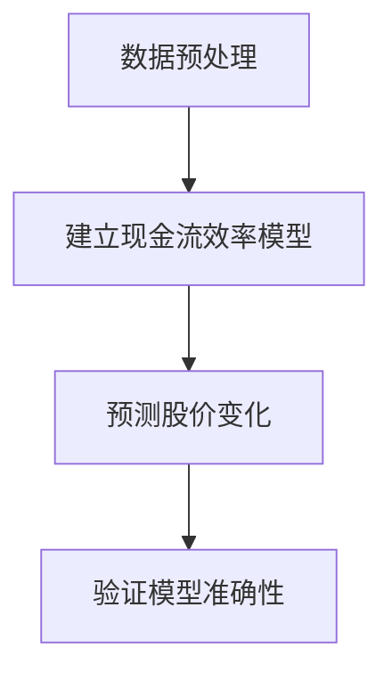
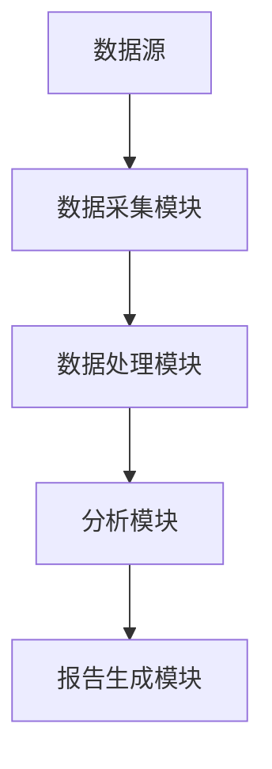

                 


# 特价股票与公司现金流管理效率的关系探讨

> 关键词：特价股票、公司现金流、管理效率、股价影响、现金流模型

> 摘要：本文探讨了特价股票与公司现金流管理效率之间的关系。首先定义了特价股票及其特征，分析了现金流管理效率的重要性。接着，通过案例分析和数学模型，详细阐述了两者之间的相互影响。最后，提出了优化现金流管理以提升股价的策略，并给出了系统架构和实战指导。

---

## 第1章：引言

### 1.1 研究背景

#### 1.1.1 特价股票的定义与特征
- **特价股票**：指价格低于市场平均水平的股票，通常被视为被低估的投资机会。
- **特征**：
  - 低估值：市盈率、市净率等指标低于行业平均水平。
  - 高波动性：价格波动较大，受市场情绪影响显著。
  - 投资风险较高：可能因公司基本面不佳或行业周期影响。

#### 1.1.2 公司现金流管理效率的重要性
- 现金流是公司运营的生命线，直接影响偿债能力、投资能力和股利分配。
- 现金流管理效率高，意味着公司能更好地应对突发事件，抓住投资机会。

#### 1.1.3 研究问题的提出
- 特价股票是否会影响公司的现金流管理效率？
- 现金流管理效率的优化是否能提升股价，减少特价股票比例？

### 1.2 研究目的与意义

#### 1.2.1 研究目标
- 探讨特价股票与现金流管理效率的关系。
- 提供优化现金流管理以提升股价的策略。

#### 1.2.2 研究意义
- 帮助投资者理解低价股的投资机会与风险。
- 为公司提供现金流管理的优化建议，提升股价。

#### 1.2.3 研究方法与框架
- 文章结构：从概念到模型，再到案例分析。
- 方法：定量分析（现金流模型）与定性分析（案例研究）结合。

---

## 第2章：特价股票的定义与特征

### 2.1 特价股票的定义

#### 2.1.1 低价股票的界定
- 相对于市场指数或行业平均水平，价格显著低于正常水平。
- 通常被视为被市场忽视或低估的投资机会。

#### 2.1.2 特价股票的分类
- 按行业：如周期性行业中的特价股票。
- 按公司规模：大盘股、中盘股、小盘股中的特价股票。

#### 2.1.3 特价股票与高价股票的对比
| 特性         | 特价股票       | 高价股票       |
|--------------|----------------|----------------|
| 价格         | 低于市场平均   | 高于市场平均    |
| 市盈率       | 低             | 高             |
| 市净率       | 低             | 高             |
| 投资风险     | 较高           | 较低           |
| 回报潜力     | 较高           | 较稳定         |

### 2.2 特价股票的特征

#### 2.2.1 价格敏感性
- 价格受市场情绪影响大，波动性高。
- 投资者可能因价格波动而频繁交易，增加交易成本。

#### 2.2.2 市场流动性分析
- 流动性可能较低，买卖价差大。
- 大额交易可能对股价产生显著影响。

#### 2.2.3 投资风险与收益
- 风险较高：公司基本面可能存在问题。
- 收益潜力大：若公司改善，股价可能大幅上涨。

---

## 第3章：公司现金流管理效率的分析

### 3.1 现金流管理的重要性

#### 3.1.1 现金流在企业运营中的作用
- 支付日常运营费用。
- 投资新项目或并购。
- 应对突发事件，如经济危机。

#### 3.1.2 现金流管理的核心目标
- 确保现金流的充足性。
- 优化现金流的使用效率。
- 降低财务风险。

### 3.2 现金流管理效率的衡量

#### 3.2.1 现金流周转率
- 公式：$$ \text{现金流周转率} = \frac{\text{年营业现金净流入}}{\text{平均应收账款 + 平均存货}} $$
- 衡量公司将应收账款和存货转化为现金的能力。

#### 3.2.2 现金流净额分析
- 正向净现金流：公司能够创造更多现金。
- 负向净现金流：公司依赖外部融资。

#### 3.2.3 现金流管理的KPI
- 现金周期：从购买原材料到销售产品的时间。
- 现金转换周期：衡量公司管理现金流的效率。

---

## 第4章：特价股票与公司现金流管理效率的关系

### 4.1 特价股票对现金流管理的影响

#### 4.1.1 特价股票的持有成本
- 股东可能要求更高的回报，增加公司的分红压力。
- 管理层可能被迫进行回购，影响现金流。

#### 4.1.2 现金流波动性分析
- 特价股票的波动可能影响市场对公司整体现金流的评估。
- 公司可能因股价波动影响融资成本。

#### 4.1.3 投资决策的影响
- 特价股票可能影响投资者对公司未来现金流的信心。
- 管理层可能调整投资策略，影响现金流管理。

### 4.2 公司现金流管理对股价的影响

#### 4.2.1 现金流与股价的相关性
- 现金流健康通常与股价稳定正相关。
- 现金流恶化可能导致股价下跌，成为特价股票。

#### 4.2.2 现金股利对股价的影响
- 高分红可能提升股价，吸引更多投资者。
- 过度分红可能削弱现金流，影响公司发展。

#### 4.2.3 现金储备与股价稳定性
- 丰富的现金流储备能增强股价抗跌性。
- 现金储备不足可能导致股价波动加剧。

---

## 第5章：案例分析

### 5.1 案例一：某公司特价股票发行与现金流管理

#### 5.1.1 案例背景
- 公司因行业低迷导致股价下跌，成为特价股票。
- 现金流管理效率低下，难以支撑日常运营。

#### 5.1.2 现金流管理策略
- 优化应收账款管理，减少坏账。
- 控制库存水平，提高资金使用效率。

#### 5.1.3 结果分析
- 现金流周转率提高，股价逐步回升。
- 现金流管理效率提升，公司摆脱特价股状态。

### 5.2 案例二：现金流优化与股价提升

#### 5.2.1 优化措施
- 建立现金流预警系统，及时调整资金运作。
- 通过并购优化资产结构，提高现金流质量。

#### 5.2.2 实施效果
- 现金流净额由负转正，股价上涨。
- 股东信心恢复，股价脱离特价区。

#### 5.2.3 经验总结
- 现金流管理是提升股价的关键。
- 综合措施比单一措施更有效。

---

## 第6章：数学模型与算法分析

### 6.1 模型构建

#### 6.1.1 变量定义
- 特价股票价格：P
- 现金流效率：E
- 股价变化率：ΔP

#### 6.1.2 模型假设
- 现金流效率与股价呈正相关。
- 特价股票价格受现金流效率影响。

#### 6.1.3 模型公式
$$ \Delta P = \beta E + \epsilon $$
其中，β为回归系数，ε为误差项。

### 6.2 算法实现

#### 6.2.1 数据预处理
- 数据来源：公司财务报表、股价数据。
- 数据清洗：处理缺失值，异常值。

#### 6.2.2 算法流程图


#### 6.2.3 Python代码实现
```python
import pandas as pd
import numpy as np
from sklearn.linear_model import LinearRegression

# 数据加载
data = pd.read_csv('data.csv')

# 特征与目标变量
X = data[['现金流效率']]
y = data['股价变化']

# 模型训练
model = LinearRegression()
model.fit(X, y)

# 预测
predictions = model.predict(X)

# 结果分析
print('回归系数:', model.coef_)
print('决定系数:', model.score(X, y))
```

---

## 第7章：系统架构与设计

### 7.1 系统需求分析

#### 7.1.1 功能需求
- 数据采集：收集公司现金流和股价数据。
- 数据分析：计算现金流效率，预测股价。
- 报告生成：输出分析结果。

#### 7.1.2 性能需求
- 实时数据处理能力。
- 高效的分析算法。

#### 7.1.3 用户需求
- 投资者：获取分析结果辅助决策。
- 管理层：优化现金流管理。

### 7.2 系统架构设计

#### 7.2.1 模块划分
- 数据采集模块：负责数据获取。
- 数据处理模块：清洗和转换数据。
- 分析模块：计算现金流效率，预测股价。
- 报告生成模块：输出结果。

#### 7.2.2 数据流图


---

## 第8章：项目实战

### 8.1 环境安装

#### 8.1.1 安装Python
- 使用Anaconda安装Python 3.8及以上版本。

#### 8.1.2 安装必要的库
```bash
pip install pandas numpy scikit-learn
```

### 8.2 核心实现

#### 8.2.1 数据采集与处理
```python
import pandas as pd
import requests

# 数据采集
url = 'https://example.com/data.csv'
data = pd.read_csv(url)
```

#### 8.2.2 现金流效率计算
```python
data['现金流效率'] = data['经营活动现金流净额'] / data['平均应收账款']
```

#### 8.2.3 股价预测
```python
from sklearn.linear_model import LinearRegression

model = LinearRegression()
model.fit(data[['现金流效率']], data['股价'])
```

### 8.3 案例分析

#### 8.3.1 数据分析
```python
# 计算相关系数
print(data['现金流效率'].corr(data['股价']))
```

#### 8.3.2 结果可视化
```python
import matplotlib.pyplot as plt

plt.scatter(data['现金流效率'], data['股价'])
plt.xlabel('现金流效率')
plt.ylabel('股价')
plt.show()
```

---

## 第9章：最佳实践与小结

### 9.1 最佳实践

#### 9.1.1 定期审查现金流状况
- 每季度审查现金流，及时调整管理策略。

#### 9.1.2 优化资本结构
- 合理使用债务与股权，降低财务风险。

#### 9.1.3 制定股利政策
- 根据现金流状况制定合理的股利分配政策。

### 9.2 小结

- 特价股票与现金流管理效率密切相关。
- 优化现金流管理是提升股价的关键。
- 投资者应关注公司现金流状况，做出明智决策。

### 9.3 注意事项

- 特价股票存在较高风险，需谨慎投资。
- 现金流管理是系统工程，需长期坚持。

### 9.4 拓展阅读

- 推荐阅读《现金流管理》和《投资学原理》。

---

## 作者：AI天才研究院 & 禅与计算机程序设计艺术

---

以上就是《特价股票与公司现金流管理效率的关系探讨》的完整目录和内容框架，希望对您有所帮助！

