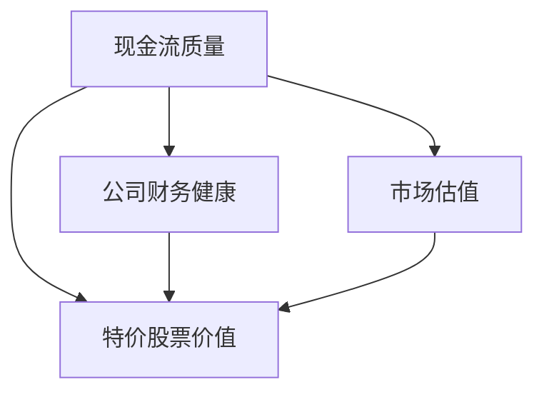
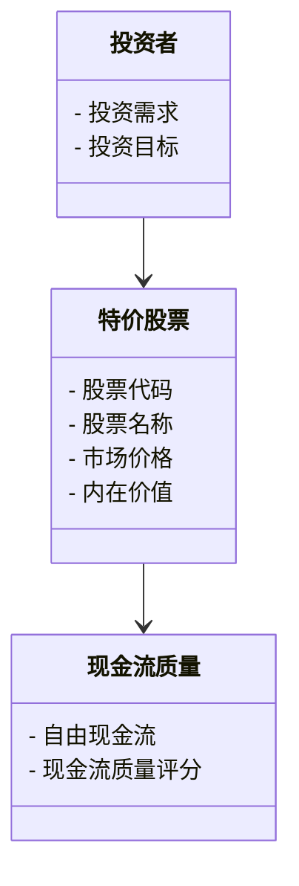
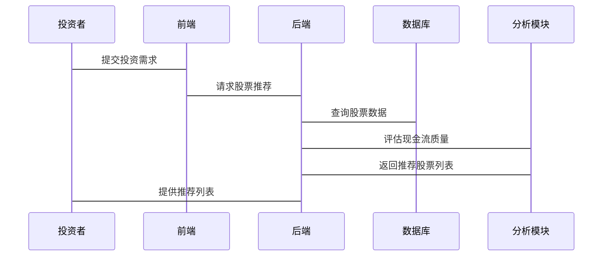

                 


# 特价股票与公司现金流质量的关系

**关键词：** 特价股票，现金流质量，财务分析，投资策略，价值评估，机器学习模型

**摘要：**  
本文探讨了特价股票与公司现金流质量之间的关系，分析了现金流质量对特价股票投资价值的影响，并通过机器学习模型预测现金流质量。文章从现金流质量的定义、评估指标入手，结合特价股票的分类与特点，深入分析两者之间的联系。通过案例分析和算法实现，帮助投资者更好地理解现金流质量对投资决策的重要性。

---

# 第1章: 特价股票与公司现金流质量的核心概念

## 1.1 特价股票的基本定义与特征
### 1.1.1 特价股票的定义
特价股票是指市场价格低于其内在价值的股票，通常被认为具有较高的投资潜力。这种股票可能因市场波动、公司短期问题或市场低估而被低估。

### 1.1.2 特价股票的分类与特点
- **价值型股票**：价格低于其内在价值，通常具有较高的股息率和较低的市盈率。
- **成长型股票**：虽然当前价格可能较高，但未来增长潜力巨大。
- **周期性股票**：受经济周期影响较大的股票，可能在经济低谷时被低估。

### 1.1.3 特价股票的投资价值与风险
- **投资价值**：低估的股票可能在市场回升时带来超额收益。
- **风险**：部分特价股票可能因公司基本面恶化而进一步下跌。

## 1.2 公司现金流质量的核心要素
### 1.2.1 公司现金流的定义与分类
- **现金流**：公司经营活动中产生的现金流入和流出。
- **经营活动现金流**：公司日常经营产生的现金流。
- **投资活动现金流**：公司投资活动产生的现金流。
- **筹资活动现金流**：公司通过借款或发行股票等方式筹集的资金。

### 1.2.2 现金流质量的关键指标
- **自由现金流（FCF）**：公司经营活动产生的现金流减去资本 expenditures。
- **现金流与利润的关系**：高利润但低现金流的公司可能面临财务风险。
- **现金流稳定性**：现金流波动小的公司财务健康，风险较低。

### 1.2.3 现金流质量与公司财务健康的关系
- **现金流质量高**：公司具有较强的偿债能力和扩张能力。
- **现金流质量低**：公司可能面临流动性风险，影响其市场估值。

## 1.3 特价股票与现金流质量的关系
### 1.3.1 特价股票与现金流质量的关联性
- 特价股票的内在价值与公司现金流密切相关。
- 公司现金流质量高的特价股票更有可能被市场重新估值。

### 1.3.2 现金流质量对特价股票价值的影响
- 高质量现金流的公司更容易吸引投资者，提升股价。
- 现金流质量差的公司可能因市场担忧而被进一步低估。

### 1.3.3 特价股票投资者关注现金流质量的原因
- 现金流质量是判断公司财务健康的重要指标。
- 高质量现金流的公司具有更强的抗风险能力。

## 1.4 本章小结
本章介绍了特价股票和现金流质量的核心概念，分析了两者之间的关系，并强调了现金流质量对特价股票投资价值的重要性。

---

# 第2章: 特价股票与现金流质量的核心概念与联系

## 2.1 现金流质量的核心原理
### 2.1.1 现金流质量的评估方法
- **绝对指标**：自由现金流、净现金流等。
- **相对指标**：现金流与收入、利润的比率。

### 2.1.2 现金流质量与公司盈利能力的关系
- **现金流与净利润**：净利润为正但现金流为负的公司可能存在财务问题。
- **现金流与收入**：高收入但低现金流的公司可能面临应收账款过高或库存积压问题。

### 2.1.3 现金流质量与公司偿债能力的关联
- **短期偿债能力**：现金流充足公司更容易偿还短期负债。
- **长期偿债能力**：高质量现金流支持公司长期债务偿还。

## 2.2 特价股票的分类与现金流质量的对比
### 2.2.1 特价股票的分类标准
- **价值型股票**：低市盈率、低市净率。
- **成长型股票**：高市盈率、高市净率。

### 2.2.2 不同类型特价股票的现金流质量分析
- **价值型股票**：现金流通常较为稳定，但可能因市场低估而被忽视。
- **成长型股票**：现金流可能为负，但未来增长潜力大。

### 2.2.3 特价股票现金流质量的特征对比
| 特质         | 价值型股票 | 成长型股票 |
|--------------|------------|------------|
| 现金流质量   | 较高       | 较低       |
| 市盈率       | 低         | 高         |
| 市净率       | 低         | 高         |
| 增长潜力     | 有限       | 大         |

## 2.3 现金流质量与特价股票价值的实体关系图


## 2.4 本章小结
本章通过对比分析，明确了不同类型特价股票的现金流质量差异，并构建了现金流质量与特价股票价值的实体关系图。

---

# 第3章: 现金流质量评估的算法原理

## 3.1 现金流质量评估的算法概述
### 3.1.1 常见的现金流质量评估算法
- **线性回归模型**：预测现金流与财务指标之间的关系。
- **逻辑回归模型**：分类现金流质量。
- **机器学习模型**：如随机森林、神经网络等。

### 3.1.2 算法的优缺点对比
| 算法         | 优点                   | 缺点                   |
|--------------|------------------------|------------------------|
| 线性回归     | 简单，易于解释         | 非线性关系表现差       |
| 逻辑回归     | 适合分类问题           | 非线性关系表现差       |
| 随机森林     | 高精度，抗过拟合       | 解释性较差             |
| 神经网络     | 高精度，适合复杂问题   | 训练时间长，解释性差   |

## 3.2 基于机器学习的现金流质量预测模型
### 3.2.1 数据预处理与特征选择
- 数据清洗：处理缺失值、异常值。
- 特征选择：选择与现金流质量相关的财务指标。

### 3.2.2 模型训练与优化
- 数据集划分：训练集、验证集、测试集。
- 模型训练：使用随机森林或神经网络模型。
- 模型优化：调整超参数，防止过拟合。

### 3.2.3 模型评估与验证
- 评估指标：准确率、召回率、F1分数。
- 模型验证：交叉验证，测试集验证。

### 3.2.4 代码实现示例
```python
from sklearn.ensemble import RandomForestClassifier
from sklearn.metrics import accuracy_score

# 数据预处理
X = ...  # 特征矩阵
y = ...  # 标签向量

# 数据划分
X_train, X_test, y_train, y_test = train_test_split(X, y, test_size=0.2)

# 模型训练
model = RandomForestClassifier(n_estimators=100)
model.fit(X_train, y_train)

# 模型预测
y_pred = model.predict(X_test)

# 评估指标
print("准确率:", accuracy_score(y_test, y_pred))
```

## 3.3 算法原理的数学模型与公式
### 3.3.1 线性回归模型
$$ y = \beta_0 + \beta_1x_1 + \beta_2x_2 + ... + \beta_nx_n $$

### 3.3.2 逻辑回归模型
$$ P(y=1|x) = \frac{e^{\beta_0 + \beta_1x_1 + ... + \beta_nx_n}}{1 + e^{\beta_0 + \beta_1x_1 + ... + \beta_nx_n}} $$

### 3.3.3 随机森林模型
随机森林通过集成学习提高模型准确率，避免单棵决策树的过拟合问题。

## 3.4 本章小结
本章介绍了几种现金流质量评估算法，重点讲解了机器学习模型的实现，并通过代码示例展示了模型的训练与评估过程。

---

# 第4章: 系统分析与架构设计方案

## 4.1 问题场景介绍
我们设计一个基于现金流质量评估的特价股票推荐系统，帮助投资者筛选出具有高投资价值的特价股票。

## 4.2 系统功能设计
### 4.2.1 领域模型


### 4.2.2 系统架构设计


### 4.2.3 系统接口设计
- **输入接口**：投资者需求、股票数据。
- **输出接口**：推荐股票列表、现金流质量评分。

### 4.2.4 系统交互设计


## 4.3 本章小结
本章通过系统架构设计，展示了如何利用现金流质量评估模型实现特价股票推荐系统。

---

# 第5章: 项目实战与现金流质量预测

## 5.1 环境安装与数据准备
### 5.1.1 环境安装
- 安装Python、NumPy、Pandas、Scikit-learn。
### 5.1.2 数据准备
- 下载股票数据，提取现金流相关指标。

## 5.2 系统核心实现
### 5.2.1 数据预处理
```python
import pandas as pd
import numpy as np

# 数据加载
df = pd.read_csv('stock_data.csv')

# 数据清洗
df.dropna(inplace=True)

# 特征选择
features = df[['Revenue', 'Net Income', 'Free Cash Flow']]
```

### 5.2.2 模型训练与优化
```python
from sklearn.ensemble import RandomForestClassifier
from sklearn.metrics import accuracy_score

# 数据划分
X_train, X_test, y_train, y_test = train_test_split(features, df['Cash Flow Quality'], test_size=0.2)

# 模型训练
model = RandomForestClassifier(n_estimators=100)
model.fit(X_train, y_train)

# 模型预测
y_pred = model.predict(X_test)

# 模型评估
print("准确率:", accuracy_score(y_test, y_pred))
```

### 5.2.3 案例分析
- **案例1**：某公司现金流质量高，但股价被低估，属于价值型股票。
- **案例2**：某公司现金流质量低，但增长潜力大，属于成长型股票。

## 5.3 本章小结
本章通过实际案例分析，展示了如何利用机器学习模型预测现金流质量，并为投资者提供参考。

---

# 第6章: 现金流质量预测结果与分析

## 6.1 现金流质量预测结果
- **高现金流质量股票**：具有较高的投资价值。
- **低现金流质量股票**：需谨慎投资，关注公司基本面改善。

## 6.2 投资策略优化
- **价值型投资者**：优先选择高现金流质量的特价股票。
- **成长型投资者**：关注现金流质量较低但增长潜力大的股票。

## 6.3 模型优化与改进建议
- **数据优化**：引入更多财务指标和市场数据。
- **模型优化**：尝试使用深度学习模型提高预测精度。
- **动态调整**：定期更新模型，适应市场变化。

## 6.4 本章小结
本章通过分析现金流质量预测结果，提出了优化投资策略的建议。

---

# 第7章: 总结与展望

## 7.1 本研究的主要结论
- 现金流质量是评估特价股票价值的重要指标。
- 机器学习模型可以有效预测现金流质量，辅助投资决策。

## 7.2 研究的局限性
- 数据获取难度：部分公司财务数据不透明。
- 模型局限性：机器学习模型无法完全预测市场波动。

## 7.3 未来研究方向
- 结合宏观经济指标优化模型。
- 研究多因素模型对现金流质量的影响。

## 7.4 本章小结
本章总结了研究成果，并展望了未来的研究方向。

---

# 作者：AI天才研究院/AI Genius Institute & 禅与计算机程序设计艺术/Zen And The Art of Computer Programming

---

**摘要：** 本文通过分析现金流质量与特价股票的关系，探讨了现金流质量对投资决策的影响。通过机器学习模型预测现金流质量，帮助投资者更好地识别具有投资价值的特价股票。

