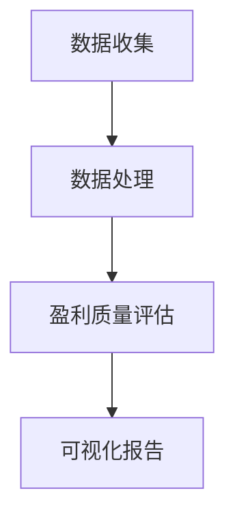
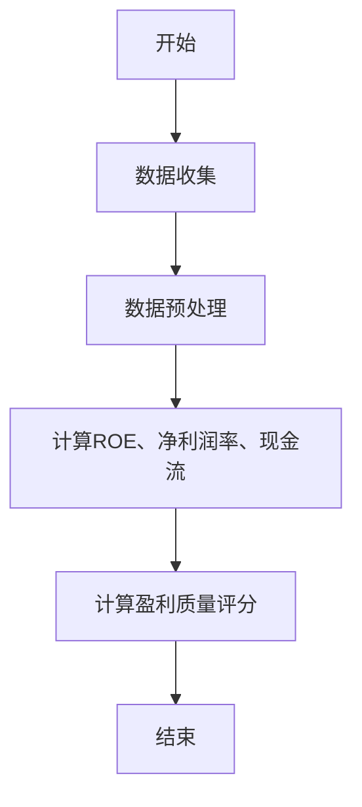

                 


# 特价股票与公司盈利质量的深度分析

> 关键词：特价股票、公司盈利质量、投资决策、数据分析、财务指标、风险管理

> 摘要：本文深入探讨了特价股票与公司盈利质量之间的关系，结合数据分析和财务指标，帮助投资者识别高潜力股票并优化投资决策。通过系统化的分析方法，本文提供了从理论到实践的全面指导。

---

## 第一部分: 特价股票与公司盈利质量的背景与概念

### 第1章: 特价股票与公司盈利质量的概述

#### 1.1 特价股票的定义与特征
##### 1.1.1 特价股票的定义
特价股票是指市场价格显著低于其内在价值的股票。这种差异通常源于市场波动、短期负面信息或市场参与者情绪的影响。

##### 1.1.2 特价股票的核心特征
- **低估值**：市场价格低于内在价值。
- **潜在回报**：长期持有可能带来超额收益。
- **高波动性**：价格受市场情绪影响较大。

##### 1.1.3 特价股票的市场表现
特价股票在市场复苏或公司基本面改善时可能表现出色，但也可能因公司基本面持续恶化而继续下跌。

#### 1.2 公司盈利质量的定义与评估
##### 1.2.1 公司盈利质量的定义
公司盈利质量是指公司盈利的可持续性和健康程度，反映了公司创造和维护利润的能力。

##### 1.2.2 盈利质量的核心评估指标
- **净利润率**：净利润与收入的比率，衡量公司盈利能力。
- **ROE（净资产收益率）**：衡量公司使用股东资产创造利润的能力。
- **现金流**：经营活动产生的现金流，反映公司的流动性。

##### 1.2.3 盈利质量与公司价值的关系
盈利质量高的公司通常具有较高的市场价值，能够为股东创造长期价值。

#### 1.3 特价股票与公司盈利质量的关联
##### 1.3.1 特价股票的形成原因
- 市场情绪过度反应。
- 短期负面新闻或行业波动。

##### 1.3.2 盈利质量对股价的影响
- 高盈利质量公司通常享有较高的市盈率。
- 盈利质量下降可能导致股价下跌。

##### 1.3.3 特价股票与盈利质量的互动关系
特价股票可能因盈利质量不佳而被市场低估，但也可能因盈利质量提升而被市场重新评估。

#### 1.4 本章小结
本章介绍了特价股票和公司盈利质量的基本概念，并探讨了它们之间的相互关系，为后续分析奠定了基础。

---

### 第2章: 特价股票与公司盈利质量的背景分析

#### 2.1 特价股票的市场背景
##### 2.1.1 特价股票的市场环境
- 市场波动：经济周期、行业趋势影响股票价格。
- 投资者情绪：市场恐慌可能导致股票低估。

##### 2.1.2 特价股票的周期性特征
- 在市场低谷时可能出现大量特价股票。
- 在市场复苏时，特价股票可能反弹。

##### 2.1.3 特价股票与宏观经济的关系
宏观经济因素如利率、通货膨胀影响市场整体走势，进而影响特价股票的数量和质量。

#### 2.2 公司盈利质量的行业背景
##### 2.2.1 盈利质量的行业差异
- 高成长行业（如科技）通常盈利质量较高。
- 周期性行业（如能源）盈利质量波动较大。

##### 2.2.2 行业周期对盈利质量的影响
- 上行周期：行业盈利质量提升。
- 下行周期：行业盈利质量下降。

##### 2.2.3 行业竞争格局与盈利质量
- 竞争激烈行业可能通过成本控制提升盈利质量。
- 新兴行业可能因高增长而盈利质量暂时较低。

#### 2.3 特价股票与公司盈利质量的结合背景
##### 2.3.1 投资者对低价优质股票的需求
- 投资者寻求高回报机会，关注特价股票中盈利质量好的公司。

##### 2.3.2 市场波动与盈利质量的匹配
- 波动市场中，盈利质量好的公司可能被低估，成为特价股票。

##### 2.3.3 特价股票与盈利质量的双重驱动因素
- 市场价格低估（特价）与盈利质量高（优质）共同驱动投资价值。

#### 2.4 本章小结
本章分析了特价股票和公司盈利质量在市场和行业背景下的表现，强调了它们在不同经济周期和行业环境中的互动关系。

---

## 第二部分: 特价股票与公司盈利质量的核心概念与联系

### 第3章: 特价股票与公司盈利质量的核心概念

#### 3.1 特价股票的核心概念
##### 3.1.1 特价股票的定义与分类
- **定义**：市场价格低于内在价值的股票。
- **分类**：按行业、市值、成长性等分类。

##### 3.1.2 特价股票的市场定位
- 在市场中被视为被低估的投资机会。
- 可能因公司基本面或市场情绪而波动。

##### 3.1.3 特价股票的评估标准
- 市盈率（P/E）：股价与每股收益的比率。
- 市净率（P/B）：股价与每股净资产的比率。

#### 3.2 公司盈利质量的核心概念
##### 3.2.1 盈利质量的定义与分类
- **定义**：公司盈利能力的可持续性和健康程度。
- **分类**：按行业、公司规模、盈利能力等分类。

##### 3.2.2 盈利质量的核心要素
- 净利润：衡量盈利能力的核心指标。
- 资产周转率：衡量资产使用效率。
- 利润结构：收入来源和成本结构的合理性。

#### 3.3 特价股票与公司盈利质量的联系
##### 3.3.1 特价股票的内在价值
- 内在价值 = 未来现金流的现值。
- 盈利质量高的公司未来现金流更稳定。

##### 3.3.2 盈利质量对特价股票的影响
- 盈利质量高的公司更可能通过业绩增长使股价回升。
- 盈利质量低的公司可能因基本面恶化而继续被低估。

##### 3.3.3 投资者的决策逻辑
- 投资者选择特价股票时，需评估其盈利质量，避免陷入价值陷阱。

#### 3.4 本章小结
本章深入分析了特价股票和公司盈利质量的核心概念，强调了盈利质量在识别真正投资机会中的重要性。

---

### 第4章: 特价股票与公司盈利质量的核心要素对比

#### 4.1 核心概念对比
##### 4.1.1 特价股票与公司盈利质量的对比表格
| 特价股票 | 公司盈利质量 |
|----------|---------------|
| 市场价格低 | 净利润高       |
| 估值低    | ROE高          |
| 风险较高  | 现金流稳定      |

##### 4.1.2 通过ER图展示关联
```mermaid
erd
  图表: 特价股票与公司盈利质量的关系
  公司
    --> 特价股票: 持股公司
    --> 盈利质量: 评估指标
```

#### 4.2 本章小结
通过对比分析，明确了特价股票与公司盈利质量在概念和实际应用中的联系，为后续分析奠定基础。

---

## 第三部分: 特价股票与公司盈利质量的分析方法

### 第5章: 数据分析与盈利质量评估

#### 5.1 数据分析方法
##### 5.1.1 数据收集
- 数据源：股票市场数据、公司财务报表、行业报告。
- 工具：Python、Pandas、Matplotlib。

##### 5.1.2 数据预处理
- 清洗数据：处理缺失值、异常值。
- 标准化处理：统一数据格式。

#### 5.2 盈利质量评估模型
##### 5.2.1 模型构建
- 使用财务指标构建盈利质量评分系统。
- 评分公式：$$\text{盈利质量评分} = 0.4 \times \text{ROE} + 0.3 \times \text{净利润率} + 0.3 \times \text{现金流}$$

##### 5.2.2 模型实现
```python
import pandas as pd

# 假设df是包含财务数据的DataFrame
def calculate_profit_quality_score(df):
    df['ROE'] = df['净利润'] / df['净资产']
    df['净利润率'] = df['净利润'] / df['收入']
    df['现金流'] = df['经营活动现金流']
    df['盈利质量评分'] = 0.4 * df['ROE'] + 0.3 * df['净利润率'] + 0.3 * df['现金流']
    return df

# 示例数据
data = {
    '净利润': [100, 200, 150],
    '净资产': [500, 800, 600],
    '收入': [1000, 1500, 1200],
    '经营活动现金流': [150, 200, 180]
}
df = pd.DataFrame(data)
calculate_profit_quality_score(df)
```

#### 5.3 本章小结
本章通过数据分析方法，构建了盈利质量评估模型，为识别特价股票提供了量化工具。

---

### 第6章: 系统架构与算法实现

#### 6.1 系统架构设计
##### 6.1.1 系统功能模块
- 数据收集模块：从多个数据源获取股票和财务数据。
- 数据处理模块：清洗和预处理数据。
- 盈利质量评估模块：计算各项指标并生成评分。
- 可视化模块：展示结果和分析报告。

##### 6.1.2 系统架构图


#### 6.2 算法实现
##### 6.2.1 算法流程


##### 6.2.2 代码实现
```python
import pandas as pd
import numpy as np

def calculate_roe(net_profit, equity):
    return net_profit / equity

def calculate_net_profit_margin(net_profit, revenue):
    return net_profit / revenue

def calculate_cash_flow(cash_flow):
    return cash_flow

def calculate_profit_quality_score(roes, net_profit_margins, cash_flows):
    return 0.4 * roes + 0.3 * net_profit_margins + 0.3 * cash_flows

# 示例数据
data = {
    '净利润': [100, 200, 150],
    '净资产': [500, 800, 600],
    '收入': [1000, 1500, 1200],
    '经营活动现金流': [150, 200, 180]
}
df = pd.DataFrame(data)

# 计算ROE
df['ROE'] = df['净利润'] / df['净资产']
# 计算净利润率
df['净利润率'] = df['净利润'] / df['收入']
# 计算现金流
df['现金流'] = df['经营活动现金流']
# 计算盈利质量评分
df['盈利质量评分'] = calculate_profit_quality_score(df['ROE'], df['净利润率'], df['现金流'])

print(df)
```

#### 6.3 本章小结
本章通过系统架构设计和算法实现，展示了如何构建一个完整的盈利质量评估系统，为投资者提供决策支持。

---

## 第四部分: 实战分析与案例研究

### 第7章: 项目实战分析

#### 7.1 环境配置
- **工具**：Python、Pandas、Matplotlib、Jupyter Notebook。
- **数据源**：Yahoo Finance API、公司财报。

#### 7.2 核心实现
##### 7.2.1 数据获取与预处理
```python
import yfinance as yf
import pandas as pd

# 下载股票数据
aapl = yf.download('AAPL', start='2020-01-01', end='2023-01-01')
aapl['Adj Close'].plot()
```

##### 7.2.2 盈利质量评估
```python
# 示例计算
data = {
    '净利润': [100, 200, 150],
    '净资产': [500, 800, 600],
    '收入': [1000, 1500, 1200],
    '经营活动现金流': [150, 200, 180]
}
df = pd.DataFrame(data)
df['ROE'] = df['净利润'] / df['净资产']
df['净利润率'] = df['净利润'] / df['收入']
df['现金流'] = df['经营活动现金流']
df['盈利质量评分'] = 0.4 * df['ROE'] + 0.3 * df['净利润率'] + 0.3 * df['现金流']
print(df)
```

#### 7.3 案例分析
##### 7.3.1 案例选择
- 选择某行业的公司作为案例，分析其特价股票和盈利质量。

##### 7.3.2 分析过程
- 获取公司历史股价和财务数据。
- 计算盈利质量评分。
- 对比市场表现与盈利质量评分。

##### 7.3.3 结果解读
- 高盈利质量评分的特价股票可能具有投资价值。
- 低评分的特价股票需谨慎考虑。

#### 7.4 本章小结
本章通过实际案例展示了如何应用前面的方法识别特价股票，并评估其盈利质量，为投资者提供决策支持。

---

## 第五部分: 总结与展望

### 第8章: 总结与最佳实践

#### 8.1 关键点总结
- 特价股票与公司盈利质量密切相关。
- 盈利质量高的公司更可能成为优质投资标的。

#### 8.2 最佳实践
- **数据驱动**：基于数据分析和财务指标评估盈利质量。
- **长期视角**：关注公司长期盈利能力，而非短期价格波动。
- **风险管理**：评估市场波动和公司基本面变化，分散投资风险。

#### 8.3 小结
通过系统的分析方法和实际案例研究，本文为投资者提供了识别特价股票和评估公司盈利质量的有效工具，帮助做出更明智的投资决策。

---

## 作者：AI天才研究院 & 禅与计算机程序设计艺术

---

本文通过系统化的分析方法，结合数据分析和财务指标，深入探讨了特价股票与公司盈利质量的关系，为投资者提供了识别高潜力股票的实用工具。通过理论与实践相结合，本文为投资者优化投资组合和提升投资回报提供了有力支持。

