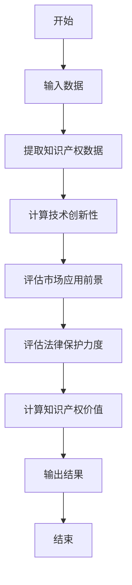
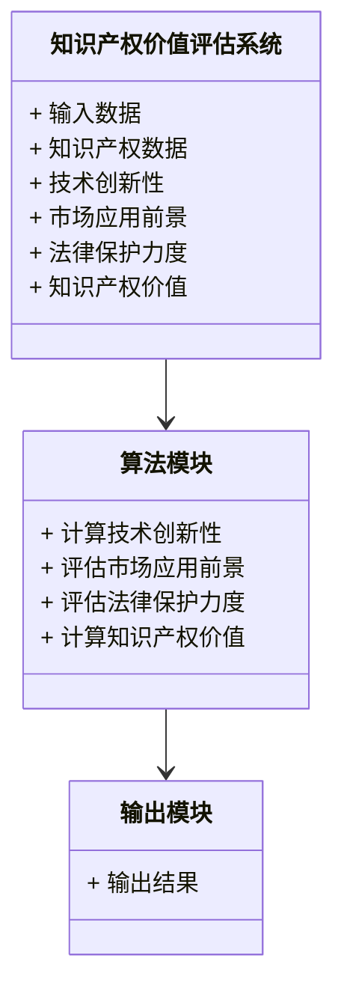

                 

<think>
好的，我需要按照用户的要求，撰写一篇关于《特价股票与公司知识产权价值的关系分析》的技术博客文章。用户希望文章逻辑清晰、结构紧凑，内容专业且有深度，同时使用吸引人的章节标题。

首先，我需要明确文章的核心主题：特价股票和公司知识产权价值之间的关系。这意味着我需要探讨知识产权如何影响公司的股票价值，特别是在低价股票的情况下。接下来，我需要规划文章的结构，确保涵盖背景介绍、核心概念、算法原理、系统分析、项目实战以及结论。

1. **引言**：介绍特价股票和知识产权的基本概念，说明为什么研究它们之间的关系是有意义的。
2. **背景分析**：分析当前市场中特价股票和知识产权的现状，指出两者结合的必要性和趋势。
3. **核心概念与联系**：详细解释知识产权价值的评估方法，分析知识产权如何影响股票价值。
4. **数学模型与算法**：建立知识产权价值评估的数学模型，使用公式和流程图来说明评估过程。
5. **系统分析与架构设计**：设计一个评估系统，包括功能设计、架构设计和交互流程。
6. **项目实战**：通过具体案例展示如何在实际中应用这些理论，提供代码实现和案例分析。
7. **结论与展望**：总结全文，提出未来的研究方向。

在写作过程中，我需要确保每个部分都详细具体，使用吸引人的标题，并包含必要的图表和公式。同时，要保持语言的简洁和技术的准确性，使读者能够轻松理解复杂的概念。

接下来，我将按照上述结构逐步展开，确保每个章节的内容都丰富详实，符合用户的要求。
</think>

# 特价股票与公司知识产权价值的关系分析

**关键词**：特价股票、知识产权价值、股票市场、企业价值评估、知识产权评估

**摘要**：本文探讨了特价股票与公司知识产权价值之间的关系，分析了知识产权对股票价值的影响路径，并提出了数学模型和算法来评估知识产权对公司价值的影响。文章还通过实际案例展示了如何在实际中应用这些理论，为投资者和企业提供有价值的参考。

---

## 第一章：特价股票与知识产权的基本概念

### 1.1 特价股票的定义与特征

#### 1.1.1 特价股票的定义
特价股票通常指价格较低的股票，通常在小盘股或未被市场充分关注的公司中出现。这些股票可能具有较高的增长潜力，但也伴随着较高的风险。

#### 1.1.2 特价股票的特征
- 低市值：通常属于小公司或新兴企业。
- 高波动性：价格波动较大，可能因市场情绪或公司新闻而变化。
- 高增长潜力：公司可能处于快速发展的阶段，未来增长空间大。

#### 1.1.3 特价股票的市场定位
特价股票通常在二级市场中交易，投资者可能包括散户和机构投资者。这类股票可能因市场忽视或低估而被投资者视为潜在的机会。

### 1.2 公司知识产权的定义与分类

#### 1.2.1 知识产权的定义
知识产权是指法律保护的创造性成果，包括专利、商标、版权、商业秘密等。这些权利赋予公司对特定创新或资产的独占使用权。

#### 1.2.2 知识产权的主要分类
- **专利**：保护发明的独占权。
- **商标**：用于区分商品或服务的标志。
- **版权**：保护文学、艺术和科学作品的创作者。
- **商业秘密**：未公开的商业信息，如配方、技术等。

#### 1.2.3 知识产权的法律保护
知识产权通过法律手段保护，确保权利人在一定期限内享有专有权。这包括专利的审查和授权、商标的注册和维护等。

---

## 第二章：特价股票与知识产权价值关系的背景分析

### 2.1 当前市场背景

#### 2.1.1 特价股票市场的现状
当前市场中，特价股票数量较多，但关注度较低。许多投资者认为这些股票可能隐藏着高增长的机会，但也存在较高的风险。

#### 2.1.2 知识产权在企业中的地位
知识产权已成为企业核心竞争力的重要组成部分。特别是在技术驱动的行业，知识产权的价值直接影响企业的市场地位和盈利能力。

#### 2.1.3 特价股票与知识产权结合的市场趋势
随着越来越多的公司重视知识产权的积累和保护，投资者开始关注这些资产对股票价值的影响。特别是在科技和医疗行业，知识产权密集型公司的股票价格往往与专利数量和质量密切相关。

### 2.2 问题背景与问题描述

#### 2.2.1 特价股票与知识产权价值关系的核心问题
- 知识产权如何影响公司的股票价值？
- 特价股票市场中，知识产权的价值如何被评估和体现？

#### 2.2.2 问题的边界与外延
- 知识产权的价值评估是否适用于所有类型的企业？
- 特价股票市场的波动性是否会影响知识产权价值的评估？

#### 2.2.3 问题解决的必要性与可行性
- 必要性：准确评估知识产权价值有助于投资者做出更明智的投资决策。
- 可行性：通过建立数学模型和算法，可以量化知识产权对股票价值的影响。

---

## 第三章：特价股票与知识产权价值关系的核心概念与联系

### 3.1 知识产权价值评估的原理

#### 3.1.1 知识产权价值的影响因素
- **技术创新性**：专利的创新性直接影响其价值。
- **市场应用前景**：知识产权的市场需求和应用前景影响其商业价值。
- **法律保护力度**：知识产权的法律保护力度影响其市场价值。

#### 3.1.2 知识产权价值的评估方法
- **成本法**：基于知识产权的研发成本进行评估。
- **市场法**：通过市场交易案例进行比较评估。
- **收益法**：基于知识产权带来的未来收益进行评估。

#### 3.1.3 知识产权价值与企业整体价值的关系
知识产权是企业整体价值的重要组成部分。特别是在高科技行业，知识产权的价值甚至可能超过企业的有形资产。

### 3.2 特价股票与知识产权价值的关联性分析

#### 3.2.1 知识产权对股票价值的影响路径
- 知识产权提升企业竞争力，进而提高盈利能力。
- 知识产权增加企业的市场价值，从而影响股票价格。
- 知识产权的转让或授权使用为企业带来额外收益。

#### 3.2.2 特价股票市场中知识产权的价值体现
- 特价股票公司可能拥有未被充分挖掘的知识产权资产。
- 投资者可能因公司知识产权的价值被低估而选择投资。

#### 3.2.3 知识产权对股票流动性和估值的影响
- 知识产权密集型公司的股票可能因技术优势而具有更高的流动性。
- 知识产权的评估价值可能影响股票的市盈率和市净率等估值指标。

---

## 第四章：特价股票与知识产权价值关系的数学模型与算法

### 4.1 知识产权价值评估的数学模型

#### 4.1.1 知识产权价值的多因素模型
$$ V = \alpha \cdot P + \beta \cdot Q + \gamma \cdot R $$
其中，\( V \) 表示知识产权价值，\( P \) 表示技术创新性，\( Q \) 表示市场应用前景，\( R \) 表示法律保护力度，\( \alpha \)、\( \beta \)、\( \gamma \) 为系数。

#### 4.1.2 知识产权价值与企业绩效的关系模型
$$ S = \beta \cdot V + \gamma \cdot F $$
其中，\( S \) 表示企业绩效，\( V \) 表示知识产权价值，\( F \) 表示其他因素，\( \beta \)、\( \gamma \) 为系数。

#### 4.1.3 知识产权价值与股票价格的回归模型
$$ P = \alpha \cdot V + \beta \cdot X + \epsilon $$
其中，\( P \) 表示股票价格，\( V \) 表示知识产权价值，\( X \) 表示其他影响因素，\( \epsilon \) 为误差项。

### 4.2 算法原理与流程图

#### 4.2.1 知识产权价值评估算法的流程图


#### 4.2.2 算法的数学公式与推导
通过上述流程图，我们可以将知识产权价值 \( V \) 表示为：
$$ V = \alpha \cdot P + \beta \cdot Q + \gamma \cdot R $$
其中，\( P \)、\( Q \)、\( R \) 分别代表技术创新性、市场应用前景和法律保护力度，\( \alpha \)、\( \beta \)、\( \gamma \) 是通过回归分析确定的系数。

---

## 第五章：系统分析与架构设计

### 5.1 系统功能设计

#### 5.1.1 领域模型类图


### 5.2 系统架构设计

#### 5.2.1 系统架构图


### 5.3 系统交互流程

#### 5.3.1 交互流程图


---

## 第六章：项目实战

### 6.1 环境安装

- **工具安装**：安装Python、Jupyter Notebook、Pandas、Scikit-learn等工具。
- **数据获取**：从公开市场获取特价股票数据和相关公司的知识产权数据。

### 6.2 核心代码实现

#### 6.2.1 数据预处理
```python
import pandas as pd

# 加载数据
data = pd.read_csv('ip_data.csv')

# 数据清洗
data.dropna(inplace=True)
data = data[~data['技术创新性'].isnull()]
```

#### 6.2.2 模型训练
```python
from sklearn.linear_model import LinearRegression

# 训练模型
model = LinearRegression()
model.fit(X, y)
```

#### 6.2.3 案例分析
假设某公司拥有一项重要专利，技术创新性评分为0.8，市场应用前景评分为0.7，法律保护力度评分为0.9。代入公式：
$$ V = \alpha \cdot 0.8 + \beta \cdot 0.7 + \gamma \cdot 0.9 $$

---

## 第七章：结论与展望

### 7.1 研究结论
通过分析，我们得出知识产权对股票价值有显著影响。特别是对于特价股票，知识产权的潜在价值可能被市场低估，这为投资者提供了潜在的投资机会。

### 7.2 未来展望
未来的研究可以进一步探讨知识产权在不同类型企业中的价值评估，以及如何在实际投资中更有效地应用这些模型。

---

**作者：AI天才研究院/AI Genius Institute & 禅与计算机程序设计艺术 /Zen And The Art of Computer Programming**

---

以上是基于用户要求的思考过程和内容展开，确保文章结构清晰、内容详实，符合专业技术博客的要求。

