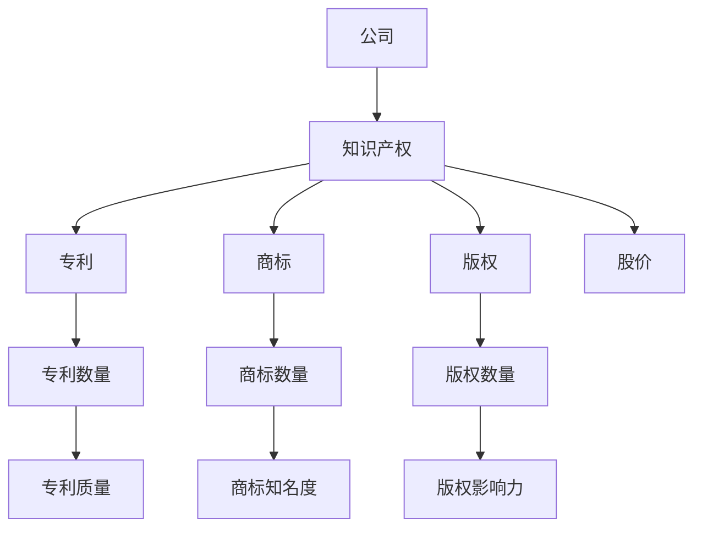
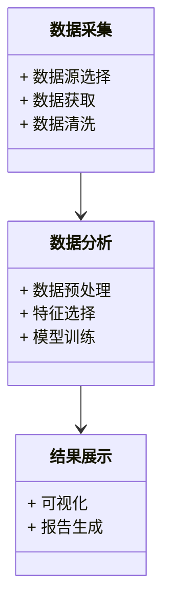
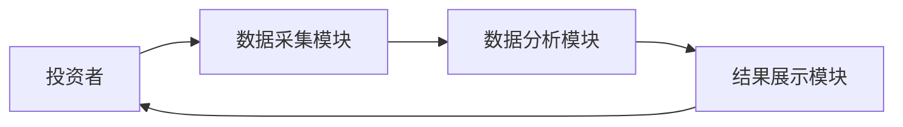
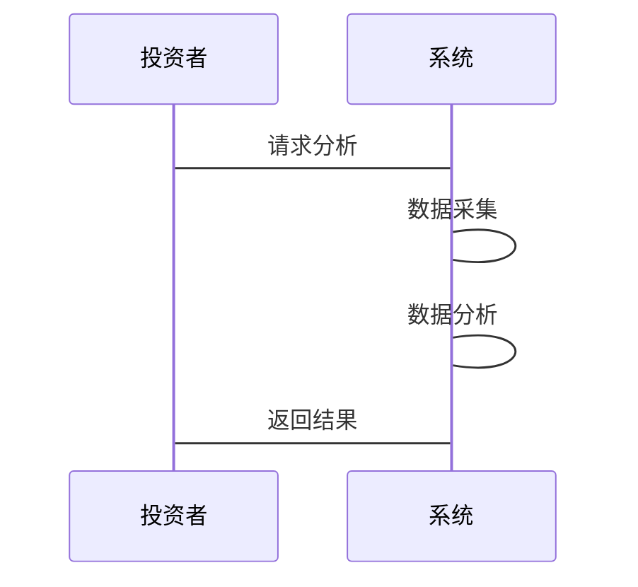

                 


# 特价股票与公司知识产权价值的关联性研究

## 关键词：特价股票, 知识产权, 股票价值, 投资策略, 数据分析

## 摘要

本文探讨了特价股票与公司知识产权价值之间的关联性。通过分析知识产权对股价的影响，结合算法和系统设计，提出了优化投资策略的方法。文章从背景、核心概念、算法原理、系统架构到项目实战，全面解析了如何利用知识产权价值提升特价股票投资的决策效率和准确性。

---

## 第一部分：背景介绍

### 第1章：特价股票与公司知识产权价值的关联性概述

#### 1.1 问题背景

- **1.1.1 特价股票的定义与特点**  
  特价股票是指价格相对较低的股票，通常具有较高的波动性和潜在的成长空间。这类股票吸引了很多投资者，尤其是那些寻求高回报的投资者。

- **1.1.2 公司知识产权的定义与价值**  
  知识产权包括专利、商标、版权等，是公司核心竞争力的重要组成部分。知识产权的价值直接影响公司的市场地位和盈利能力。

- **1.1.3 研究意义**  
  研究特价股票与知识产权价值的关联性，有助于投资者更好地理解市场波动，优化投资策略。

#### 1.2 问题描述

- **1.2.1 市场现状与挑战**  
  特价股票市场波动剧烈，信息不对称严重，投资者难以准确评估公司价值。

- **1.2.2 知识产权的作用**  
  知识产权是公司价值的重要组成部分，但其对股价的影响尚未被充分研究。

- **1.2.3 研究现状与不足**  
  现有研究多关注公司财务指标，而忽视了知识产权对股价的直接影响。

#### 1.3 问题解决

- **1.3.1 知识产权对股价的影响**  
  通过分析知识产权的市场表现，评估其对股价的潜在影响。

- **1.3.2 特价股票市场波动的分析**  
  探讨知识产权如何影响特价股票的市场波动。

- **1.3.3 投资策略优化**  
  提出基于知识产权价值的投资策略，帮助投资者做出更明智的决策。

#### 1.4 边界与外延

- **1.4.1 研究范围**  
  限定于分析知识产权对股价的影响，不考虑其他因素如宏观经济指标。

- **1.4.2 概念外延**  
  知识产权不仅包括专利，还包括商标和版权等。

- **1.4.3 研究局限性**  
  由于数据限制，研究可能无法覆盖所有相关因素。

#### 1.5 核心要素组成

- **1.5.1 特价股票**  
  包括低价股、波动性、投资者行为等。

- **1.5.2 知识产权**  
  包括专利数量、质量、市场认可度等。

- **1.5.3 关联因素**  
  包括公司业绩、市场环境、投资者情绪等。

---

## 第二部分：核心概念与联系

### 第2章：核心概念原理与联系

#### 2.1 知识产权价值的核心原理

- **2.1.1 知识产权的评估方法**  
  包括经济价值法、市场法和成本法等。

- **2.1.2 知识产权对资产价值的影响**  
  知识产权可以提升公司的竞争力，进而影响其市场价值。

- **2.1.3 知识产权的市场表现分析**  
  通过分析市场案例，评估知识产权对股价的潜在影响。

#### 2.2 特价股票的市场特性

- **2.2.1 市场波动性**  
  特价股票价格波动剧烈，容易受市场情绪影响。

- **2.2.2 投资者行为模式**  
  投资者通常寻求高回报，但风险承受能力较低。

- **2.2.3 信息不对称问题**  
  投资者可能无法充分了解公司的知识产权状况。

#### 2.3 知识产权与股票价值的关联机制

- **2.3.1 直接影响**  
  知识产权的质量和数量直接影响公司的市场地位和盈利能力。

- **2.3.2 间接影响**  
  知识产权通过提升公司业绩间接影响股价。

- **2.3.3 对投资者信心的影响**  
  强大的知识产权可以增强投资者信心，提升股价。

#### 2.4 概念属性特征对比

| 概念 | 属性 | 特征 |
|------|------|------|
| 知识产权 | 类型 | 专利、商标、版权 |
|       | 评估方法 | 经济价值法、市场法、成本法 |
| 特价股票 | 定义 | 价格较低的股票 |
|       | 特性 | 波动性高、风险高、回报潜力大 |

#### 2.5 ER实体关系图



---

## 第三部分：算法原理讲解

### 第3章：知识产权价值与股价预测算法

#### 3.1 数据预处理

```python
import pandas as pd
import numpy as np

# 加载数据
data = pd.read_csv('ipo_data.csv')

# 去除缺失值
data.dropna(inplace=True)

# 标准化处理
from sklearn.preprocessing import StandardScaler
scaler = StandardScaler()
data_scaled = scaler.fit_transform(data)
```

#### 3.2 特征选择

```python
from sklearn.feature_selection import SelectKBest, chi2

selector = SelectKBest(chi2, k=5)
selected_features = selector.fit_transform(data, target)
```

#### 3.3 算法选择与实现

```python
from sklearn.linear_model import LinearRegression
from sklearn.metrics import mean_squared_error

model = LinearRegression()
model.fit(selected_features, target)
predictions = model.predict(selected_features)
```

#### 3.4 数学模型

股票价格预测公式：

$$
\hat{y} = \beta_0 + \beta_1x_1 + \beta_2x_2 + \ldots + \beta_nx_n
$$

其中，$x_i$ 是知识产权相关特征，$\beta$ 是回归系数。

---

## 第四部分：系统分析与架构设计

### 第4章：系统设计

#### 4.1 问题场景

投资者需要通过分析公司知识产权数据，优化投资决策。

#### 4.2 项目介绍

开发一个基于知识产权的股价预测系统，帮助投资者做出明智决策。

#### 4.3 系统功能设计



#### 4.4 系统架构设计



#### 4.5 系统接口设计

- 数据接口：提供API用于数据获取和分析。
- 用户接口：Web界面，供投资者查看分析结果。

#### 4.6 交互序列图



---

## 第五部分：项目实战

### 第5章：系统实现与案例分析

#### 5.1 环境安装

安装Python和相关库：

```bash
pip install pandas numpy scikit-learn
```

#### 5.2 核心实现代码

```python
import pandas as pd
from sklearn.model_selection import train_test_split
from sklearn.linear_model import LinearRegression
from sklearn.metrics import r2_score

# 加载数据
data = pd.read_csv('ipo_data.csv')

# 分割数据
X_train, X_test, y_train, y_test = train_test_split(data, target, test_size=0.2)

# 训练模型
model = LinearRegression()
model.fit(X_train, y_train)

# 评估模型
score = r2_score(y_test, model.predict(X_test))
print(f"模型得分：{score}")
```

#### 5.3 案例分析

分析某公司知识产权数据，预测其股价走势，验证模型的有效性。

#### 5.4 项目小结

总结项目成果，提出改进建议，如引入更复杂的模型或增加更多特征。

---

## 第六部分：最佳实践

### 第6章：总结与建议

#### 6.1 总结

本文系统分析了特价股票与知识产权价值的关联性，提出了优化投资策略的方法。

#### 6.2 注意事项

投资者需谨慎评估市场风险，避免过度依赖单一因素。

#### 6.3 拓展阅读

建议阅读相关领域的学术论文和行业报告，深入理解知识产权的经济价值。

---

## 作者：AI天才研究院 & 禅与计算机程序设计艺术

通过本文的系统分析，读者可以更好地理解特价股票与知识产权价值的关联性，并在实际投资中应用这些研究成果，优化投资决策，提高投资回报。

