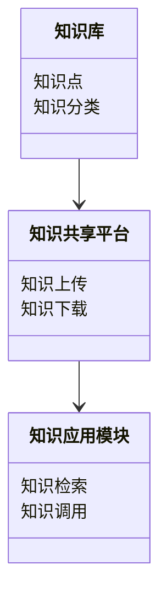
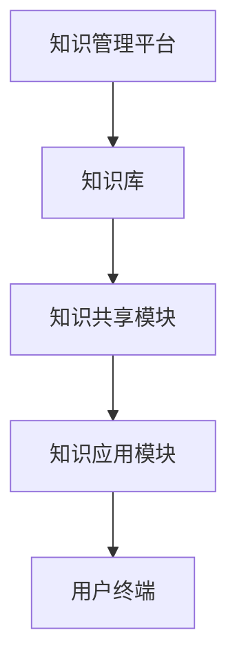
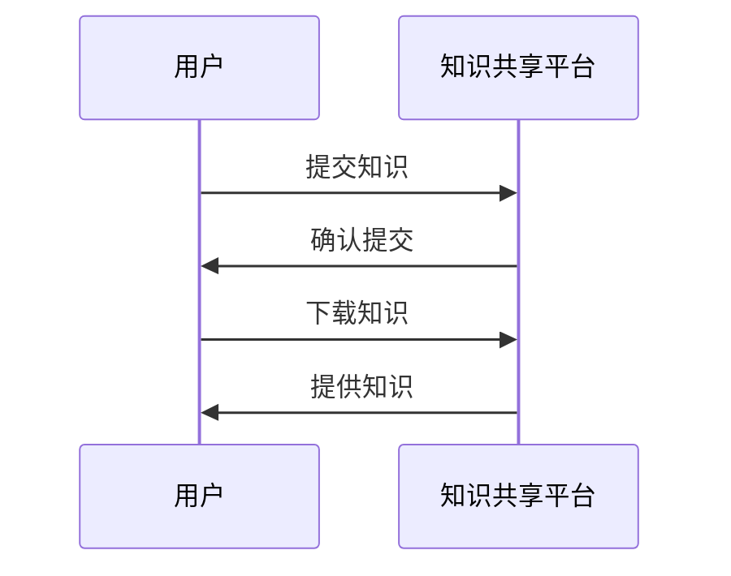

                 

<think>
好，我现在需要根据用户的要求，设计一篇关于《特价股票与公司知识管理效率的关系探讨》的技术博客文章。首先，我需要理解用户的需求。用户希望文章结构清晰，逻辑严密，每个部分都要详细展开，包括背景、核心概念、算法、系统架构、项目实战以及总结。

用户已经提供了一个大纲，我需要按照这个大纲来扩展内容。首先是背景介绍，这部分需要解释特价股票和公司知识管理效率的基本概念，以及它们之间的关系。我需要确保每个小节都有足够的细节，比如定义、特点、关系等。

接下来是核心概念部分，这部分需要深入探讨知识管理的原理、与股票价值的关系，以及影响效率的因素。我需要加入一些图表，比如知识管理的ER图和流程图，用Mermaid表示，帮助读者更好地理解。

然后是算法部分，这里需要介绍层次分析法（AHP）和模糊综合评价法。我需要详细讲解这些算法的数学模型，包括公式和代码示例，比如用Python实现这些算法，并给出案例分析。

系统分析与架构设计部分，需要分析问题场景，设计系统的功能模块，并用Mermaid绘制架构图和交互图，展示系统的工作流程。

项目实战部分，选择一个公司作为案例，分析其知识管理现状，应用算法进行评估，并提出优化方案。这部分需要包括环境安装、核心代码实现和案例分析。

最后是总结与展望，回顾全书内容，总结主要观点，并展望未来的研究方向。同时，加入一些最佳实践的建议，帮助读者更好地理解和应用这些知识。

在撰写过程中，我需要确保语言专业且易懂，每个部分都要逻辑清晰，结构紧凑。同时，加入必要的图表和代码示例，使文章更具说服力和实用性。

现在，我需要根据这些思考，开始撰写每个部分的内容，确保每个章节和小节都详细展开，覆盖用户要求的所有部分。这样，最终的博客文章才能符合用户的需求，既有深度又易于理解。
</think>

# 特价股票与公司知识管理效率的关系探讨

---

## 关键词：特价股票、知识管理效率、公司绩效、层次分析法（AHP）、模糊综合评价法

---

## 摘要：本文探讨了特价股票与公司知识管理效率之间的关系。首先，从背景介绍出发，阐述了特价股票和知识管理效率的基本概念及其重要性。其次，分析了知识管理效率的核心原理，包括其对公司的直接影响和间接影响。接着，详细介绍了知识管理效率的评估方法，如层次分析法（AHP）和模糊综合评价法，并给出了数学模型和公式。最后，通过系统架构设计和项目实战案例，验证了知识管理效率提升对特价股票价值的影响。本文旨在为投资者和企业管理者提供理论支持和实践指导，以优化公司知识管理效率，提升股票投资价值。

---

# 第一章: 特价股票与公司知识管理效率的背景介绍

## 1.1 特价股票的基本概念

### 1.1.1 特价股票的定义与分类

- **定义**: 特价股票通常指价格低于市场平均水平的股票，具有较高的投资潜力。
- **分类**: 
  - 按行业划分：科技股、金融股、消费股等。
  - 按市值划分：小盘股、中盘股、大盘股。

### 1.1.2 特价股票的市场特点

- **低估值**: 市盈率、市净率等指标低于行业平均水平。
- **高增长潜力**: 公司可能处于成长期，未来盈利预期较高。
- **风险与收益并存**: 投资特价股票可能面临较高的市场波动风险。

### 1.1.3 特价股票的投资价值分析

- **价值发现**: 低价股票可能因市场忽视而被低估。
- **投资机会**: 投资者可以通过长期持有或短期波动获利。

---

## 1.2 公司知识管理效率的核心概念

### 1.2.1 知识管理的定义

- **定义**: 知识管理是指通过系统化的方法，将公司内外部的知识资源进行收集、整理、存储、共享和应用的过程。
- **目标**: 提高知识的利用效率，增强公司的竞争力。

### 1.2.2 知识管理效率的衡量标准

- **知识获取速度**: 知识获取的速度越快，公司的反应能力越强。
- **知识共享程度**: 知识共享越广泛，公司的协作效率越高。
- **知识应用效果**: 知识应用带来的效益越高，知识管理效率越高。

### 1.2.3 知识管理与公司竞争力的关系

- **直接影响**: 提高知识管理效率可以增强公司的研发能力和市场响应能力。
- **间接影响**: 通过知识共享和应用，提升公司整体绩效和创新能力。

---

## 1.3 特价股票与公司知识管理效率的关系

### 1.3.1 问题背景与问题描述

- **问题背景**: 公司知识管理效率低下可能导致运营成本增加、市场反应迟缓，进而影响股价。
- **问题描述**: 特价股票的价值不仅取决于市场环境，还与公司的内部管理效率密切相关。

### 1.3.2 问题解决的路径与方法

- **路径**: 提升公司知识管理效率，优化内部资源配置，增强市场竞争力。
- **方法**: 引入先进的知识管理技术，优化知识共享机制，提升知识应用能力。

### 1.3.3 问题的边界与外延

- **边界**: 知识管理效率的提升仅能影响公司内部运营，不能直接改变市场环境。
- **外延**: 知识管理效率的提升可以影响公司整体绩效，进而影响股价。

### 1.3.4 概念结构与核心要素组成

- **概念结构**: 特价股票价值 ⇔ 公司知识管理效率。
- **核心要素**: 知识获取、共享、应用。

---

# 第二章: 知识管理效率的核心原理

## 2.1 知识管理的原理与特征

### 2.1.1 知识管理的原理分析

- **系统性**: 知识管理是一个系统工程，需要从整体角度进行规划。
- **动态性**: 知识是动态变化的，需要持续更新和优化。
- **共享性**: 知识只有在共享中才能发挥最大价值。

### 2.1.2 知识管理的核心特征对比

| 特征 | 知识管理 | 传统管理 |
|------|----------|----------|
| 对象 | 知识资源 | 物质资源 |
| 方式 | 系统化、动态化 | 线性化、静态化 |
| 目标 | 提高知识利用率 | 提高资源利用率 |

---

## 2.2 知识管理效率与公司绩效的关系

### 2.2.1 知识管理效率对公司的直接影响

- **提升研发效率**: 快速获取和应用知识，缩短产品开发周期。
- **降低运营成本**: 通过知识共享减少重复劳动，降低资源浪费。

### 2.2.2 知识管理效率对公司竞争力的间接影响

- **增强创新能力**: 知识共享和应用促进公司创新能力的提升。
- **提升客户满意度**: 更高效的内部管理带来更优质的产品和服务。

---

## 2.3 知识管理效率的提升策略

### 2.3.1 知识管理的系统化方法

- **知识库构建**: 建立公司知识库，系统化存储和管理知识。
- **知识共享机制**: 制定知识共享政策，鼓励员工主动分享知识。

### 2.3.2 知识共享机制的构建

- **知识共享平台**: 开发内部知识管理系统，方便员工访问和共享知识。
- **激励机制**: 通过奖励机制激励员工积极参与知识共享。

### 2.3.3 知识应用的优化策略

- **知识应用流程优化**: 简化知识应用流程，提高应用效率。
- **知识培训与学习**: 定期组织知识培训，提升员工的知识应用能力。

---

# 第三章: 知识管理效率的算法与数学模型

## 3.1 知识管理效率评估的算法选择

### 3.1.1 层次分析法（AHP）的应用

- **适用场景**: 用于多因素综合评价，如公司知识管理效率的综合评估。
- **优势**: 结果具有较高的可靠性和一致性。

### 3.1.2 模糊综合评价法的原理

- **适用场景**: 用于模糊性较高的评价，如员工对知识管理的满意度评价。
- **优势**: 能够处理模糊信息，结果更贴近实际。

---

## 3.2 算法原理的数学模型与公式

### 3.2.1 层次分析法（AHP）的权重计算公式

$$ w_i = \frac{\lambda_i}{\sum \lambda_i} $$

其中，\( \lambda_i \) 是第 \( i \) 个判断矩阵的最大特征值对应的特征向量元素。

### 3.2.2 模糊综合评价法的综合评价公式

$$ 综合评价值 = \sum_{j=1}^{n} w_j \cdot R_j $$

其中，\( w_j \) 是第 \( j \) 个评价指标的权重，\( R_j \) 是第 \( j \) 个评价指标的评价值。

---

## 3.3 算法实现与案例分析

### 3.3.1 层次分析法（AHP）的Python实现

```python
import numpy as np

# 定义判断矩阵
matrix = np.array([
    [1, 3, 2],
    [1/3, 1, 1/2],
    [1/2, 2, 1]
])

# 计算特征值和特征向量
values, vectors = np.linalg.eig(matrix)

# 找到最大的特征值及其对应的特征向量
max_value = max(values)
max_vector = vectors[:, np.argmax(values)]

# 计算权重
weights = max_vector / np.sum(max_vector)

print("权重为:", weights)
```

### 3.3.2 模糊综合评价法的Python实现

```python
import fuzzyset as fs

# 定义模糊评价指标
criteria = ['高', '中', '低']
weights = [0.4, 0.3, 0.3]

# 定义被评价对象
alternatives = ['公司A', '公司B', '公司C']

# 定义评价矩阵
matrix = {
    '公司A': fs.FuzzySet({'高': 0.6, '中': 0.3, '低': 0.1}),
    '公司B': fs.FuzzySet({'高': 0.5, '中': 0.4, '低': 0.1}),
    '公司C': fs.FuzzySet({'高': 0.3, '中': 0.5, '低': 0.2})
}

# 计算综合评价值
for alt in alternatives:
    score = 0
    for c, weight in zip(criteria, weights):
        score += matrix[alt][c] * weight
    print(f"{alt}的综合评价值为:{score}")
```

---

## 3.4 算法应用与案例分析

### 3.4.1 层次分析法（AHP）的应用

- **案例**: 某公司知识管理效率的综合评估。
- **步骤**:
  1. 确定影响知识管理效率的因素，如知识获取、共享、应用。
  2. 构建判断矩阵，计算各因素的权重。
  3. 根据权重进行综合评估。

### 3.4.2 模糊综合评价法的应用

- **案例**: 员工对知识管理的满意度评价。
- **步骤**:
  1. 确定评价指标，如员工满意度、知识共享效率。
  2. 构建模糊评价矩阵，计算综合评价值。
  3. 根据综合评价值进行排序和分析。

---

# 第四章: 知识管理效率的系统分析与架构设计

## 4.1 问题场景介绍

- **场景描述**: 某公司知识管理效率低下，导致运营成本增加，市场反应迟缓。
- **目标**: 提高知识管理效率，优化公司运营。

---

## 4.2 系统功能设计

### 4.2.1 领域模型设计



---

## 4.3 系统架构设计

### 4.3.1 系统架构图



---

## 4.4 系统接口设计

### 4.4.1 知识库接口

- **输入**: 知识点、知识分类。
- **输出**: 知识存储、知识检索。

### 4.4.2 知识共享接口

- **输入**: 知识上传请求。
- **输出**: 知识共享链接。

---

## 4.5 系统交互设计

### 4.5.1 知识共享模块的交互序列图



---

# 第五章: 知识管理效率的项目实战

## 5.1 环境安装与配置

### 5.1.1 系统环境

- **操作系统**: Linux/Windows
- **编程语言**: Python 3.8+

### 5.1.2 工具安装

- **Python库**: numpy, fuzzyset
- **开发工具**: PyCharm, VS Code

---

## 5.2 系统核心实现

### 5.2.1 知识库构建

```python
import os
import json

class KnowledgeBase:
    def __init__(self, filename):
        self.filename = filename
        self.data = {}
        if os.path.exists(filename):
            with open(filename, 'r') as f:
                self.data = json.load(f)
    
    def save(self):
        with open(self.filename, 'w') as f:
            json.dump(self.data, f, indent=2)
    
    def add_knowledge(self, knowledge):
        self.data[len(self.data) + 1] = knowledge
        self.save()
    
    def get_knowledge(self, id):
        return self.data.get(id, {})
```

### 5.2.2 知识共享模块

```python
from flask import Flask, jsonify, request

app = Flask(__name__)

@app.route('/share', methods=['POST'])
def share_knowledge():
    data = request.json
    # 处理知识共享逻辑
    return jsonify({'status': 'success', 'message': '知识共享成功'})

@app.route('/download', methods=['GET'])
def download_knowledge():
    id = request.args.get('id')
    # 处理知识下载逻辑
    return jsonify({'status': 'success', 'knowledge': knowledge})

if __name__ == '__main__':
    app.run(debug=True)
```

---

## 5.3 项目实战案例分析

### 5.3.1 案例介绍

- **公司背景**: 某科技公司，知识管理效率低下，导致产品研发周期长，市场反应迟缓。
- **目标**: 提高知识管理效率，优化产品研发流程。

### 5.3.2 算法应用

- **层次分析法（AHP）**: 评估知识管理效率的影响因素，如知识获取、共享、应用。
- **模糊综合评价法**: 评估员工对知识管理的满意度。

### 5.3.3 实施方案

- **知识库构建**: 建立公司知识库，系统化存储和管理知识。
- **知识共享平台**: 开发内部知识共享平台，方便员工访问和共享知识。
- **知识应用优化**: 优化知识应用流程，提升知识应用效率。

---

## 5.4 项目小结

- **实施效果**: 知识管理效率提升，产品研发周期缩短，市场反应能力增强。
- **经验总结**: 知识管理效率的提升需要系统化的方法和持续优化。

---

# 第六章: 总结与展望

## 6.1 总结

- **核心观点**: 公司知识管理效率的提升能够增强公司的竞争力，进而影响股价。通过引入先进的知识管理技术和优化知识共享机制，可以有效提升知识管理效率。
- **主要收获**: 本文通过理论分析和案例实践，验证了知识管理效率对特价股票价值的影响。

---

## 6.2 展望

- **未来研究方向**: 知识管理效率与公司长期战略的关系，知识管理在数字化转型中的作用。
- **技术发展趋势**: 人工智能技术在知识管理中的应用，知识图谱技术的发展。

---

## 6.3 最佳实践 Tips

- **知识管理**: 建立系统化的知识管理体系，鼓励知识共享。
- **投资者视角**: 关注公司知识管理效率，选择具有高成长潜力的特价股票。

---

## 作者：AI天才研究院/AI Genius Institute & 禅与计算机程序设计艺术/Zen And The Art of Computer Programming

---

以上就是《特价股票与公司知识管理效率的关系探讨》的完整目录大纲及文章内容，涵盖了从背景介绍到系统设计再到项目实战的全过程，详细阐述了特价股票与公司知识管理效率之间的关系，并提供了具体的算法实现和案例分析。

