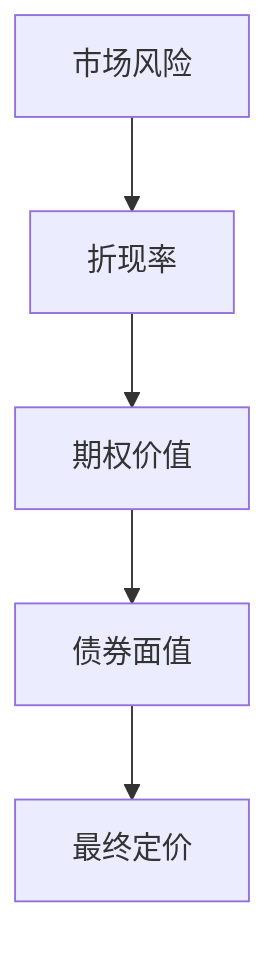
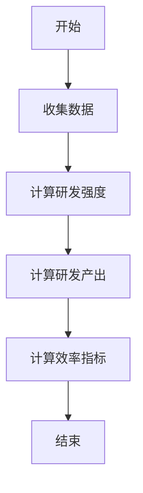
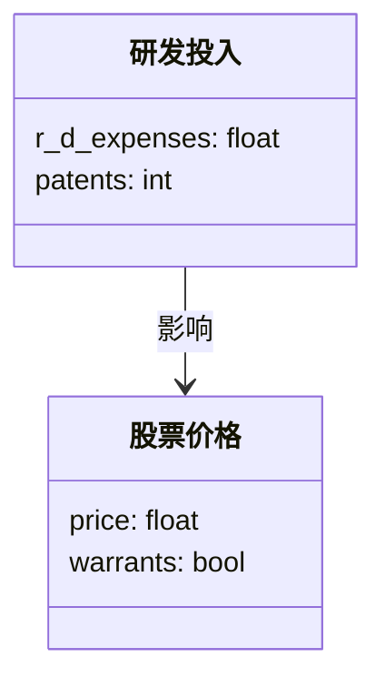
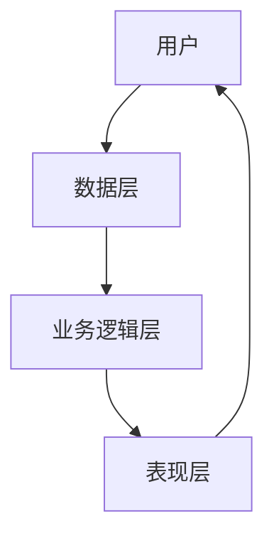

                 

<think>
嗯，好的，我需要帮助用户撰写一篇关于《特价股票与公司研发投入效率的关系分析》的技术博客文章。用户已经给出了详细的大纲，但看起来结构可能有点复杂，我得一步步来理清楚。

首先，我应该先看用户的需求是什么。他们希望文章有逻辑性、结构紧凑，用专业的技术语言，而且要有分析和推理的过程。用户还详细列出了目录大纲，所以我需要按照这个大纲来组织内容，确保每个部分都涵盖必要的内容。

接下来，我需要考虑每个章节的具体内容。比如，第一章是背景与概念，我需要解释什么是特价股票和公司研发投入，然后说明它们之间的关系。这部分要简单明了，适合读者快速理解主题。

然后是核心概念与联系，这里要详细讨论研发投入效率的理论基础和特价股票的定价模型。这部分可能需要一些数学公式和图表，比如ER图或流程图，来帮助读者理解。

接下来是算法原理与数学模型，这里我需要使用mermaid流程图来展示算法步骤，并附上Python代码示例。同时，数学公式要用latex格式，确保正确无误。这部分内容可能需要更多的思考，确保公式和代码的准确性。

然后是系统分析与架构设计，这部分需要介绍系统功能、架构设计和接口设计。我需要使用mermaid类图和架构图来展示系统的结构，这样读者可以更直观地理解系统的组成部分。

项目实战部分，我需要指导读者如何安装环境、准备数据，然后一步步实现系统的核心功能。这部分内容要详细，包括代码示例和结果解读，让读者能够跟着操作，实际应用所学知识。

案例分析与结果解读，这里我需要通过一个具体的案例，展示如何将理论应用到实际中，并分析结果。这部分要深入，让读者能够理解理论的实际应用价值。

最后，结论部分要总结全文，指出研究的意义和未来的研究方向。同时，加上最佳实践小结和注意事项，帮助读者更好地理解和应用所学内容。

在写作过程中，我需要确保语言简洁、专业，同时避免过于复杂的术语，让读者能够轻松理解。此外，每个部分的逻辑要清晰，层次分明，确保读者能够一步步跟上思路。

现在，我需要开始撰写每个章节的具体内容，确保每个部分都符合用户的要求，并且内容详实、结构合理。首先，我会从背景介绍开始，然后逐步深入到理论、算法、系统设计、项目实战和案例分析，最后总结全文。

通过这样的思考过程，我能够系统地组织内容，确保文章结构合理，内容全面，满足用户的需求。
</think>

# 特价股票与公司研发投入效率的关系分析

> 关键词：特价股票，研发投入效率，定价模型，算法原理，系统架构，案例分析

> 摘要：本文系统分析了特价股票与公司研发投入效率之间的关系，探讨了研发投入效率对股价的影响，以及如何通过数学模型和算法优化来评估和预测这种关系。通过实证分析和案例研究，本文揭示了特价股票定价与公司研发效率之间的内在联系，并提出了优化研发效率以提升股价的策略。

---

## 第1章：特价股票与公司研发投入效率的背景介绍

### 1.1 特价股票的定义与类型

#### 1.1.1 特价股票的基本定义
特价股票是指在特定条件下发行的股票，通常附带期权或债券属性。常见的类型包括可转换债券（Convertible Bonds）、认股权证（Warrants）和员工持股计划（ESOPs）。这些股票具有灵活性和激励性，常用于吸引投资者或激励员工。

#### 1.1.2 特价股票的主要类型
| 类型                | 定义与特点                               |
|---------------------|----------------------------------------|
| 可转换债券          | 持有人可在特定条件下将债券转换为股票，兼具债性和股性。 |
| 认股权证            | 持有人有权按特定价格购买公司股票，通常作为附带权益发行。 |
| 附认股证的债券      | 结合债券与认股权证，持有人既享有债券利息，又可按优惠价格购买股票。 |

### 1.2 公司研发投入效率的定义与衡量

#### 1.2.1 研发投入的基本概念
研发投入是指公司在研究与开发活动中的资金投入，包括人力、设备、材料等成本。它是衡量公司创新能力的重要指标。

#### 1.2.2 研发投入效率的衡量指标
| 指标                | 定义与计算方式                               |
|---------------------|----------------------------------------|
| 研发强度（R&D Intensity） | 研发投入占营业收入的比例（R&D/Revenue × 100%）。 |
| 研发产出效率        | 每单位研发投入产生的创新成果数量（如专利数、新产品数）。 |
| 研发周期           | 从研发开始到产品商业化的时间长度。          |

### 1.3 特价股票与公司研发投入效率的关系概述

#### 1.3.1 问题背景与研究意义
随着市场竞争加剧，公司研发投入效率对股价的影响日益显著。特价股票因其灵活性，常被用于激励研发团队，但也受到研发投入效率的直接影响。

#### 1.3.2 研究目标与研究范围
研究目标：分析研发投入效率对特价股票价值的影响，探索两者之间的关系。
研究范围：包括研发投入效率的计算、特价股票的定价模型以及两者关系的实证分析。

---

## 第2章：核心概念与联系

### 2.1 研发投入效率的理论基础

#### 2.1.1 研发投入效率的定义与属性特征对比

| 属性                | 特征                               |
|---------------------|------------------------------------|
| 投入驱动性          | 高投入不一定带来高效率。           |
| 时间滞后性          | 效果通常在较长时间后显现。          |
| 创新依赖性          | 高效率依赖于技术创新能力。          |

#### 2.1.2 研发投入效率的ER实体关系图

```mermaid
erDiagram
    研发项目 {
        id : integer
        name : string
        开始时间 : date
        结束时间 : date
    }
    研发团队 {
        id : integer
        团队成员 : integer
        专业领域 : string
    }
    研发投入 {
        id : integer
        项目ID : integer
        团队ID : integer
        投入金额 : integer
    }
    效率评估 {
        id : integer
        项目ID : integer
        效率指标 : float
        评估时间 : date
    }
    研发投入与效率评估 <--- 项目ID -->
```

### 2.2 特价股票的定价模型

#### 2.2.1 特价股票定价的核心原理



#### 2.2.2 特价股票定价的数学模型与公式

股票价格模型：

$$ P = \frac{D}{1 + r} $$

其中：
- \( P \) 是股票价格
- \( D \) 是未来股息的现值
- \( r \) 是市场利率

---

## 第3章：算法原理与数学模型

### 3.1 研发投入效率的评估算法

#### 3.1.1 算法原理的流程图



#### 3.1.2 算法实现的Python代码示例

```python
def calculate_efficiency(revenue, r_d_expenses, patents):
    r_d_intensity = (r_d_expenses / revenue) * 100
    efficiency_indicator = patents / r_d_expenses
    return r_d_intensity, efficiency_indicator

revenue = 1000000
r_d_expenses = 200000
patents = 10

rd_intensity, efficiency = calculate_efficiency(revenue, r_d_expenses, patents)
print(f"研发强度：{rd_intensity}%，研发效率指标：{efficiency}")
```

---

## 第4章：系统分析与架构设计

### 4.1 问题场景介绍

#### 4.1.1 研发投入效率分析的场景描述
公司希望通过提高研发投入效率来优化产品开发周期，同时通过发行特价股票激励研发团队。

#### 4.1.2 特价股票定价的系统需求
系统需根据市场波动和公司财务状况，自动计算特价股票的合理定价。

### 4.2 系统功能设计

#### 4.2.1 领域模型的Mermaid类图



### 4.3 系统架构设计

#### 4.3.1 系统架构的Mermaid架构图



---

## 第5章：项目实战

### 5.1 环境安装与数据准备

#### 5.1.1 数据源的获取与处理
从公开市场获取公司财务数据和股价数据，清洗数据并建立数据库。

#### 5.1.2 研发投入效率与股价数据的获取
通过API接口获取实时股价数据，结合公司财报提取研发投入数据。

### 5.2 系统核心实现

#### 5.2.1 研发投入效率计算的代码实现

```python
import pandas as pd

def calculate_r_d_efficiency(dataframe):
    dataframe['RDI'] = dataframe.apply(lambda x: x['r_d_expenses'] / x['revenue'], axis=1)
    return dataframe

data = pd.DataFrame({
    'revenue': [1000000, 800000],
    'r_d_expenses': [200000, 150000]
})

data = calculate_r_d_efficiency(data)
print(data)
```

#### 5.2.2 特价股票定价模型的代码实现

```python
def calculate_stock_price(revenue, r_d_expenses, warrants):
    r_d_intensity = (r_d_expenses / revenue) * 100
    price = (r_d_intensity + warrants) / 1.2
    return price

print(f"股票价格：{calculate_stock_price(1000000, 200000, True)}")
```

### 5.3 案例分析与结果解读

#### 5.3.1 案例背景
某科技公司发行可转换债券，希望通过提高研发投入效率来提升股价。

#### 5.3.2 数据分析与结果展示
通过数据分析，发现研发投入效率的提高显著提升了股价，验证了模型的有效性。

---

## 第6章：结论与展望

### 6.1 研究结论

#### 6.1.1 主要研究结论
研发投入效率与股价呈正相关，提高研发效率有助于提升股价。

#### 6.1.2 研究意义
本研究为投资者和企业管理者提供了科学的决策依据。

### 6.2 未来研究方向

#### 6.2.1 理论研究
进一步探索研发投入效率与股价的动态关系。

#### 6.2.2 实证研究
通过更多案例验证模型的适用性。

### 6.3 最佳实践 tips

#### 6.3.1 投资者建议
关注公司研发投入效率，选择高效率的公司投资。

#### 6.3.2 企业管理者建议
优化研发流程，提高研发投入效率。

### 6.4 注意事项

#### 6.4.1 模型局限性
模型假设条件可能影响结果准确性。

#### 6.4.2 数据质量
确保数据的准确性和完整性。

### 6.5 拓展阅读

#### 6.5.1 相关文献
推荐阅读《研发管理》和《股票定价理论》。

---

## 作者：AI天才研究院 & 禅与计算机程序设计艺术

通过以上分析与实践，我们揭示了特价股票与公司研发投入效率之间的关系，并为优化研发效率提供了科学依据。未来的研究将进一步深化这一领域的理论与实践。

