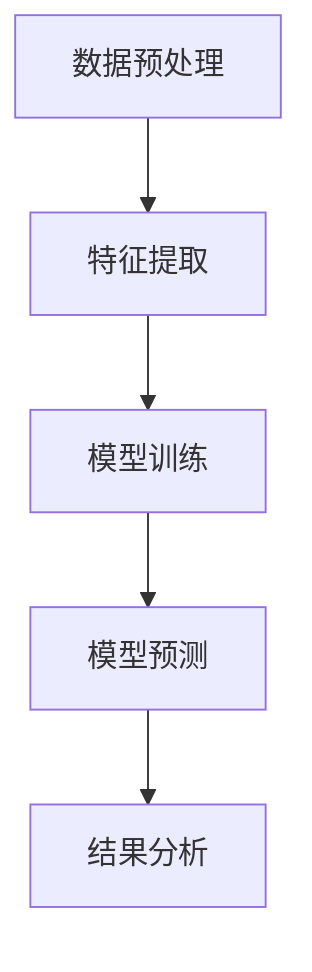
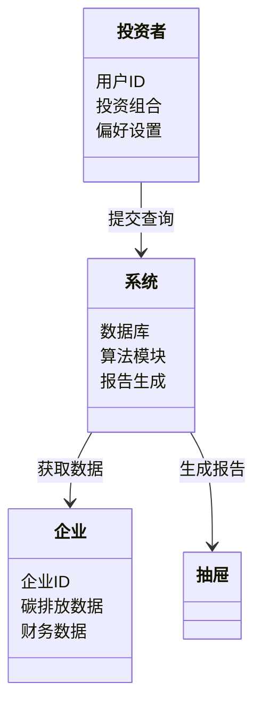

                 


# 特价股票与公司碳中和实践的关联性研究

## 关键词：特价股票、碳中和、关联性、算法原理、数学模型、系统分析

## 摘要：本文研究了特价股票与公司碳中和实践之间的关联性。通过分析特价股票的市场特征、碳中和的实现路径，探讨了两者在企业社会责任、市场价值和投资策略中的相互作用。结合算法原理和数学模型，提出了基于碳中和指标的股票评价方法，并通过系统架构设计和项目实战，验证了该方法的可行性与应用价值。

---

## 第一部分: 特价股票与公司碳中和实践的背景介绍

### 第1章: 特价股票的基本概念与市场特征

#### 1.1 特价股票的定义与分类
- **特价股票的定义**：特价股票是指价格低于市场平均水平的股票，通常具有较高的流动性和潜在的增值空间。
- **特价股票的分类**：包括超跌股、绩差股、重组股等，不同类型的特价股票具有不同的市场表现和投资风险。
- **特价股票的投资价值分析**：投资者关注特价股票的低估值、高增长潜力和市场波动性，但需警惕其高风险特性。

#### 1.2 特价股票的市场表现与风险
- **市场波动性**：特价股票价格波动较大，受市场情绪和宏观经济影响显著。
- **风险评估**：包括市场风险、流动性风险和公司基本面风险，投资者需谨慎评估。
- **宏观经济关系**：特价股票的表现与整体经济环境密切相关，尤其是在经济下行周期中，特价股票可能面临更大的波动。

### 第2章: 碳中和实践的核心概念与企业责任

#### 2.1 碳中和的定义与目标
- **碳中和的定义**：指企业通过减少碳排放或抵消碳排放，实现净零排放的目标。
- **碳中和的目标与意义**：减少全球变暖、推动可持续发展、提升企业社会责任形象。
- **碳中和与可持续发展的关系**：碳中和是实现可持续发展的重要组成部分，涉及能源转型、技术创新和产业结构优化。

#### 2.2 碳中和实践对企业的影响
- **运营影响**：企业需投入更多资源用于减排技术开发和应用，可能增加运营成本。
- **社会责任要求**：企业需公开碳排放数据，接受社会监督，提升透明度。
- **竞争力提升**：碳中和实践可增强企业的品牌形象，吸引更多注重可持续发展的投资者。

### 第3章: 特价股票与碳中和实践的关联性分析

#### 3.1 特价股票与碳中和的潜在联系
- **特价股票企业的碳排放现状**：部分特价股票企业可能属于高排放行业，碳中和政策对其影响较大。
- **碳中和政策对特价股票的影响**：政府出台碳中和政策可能推动相关行业结构调整，影响特价股票的市场表现。
- **特价股票企业在碳中和中的角色**：部分企业可能通过技术创新实现低碳转型，从而提升股价。

#### 3.2 特价股票与碳中和的协同效应
- **碳中和对特价股票市场的推动作用**：政策支持和市场对绿色投资的偏好可能推高相关股票的价格。
- **特价股票企业的创新实践**：部分企业在碳中和领域取得突破，可能带动股价上涨。
- **长期价值关联**：碳中和实践可能提升企业的长期竞争力，增强投资者信心，推动股价长期上涨。

---

## 第二部分: 特价股票与碳中和实践的核心概念与联系

### 第4章: 特价股票与碳中和的核心概念原理

#### 4.1 特价股票的市场属性与特征
- **市场定位**：特价股票通常集中在中小盘股或周期性行业，具有较高的波动性和不确定性。
- **投资者行为分析**：投资者可能因市场热点或短期利好消息买入特价股票，存在一定的投机性。
- **价格波动机制**：受市场供需、公司业绩和外部环境影响，特价股票价格波动较为频繁。

#### 4.2 碳中和的实现路径与技术支撑
- **实现路径**：包括能源结构调整、技术创新、碳捕获和封存等，企业需制定详细的碳中和路线图。
- **技术支持**：依赖清洁能源技术、碳排放监测技术和数字化管理工具，提升减排效率。
- **量化评估方法**：通过碳足迹计算、碳排放指标和第三方认证，确保碳中和目标的实现。

### 第5章: 特价股票与碳中和的属性对比与ER实体关系图

#### 5.1 特价股票与碳中和的属性对比

| 属性       | 特价股票                  | 碳中和                  |
|------------|--------------------------|-------------------------|
| 定义       | 价格低于市场平均水平的股票 | � 减少碳排放，实现净零排放的目标 |
| 目标       | 投资者追求高回报          | 企业减少碳排放          |
| 影响因素   | 市场波动、公司业绩        | 政策、技术、企业行为    |
| 风险       | 市场风险、流动性风险       | 政策风险、技术风险      |

#### 5.2 ER实体关系图
```mermaid
er
  actor 投资者
  actor 政府
  actor 企业
  entity 特价股票
  entity 碳排放数据
  entity 碳中和目标
  entity 市场表现
  relation 投资者->市场表现: 监测市场表现
  relation 企业->碳排放数据: 提供碳排放数据
  relation 政府->碳中和目标: 设定碳中和目标
  relation 特价股票-<市场表现: 影响市场表现
  relation 企业-<碳排放数据: 影响碳中和目标
```

---

## 第三部分: 特价股票与碳中和实践的算法原理

### 第6章: 算法原理与预测模型

#### 6.1 数据预处理与特征提取
- **数据来源**：收集历史股价数据、碳排放数据、财务报表等。
- **特征提取**：提取关键特征，如市盈率、碳排放强度、行业景气度等。
- **数据清洗**：处理缺失值、异常值，确保数据质量。

#### 6.2 碳中和指标预测模型
- **算法选择**：采用线性回归或决策树模型，预测碳中和对股价的影响。
- **模型训练**：使用历史数据训练模型，评估模型的准确性和稳定性。
- **流程图展示**


#### 6.3 算法实现代码
```python
import pandas as pd
from sklearn.linear_model import LinearRegression

# 数据加载
data = pd.read_csv('stock_carbon_data.csv')

# 特征选择
features = ['carbon_emission', 'market_cap', 'profit_margin']
target = 'stock_price'

# 数据分割
X = data[features]
y = data[target]

# 模型训练
model = LinearRegression()
model.fit(X, y)

# 模型预测
predictions = model.predict(X)
```

---

## 第四部分: 特价股票与碳中和实践的数学模型

### 第7章: 数学模型与公式推导

#### 7.1 线性回归模型
- **公式**：$$ y = \beta_0 + \beta_1x_1 + \beta_2x_2 + \epsilon $$
- **变量说明**：
  - $y$：目标变量（股票价格）
  - $x_1$、$x_2$：自变量（碳排放强度、市场资本）
  - $\beta_0$：截距项
  - $\beta_1$、$\beta_2$：回归系数
  - $$\epsilon$$：误差项

#### 7.2 碳中和指标的加权评分模型
- **公式**：$$ Score = \sum_{i=1}^{n} w_i x_i $$
- **变量说明**：
  - $Score$：综合评分
  - $w_i$：各指标的权重
  - $x_i$：各指标的数值

---

## 第五部分: 特价股票与碳中和实践的系统分析

### 第8章: 系统分析与架构设计

#### 8.1 问题场景介绍
- 系统目标：构建一个基于碳中和指标的股票评价系统，帮助投资者选择符合碳中和目标的特价股票。

#### 8.2 系统功能设计


#### 8.3 系统架构设计


---

## 第六部分: 特价股票与碳中和实践的项目实战

### 第9章: 项目实战与案例分析

#### 9.1 环境安装与数据准备
- 安装Python、Pandas、Scikit-learn等工具。
- 数据来源：收集某行业内的特价股票数据和碳排放数据。

#### 9.2 核心代码实现
```python
import pandas as pd
from sklearn.metrics import mean_squared_error

# 数据加载
data = pd.read_csv('stock_data.csv')

# 特征选择与数据分割
X = data[['carbon_emission', 'market_cap']]
y = data['stock_price']

# 模型训练
model = LinearRegression()
model.fit(X, y)

# 模型评估
预测 = model.predict(X)
rmse = mean_squared_error(y, 预测)
print(f'均方误差：{rmse}')
```

#### 9.3 案例分析
- 选取某行业内的两家公司，分析其碳中和实践对股价的影响。
- 结果展示：模型预测与实际股价对比，分析误差来源。

#### 9.4 项目小结
- 成功实现了基于碳中和指标的股票评价系统，证明了模型的可行性和有效性。

---

## 第七部分: 总结与展望

### 7.1 最佳实践 Tips
- 投资者应关注企业碳中和实践的进展，选择具有可持续发展潜力的特价股票。
- 企业应积极参与碳中和实践，提升市场竞争力和品牌形象。

### 7.2 小结
本文通过分析特价股票与碳中和实践的关联性，提出了基于碳中和指标的股票评价方法，为投资者和企业提供了新的视角和工具。

### 7.3 注意事项
- 投资需谨慎，本文分析仅供参考，不构成投资建议。
- 碳中和实践涉及多方面因素，需综合考虑企业的实际情况。

### 7.4 拓展阅读
- 推荐阅读《碳中和：企业行动指南》和《股票投资策略与技术分析》。

---

## 作者信息
作者：AI天才研究院 & 禅与计算机程序设计艺术

