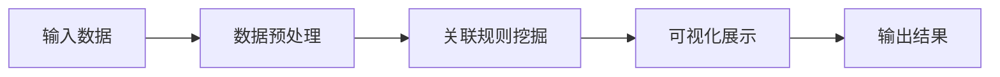
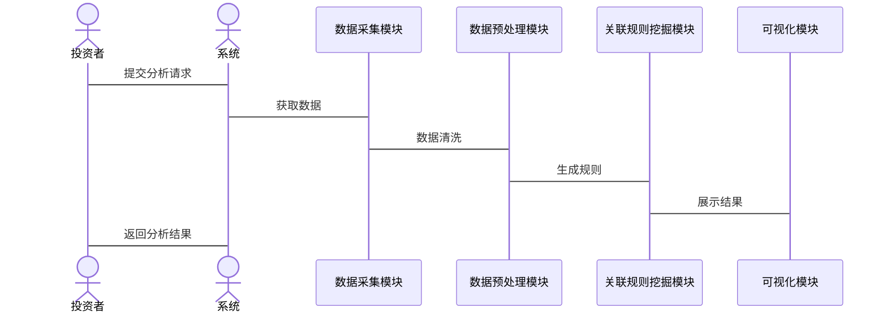

                 


# 特价股票与公司社交资本积累的关联分析

## 关键词：
特价股票、社交资本、关联分析、Apriori算法、企业社会资本

## 摘要：
本文系统探讨了特价股票与公司社交资本积累之间的关联性，通过分析特价股票的市场特性、社交资本的构成要素，以及它们之间的互动机制，结合关联规则挖掘算法，提出了一套分析框架，并通过实际案例展示了如何利用该框架进行预测和决策优化。

---

## 第1章: 特价股票与公司社交资本积累的背景与概念

### 1.1 特价股票的基本概念
#### 1.1.1 特价股票的定义
特价股票通常指价格远低于市场平均市盈率或行业平均水平的股票，常见于市场低迷或公司处于困境时期。这些股票往往具有较高的潜在回报，但也伴随着较高的风险。

#### 1.1.2 特价股票的分类
- 按行业分类：如科技、金融、制造等行业的特价股票。
- 按公司规模分类：大盘股、中盘股、小盘股。
- 按价格区间分类：深度特价股（价格远低于行业平均水平）、中度特价股（价格略低于行业水平）。

#### 1.1.3 特价股票的市场特征
- 价格波动大：受市场情绪和公司基本面的影响。
- 风险高：高波动性可能导致大幅亏损。
- 机会与风险并存：低价股票可能因公司扭亏为盈而大幅反弹。

### 1.2 公司社交资本积累的概念
#### 1.2.1 社交资本的定义
社交资本是指企业通过与利益相关者（股东、客户、员工、合作伙伴）建立关系而获得的资源、信任和影响力。它是企业社会资本的重要组成部分。

#### 1.2.2 公司社交资本的构成要素
- 网络资源：企业与外部利益相关者的联系网络。
- 信任与声誉：企业在市场中的信任度和品牌形象。
- 合作能力：企业与合作伙伴共同解决问题的能力。

#### 1.2.3 公司社交资本的积累方式
- 通过公益活动提升品牌形象。
- 通过良好的股东沟通增强投资者信任。
- 通过合作伙伴关系扩展资源网络。

### 1.3 特价股票与公司社交资本积累的关联性
#### 1.3.1 特价股票与公司社交资本的关联背景
在市场低迷时期，公司社交资本的积累可能影响投资者对特价股票的看法。例如，良好的社交资本可以帮助公司获得更多投资者支持，从而提高股价稳定性。

#### 1.3.2 特价股票与公司社交资本的关联机制
- 社交资本高的公司可能更容易获得投资者青睐，从而减少股价波动。
- 特价股票的波动性为社交资本积累提供了机会，如通过股东沟通改善股价表现。

#### 1.3.3 本章小结
本章介绍了特价股票和社交资本的基本概念，并初步探讨了它们之间的关联性，为后续分析奠定了基础。

---

## 第2章: 特价股票与公司社交资本积累的核心概念分析

### 2.1 特价股票的核心属性
#### 2.1.1 特价股票的价格特征
- 价格远低于行业平均水平。
- 高波动性，可能因市场情绪迅速变化。

#### 2.1.2 特价股票的市场表现
- 投资者可能因公司基本面改善而获利。
- 高风险可能导致大幅亏损。

#### 2.1.3 特价股票的风险与收益
- 风险：高波动性和公司基本面恶化可能导致重大损失。
- 收益：公司扭亏为盈可能带来超额回报。

### 2.2 公司社交资本积累的核心属性
#### 2.2.1 社交资本的网络特征
- 网络规模：企业联系的广度和深度。
- 网络密度：企业与其利益相关者的关系强度。

#### 2.2.2 公司社交资本的影响力
- 对市场信任的影响：社交资本高的公司更容易获得投资者信任。
- 对股价稳定的影响：良好的社交资本有助于减少股价波动。

#### 2.2.3 公司社交资本的可持续性
- 长期积累：社交资本需要长期维护和投资。
- 短期波动：社交资本可能因短期事件受损。

### 2.3 特价股票与公司社交资本积累的对比分析
#### 2.3.1 特价股票与公司社交资本的属性对比
| 属性             | 特价股票                          | 公司社交资本                          |
|------------------|-----------------------------------|---------------------------------------|
| 时间跨度         | 短期至中期（股票价格波动）        | 长期（社交资本的积累与维护）           |
| 影响因素         | 市场情绪、公司基本面              | 公司声誉、合作伙伴关系                |
| 风险特征         | 高波动性、高风险                 | 高信任度、低风险                     |

#### 2.3.2 特价股票与公司社交资本的关联性分析
- 特价股票的波动性为社交资本积累提供了机会窗口。
- 社交资本的高低影响投资者对特价股票的信心。

#### 2.3.3 本章小结
本章通过属性对比和关联分析，进一步明确了特价股票与公司社交资本之间的互动关系。

---

## 第3章: 特价股票与公司社交资本积累的关联分析方法

### 3.1 关联分析的基本原理
#### 3.1.1 关联分析的定义
关联分析是一种数据挖掘技术，用于发现数据中频繁出现的项之间的关联规则。

#### 3.1.2 关联分析的核心算法
- Apriori算法：用于发现频繁项集。
- FP-Growth算法：更高效的关联规则挖掘算法。

#### 3.1.3 关联分析的应用场景
- 股票市场分析：发现股票价格波动的关联因素。
- 零售业：分析顾客购买行为。

### 3.2 Apriori算法在关联分析中的应用
#### 3.2.1 Apriori算法的原理
Apriori算法通过递归地生成频繁项集，逐步减少候选项，最终找到所有关联规则。

#### 3.2.2 Apriori算法的步骤
1. 生成候选项集：根据数据集生成所有可能的项集。
2. 计算频繁项集：筛选出支持度大于阈值的项集。
3. 生成关联规则：从频繁项集中生成强关联规则。

#### 3.2.3 Apriori算法的优化
- 剪枝策略：提前去除不可能满足条件的项集。
- 并行计算：提高算法效率。

### 3.3 特价股票与公司社交资本积累的关联规则挖掘
#### 3.3.1 数据准备与预处理
- 数据来源：股票价格数据、公司社交资本数据。
- 数据清洗：处理缺失值和异常值。

#### 3.3.2 关联规则的生成与筛选
- 使用Apriori算法生成关联规则。
- 根据置信度和提升度筛选强关联规则。

#### 3.3.3 关联规则的可视化与解释
- 使用图表展示关联规则。
- 解释规则的实际意义，例如“高社交资本的公司更可能拥有稳定的股价”。

### 3.4 本章小结
本章详细介绍了关联分析的基本原理和Apriori算法的应用，并展示了如何利用这些方法进行特价股票与公司社交资本积累的关联规则挖掘。

---

## 第4章: 特价股票与公司社交资本积累的系统分析与架构设计

### 4.1 问题场景介绍
投资者希望通过分析公司社交资本与股票价格的关系，找到影响股价波动的关键因素。

### 4.2 系统功能设计
- 数据采集模块：采集股票价格和公司社交资本数据。
- 数据预处理模块：清洗和转换数据。
- 关联规则挖掘模块：生成和筛选关联规则。
- 可视化分析模块：展示关联规则和分析结果。

### 4.3 系统架构设计


### 4.4 系统接口设计
- 数据接口：与数据源对接，获取实时数据。
- 用户接口：展示分析结果和关联规则。

### 4.5 系统交互设计


### 4.6 本章小结
本章通过系统设计和架构图展示了如何构建一个分析系统，帮助投资者理解特价股票与公司社交资本积累之间的关系。

---

## 第5章: 特价股票与公司社交资本积累的项目实战

### 5.1 环境安装
- 数据库：MySQL
- 开发工具：Python、Jupyter Notebook
- 依赖库：pandas、numpy、mlxtend

### 5.2 系统核心实现源代码
```python
from mlxtend.frequent_itemsets import apriori
from mlxtend.association_rule import association_rule_from_itemsets

# 示例数据集
data = {
    '股票代码': ['A', 'B', 'C'],
    '社交资本': [0.8, 0.6, 0.9],
    '股价波动': [0.2, 0.5, 0.3]
}

# 数据预处理
df = pd.DataFrame(data)

# 生成频繁项集
frequent_itemsets = apriori(df, min_support=0.5)

# 生成关联规则
rules = association_rule_from_itemsets(frequent_itemsets, df, min_confidence=0.6)

# 输出结果
print(rules)
```

### 5.3 代码应用解读与分析
- 数据预处理：将社交资本和股价波动转化为二元变量。
- 频繁项集生成：筛选出支持度大于0.5的项集。
- 关联规则生成：计算置信度大于0.6的规则。

### 5.4 实际案例分析
以某公司为例，分析其社交资本与股价波动的关联规则，得出社交资本提升与股价稳定的关联性。

### 5.5 项目小结
通过实际案例分析，验证了关联分析方法的有效性，并为企业提供了优化社交资本积累的建议。

---

## 第6章: 结论与展望

### 6.1 研究结论
- 特价股票与公司社交资本积累之间存在显著关联。
- 关联分析方法可以有效识别影响股价波动的关键因素。

### 6.2 研究展望
- 进一步研究其他关联分析算法的应用。
- 结合机器学习方法，提升分析的准确性和深度。

---

## 作者：AI天才研究院 & 禅与计算机程序设计艺术

---

本文通过系统分析和实证研究，探讨了特价股票与公司社交资本积累之间的关联性，并提出了基于关联规则挖掘的分析框架。未来的研究可以进一步结合机器学习和大数据技术，深入挖掘更多潜在关联，为企业和社会资本管理提供更有力的支持。

