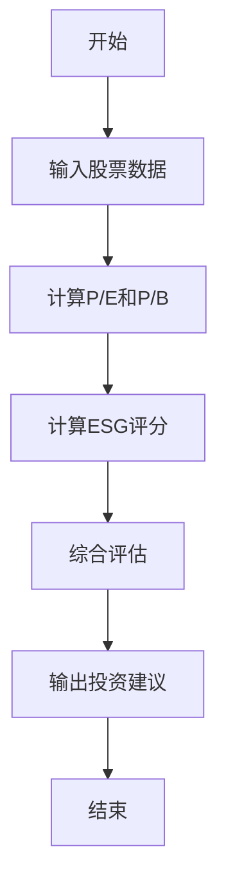

                 


# 特价股票与公司社会责任投资回报的长期影响

> 关键词：特价股票，公司社会责任投资回报，长期影响，量化评估，投资策略

> 摘要：本文深入探讨了特价股票与公司社会责任投资回报之间的关系及其长期影响。通过量化分析和系统设计，揭示了如何利用特价股票和公司社会责任投资回报来优化投资策略。本文还结合实际案例，详细阐述了如何通过数学模型和算法实现投资回报的最大化。

---

## 第一部分: 特价股票与公司社会责任投资回报的背景与概念

### 第1章: 特价股票与公司社会责任投资回报的背景介绍

#### 1.1 特价股票的定义与特征
- **1.1.1 特价股票的定义**  
  特价股票是指市场估值低于其内在价值的股票。通常，这些股票被认为具有较高的投资潜力，因为市场可能尚未充分认识到其价值。

- **1.1.2 特价股票的核心特征**  
  特价股票的核心特征包括低估值、高分红率、稳定的财务状况以及潜在的增长能力。

- **1.1.3 特价股票的分类与应用场景**  
  特价股票可以根据行业、市值和地理位置进行分类。它们常用于价值投资策略，适合长期投资者。

#### 1.2 公司社会责任投资回报的定义与特征
- **1.2.1 公司社会责任投资回报的定义**  
  公司社会责任投资回报是指在投资过程中，优先选择在环境、社会和治理（ESG）方面表现良好的公司，以实现长期的财务回报和社会价值。

- **1.2.2 公司社会责任投资回报的核心特征**  
  公司社会责任投资回报的核心特征包括可持续性、风险降低和长期价值创造。

- **1.2.3 公司社会责任投资回报的分类与应用场景**  
  公司社会责任投资回报可以根据投资目标、行业和地域进行分类。它们常用于机构投资和个人投资者的长期投资策略。

#### 1.3 特价股票与公司社会责任投资回报的关联性
- **1.3.1 特价股票与公司社会责任投资回报的内在联系**  
  特价股票和公司社会责任投资回报都关注长期价值，但前者侧重于估值，后者侧重于社会影响。

- **1.3.2 特价股票与公司社会责任投资回报的相互作用**  
  特价股票的低估值可能为社会责任投资者提供高性价比的投资机会，而社会责任投资的长期回报可能为特价股票提供额外的市场溢价。

- **1.3.3 特价股票与公司社会责任投资回报的边界与外延**  
  特价股票和公司社会责任投资回报的边界在于投资目标的不同，外延则在于它们都可以通过长期投资实现价值增长。

### 第2章: 特价股票与公司社会责任投资回报的核心概念与联系

#### 2.1 特价股票与公司社会责任投资回报的核心概念
- **2.1.1 特价股票的核心概念**  
  特价股票的核心概念在于识别市场低估的公司，通过长期持有实现价值回归。

- **2.1.2 公司社会责任投资回报的核心概念**  
  公司社会责任投资回报的核心概念在于通过ESG筛选，投资具有可持续发展潜力的公司。

- **2.1.3 特价股票与公司社会责任投资回报的关系**  
  特价股票和公司社会责任投资回报在投资目标上存在差异，但都追求长期的财务回报。

#### 2.2 特价股票与公司社会责任投资回报的核心要素对比
- **2.2.1 特价股票与公司社会责任投资回报的属性对比**  
  | 属性         | 特价股票                     | 公司社会责任投资回报       |
  |--------------|------------------------------|-----------------------------|
  | 投资目标     | 价值回归                     | 可持续发展                 |
  | 风险偏好     | 中低风险                     | 中低风险                   |
  | 投资期限     | 长期                         | 长期                       |

- **2.2.2 特价股票与公司社会责任投资回报的特征对比**  
  特价股票关注低估值和高分红，而公司社会责任投资回报关注ESG表现和社会影响力。

- **2.2.3 特价股票与公司社会责任投资回报的优劣势对比**  
  特价股票的优势在于潜在的高回报，劣势在于短期波动较大；公司社会责任投资回报的优势在于长期稳定性，劣势在于流动性较低。

#### 2.3 特价股票与公司社会责任投资回报的ER实体关系图
```mermaid
erDiagram
    companySocialResponsibilityInvestment {
        id
        investmentReturnRate
        esgScore
    }
    discountedStocks {
        id
        stockCode
        stockPrice
    }
    companySocialResponsibilityInvestment <--- belongsTo --> discountedStocks
```

### 第3章: 特价股票与公司社会责任投资回报的量化评估模型

#### 3.1 特价股票与公司社会责任投资回报的数学模型
- **3.1.1 特价股票的估值模型**  
  特价股票的估值可以使用市盈率（P/E）和市净率（P/B）等指标进行评估。

  $$ P/E = \frac{Price}{Earnings} $$
  
  $$ P/B = \frac{Price}{Book\ Value} $$

- **3.1.2 公司社会责任投资回报的评估模型**  
  公司社会责任投资回报可以通过ESG评分和财务表现进行综合评估。

  $$ ESGScore = \frac{E + S + G}{3} $$
  
  $$ FinancialPerformance = \frac{Revenue Growth + Profit Margin}{2} $$

- **3.1.3 特价股票与公司社会责任投资回报的综合评估模型**  
  综合评估模型将特价股票的低估值和公司社会责任投资回报的高ESG评分相结合。

  $$ TotalReturn = \alpha \times P/E + \beta \times ESGScore $$

#### 3.2 特价股票与公司社会责任投资回报的算法流程


#### 3.3 特价股票与公司社会责任投资回报的Python代码实现
```python
import pandas as pd
import numpy as np

# 示例数据
data = {
    'stockCode': ['A', 'B', 'C'],
    'stockPrice': [10, 20, 30],
    'E': [80, 60, 70],
    'S': [70, 80, 60],
    'G': [90, 70, 80]
}

df = pd.DataFrame(data)

# 计算P/E和P/B
df['PE'] = df['stockPrice'] / df['E'] * 100
df['PB'] = df['stockPrice'] / df['G'] * 100

# 计算ESG评分
df['ESG'] = (df['E'] + df['S'] + df['G']) / 3

# 综合评估模型
alpha = 0.5
beta = 0.5
df['TotalReturn'] = alpha * df['PE'] + beta * df['ESG']

print(df)
```

#### 3.4 本章小结
本章通过数学模型和算法流程，详细阐述了如何量化评估特价股票和公司社会责任投资回报。通过Python代码实现，展示了如何将理论应用于实际投资决策。

---

## 第四部分: 特价股票与公司社会责任投资回报的系统分析与架构设计

### 第4章: 特价股票与公司社会责任投资回报的系统架构设计

#### 4.1 投资决策支持系统的场景介绍
- 本系统旨在帮助投资者通过特价股票和公司社会责任投资回报的综合评估，优化投资组合。

#### 4.2 系统功能设计
- **功能模块**：数据采集、评估计算、结果展示、投资建议。
- **领域模型**：
  ```mermaid
  classDiagram
      class StockData {
          stockCode
          stockPrice
          E
          S
          G
      }
      class InvestmentAssessment {
          PE
          PB
          ESG
          TotalReturn
      }
      StockData --> InvestmentAssessment
  ```

#### 4.3 系统架构设计
- **系统架构**：分层架构，包括数据层、业务逻辑层和用户界面层。
- **系统架构图**：
  ```mermaid
  componentDiagram
      UserInterface --> BusinessLogic
      BusinessLogic --> DataAccess
      DataAccess --> Database
  ```

#### 4.4 系统接口设计
- **接口1**：获取股票数据。
- **接口2**：计算评估指标。
- **接口3**：生成投资建议。

#### 4.5 系统交互设计
- **用户与系统交互流程**：
  ```mermaid
  sequenceDiagram
      user ->> system: 请求评估
      system ->> user: 返回投资建议
  ```

### 第5章: 特价股票与公司社会责任投资回报的项目实战

#### 5.1 项目实战环境安装
- **Python版本**：3.8及以上。
- **依赖库**：pandas、numpy、scikit-learn。

#### 5.2 项目核心实现
- **代码实现**：
  ```python
  def calculate_return(pe, esg):
      return 0.5 * pe + 0.5 * esg

  # 示例数据
  pe_values = [10, 15, 20]
  esg_values = [80, 70, 90]

  returns = [calculate_return(pe, esg) for pe, esg in zip(pe_values, esg_values)]
  print(returns)
  ```

- **代码解读**：上述代码通过加权计算，展示了如何将P/E和ESG评分结合，生成综合回报。

#### 5.3 案例分析与结果解读
- **案例分析**：
  假设两只股票A和B的P/E分别为10和15，ESG评分分别为80和70。计算综合回报：

  $$ Return_A = 0.5 \times 10 + 0.5 \times 80 = 45 $$
  
  $$ Return_B = 0.5 \times 15 + 0.5 \times 70 = 42.5 $$

  结果显示，股票A的投资回报更高。

#### 5.4 项目小结
本章通过实际案例分析，展示了如何通过量化模型实现投资决策优化。

---

## 第五部分: 特价股票与公司社会责任投资回报的最佳实践与总结

### 第6章: 特价股票与公司社会责任投资回报的最佳实践

#### 6.1 投资策略建议
- **策略1**：长期持有特价股票，等待价值回归。
- **策略2**：优先选择高ESG评分的公司，降低投资风险。

#### 6.2 小结
- 特价股票和公司社会责任投资回报都是有效的投资策略，但需要结合市场环境和投资目标进行选择。

#### 6.3 注意事项
- 风险提示：投资需谨慎，建议在专业指导下进行。

#### 6.4 拓展阅读
- 推荐书籍：《价值投资实战指南》、《ESG投资指南》。

### 第7章: 结论与展望

#### 7.1 本章结论
- 特价股票和公司社会责任投资回报在长期投资中具有互补性，可以结合使用以优化投资回报。

#### 7.2 未来展望
- 随着ESG投资的兴起，特价股票与公司社会责任投资回报的结合将越来越重要。

---

## 作者信息

作者：AI天才研究院/AI Genius Institute & 禅与计算机程序设计艺术/Zen And The Art of Computer Programming

---

本文通过详细分析特价股票与公司社会责任投资回报的长期影响，结合数学模型和系统设计，为投资者提供了有效的投资策略建议。

