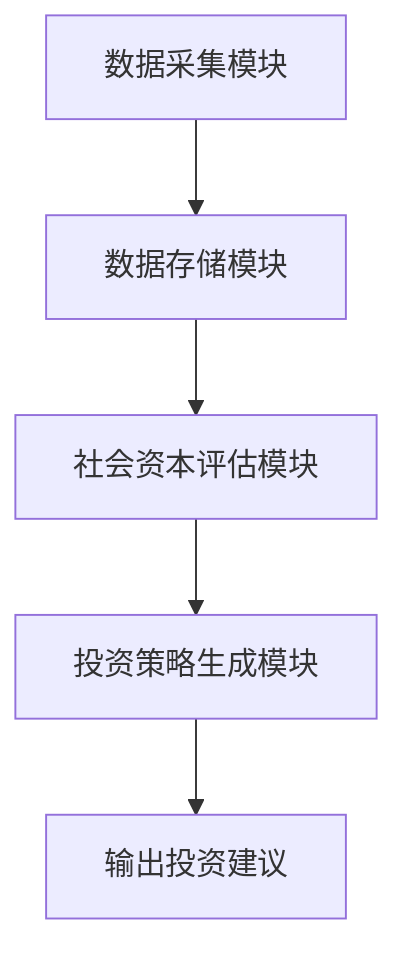
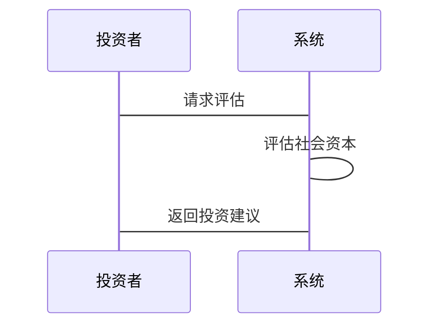

                 


# 特价股票与公司社会资本积累的长期关系

> 关键词：特价股票、社会资本、公司治理、长期投资、市场行为

> 摘要：本文探讨了特价股票与公司社会资本积累之间的长期关系。通过分析特价股票的市场行为、投资者心理以及公司治理结构，结合社会资本的积累机制，提出了一种基于网络分析的长期投资策略。文章从理论模型构建、算法实现、系统架构设计到项目实战，详细阐述了如何通过社会资本积累优化公司治理，进而影响股票价格波动，为投资者提供了一种新的视角和方法。

---

## 第1章：引言

### 1.1 研究背景
- 特价股票是指价格低于面值的股票，通常反映市场对公司的短期负面情绪。
- 公司社会资本积累涉及品牌、声誉、客户关系等非财务资源的长期积累。
- 长期视角下，社会资本积累如何影响公司股价波动，尤其是特价股票的市场行为，是一个值得深入研究的问题。

### 1.2 研究问题
- 特价股票如何反映公司治理和社会资本的积累？
- 长期视角下，社会资本积累如何影响股价波动？
- 如何构建一个基于社会资本的长期投资策略？

### 1.3 研究意义
- 理论意义：丰富社会资本与金融行为的交叉研究。
- 实践意义：为投资者提供新的视角和策略。

---

## 第2章：核心概念与理论基础

### 2.1 特价股票的定义与特征
- **定义**：价格低于面值的股票，通常反映市场对公司的短期负面情绪。
- **特征**：低估值、高波动性、投资者情绪敏感。

### 2.2 公司社会资本的内涵
- **定义**：品牌、声誉、客户关系等非财务资源的积累。
- **特征**：长期积累、难以量化、依赖信任。

### 2.3 特价股票与社会资本的关系
- **相互作用机制**：社会资本积累影响公司治理，进而影响股价。
- **动态关系**：短期市场情绪与长期社会资本积累的动态平衡。

---

## 第3章：理论模型与分析框架

### 3.1 理论模型构建
- **模型**：社会资本积累影响公司治理，进而影响股价波动。
- **变量**：社会资本积累、公司治理结构、股价波动。

### 3.2 数据来源与处理
- **数据来源**：历史股价数据、公司治理数据、市场情绪数据。
- **数据处理**：数据清洗、特征提取、标准化。

### 3.3 研究方法
- **定量分析**：回归分析、时间序列分析。
- **定性分析**：案例研究、专家访谈。

---

## 第4章：算法原理与实现

### 4.1 算法选择
- **算法**：线性回归模型，用于分析社会资本积累与股价波动的关系。

### 4.2 算法实现
- **代码示例**（Python）：
```python
import numpy as np
from sklearn.linear_model import LinearRegression

# 假设X为社会资本积累数据，y为股价波动数据
X = np.array([1, 2, 3, 4, 5]).reshape(-1, 1)
y = np.array([2, 4, 5, 4, 6])

model = LinearRegression()
model.fit(X, y)

print('系数:', model.coef_)
print('截距:', model.intercept_)
```

### 4.3 数学模型
- **回归方程**：
$$ y = \beta_0 + \beta_1 x + \epsilon $$
其中，$y$为股价波动，$x$为社会资本积累，$\beta_0$为截距，$\beta_1$为回归系数。

---

## 第5章：系统架构设计

### 5.1 问题场景
- **目标**：构建一个基于社会资本的长期投资系统。
- **需求**：实时数据采集、社会资本评估、投资策略生成。

### 5.2 系统功能设计
- **功能模块**：
  - 数据采集模块：采集股价、公司治理数据。
  - 社会资本评估模块：评估公司社会资本。
  - 投资策略生成模块：基于评估结果生成投资策略。

### 5.3 系统架构图


### 5.4 接口设计
- **API接口**：
  - `GET /api/data`：获取实时数据。
  - `POST /api/assessment`：提交社会资本评估请求。

### 5.5 交互流程图


---

## 第6章：项目实战

### 6.1 环境安装
- **工具**：Python、Jupyter Notebook、Scikit-learn。
- **安装命令**：
```bash
pip install numpy scikit-learn
```

### 6.2 核心代码实现
- **数据处理**：
```python
import pandas as pd
import numpy as np

# 假设df为数据框，包含股价和公司治理数据
df['社会资本积累'] = df['品牌价值'] + df['客户满意度']
```

- **模型训练**：
```python
from sklearn.linear_model import LinearRegression

X = df[['社会资本积累', '收入增长率']]
y = df['股价波动']

model = LinearRegression()
model.fit(X, y)
```

### 6.3 案例分析
- **案例**：某公司社会资本积累较高，但股价处于低价位。
- **分析**：投资者应关注长期社会资本积累，而非短期股价波动。

---

## 第7章：结论与建议

### 7.1 主要结论
- 特价股票反映市场短期情绪，而社会资本积累影响长期股价。
- 基于社会资本积累的长期投资策略具有可行性。

### 7.2 实践建议
- 投资者应关注公司社会资本积累，而非短期股价波动。
- 公司应注重品牌建设和社会资本积累。

### 7.3 未来研究
- 结合更多因素，如行业竞争格局，优化模型。
- 开发实时监测系统，动态评估社会资本积累。

---

## 作者：AI天才研究院/AI Genius Institute & 禅与计算机程序设计艺术/Zen And The Art of Computer Programming

---

**感谢您的耐心阅读！**

