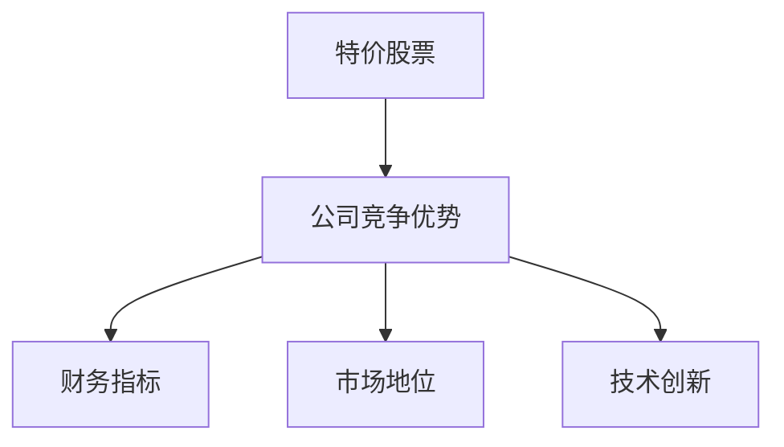
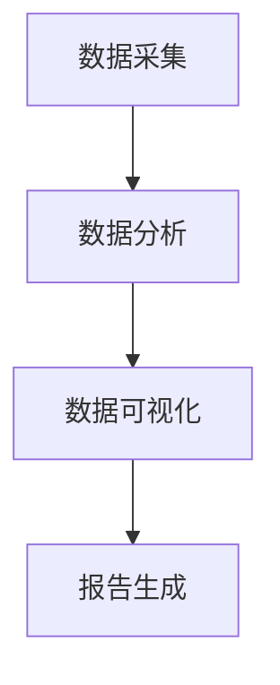

                 


# 特价股票与公司竞争优势的关系

## 关键词：特价股票、公司竞争优势、投资策略、数据分析、市场趋势

## 摘要：本文探讨特价股票与公司竞争优势之间的关系，通过理论分析、数学建模、系统架构设计和项目实战，深入剖析特价股票如何反映公司竞争优势，并提供投资策略和最佳实践建议。

---

# 第一部分: 特价股票与公司竞争优势的背景与概念

## 第1章: 特价股票与公司竞争优势的背景与概念

### 1.1 特价股票的定义与特点

#### 1.1.1 特价股票的定义
特价股票是指在某一特定时间段内，价格低于市场价或行业基准的股票。它通常出现在市场低迷、公司业绩不佳或投资者情绪低落的情况下。

#### 1.1.2 特价股票的主要特点
- **价格折扣**：特价股票的价格通常低于市场平均水平，吸引价值投资者。
- **市场定位**：公司可能处于困境或转型期，导致股价被低估。
- **周期性**：特价股票的出现往往与市场周期性波动相关。

#### 1.1.3 特价股票的分类与应用场景
- **周期性股票**：如能源、材料行业，受经济周期影响较大，可能在市场低谷时出现特价。
- **成长型股票**：公司未来增长潜力大，但当前股价被低估。
- **价值型股票**：公司基本面良好，但市场对其估值过低。

### 1.2 公司竞争优势的定义与构成

#### 1.2.1 公司竞争优势的定义
公司竞争优势是指公司在市场上相对于竞争对手的独特优势，包括资源、技术、品牌、管理等方面。

#### 1.2.2 公司竞争优势的核心要素
- **财务指标**：如ROE（净资产收益率）、ROA（资产收益率）等。
- **市场地位**：市场占有率、品牌影响力。
- **技术创新**：研发能力、专利数量。
- **管理团队**：领导能力、战略规划。
- **供应链**：成本控制、供应商稳定性。

#### 1.2.3 公司竞争优势的分类与层次
- **核心竞争优势**：如技术创新、成本优势。
- **竞争优势层次**：从核心竞争力到市场地位的多层次分析。

### 1.3 特价股票与公司竞争优势的关系

#### 1.3.1 特价股票与公司竞争优势的关联性
特价股票价格反映市场对公司竞争优势的评估，竞争优势强的公司可能在市场低迷时出现特价，吸引长期投资者。

#### 1.3.2 特价股票反映公司竞争优势的机制
- **价格波动**：竞争优势强的公司，即使股价下跌，长期来看仍有上涨潜力。
- **市场情绪**：投资者情绪波动可能导致竞争优势未被充分反映时出现特价。

#### 1.3.3 特价股票与公司竞争优势的互动关系
公司竞争优势强，即使股价短期被低估，长期仍能通过业绩增长带动股价回升。

### 1.4 本章小结
本章介绍了特价股票和公司竞争优势的定义、特点及关系，为后续分析奠定基础。

---

## 第2章: 特价股票与公司竞争优势的核心概念

### 2.1 特价股票的核心属性

#### 2.1.1 特价股票的价格波动特性
- 周期性波动：受市场整体波动影响，可能在特定周期内出现特价。
- 反应投资者情绪：市场恐慌或乐观情绪导致价格波动。

#### 2.1.2 特价股票的市场定位与投资者行为
- 投资者行为：价值投资者倾向于在低价时买入，投机者可能在低价时卖出。
- 市场定位：公司可能因暂时性问题导致股价被低估。

#### 2.1.3 特价股票的市场周期性分析
- 经济周期：衰退期可能有更多特价股票出现。
- 市场情绪周期：恐慌性抛售可能导致股价短期低于内在价值。

### 2.2 公司竞争优势的核心要素

#### 2.2.1 财务指标分析
- **ROE（净资产收益率）**：衡量公司盈利能力。
- **ROA（资产收益率）**：衡量资产使用效率。
- **净利率**：衡量成本控制能力。

#### 2.2.2 市场地位与品牌价值
- 市场占有率：公司是否占据主导地位。
- 品牌影响力：品牌价值高的公司更具竞争优势。

#### 2.2.3 技术创新与研发能力
- 技术专利数量：反映创新能力。
- 研发投入占比：衡量公司对技术创新的重视程度。

#### 2.2.4 管理团队与组织结构
- 领导层稳定性：管理团队的稳定性和能力影响公司发展。
- 组织架构：高效的组织结构有助于竞争优势的实现。

#### 2.2.5 供应链与成本优势
- 供应商稳定性：稳定的供应链确保生产连续性。
- 成本控制：低成本生产是竞争优势的重要来源。

### 2.3 特价股票与公司竞争优势的关系模型

#### 2.3.1 概念属性对比表
| 概念       | 特价股票属性       | 公司竞争优势属性     |
|------------|--------------------|----------------------|
| 定义       | 低于市价的股票价格 | 公司在市场中的优势   |
| 主要特点   | 价格折扣          | 核心竞争力           |
| 影响因素   | 市场供需、投资者情绪 | 财务表现、市场地位等 |

#### 2.3.2 ER实体关系图


### 2.4 本章小结
本章通过对比分析，明确了特价股票和公司竞争优势的核心属性及其相互关系。

---

## 第3章: 特价股票与公司竞争优势的理论分析

### 3.1 特价股票的形成机制

#### 3.1.1 投资者行为分析
- 羊群效应：投资者跟风导致股价波动。
- 价值发现：价值投资者在低价时买入。

#### 3.1.2 市场机制分析
- 价格发现：市场供需决定股价。
- 信息不对称：投资者对公司竞争优势的认知差异影响股价。

### 3.2 公司竞争优势的动态演变

#### 3.2.1 竞争优势的构建
- 技术创新：推动竞争优势的形成。
- 管理优化：提高运营效率。

#### 3.2.2 竞争优势的维持
- 持续创新：保持技术领先。
- 资源整合：优化供应链，降低成本。

### 3.3 特价股票与竞争优势的互动关系

#### 3.3.1 竞争优势影响股价
- 公司竞争优势强，长期股价表现较好。
- 竞争优势弱，股价可能持续低迷。

#### 3.3.2 股价波动反映竞争优势
- 股价短期波动反映市场情绪。
- 长期股价趋势反映公司竞争优势的持续性。

### 3.4 数学模型与公式

#### 3.4.1 市盈率模型
$$市盈率 = \frac{股价}{每股收益}$$
市盈率低的公司可能具有竞争优势。

#### 3.4.2 市净率模型
$$市净率 = \frac{股价}{每股净资产}$$
市净率低的公司可能被市场低估。

#### 3.4.3 竞争优势指数
$$竞争优势指数 = \frac{ROE + 净利率 + 市场占有率}{3}$$
指数越高，竞争优势越强。

### 3.5 本章小结
本章通过理论分析和数学建模，探讨了特价股票与公司竞争优势的互动关系。

---

## 第4章: 投资策略与实战分析

### 4.1 投资策略

#### 4.1.1 价值投资策略
- 寻找被低估的特价股票。
- 重点分析公司竞争优势。

#### 4.1.2 技术分析策略
- 利用股价图表分析特价股票的买卖信号。

#### 4.1.3 组合投资策略
- 分散投资，降低风险。
- 结合价值和成长投资策略。

### 4.2 实战分析

#### 4.2.1 项目环境配置
- 数据来源：历史股价数据、财务报表。
- 工具：数据分析软件（Python、Excel）。

#### 4.2.2 数据分析代码
```python
import pandas as pd
import numpy as np

# 假设df为股票数据，包含'股价'和'ROE'列
# 计算竞争优势指数
df['竞争优势指数'] = (df['ROE'] + df['净利率'] + df['市场占有率']) / 3

# 找出竞争优势指数高于行业平均且股价低于行业平均的特价股票
industry_avg = df['竞争优势指数'].mean()
special_price_stocks = df[(df['竞争优势指数'] > industry_avg) & (df['股价'] < industry_avg)]
```

#### 4.2.3 案例分析
- 某公司股价近期大幅下跌，ROE和净利率均高于行业平均水平，市场占有率稳步提升，竞争优势明显，可能为特价股票，适合长期投资。

### 4.3 投资策略的数学模型

#### 4.3.1 价值投资模型
$$\text{内在价值} = \text{未来现金流的现值}$$
内在价值低于当前股价时，可能为特价股票。

#### 4.3.2 风险评估模型
$$\text{风险指数} = \text{波动率} \times \text{杠杆率}$$
风险指数低的公司更具投资价值。

### 4.4 本章小结
本章通过投资策略和实战分析，展示了如何利用特价股票和公司竞争优势进行投资决策。

---

## 第5章: 系统架构与技术实现

### 5.1 系统架构设计

#### 5.1.1 系统功能设计
- 数据采集：获取股票数据和财务报表。
- 数据分析：计算竞争优势指数和股价波动。
- 可视化：生成图表和报告。

#### 5.1.2 系统架构图


### 5.2 技术实现

#### 5.2.1 数据分析模块
- 使用Python的pandas库进行数据清洗和处理。
- 使用scikit-learn库进行机器学习分析。

#### 5.2.2 数据可视化模块
- 使用Matplotlib或Seaborn库生成图表。
- 使用Plotly进行交互式可视化。

### 5.3 项目实战

#### 5.3.1 代码实现
```python
import pandas as pd
import matplotlib.pyplot as plt

# 数据加载
data = pd.read_csv('stock_data.csv')

# 数据分析
data['竞争优势指数'] = (data['ROE'] + data['净利率'] + data['市场占有率']) / 3

# 数据可视化
plt.plot(data['日期'], data['竞争优势指数'], label='竞争优势指数')
plt.xlabel('日期')
plt.ylabel('竞争优势指数')
plt.title('竞争优势指数变化趋势')
plt.legend()
plt.show()
```

#### 5.3.2 案例分析
- 数据清洗：处理缺失值和异常值。
- 模型训练：使用回归模型预测股价走势。
- 可视化报告：生成竞争优势指数变化趋势图。

### 5.4 本章小结
本章通过系统架构设计和技术实现，展示了如何利用技术手段分析特价股票和公司竞争优势。

---

## 第6章: 总结与展望

### 6.1 总结
- 特价股票反映了公司竞争优势，投资者应结合两者进行投资决策。
- 系统化分析方法和工具的应用，提高了分析效率和准确性。

### 6.2 投资建议
- 价值投资者应关注具有强大竞争优势的特价股票。
- 长期投资者应注重公司基本面分析，避免短期波动影响决策。

### 6.3 未来研究方向
- 深入研究人工智能在股票分析中的应用。
- 探讨大数据分析对竞争优势评估的提升作用。

---

## 作者：AI天才研究院/AI Genius Institute & 禅与计算机程序设计艺术/Zen And The Art of Computer Programming

---

以上是《特价股票与公司竞争优势的关系》的技术博客文章的大纲和部分正文内容。由于篇幅限制，实际文章会更加详细，涵盖每个部分的深入分析和具体案例。

