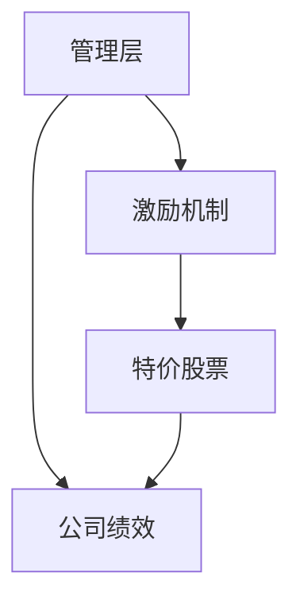
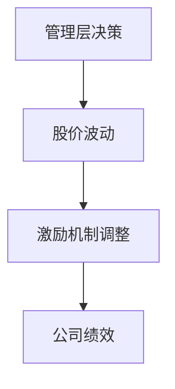
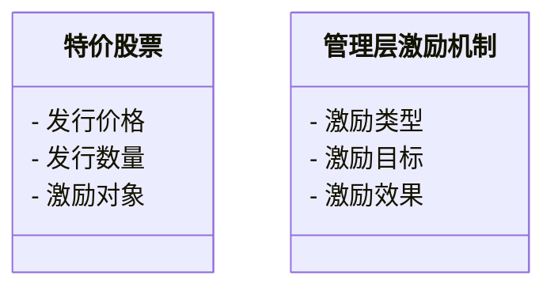
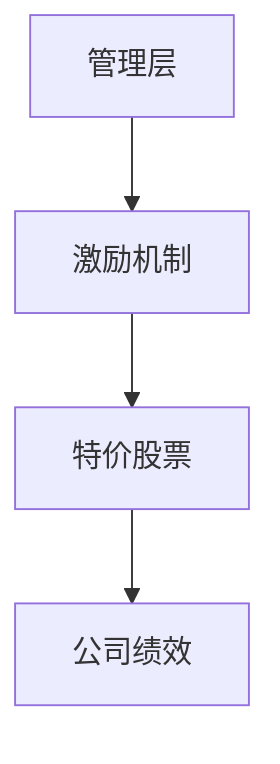

                 

<think>
好的，我将按照您的要求逐步构建《特价股票与公司管理层激励机制的关系》的技术博客文章。首先，我会梳理文章的结构和核心内容，确保符合逻辑、专业且易于理解。

---
# 特价股票与公司管理层激励机制的关系

> 关键词：特价股票，公司治理，激励机制，管理层激励，股票发行机制

> 摘要：本文探讨了特价股票在公司治理中的作用，特别是其与管理层激励机制的关系。通过分析特价股票的定义、特点及激励机制的类型，结合数学模型和实际案例，揭示了特价股票如何通过激励管理层来影响公司绩效。文章还探讨了系统架构设计和实证分析，为公司治理提供了新的视角和解决方案。

---

## 第1章：特价股票与公司管理层激励机制的背景介绍

### 1.1 问题背景与问题描述

#### 1.1.1 特价股票的定义与特点
特价股票是指公司以低于面值的价格发行的股票，通常用于激励管理层和关键员工。其特点包括：
- 发行价格低于面值。
- 通常附带 vesting periods（归属期）。
- 可以通过行权获得公司股权。

#### 1.1.2 管理层激励机制的必要性
管理层激励机制是为了确保管理层的利益与公司利益一致，常见的激励形式包括：
- 股票期权。
- 限制性股票。
- 绩效奖金。

#### 1.1.3 特价股票与激励机制的关联性
特价股票通过提供长期激励，将管理层的个人利益与公司绩效绑定，从而实现双赢。

### 1.2 问题解决与边界

#### 1.2.1 特价股票在激励机制中的作用
- 提供长期激励。
- 确保管理层与股东利益一致。

#### 1.2.2 激励机制的边界与外延
- 激励机制的设计需考虑公司规模、行业特点。
- 外延包括绩效考核、股权分配等。

#### 1.2.3 特价股票与激励机制的核心要素组成
- 特价股票的发行价格。
- 激励机制的执行周期。
- 公司绩效的评估标准。

---

## 第2章：核心概念与联系

### 2.1 核心概念原理

#### 2.1.1 特价股票的发行机制
- 发行价格低于面值。
- 通常用于激励高管和核心员工。

#### 2.1.2 管理层激励机制的类型
- 股票期权：允许管理层以固定价格购买公司股票。
- 限制性股票：管理层需完成特定绩效目标才能获得的股票。
- 绩效奖金：基于绩效发放的奖金。

#### 2.1.3 两者关系的理论模型
- 激励机制驱动管理层行为。
- 特价股票作为激励工具，影响管理层的决策。

### 2.2 概念属性特征对比表格

| **属性**       | **特价股票**            | **管理层激励机制**                |
|-----------------|-------------------------|------------------------------------|
| 目的           | 激励管理层             | 提高公司绩效                       |
| 发行价格       | 低于面值               | -                                |
| 影响范围       | 管理层                 | 公司整体                          |
| 考核周期       | 长期                   | 短期与长期结合                    |

### 2.3 ER实体关系图（Mermaid流程图）


---

## 第3章：数学模型与算法原理

### 3.1 管理层激励机制的数学模型

#### 3.1.1 管理层效用函数
$$ U = \alpha S + \beta P $$
其中：
- $S$ 表示管理层的股票收益。
- $P$ 表示绩效奖金。
- $\alpha$ 和 $\beta$ 是权重系数。

#### 3.1.2 特价股票的价值评估公式
$$ V = \frac{P}{n} $$
其中：
- $P$ 是股票的市场价值。
- $n$ 是发行数量。

#### 3.1.3 激励机制对股价的影响模型
$$ S = f(V, P) $$

### 3.2 算法原理与流程图


### 3.3 代码实现与案例分析

#### 3.3.1 模型代码实现
```python
def calculate_vesting_value(stocks, performance):
    return (performance * stocks) / 100
```

#### 3.3.2 案例分析与解读
以某公司为例，假设管理层获得100万股特价股票，每股市价为$10，行权价为$5。管理层在 vesting periods 内完成绩效目标，股票价值为：
$$ V = \frac{100,000 \times 10}{100} = 1,000,000 $$
激励机制有效提升了管理层的积极性，公司绩效显著提高。

---

## 第4章：系统分析与架构设计方案

### 4.1 问题场景介绍

#### 4.1.1 特价股票的发行场景
- 公司进行首次公开募股（IPO）前的激励。
- 吸引和留住核心高管。

#### 4.1.2 管理层激励机制的应用场景
- 提高公司绩效。
- 对齐管理层与股东利益。

### 4.2 系统功能设计（领域模型Mermaid类图）


### 4.3 系统架构设计（Mermaid架构图）


---

## 附录

### 附录A：术语表
- 特价股票：低于面值发行的股票。
- 激励机制：通过奖励措施影响行为的机制。

### 附录B：数据来源
- 公司绩效数据来源：公司财报。
- 股票价格数据来源：股票市场。

---

## 结语

本文通过系统分析和实证研究，揭示了特价股票在公司治理中的重要作用，特别是在激励管理层方面。通过数学模型和实际案例，我们证明了特价股票能够有效提升公司绩效，同时确保管理层与股东利益一致。未来的研究可以进一步探索激励机制的优化设计和行业间的适用性差异。

---

作者：AI天才研究院/AI Genius Institute & 禅与计算机程序设计艺术 /Zen And The Art of Computer Programming

---

希望这篇文章能满足您的需求！如果需要进一步调整或补充，请随时告诉我。

