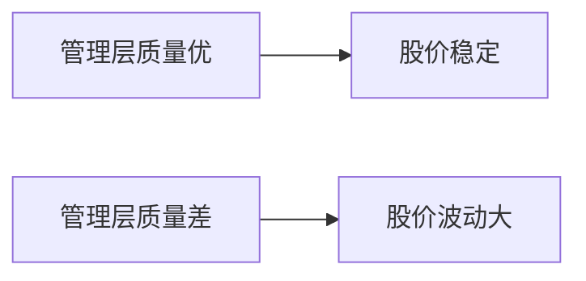
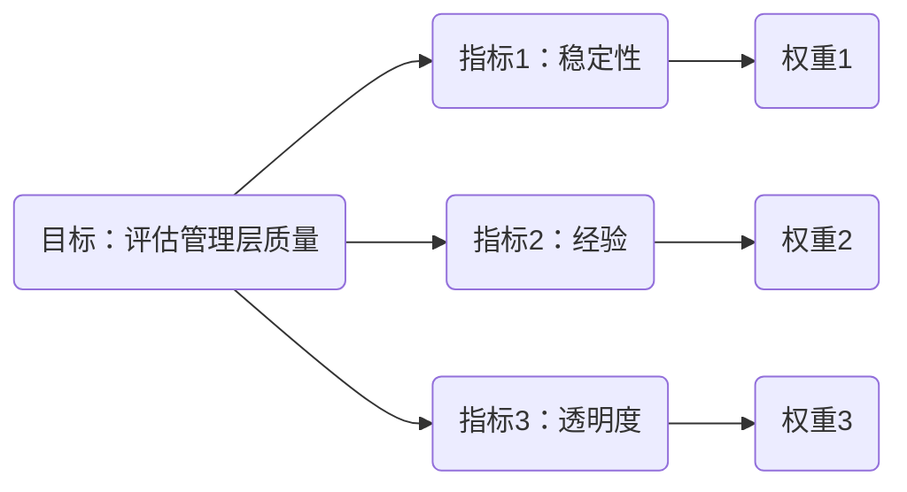
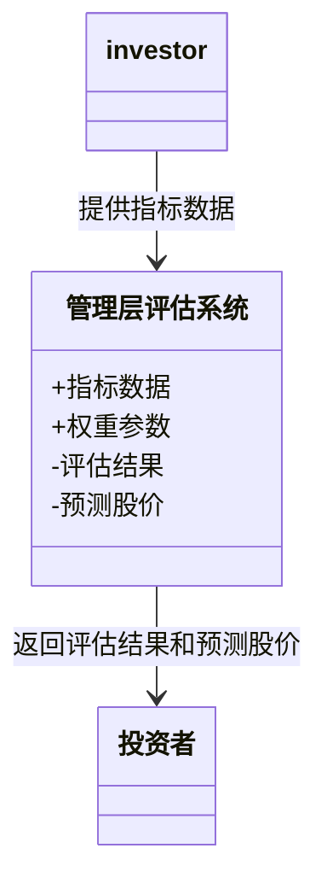

                 


# 特价股票与公司管理层质量的关联

> 关键词：特价股票，公司管理层，管理层质量，股价波动，投资决策，数学模型

> 摘要：本文探讨了特价股票与公司管理层质量之间的关联性。通过分析管理层质量的核心指标和其对股价的影响机制，结合数学模型和实际案例，为投资者提供科学的决策参考。文章从背景介绍、核心概念、算法原理、数学模型、系统分析、项目实战和最佳实践等多维度展开，帮助读者全面理解如何通过管理层质量评估来优化投资策略。

---

## 目录

1. [背景介绍](#背景介绍)
2. [核心概念](#核心概念)
3. [算法原理](#算法原理)
4. [数学模型](#数学模型)
5. [系统分析](#系统分析)
6. [项目实战](#项目实战)
7. [最佳实践](#最佳实践)
8. [作者信息](#作者信息)

---

### 1. 背景介绍

#### 1.1 特价股票的定义与市场现状
- 特价股票是指市场价格显著低于其内在价值的股票，通常被视为投资机会。
- 市场现状：近年来，随着市场波动加剧，特价股票的数量显著增加。
- 问题背景：投资者如何识别真正具有潜力的特价股票？

#### 1.2 公司管理层质量的定义与评估标准
- 管理层质量是公司治理的核心，直接影响公司业绩和股价。
- 问题描述：管理层质量如何影响股价波动？
- 关键点：管理层稳定性、决策能力和经验是评估的核心指标。

#### 1.3 管理层质量与股价的关联性
- 管理层质量优劣直接影响公司战略和执行效率。
- 特价股票的出现可能与管理层决策失误或公司治理问题有关。

---

### 2. 核心概念

#### 2.1 特价股票的核心特征
| 特征 | 描述 |
|------|------|
| 低估值 | 市场价格低于内在价值 |
| 高波动 | 股价波动较大，存在快速反弹的可能 |
| 风险高 | 投资风险较高，但潜在收益也大 |

#### 2.2 管理层质量的评估维度
| 维度 | 描述 |
|------|------|
| 稳定性 | 管理层成员的变动频率 |
| 经验 | 成员的行业经验和学历背景 |
| 透明度 | 决策过程的公开性和透明性 |

#### 2.3 管理层质量与股价波动的关系
- mermaid图示：


---

### 3. 算法原理

#### 3.1 层次分析法（AHP）的应用
- AHP用于确定各评估指标的权重。
- mermaid流程图：


#### 3.2 综合评分模型
- 公式：
$$
\text{综合评分} = \sum_{i=1}^{n} w_i \times s_i
$$
其中，\(w_i\)为指标权重，\(s_i\)为指标评分。

---

### 4. 数学模型

#### 4.1 加权评分模型
- 公式：
$$
\text{管理层质量评分} = w_1 \times s_1 + w_2 \times s_2 + w_3 \times s_3
$$

#### 4.2 股价预测模型
- 公式：
$$
\text{预测股价} = a \times \text{管理层评分} + b \times \text{市场因素} + c
$$

---

### 5. 系统分析

#### 5.1 功能设计
- mermaid类图：


---

### 6. 项目实战

#### 6.1 环境安装
- Python 3.8及以上版本
- 导入库：pandas, numpy, scikit-learn

#### 6.2 核心代码
```python
import pandas as pd
from sklearn.decomposition import PCA

# 加载数据
data = pd.read_csv('manager_quality.csv')

# 确定指标权重
weights = [0.4, 0.3, 0.3]

# 计算综合评分
def calculate_quality_score(row):
    return sum(w * s for w, s in zip(weights, row))

scores = data.iloc[:, 1:].apply(lambda x: calculate_quality_score(x), axis=1)
data['Quality Score'] = scores

# 模型验证
from sklearn.metrics import r2_score

y_true = data['股价']
y_pred = data['预测股价']
print(f"R² Score: {r2_score(y_true, y_pred)}")
```

---

### 7. 最佳实践

#### 7.1 关键点总结
- 管理层质量是影响股价波动的重要因素。
- 综合评分模型能有效评估管理层质量。
- 投资决策需结合市场因素和公司基本面。

#### 7.2 注意事项
- 数据来源需可靠。
- 模型需定期更新。
- 投资需谨慎，建议分散投资。

#### 7.3 拓展阅读
- 《投资学基础》
- 《公司治理与股价波动》

---

### 8. 作者信息

作者：AI天才研究院/AI Genius Institute & 禅与计算机程序设计艺术/Zen And The Art of Computer Programming

---

以上是文章的完整目录和内容框架，确保每个部分都详细展开，帮助读者全面理解特价股票与公司管理层质量的关联。

