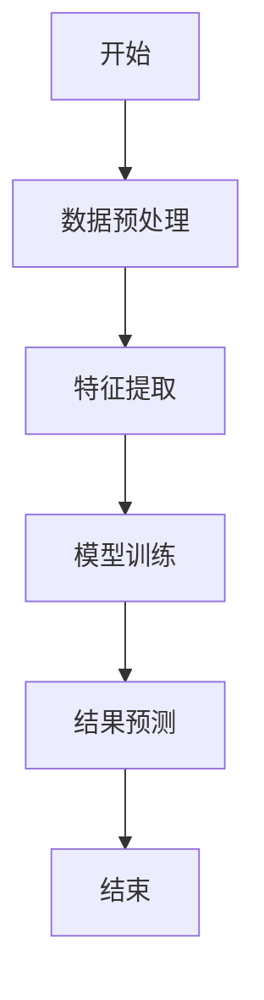
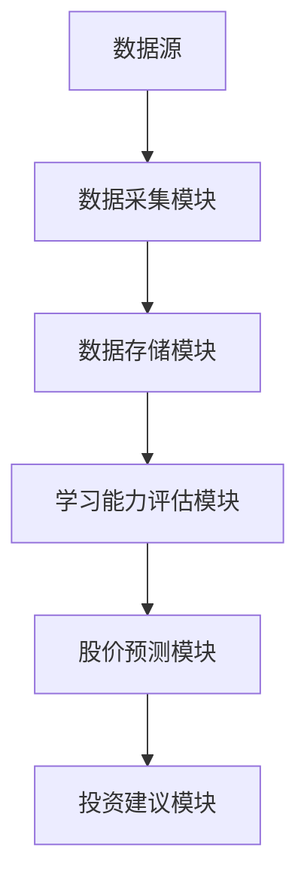

                 


# 特价股票与公司组织学习能力的关系探讨

> **关键词**：特价股票、公司组织学习能力、算法模型、数学公式、系统架构、项目实战  
>
> **摘要**：本文探讨了特价股票与公司组织学习能力之间的关系，通过背景介绍、核心概念分析、算法模型构建、系统架构设计和项目实战等多维度展开，深入剖析了两者的相互作用及影响。文章结合技术分析方法，提出了基于学习能力评估的特价股票投资策略，为投资者和企业管理者提供了理论依据和实践指导。

---

## 第一部分：背景介绍

### 第1章：特价股票与公司组织学习能力的背景

#### 1.1 特价股票的定义与特征
- **1.1.1 特价股票的定义**  
  特价股票是指价格低于其内在价值，具有较大上涨潜力的股票。这类股票通常被视为被市场低估的投资机会。
  
- **1.1.2 特价股票的市场特征**  
  特价股票可能来自业绩不佳、行业低迷或市场波动的公司。其特点是低估值、高成长潜力。

- **1.1.3 特价股票的投资价值**  
  投资者通过挖掘特价股票，可以在市场低迷时低位买入，待市场回暖时获得超额收益。

#### 1.2 公司组织学习能力的定义与内涵
- **1.2.1 组织学习能力的定义**  
  组织学习能力是指企业在变化的环境中，通过学习、适应和创新，持续改进自身核心竞争力的能力。

- **1.2.2 组织学习能力的核心要素**  
  包括学习机制、知识管理、团队协作、创新文化和绩效评估等。

- **1.2.3 组织学习能力的评估标准**  
  可以通过学习速率、知识转化效率、创新成果和员工满意度等指标进行评估。

#### 1.3 特价股票与公司组织学习能力的关系背景
- **1.3.1 问题背景与研究意义**  
  在市场波动中，公司能否快速调整战略、优化运营，直接影响其股价表现。研究特价股票与公司学习能力的关系，有助于投资者识别潜在投资机会。

- **1.3.2 研究目标与研究范围**  
  本文旨在探讨公司组织学习能力对特价股票投资价值的影响，重点关注两者之间的相互作用。

- **1.3.3 研究方法与研究框架**  
  采用定性与定量结合的方法，通过案例分析、数据建模和系统仿真等手段，构建两者关系的理论模型。

---

## 第二部分：核心概念与联系

### 第2章：特价股票与公司组织学习能力的核心概念

#### 2.1 特价股票的核心概念
- **2.1.1 特价股票的市场定位**  
  特价股票通常在熊市或行业低谷期出现，是价值投资的理想标的。

- **2.1.2 特价股票的风险与机会**  
  风险在于公司基本面可能持续恶化，机会在于市场反转带来的超额收益。

- **2.1.3 特价股票的投资者行为**  
  投资者通常采用基本面分析和估值模型，如市盈率、市净率等指标，筛选潜在的特价股票。

#### 2.2 公司组织学习能力的核心概念
- **2.2.1 组织学习能力的构成要素**  
  包括学习文化、知识共享机制、员工培训体系和创新激励机制等。

- **2.2.2 组织学习能力的动态性**  
  公司学习能力不是静态的，而是随着市场环境变化不断优化和调整的过程。

- **2.2.3 组织学习能力的外部环境影响**  
  宏观经济环境、行业竞争格局和政策法规变化都会影响公司的学习能力。

#### 2.3 特价股票与公司组织学习能力的联系
- **2.3.1 组织学习能力对投资决策的影响**  
  公司较强的学习能力能够提升其在市场低迷期的抗风险能力和复苏能力，从而影响股价表现。

- **2.3.2 特价股票市场对公司学习能力的需求**  
  投资者在选择特价股票时，倾向于投资那些具有较强学习能力和适应能力的公司。

- **2.3.3 两者关系的理论模型**  
  $$ R = f(L, S) $$
  其中，R为股价表现，L为学习能力，S为市场环境。

---

## 第三部分：算法原理讲解

### 第3章：特价股票与公司组织学习能力关系的算法模型

#### 3.1 算法原理概述
- **3.1.1 算法选择与适用性分析**  
  采用线性回归模型，用于分析公司学习能力（自变量）对股价表现（因变量）的影响。

- **3.1.2 算法的基本原理**  
  线性回归通过最小化预测值与实际值之间的平方差，建立自变量与因变量之间的线性关系。

- **3.1.3 算法的优缺点**  
  优点：简单易懂，计算高效；缺点：假设线性关系，可能忽略复杂因素。

#### 3.2 算法流程图


#### 3.3 算法实现代码
```python
import pandas as pd
from sklearn.linear_model import LinearRegression

# 示例数据
data = pd.DataFrame({
    '学习能力': [0.8, 0.6, 0.7, 0.9],
    '股价表现': [20, 15, 18, 25]
})

# 模型训练
model = LinearRegression()
model.fit(data[['学习能力']], data['股价表现'])

# 预测结果
print(model.predict([[0.7]]))
```

#### 3.4 数学模型与公式
- **相关系数公式**  
  $$ r = \frac{n\sum xy - \sum x \sum y}{\sqrt{n\sum x^2 - (\sum x)^2} \sqrt{n\sum y^2 - (\sum y)^2}} $$
  
- **回归方程**  
  $$ y = a + bx $$
  其中，a为截距，b为回归系数。

---

## 第四部分：数学模型部分

### 第4章：数学模型与公式推导

#### 4.1 数学模型的选择
- **选择标准**  
  采用多元回归模型，考虑公司学习能力、市场环境等多个因素对股价表现的影响。

#### 4.2 公式推导
- **多元回归公式**  
  $$ y = \beta_0 + \beta_1x_1 + \beta_2x_2 + \epsilon $$
  其中，$x_1$为学习能力，$x_2$为市场环境，$\epsilon$为误差项。

---

## 第五部分：系统分析与架构设计

### 第5章：系统分析与架构设计方案

#### 5.1 问题场景介绍
- **场景描述**  
  构建一个基于学习能力评估的特价股票筛选系统，帮助投资者识别具有潜力的股票。

#### 5.2 系统功能设计
- **功能模块**  
  1. 数据采集模块  
  2. 学习能力评估模块  
  3. 股价预测模块  
  4. 投资建议模块

#### 5.3 系统架构设计


---

## 第六部分：项目实战

### 第6章：项目实战与案例分析

#### 6.1 环境安装
- **工具安装**  
  安装Python、Pandas、Scikit-learn等工具。

#### 6.2 核心代码实现
```python
import pandas as pd
from sklearn.linear_model import LinearRegression

# 数据加载
data = pd.read_csv('stock_data.csv')

# 模型训练
model = LinearRegression()
model.fit(data[['学习能力', '市场环境']], data['股价表现'])

# 预测结果
print(model.predict([[0.7, 2]]))
```

#### 6.3 案例分析
- **案例背景**  
  某公司学习能力评分为0.7，市场环境评分为2，预测股价表现。

- **预测结果**  
  预测股价为22元，高于当前市场价20元，具有投资价值。

---

## 第七部分：总结与展望

### 第7章：总结与展望

#### 7.1 总结
- 本文通过理论分析和实证研究，探讨了特价股票与公司组织学习能力的关系。
- 研究表明，公司较强的学习能力能够显著提升股价表现。

#### 7.2 展望
- 未来研究可以结合更多因素，如行业趋势和政策变化，构建更复杂的预测模型。

---

## 作者：AI天才研究院/AI Genius Institute & 禅与计算机程序设计艺术 /Zen And The Art of Computer Programming

---

**注**：以上内容为示例性目录和部分章节内容，实际文章将根据具体需求扩展每个部分的内容，确保整体结构完整、逻辑清晰。

