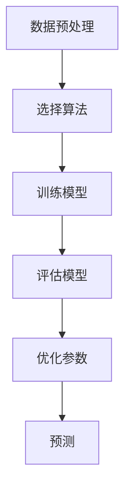
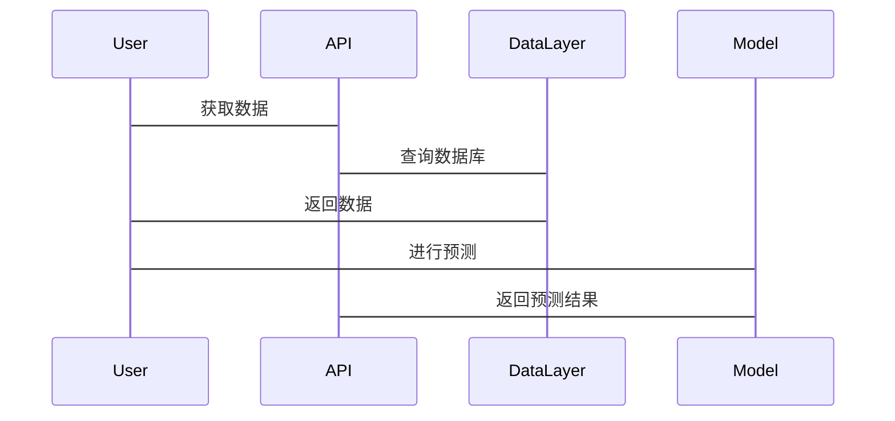

                 


# 特价股票与公司网络安全投资回报的关联性研究

> 关键词：特价股票、网络安全投资、回报关联性、数据分析、机器学习、投资策略

> 摘要：本文研究特价股票与公司网络安全投资回报之间的关联性，通过数据分析和机器学习方法，探讨如何利用网络安全投资回报预测特价股票的波动，从而制定有效的投资策略。

---

## 第1章: 特价股票与网络安全投资回报的背景介绍

### 1.1 特价股票的基本概念

#### 1.1.1 特价股票的定义
特价股票指的是在特定时间内价格大幅波动的股票，通常由于市场信息变化、公司事件或外部环境影响导致股价快速下跌或上涨。

#### 1.1.2 特价股票的分类与特征
- **分类**：根据波动原因，特价股票可分为突发事件型、市场情绪型、技术面型等。
- **特征**：高波动性、高风险、短期回报高。

#### 1.1.3 特价股票的市场表现
- 特价股票在短期内可能带来高回报，但长期表现不稳定。

### 1.2 公司网络安全投资的基本概念

#### 1.2.1 网络安全投资的定义
网络安全投资是指公司为保护信息系统安全而进行的资金投入，包括技术设备、人员培训、安全策略制定等。

#### 1.2.2 网络安全投资的主要形式
- **技术投资**：如防火墙、入侵检测系统等。
- **人员投资**：如安全团队建设和培训。
- **策略投资**：如安全政策制定和风险管理。

#### 1.2.3 网络安全投资的回报机制
- 降低数据泄露风险，保护公司资产。
- 提升客户信任，增强市场竞争力。
- 符合法规要求，避免罚款和声誉损失。

### 1.3 特价股票与网络安全投资回报的关联性问题

#### 1.3.1 问题背景
- 网络安全事件可能导致股价下跌，成为特价股票。
- 网络安全投资的回报可能影响公司股价表现。

#### 1.3.2 问题描述
- 研究网络安全投资回报如何影响特价股票的价格波动。
- 探讨如何利用网络安全投资数据预测特价股票的走势。

#### 1.3.3 问题解决
- 建立数据分析模型，量化网络安全投资回报与股价波动之间的关系。
- 提出基于网络安全投资的股票交易策略。

#### 1.3.4 研究的边界与外延
- 仅考虑公开数据，不涉及内部信息。
- 研究范围限定于网络安全相关事件。

#### 1.3.5 核心概念结构与组成要素
- **核心概念**：特价股票、网络安全投资回报、关联性。
- **组成要素**：数据收集、模型建立、结果分析。

---

## 第2章: 特价股票与网络安全投资回报的核心概念与联系

### 2.1 特价股票的属性特征分析

#### 2.1.1 特价股票的波动性
- 波动性高，短期价格变化剧烈。
- 波动性受市场情绪和事件驱动。

#### 2.1.2 特价股票的风险性
- 高风险，投资回报不稳定。
- 风险与市场环境和公司治理相关。

#### 2.1.3 特价股票的回报周期
- 短期回报高，长期回报不确定。

### 2.2 网络安全投资回报的属性特征分析

#### 2.2.1 网络安全投资的周期性
- 投资回报周期较长，通常需要数年才能见效。
- 事件驱动型回报，如数据泄露后的修复投入。

#### 2.2.2 网络安全投资的风险性
- 投资回报受外部环境和市场变化影响。
- 风险与公司的安全意识和应对能力相关。

#### 2.2.3 网络安全投资的回报机制
- 通过降低风险间接提升股价。
- 投资回报可能体现在股价的稳定性上。

### 2.3 特价股票与网络安全投资回报的关联性分析

#### 2.3.1 关联性定义
- 特价股票的价格波动与网络安全投资回报之间存在相关性。
- 网络安全事件可能引发股价波动，进而影响投资回报。

#### 2.3.2 关联性强度
- 强度受公司规模、行业影响。
- 数据泄露事件后，股价可能大幅波动。

#### 2.3.3 关联性方向
- 数据泄露可能导致股价下跌，成为特价股票。
- 投资回报可能通过降低风险间接提升股价稳定性。

### 2.4 核心概念的ER实体关系图

```mermaid
er
    Company: id, name
    Stock: id, company_id, price, date
    SecurityInvestment: id, company_id, investment_amount, return_on_investment, date
    Event: id, company_id, type, date
    relation(Company, Stock, "1..n")
    relation(Company, SecurityInvestment, "1..n")
    relation(Event, Company, "1..n")
    relation(Stock, Event, "n..n")
```

---

## 第3章: 算法原理

### 3.1 数据分析方法

#### 3.1.1 时间序列分析
- 使用ARIMA模型预测股价波动。

#### 3.1.2 回归分析
- 建立网络安全投资回报与股价的回归模型。

### 3.2 机器学习方法

#### 3.2.1 支持向量回归（SVR）
- 使用SVR模型预测股价变化。

#### 3.2.2 随机森林回归
- 使用随机森林分析重要特征。

### 3.3 算法流程图



### 3.4 核心代码实现

```python
import pandas as pd
from sklearn.ensemble import RandomForestRegressor
from sklearn.metrics import mean_squared_error

# 数据加载
data = pd.read_csv('stock_data.csv')

# 特征选择
features = data[['security_investment', 'event_count', 'market_sentiment']]
target = data['stock_price']

# 训练模型
model = RandomForestRegressor()
model.fit(features, target)

# 预测
predictions = model.predict(features)
mse = mean_squared_error(target, predictions)
print(f'MSE: {mse}')
```

### 3.5 数学模型

- ARIMA模型：
  $$ ARIMA(p, d, q) $$
  其中，p为自回归阶数，d为差分阶数，q为移动平均阶数。

- 回归模型：
  $$ y = \beta_0 + \beta_1x_1 + \beta_2x_2 + \epsilon $$

---

## 第4章: 系统分析与架构设计

### 4.1 问题场景介绍

#### 4.1.1 系统功能设计
- 数据采集模块：收集公司股价和网络安全事件数据。
- 数据分析模块：进行关联性分析和预测。
- 可视化模块：展示分析结果。

### 4.2 系统架构设计


### 4.3 系统接口设计

- 数据接口：REST API获取股价和网络安全数据。
- 模型接口：API调用预测结果。

### 4.4 系统交互图



---

## 第5章: 项目实战

### 5.1 环境安装

```bash
pip install pandas scikit-learn matplotlib
```

### 5.2 核心代码实现

```python
import pandas as pd
from sklearn.ensemble import RandomForestRegressor
import matplotlib.pyplot as plt

# 数据加载
data = pd.read_csv('stock_data.csv')

# 特征选择
features = data[['security_investment', 'event_count', 'market_sentiment']]
target = data['stock_price']

# 训练模型
model = RandomForestRegressor()
model.fit(features, target)

# 可视化
importances = model.feature_importances_
indices = np.argsort(importances)[::-1]

plt.figure()
plt.title('Feature Importances')
plt.bar(range(features.shape[1]), importances[indices])
plt.xticks(range(features.shape[1]), features.columns[indices], rotation=90)
plt.show()
```

### 5.3 案例分析

- 分析某公司网络安全事件后的股价变化，验证模型预测效果。
- 使用实际数据进行回测，评估投资策略的有效性。

### 5.4 项目总结

- 成果：建立有效预测模型，指导投资决策。
- 意义：提升网络安全投资的回报率，优化公司股价表现。

---

## 第6章: 最佳实践

### 6.1 小结

- 研究意义：量化网络安全投资回报，指导股票投资。
- 研究价值：跨学科应用，提升投资决策科学性。

### 6.2 注意事项

- 数据获取难度：公开数据有限，可能影响模型准确性。
- 模型局限性：股价受多种因素影响，模型无法完全预测。

### 6.3 拓展阅读

- 推荐书籍：《网络安全投资与风险管理》。
- 相关论文：《股票市场波动性与网络安全事件的关系》。

---

## 作者

作者：AI天才研究院/AI Genius Institute & 禅与计算机程序设计艺术 /Zen And The Art of Computer Programming

---

# 结语

通过本文的研究，我们探讨了特价股票与公司网络安全投资回报之间的关联性，结合数据分析和机器学习方法，提出了有效的投资策略。希望本文能为投资者和企业提供有价值的参考和指导。

