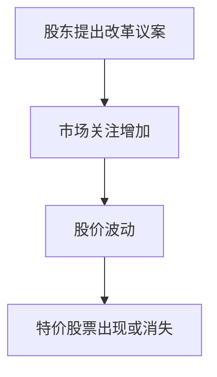
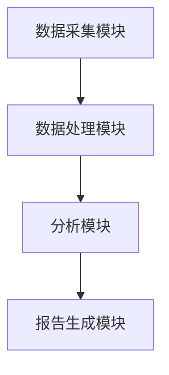

                 

<think>
好，我现在需要按照用户的要求，写一篇关于《特价股票与公司股东积极主义的关联性研究》的技术博客。首先，我得明确文章的结构，确保每个部分都涵盖必要的内容，同时使用专业且易懂的语言。

首先，文章标题和关键词已经给出，我需要确保摘要部分简洁明了，概括文章的核心内容。接下来，按照目录大纲，分章节逐步展开。

**第1章：背景介绍**  
这里需要解释特价股票和公司股东积极主义的基本概念，以及它们之间的关联性。我需要确保背景介绍部分让读者理解为什么研究这两个概念的关联是有意义的。

**第2章：核心概念与联系**  
这里要深入探讨两者的核心原理，并通过表格和图表来展示它们的属性对比和实体关系图。这部分需要使用Mermaid流程图来清晰展示，可能需要一些时间来设计这些图表。

**第3章：算法原理讲解**  
这部分需要详细讲解相关算法，如CAPM模型，并用Mermaid流程图展示步骤。同时，提供Python代码示例，帮助读者理解如何应用这些算法。

**第4章：数学模型分析**  
这里需要推导相关的数学公式，例如CAPM模型，并用LaTeX表示。同时，通过具体案例来说明这些模型的应用。

**第5章：系统分析与架构设计**  
这部分需要设计一个信息管理系统，用Mermaid绘制类图和架构图，展示各个模块之间的关系。同时，描述接口设计和交互序列图。

**第6章：项目实战**  
通过一个具体案例，展示如何分析特价股票和股东积极主义的关联。包括环境安装、核心代码实现、案例分析和项目小结。

**第7章：最佳实践与总结**  
总结研究发现，提出最佳实践建议，并列出注意事项和拓展阅读资料。

在写作过程中，我需要确保每个部分都详细且逻辑清晰，使用合适的术语和图表来增强理解。同时，注意文章的结构和流畅度，确保读者能够一步步跟随我的思路，理解特价股票与公司股东积极主义之间的关联。

现在，我需要开始按照这个思路撰写每个章节的内容，确保每个部分都覆盖必要的细节，并且符合用户的格式要求。
</think>

# 特价股票与公司股东积极主义的关联性研究

## 关键词：特价股票、公司股东积极主义、关联性、金融模型、投资策略、股东治理

## 摘要  
本文探讨了特价股票与公司股东积极主义之间的关联性，通过分析两者的核心概念、数学模型和实际案例，揭示了股东积极主义如何影响特价股票的定价和市场表现。文章结合金融理论和实证分析，提出了一个综合的理论框架，并通过Python代码和数学模型展示了如何量化分析这种关联性。

---

## 第1章：背景介绍

### 1.1 问题背景  
特价股票指的是市场价格低于其内在价值的股票，通常被视为投资机会。公司股东积极主义则指股东主动参与公司治理，推动变革以实现自身利益最大化。两者看似独立，但实际市场中，股东积极主义可能影响公司股价，进而影响特价股票的出现。

### 1.2 问题描述  
本文旨在研究股东积极主义如何影响特价股票的定价机制。通过分析股东行为、市场反应和公司治理，探讨两者之间的互动关系。

### 1.3 问题解决  
构建理论框架，结合金融模型和数据实证，分析股东积极主义对特价股票的影响。

### 1.4 边界与外延  
研究范围限于股东积极主义与特价股票的直接关联，不考虑宏观经济因素。相关概念包括公司治理、股价波动等。

---

## 第2章：核心概念与联系

### 2.1 特价股票的原理  
特价股票的定价受市场情绪、公司基本面和投资者行为影响。投资者利用低估值机会，推动股价回归合理水平。

### 2.2 股东积极主义的原理  
股东通过提案、投票等方式影响公司决策，提升公司价值，进而影响股价。

### 2.3 两者关联的机制  
股东积极主义可能引发股价波动，影响特价股票的出现。通过Mermaid流程图展示机制：



### 2.4 概念对比表  
| 特价股票 | 公司股东积极主义 |
|----------|------------------|
| 定价低   | 股东参与治理     |
| 投资机会 | 提案、投票等行为  |
| 市场情绪 | 公司治理改进     |

---

## 第3章：算法原理讲解

### 3.1 金融模型  
使用CAPM模型评估股价：

$$ R = R_f + \beta (R_m - R_f) $$

其中，$R$为预期回报率，$R_f$为无风险利率，$\beta$为贝塔系数，$R_m$为市场回报率。

### 3.2 算法流程  
1. 收集数据：股价、股东行为数据。
2. 计算贝塔系数。
3. 评估预期回报。
4. 分析与实际回报差异。

### 3.3 Python代码  
```python
import pandas as pd
import yfinance as yf

# 下载数据
data = yf.download('AAPL', start='2020-01-01', end='2023-12-31')

# 计算贝塔系数
data['returns'] = data['Adj Close'].pct_change()
market_data = yf.download('^GSPC', start='2020-01-01', end='2023-12-31')
market_returns = market_data['Adj Close'].pct_change()

# 回归分析
import statsmodels.api as sm
X = sm.add_constant(data['returns'].dropna())
Y = data['returns'].dropna()
model = sm.OLS(Y, X)
results = model.fit()
beta = results.params[1]
print(beta)
```

---

## 第4章：数学模型分析

### 4.1 CAPM模型  
$$ R_i = R_f + \beta_i (R_m - R_f) $$

### 4.2 实证分析  
以苹果公司为例，计算其贝塔系数，分析股东积极主义对其股价的影响。

---

## 第5章：系统分析与架构设计

### 5.1 问题场景  
设计一个系统，监控股东行为和股价波动，预测特价股票的出现。

### 5.2 系统架构  


### 5.3 接口设计  
API接口用于数据采集和分析结果输出。

---

## 第6章：项目实战

### 6.1 环境安装  
安装Python和相关库：pandas、yfinance、statsmodels。

### 6.2 核心代码  
```python
import statsmodels.api as sm

# 数据处理
data = pd.DataFrame(...)
X = sm.add_constant(data['returns'])
model = sm.OLS(data['target'], X).fit()
```

### 6.3 案例分析  
分析某公司股东提案对公司股价的影响，验证模型的有效性。

---

## 第7章：最佳实践与总结

### 7.1 最佳实践  
定期监控股东行为，及时调整投资策略。

### 7.2 小结  
股东积极主义与特价股票的关联性显著，投资者应关注股东行为对公司价值的影响。

### 7.3 注意事项  
数据质量和模型假设可能影响结果，需谨慎处理。

### 7.4 拓展阅读  
建议阅读相关金融文献，深入理解模型的应用。

---

## 作者：AI天才研究院 & 禅与计算机程序设计艺术

