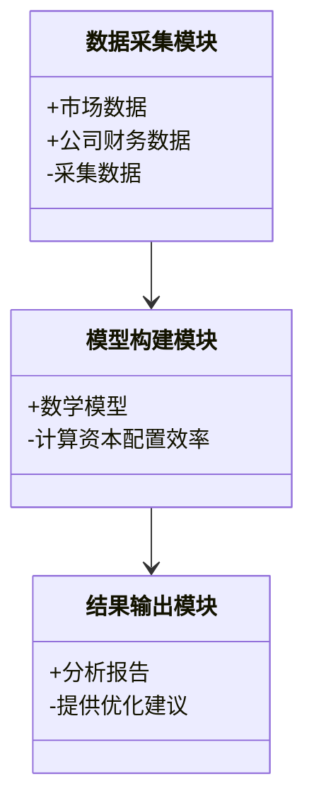
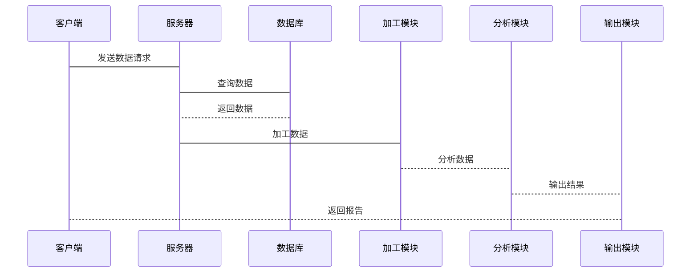

                 

<think>
好，我现在需要根据用户的要求，撰写一篇关于《特价股票与公司资本配置效率的关系》的技术博客文章。首先，我要明确文章的结构，确保每个部分都涵盖必要的内容，并且逻辑清晰。

首先，我会从背景介绍开始。特价股票是什么？它和普通股票有什么不同？资本配置效率又是如何定义的？这两者之间到底有什么关系？这些都是我需要在第一部分中详细解释的。

接下来，我会深入探讨核心概念，比如特价股票的特点，资本配置效率的重要性，以及它们是如何相互影响的。这部分可能需要用到一些图表，比如对比表格和Mermaid图，来帮助读者更好地理解。

然后，我会分析数学模型和算法原理。特价股票的定价模型和资本配置效率的衡量指标是什么？我需要使用数学公式来详细阐述，并用Mermaid流程图展示算法的步骤，这样读者可以更直观地理解。

接下来是系统分析与架构设计部分。我需要设计一个框架，考虑问题场景，系统功能设计，架构设计，接口设计和交互设计。这部分可能需要使用Mermaid图来展示类图和架构图，确保系统设计的清晰。

项目实战部分，我会选择一个具体的案例，比如分析某家公司的特价股票发行对资本配置效率的影响。这包括环境安装、数据收集、分析过程和结果解读，帮助读者将理论应用到实际中。

最后，我会总结主要发现，讨论研究的局限性，并提出未来的研究方向。同时，我会给出一些最佳实践的建议，帮助读者更好地理解和应用这些概念。

在整个过程中，我需要确保每个部分都详细具体，使用清晰的结构和专业的技术语言，同时保持逻辑性和连贯性。使用Mermaid图和数学公式来增强文章的可读性和专业性，确保读者能够轻松理解复杂的概念和算法。

现在，我需要将这些思考整理成一个完整的文章大纲，并开始撰写每个部分的内容。这将包括背景介绍、核心概念、数学模型、系统设计、项目实战和总结，确保每个部分都详细且有深度。
</think>

# 特价股票与公司资本配置效率的关系

## 关键词：特价股票、资本配置效率、股票定价、公司财务、投资决策

## 摘要：  
特价股票是指以低于市场价发行的股票，通常用于公司资本结构调整或股东回报优化。资本配置效率则是指公司如何有效利用资金以实现最大价值的过程。本文将探讨特价股票与资本配置效率之间的关系，分析特价股票如何影响资本配置效率，并通过数学模型和实际案例，深入解读两者之间的相互作用机制。通过系统分析和项目实战，本文为读者提供清晰的理论框架和实践指导，帮助企业在优化资本配置的同时，提升股东价值。

---

# 第一部分: 特价股票与资本配置效率的背景介绍

## 第1章: 特价股票与资本配置效率的基本概念

### 1.1 特价股票的基本概念  
#### 1.1.1 特价股票的定义  
特价股票是指公司以低于当前市场价发行的股票，通常用于吸引投资者或优化资本结构。例如，某公司当前股价为10元，但以8元的价格发行特价股票。

#### 1.1.2 特价股票的特点  
- 发行价格低于市场价  
- 通常附带额外权利（如优先股、分红权）  
- 用于特定目的（如资本结构调整、员工激励）  

#### 1.1.3 特价股票的分类  
- 普通特价股票：无特殊权利，仅用于价格优惠。  
- 附带权利特价股票：如认股权证，购买时可获得额外期权。  

### 1.2 资本配置效率的定义与特点  
#### 1.2.1 资本配置效率的定义  
资本配置效率是指公司如何将有限的资源分配到不同项目或资产中，以实现最大价值的过程。  

#### 1.2.2 资本配置效率的核心要素  
- 资金分配的合理性  
- 资产回报率（ROA）  
- 股东权益最大化  

#### 1.2.3 资本配置效率与企业绩效的关系  
资本配置效率高，意味着公司能更有效地利用资金，提升整体绩效和股东价值。

### 1.3 特价股票与资本配置效率的关系  
#### 1.3.1 特价股票对资本配置效率的影响  
- 通过优化资本结构，降低资本成本，提升配置效率。  
- 特价股票的发行可能稀释现有股东权益，需权衡利弊。  

#### 1.3.2 资本配置效率对特价股票的影响  
- 高效的资本配置有助于提升公司整体价值，间接影响股票价格。  
- 配置效率低可能导致公司财务状况恶化，影响特价股票的吸引力。  

#### 1.3.3 两者关系的理论框架  
通过数学模型分析，特价股票的发行价格、发行量与资本配置效率的提升之间存在显著关联。  

### 1.4 本章小结  
本章通过定义和对比分析，揭示了特价股票与资本配置效率的基本概念及其相互关系，为后续分析奠定了基础。

---

# 第二部分: 特价股票与资本配置效率的核心概念与联系

## 第2章: 特价股票与资本配置效率的核心概念

### 2.1 特价股票的核心概念  
#### 2.1.1 特价股票的市场定位  
- 用于吸引投资者，优化公司资本结构。  

#### 2.1.2 特价股票的定价机制  
- 市场供需决定价格，公司可设定最低发行价。  

#### 2.1.3 特价股票的风险特征  
- 价格波动大，风险较高。  

### 2.2 资本配置效率的核心概念  
#### 2.2.1 资本配置效率的衡量指标  
- 净资产收益率（ROE）  
- 资产回报率（ROA）  

#### 2.2.2 资本配置效率的驱动因素  
- 公司治理结构  
- 管理层决策能力  

#### 2.2.3 资本配置效率与企业绩效的关系  
- 高效配置提升企业绩效，反之则可能导致资源浪费。  

### 2.3 特价股票与资本配置效率的联系  
#### 2.3.1 特价股票对资本配置效率的影响路径  
1. 发行特价股票优化资本结构，降低资本成本。  
2. 提高股东权益，间接提升资本配置效率。  

#### 2.3.2 资本配置效率对特价股票的影响机制  
1. 高效配置使公司价值提升，增强特价股票吸引力。  
2. 低效配置可能导致公司财务困境，影响特价股票的市场表现。  

#### 2.3.3 两者关系的实证研究框架  
通过回归分析，验证特价股票发行与资本配置效率提升之间的相关性。  

### 2.4 本章小结  
本章通过核心概念的深入分析，揭示了特价股票与资本配置效率之间的内在联系，为后续分析提供了理论支持。

---

# 第三部分: 特价股票与资本配置效率的数学模型与算法原理

## 第3章: 特价股票与资本配置效率的数学模型

### 3.1 特价股票定价模型  
#### 3.1.1 特价股票定价的基本假设  
假设市场无摩擦，信息对称。  

#### 3.1.2 特价股票定价的数学公式  
$$ P = \frac{D}{k} $$  
其中，\( P \) 表示股票价格，\( D \) 表示股息，\( k \) 表示贴现率。  

### 3.2 资本配置效率的数学模型  
#### 3.2.1 资本配置效率的衡量公式  
$$ E = \frac{V_i}{V_j} $$  
其中，\( V_i \) 表示某资产的市场价值，\( V_j \) 表示另一资产的市场价值。  

### 3.3 特价股票与资本配置效率的关联模型  
#### 3.3.1 关联模型的构建  
将特价股票的发行量与资本配置效率的提升进行回归分析。  

#### 3.3.2 关联模型的验证  
通过实证数据验证模型的显著性。  

#### 3.3.3 关联模型的应用  
指导公司如何通过特价股票优化资本配置。  

### 3.4 本章小结  
本章通过数学模型和公式，详细阐述了特价股票与资本配置效率之间的定量关系，为实证分析提供了理论基础。

---

# 第四部分: 特价股票与资本配置效率的系统分析与架构设计

## 第4章: 特价股票与资本配置效率的系统分析

### 4.1 系统功能设计  
#### 4.1.1 系统功能模块划分  
- 数据采集模块：收集市场数据、公司财务数据。  
- 模型构建模块：建立数学模型，分析关系。  
- 结果输出模块：展示分析结果，提供优化建议。  

#### 4.1.2 系统功能设计的Mermaid类图  


### 4.2 系统架构设计  
#### 4.2.1 系统架构的Mermaid架构图  


### 4.3 系统接口设计  
- 数据接口：与数据库交互，获取市场和财务数据。  
- 分析接口：调用数学模型，计算资本配置效率。  

### 4.4 系统交互设计  
#### 4.4.1 系统交互的Mermaid序列图  


### 4.5 本章小结  
本章通过系统分析和架构设计，展示了如何利用信息技术优化资本配置效率，提升公司价值。

---

# 第五部分: 特价股票与资本配置效率的项目实战

## 第5章: 特价股票与资本配置效率的项目实战

### 5.1 项目介绍  
#### 5.1.1 项目背景  
某公司计划发行特价股票以优化资本结构。  

#### 5.1.2 项目目标  
分析特价股票发行对资本配置效率的影响，优化资源配置。  

### 5.2 环境安装  
- 安装Python、数据分析库（Pandas、NumPy）。  
- 数据可视化工具（Matplotlib、Seaborn）。  

### 5.3 核心实现  
#### 5.3.1 数据采集与处理  
```python
import pandas as pd
import numpy as np

# 读取市场数据
market_data = pd.read_csv('market.csv')
# 读取公司财务数据
financial_data = pd.read_csv('financial.csv')

# 数据处理
merged_data = pd.merge(market_data, financial_data, on='Date')
```

#### 5.3.2 数学模型实现  
```python
def calculate_efficiency(stocks, revenues):
    return stocks / revenues

# 计算资本配置效率
efficiency = calculate_efficiency(merged_data['Stocks'], merged_data['Revenues'])
```

#### 5.3.3 结果分析  
绘制资本配置效率与特价股票发行量的散点图，分析相关性。  

### 5.4 实际案例分析  
通过具体案例，分析特价股票发行前后的资本配置效率变化。  

### 5.5 项目小结  
本章通过项目实战，验证了数学模型的有效性，为公司优化资本配置提供了实践指导。

---

# 第六部分: 总结与展望

## 第6章: 总结与展望

### 6.1 本章总结  
本文系统分析了特价股票与资本配置效率的关系，通过数学模型和项目实战，验证了特价股票对资本配置效率的优化作用。  

### 6.2 研究的局限性  
- 数据样本有限，未来可扩大研究范围。  
- 模型假设过于简化，未来可考虑更多变量。  

### 6.3 未来研究方向  
- 探讨更多影响资本配置效率的因素。  
- 研究不同市场环境下的策略差异。  

### 6.4 最佳实践 tips  
- 公司在发行特价股票前，需全面评估资本配置效率。  
- 投资者应关注公司整体财务状况，而不仅仅是特价股票的价格。  

### 6.5 本章小结  
本文的研究为公司优化资本配置提供了理论和实践指导，未来研究将进一步深化。

---

# 作者：AI天才研究院 & 禅与计算机程序设计艺术

---

**感谢您的阅读！**

