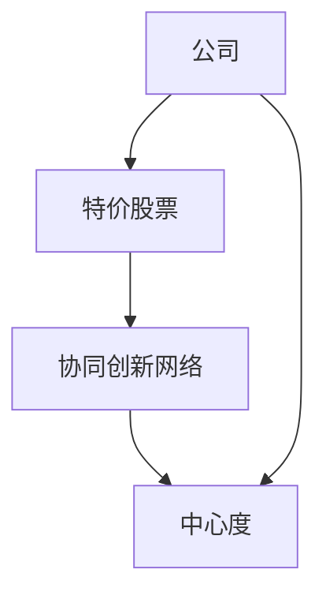
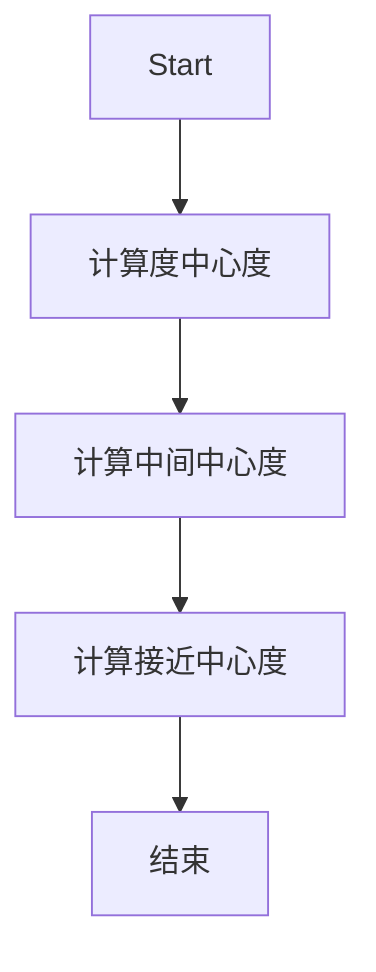
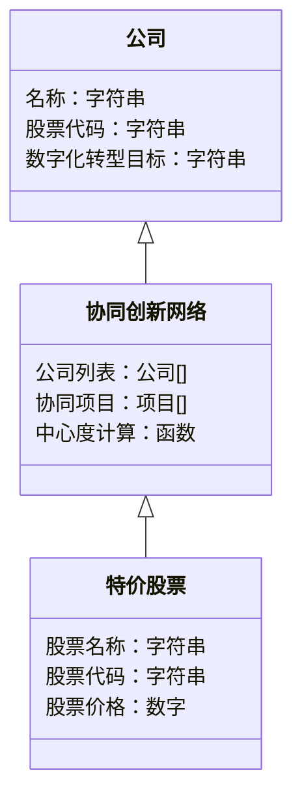
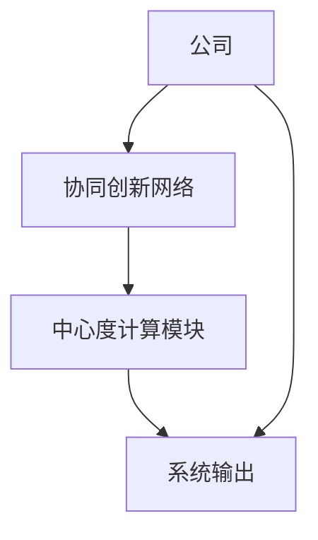
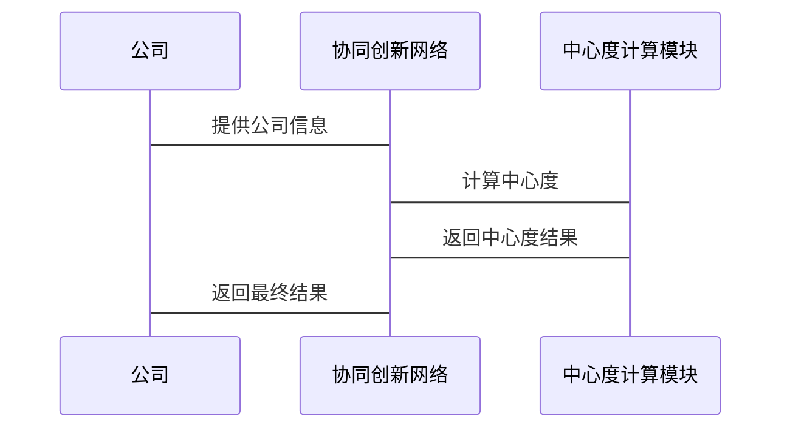

                 


# 特价股票与公司跨界数字化协同创新网络中心度的关系研究

## 关键词：
特价股票，公司数字化，协同创新网络，中心度，网络分析

## 摘要：
本文探讨了特价股票与公司跨界数字化协同创新网络中心度之间的关系，分析了特价股票在公司数字化转型中的作用，以及协同创新网络如何通过中心度影响公司的竞争力。文章从背景介绍、核心概念、算法原理、系统分析、项目实战等多方面展开，结合理论与实践，为公司利用特价股票提升数字化协同创新能力提供了有价值的参考。

---

## 目录大纲：

### 第一部分：背景与概念

#### 第1章：特价股票与公司数字化协同创新网络的背景介绍

##### 1.1 问题背景
- 1.1.1 特价股票的定义与特点
- 1.1.2 公司数字化转型的必要性
- 1.1.3 协同创新网络的形成与发展

##### 1.2 问题描述
- 1.2.1 特价股票在公司数字化转型中的作用
- 1.2.2 协同创新网络在公司数字化转型中的地位
- 1.2.3 特价股票与公司数字化协同创新网络的关联性

##### 1.3 问题解决
- 1.3.1 特价股票如何促进公司数字化转型
- 1.3.2 协同创新网络如何推动公司数字化转型
- 1.3.3 特价股票与公司数字化协同创新网络的协同效应

##### 1.4 边界与外延
- 1.4.1 特价股票的边界
- 1.4.2 公司数字化协同创新网络的边界
- 1.4.3 两者关系的外延

##### 1.5 概念结构与核心要素
- 1.5.1 特价股票的核心要素
- 1.5.2 公司数字化协同创新网络的核心要素
- 1.5.3 两者关系的核心要素

---

### 第二部分：核心概念与联系

#### 第2章：特价股票与公司数字化协同创新网络中心度的核心概念

##### 2.1 中心度的定义与原理
- 2.1.1 中心度的定义
- 2.1.2 中心度的原理
- 2.1.3 中心度在协同创新网络中的应用

##### 2.2 特价股票与公司数字化协同创新网络中心度的关联
- 2.2.1 特价股票在协同创新网络中的作用
- 2.2.2 公司数字化协同创新网络中心度的衡量
- 2.2.3 特价股票对中心度的影响

##### 2.3 中心度的类型与特征
- 2.3.1 度中心度
- 2.3.2 中间中心度
- 2.3.3 接近中心度

##### 2.4 中心度的对比分析
- 2.4.1 中心度类型对比表格
- 2.4.2 中心度在协同创新网络中的应用对比

##### 2.5 ER实体关系图


---

### 第三部分：算法原理讲解

#### 第3章：中心度算法的原理与实现

##### 3.1 算法原理
- 3.1.1 度中心度的计算公式
- 3.1.2 中间中心度的计算方法
- 3.1.3 接近中心度的计算步骤

##### 3.2 算法实现


##### 3.3 Python代码实现
```python
import networkx as nx

def calculate_centralities(G):
    degree_cent = nx.degree_centrality(G)
    between_cent = nx.betweenness_centrality(G)
    closeness_cent = nx.closeness_centrality(G)
    return degree_cent, between_cent, closeness_cent

# 示例网络
G = nx.Graph()
G.add_edges_from([('A', 'B'), ('B', 'C'), ('C', 'D'), ('D', 'E')])
degree_cent, between_cent, closeness_cent = calculate_centralities(G)

print("度中心度:", degree_cent)
print("中间中心度:", between_cent)
print("接近中心度:", closeness_cent)
```

##### 3.4 数学模型与公式
- 度中心度公式：
  $$ degree\_centrality(i) = \frac{1}{\sum_{j} A_{ij}} $$
- 中间中心度公式：
  $$ betweenness\_centrality(i) = \sum_{j > i} \frac{g_{ik} - g_{ik|j}}{g_{ik}} $$
- 接近中心度公式：
  $$ closeness\_centrality(i) = \frac{1}{\sum_{j} d(i,j)} $$

---

### 第四部分：系统分析与架构设计

#### 第4章：数字化协同创新网络系统分析

##### 4.1 系统功能设计


##### 4.2 系统架构设计


##### 4.3 接口设计与交互


---

### 第五部分：项目实战

#### 第5章：数字化协同创新网络的构建与分析

##### 5.1 环境安装
- 安装Python和相关库（networkx、numpy、pandas）

##### 5.2 核心代码实现
```python
import networkx as nx
import pandas as pd

# 数据加载
data = pd.read_csv('company_network.csv')

# 构建网络
G = nx.from_pandas_edgelist(data, 'from', 'to')

# 计算中心度
degree_cent = nx.degree_centrality(G)
between_cent = nx.betweenness_centrality(G)
closeness_cent = nx.closeness_centrality(G)

# 可视化网络
nx.draw(G, with_labels=True, node_color='red', edge_color='blue')
plt.show()
```

##### 5.3 案例分析与结果解读
- 案例：某公司通过特价股票优化协同创新网络中心度，提升数字化转型效果。

##### 5.4 项目小结
- 成果总结
- 经验分享
- 改进建议

---

### 第六部分：最佳实践

#### 第6章：数字化协同创新网络的优化策略

##### 6.1 小结
- 特价股票在数字化转型中的重要性
- 协同创新网络中心度的优化策略

##### 6.2 注意事项
- 数据隐私与安全
- 网络构建的复杂性
- 中心度计算的局限性

##### 6.3 拓展阅读
- 推荐书籍和文献
- 在线资源和工具
- 行业案例研究

---

## 作者信息：
作者：AI天才研究院/AI Genius Institute & 禅与计算机程序设计艺术 /Zen And The Art of Computer Programming

