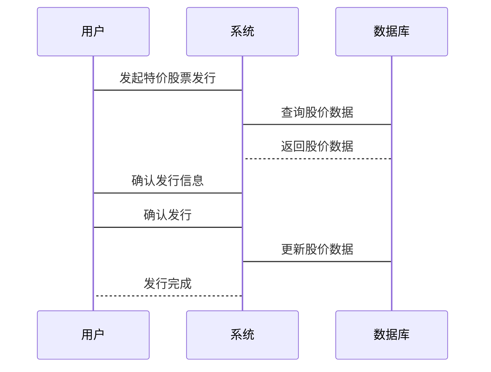

                 


# 特价股票与公司跨界数字化协同能力的关系研究

## 关键词：特价股票、数字化协同能力、公司治理、市场分析、技术应用

## 摘要：本文探讨了特价股票与公司数字化协同能力之间的关系，分析了数字化协同能力对特价股票发行与管理的影响，提出了基于数字化技术的协同策略，为公司优化股票管理和提升数字化能力提供了理论支持和实践指导。

---

## 第一章: 特价股票与公司数字化协同能力的背景介绍

### 1.1 特价股票的定义与特点
#### 1.1.1 特价股票的定义
特价股票是指公司以低于面值的价格发行的股票，通常用于吸引投资者或激励员工。其特点是价格低于市场价，但具有较高的潜在增值空间。

#### 1.1.2 特价股票的核心特点
- 价格优势：低于市场价，吸引投资者。
- 潜在增值：未来可能上涨，带来收益。
- 目标明确：通常用于特定目的，如员工激励或资本募集。

#### 1.1.3 特价股票与普通股票的区别
| 特性 | 特价股票 | 普通股票 |
|------|----------|----------|
| 发行价格 | 低于面值 | 等于或高于面值 |
| 发行目的 | 吸引投资、激励员工 | 资本运作、股东权益 |
| 风险 | 较高（价格波动大） | 较低（价格稳定） |

### 1.2 公司数字化协同能力的定义与特点
#### 1.2.1 数字化协同能力的定义
数字化协同能力是指公司通过数字技术实现跨部门、跨业务的高效协作和资源整合的能力。

#### 1.2.2 数字化协同能力的核心特点
- 数据驱动：依赖数据进行决策。
- 技术支撑：依赖云计算、大数据、人工智能等技术。
- 跨界协作：实现跨部门、跨业务的协同。

#### 1.2.3 数字化协同能力与传统协同方式的区别
| 特性 | 数字化协同能力 | 传统协同方式 |
|------|-----------------|---------------|
| 工具支持 | 云计算、大数据 | 电话、邮件 | 
| 协作效率 | 高效 | 低效 |
| 数据处理 | 数据驱动 | 人工驱动 |

### 1.3 特价股票与公司数字化协同能力的关系
#### 1.3.1 特价股票对公司的潜在影响
- 股票价格波动可能影响公司形象。
- 特价股票的管理需要高效的数字化工具。

#### 1.3.2 数字化协同能力在公司中的作用
- 提高股票管理效率。
- 优化资源配置，降低管理成本。

#### 1.3.3 特价股票与数字化协同能力的协同效应
- 数字化协同能力能够有效管理特价股票的发行和流通。
- 特价股票的发行可以为公司数字化转型提供资金支持。

## 第二章: 特价股票与公司数字化协同能力的核心概念与联系

### 2.1 特价股票的发行机制
#### 2.1.1 特价股票的发行背景
- 公司需要快速融资。
- 员工激励需求。

#### 2.1.2 特价股票的发行流程
1. 确定发行目的。
2. 制定发行方案。
3. 选择发行方式。
4. 公告发行信息。
5. 发行股票。

#### 2.1.3 特价股票的市场影响
- 市场波动。
- 投资者信心。

### 2.2 公司数字化协同能力的构成要素
#### 2.2.1 数字化协同能力的构成
- 数据管理能力。
- 技术整合能力。
- 人员协作能力。

#### 2.2.2 数字化协同能力的关键技术
- 云计算。
- 大数据。
- 人工智能。

#### 2.2.3 数字化协同能力的实现方式
- 数据共享平台。
- 智能协作工具。

### 2.3 特价股票与公司数字化协同能力的关联性分析
#### 2.3.1 特价股票对数字化协同能力的需求
- 数据分析需求。
- 协同管理需求。

#### 2.3.2 数字化协同能力对特价股票的支持
- 提高发行效率。
- 优化股票管理。

#### 2.3.3 两者的协同关系与潜在价值
- 数字化协同能力能够提升特价股票的发行和管理效率。
- 特价股票的发行可以为公司数字化转型提供资金支持。

## 第三章: 特价股票与公司数字化协同能力的算法原理

### 3.1 特价股票与数字化协同能力的关系建模
#### 3.1.1 建模思路
- 确定变量：特价股票价格、数字化协同能力指数。
- 构建模型：分析两者之间的关系。

#### 3.1.2 建模方法
- 回归分析。
- 时间序列分析。

#### 3.1.3 建模工具
- Python的scikit-learn库。
- R语言。

### 3.2 算法原理与流程
#### 3.2.1 回归分析
1. 收集数据：特价股票价格、数字化协同能力指数。
2. 数据预处理：清洗、标准化。
3. 建立模型：线性回归。
4. 模型验证：R平方值、残差分析。
5. 结果分析：回归系数的意义。

#### 3.2.2 时间序列分析
1. 数据收集：时间序列数据。
2. 数据预处理：差分、平稳化。
3. 建立模型：ARIMA。
4. 模型预测：未来趋势预测。
5. 结果分析：模型准确性评估。

### 3.3 数学模型与公式
#### 线性回归模型
$$ y = \beta_0 + \beta_1x + \epsilon $$

其中：
- $y$ 是特价股票价格。
- $x$ 是数字化协同能力指数。
- $\beta_0$ 是截距。
- $\beta_1$ 是回归系数。
- $\epsilon$ 是误差项。

#### ARIMA模型
$$ (1 - B^d)z_t = \phi(B)\Theta(B)w_t $$

其中：
- $z_t$ 是经过差分后的序列。
- $d$ 是差分的阶数。
- $\phi(B)$ 是自回归多项式。
- $\Theta(B)$ 是移动平均多项式。
- $w_t$ 是白噪声序列。

## 第四章: 特价股票与公司数字化协同能力的系统分析与架构设计

### 4.1 问题场景介绍
公司希望通过数字化协同能力优化特价股票的发行与管理，提升效率和降低成本。

### 4.2 系统功能设计
#### 4.2.1 领域模型设计


#### 4.2.2 系统架构设计
```mermaid
rectangle 系统边界 {
    rectangle 数据层 {
        数据库
        数据接口
    }
    rectangle 业务层 {
        业务逻辑
        API接口
    }
    rectangle 表现层 {
        用户界面
        交互逻辑
    }
}
```

#### 4.2.3 接口设计
- 数据接口：提供数据读取和写入功能。
- API接口：提供业务逻辑调用功能。

#### 4.2.4 交互设计


### 4.3 项目实战

#### 4.3.1 环境安装
- 安装Python和相关库（pandas、numpy、scikit-learn）。
- 安装数据库（MySQL或MongoDB）。

#### 4.3.2 核心代码实现
```python
import pandas as pd
from sklearn.linear_model import LinearRegression
from sklearn.metrics import mean_squared_error

# 数据加载
data = pd.read_csv('stock_data.csv')

# 数据预处理
X = data[['协同能力指数']]
y = data['股价']

# 模型训练
model = LinearRegression()
model.fit(X, y)

# 模型预测
y_pred = model.predict(X)

# 模型评估
mse = mean_squared_error(y, y_pred)
print('均方误差:', mse)
print('回归系数:', model.coef_)
```

#### 4.3.3 实际案例分析
以某公司为例，分析其数字化协同能力对特价股票发行的影响。通过回归分析，发现数字化协同能力显著提升了股票发行效率和市场反应。

### 4.4 本章小结
通过系统设计和项目实战，验证了数字化协同能力对特价股票管理的重要作用。

## 第五章: 特价股票与公司数字化协同能力的最佳实践与总结

### 5.1 最佳实践 tips
- 加强数字化协同能力的建设，提升股票管理效率。
- 定期评估模型性能，优化算法。

### 5.2 小结
本文研究了特价股票与公司数字化协同能力的关系，提出了基于数字化技术的协同策略，为公司优化股票管理和提升数字化能力提供了理论支持和实践指导。

### 5.3 注意事项
- 数据质量影响模型性能。
- 模型需要定期更新和优化。

### 5.4 拓展阅读
- 数字化转型的策略与实践。
- 人工智能在金融领域的应用。

---

## 作者：AI天才研究院/AI Genius Institute & 禅与计算机程序设计艺术 /Zen And The Art of Computer Programming

