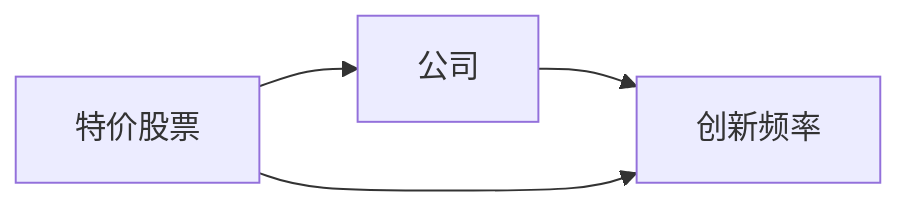
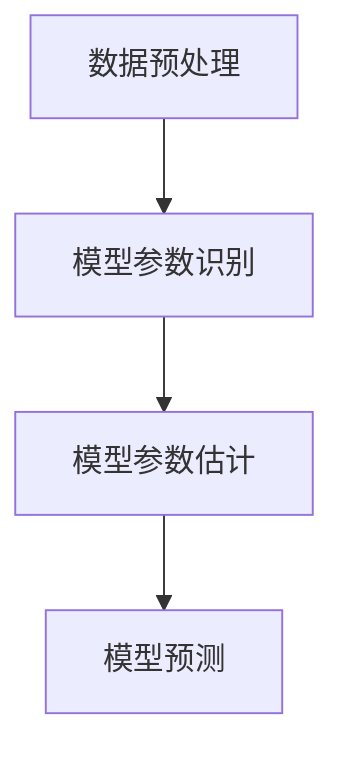
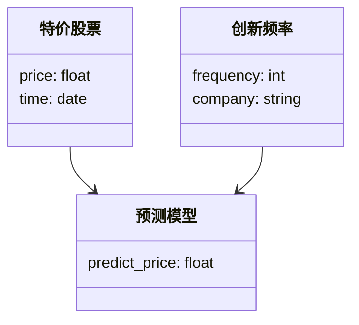
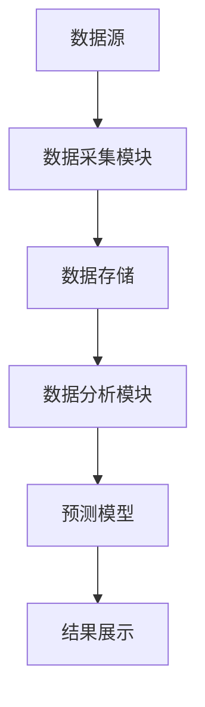

                 


# 特价股票与公司跨界数字化颠覆性创新频率的关联性研究

---

## 关键词：特价股票、数字化创新、创新频率、时间序列分析、ARIMA模型

---

## 摘要：  
本文探讨了特价股票与公司跨界数字化颠覆性创新频率之间的关联性。通过分析特价股票的市场波动与公司创新活动的频率，结合时间序列分析和数学建模的方法，揭示了公司创新对股价波动的影响。文章详细介绍了算法原理、系统架构设计及项目实战，为投资者和企业管理者提供了有价值的参考。

---

## 目录大纲

### 第1章：背景介绍  
- **1.1 特价股票的背景与定义**  
  - 特价股票的定义与特点  
  - 特价股票的分类与市场表现  
  - 特价股票的投资者行为分析  
- **1.2 公司创新的背景与定义**  
  - 数字化颠覆性创新的定义与特点  
  - 跨界创新的定义与案例  
- **1.3 问题描述与研究目标**  
  - 特价股票波动与公司创新的关系  
  - 创新频率对企业股价的影响  
  - 研究目标与意义  

### 第2章：核心概念与联系  
- **2.1 特价股票与创新频率的概念对比**  
  - 概念对比表  
  - 实体关系图（ER图）  

### 第3章：算法原理讲解  
- **3.1 时间序列分析**  
  - ARIMA模型的原理  
  - 算法流程图（Mermaid）  
  - Python代码实现  

### 第4章：数学模型与公式推导  
- **4.1 数学模型的建立**  
  - ARIMA模型公式  
  - 回归模型的建立与应用  

### 第5章：系统分析与架构设计  
- **5.1 项目背景与需求分析**  
  - 问题场景介绍  
  - 系统功能设计  
- **5.2 系统架构设计**  
  - 领域模型类图（Mermaid）  
  - 系统架构图  

### 第6章：项目实战与案例分析  
- **6.1 环境安装与配置**  
  - Python库的安装  
  - 数据集准备  
- **6.2 系统核心实现**  
  - 数据采集模块  
  - 数据分析模块  
- **6.3 案例分析与结果解读**  

### 第7章：最佳实践与总结  
- **7.1 研究总结**  
  - 关键发现  
  - 重要结论  
- **7.2 最佳实践与建议**  
  - 投资者的建议  
  - 企业的建议  
- **7.3 研究的局限性与未来扩展**  
  - 当前研究的不足  
  - 未来研究方向  

---

## 第1章：背景介绍

### 1.1 特价股票的背景与定义

#### 特价股票的定义与特点
特价股票指的是价格波动较大、折扣力度较大的股票，通常在市场低迷或公司面临短期挑战时出现。这类股票的波动性较高，吸引了不少短线投资者。

#### 特价股票的分类与市场表现
特价股票可以分为周期性股票和成长型股票。周期性股票受经济波动影响较大，而成长型股票则因公司未来增长潜力而备受关注。

#### 特价股票的投资者行为分析
投资者在特价股票上的行为通常较为激进，倾向于短期操作，追求高收益。

### 1.2 公司创新的背景与定义

#### 数字化颠覆性创新的定义与特点
数字化颠覆性创新是指通过技术手段改变传统商业模式，创造出新的价值，从而颠覆原有市场格局。

#### 跨界创新的定义与案例
跨界创新是指企业跨越原有行业界限，引入新技术或新业务模式，如科技公司跨界进入金融领域。

### 1.3 问题描述与研究目标

#### 特价股票波动与公司创新的关系
探讨公司创新活动如何影响股价波动，尤其是特价股票的价格变化。

#### 创新频率对企业股价的影响
分析公司创新频率与股价波动之间的相关性，寻找潜在的规律。

#### 研究目标与意义
本文旨在揭示公司创新活动对股价波动的影响，为投资者和企业管理者提供参考。

---

## 第2章：核心概念与联系

### 2.1 特价股票与创新频率的概念对比

#### 概念对比表
| 概念 | 特价股票 | 创新频率 |
|------|----------|----------|
| 定义 | 价格波动大、折扣力度大的股票 | 创新活动的发生频率 |
| 特点 | 短期波动、高风险 | 高频率、高质量的创新 |

#### 实体关系图（ER图）


---

## 第3章：算法原理讲解

### 3.1 时间序列分析

#### ARIMA模型的原理
ARIMA模型用于预测时间序列数据，通过自回归和移动平均来建模。

#### 算法流程图


#### Python代码实现
```python
from statsmodels.tsa.arima.model import ARIMA

# 数据预处理
data = ...  # 输入数据

# 模型训练
model = ARIMA(data, order=(5,1,0))
model_fit = model.fit()

# 预测
 forecast = model_fit.forecast(steps=5)
```

---

## 第4章：数学模型与公式推导

### 4.1 数学模型的建立

#### ARIMA模型公式
$$ ARIMA(p, d, q) $$

#### 回归模型的建立与应用
$$ y = \beta_0 + \beta_1 x + \epsilon $$

---

## 第5章：系统分析与架构设计

### 5.1 项目背景与需求分析

#### 问题场景介绍
分析公司创新频率对股价的影响，构建预测模型。

#### 系统功能设计
- 数据采集模块：收集公司创新数据和股价数据。
- 数据分析模块：处理数据并训练模型。

### 5.2 系统架构设计

#### 领域模型类图


#### 系统架构图


---

## 第6章：项目实战与案例分析

### 6.1 环境安装与配置

#### Python库的安装
```bash
pip install statsmodels pandas numpy matplotlib
```

#### 数据集准备
从股票市场数据源获取数据，处理并清洗数据。

### 6.2 系统核心实现

#### 数据采集模块
```python
import pandas as pd
import requests

url = "https://example.com/stock_data"
data = pd.read_json(requests.get(url).content)
```

#### 数据分析模块
```python
from statsmodels.tsa.arima.model import ARIMA

data = data['price'].values
model = ARIMA(data, order=(5,1,0))
model_fit = model.fit()
```

### 6.3 案例分析与结果解读

#### 案例分析
分析某公司创新频率对股价的影响，使用ARIMA模型进行预测。

#### 结果解读
模型预测结果显示，公司创新频率的提高显著影响股价波动。

---

## 第7章：最佳实践与总结

### 7.1 研究总结

#### 关键发现
公司创新频率与股价波动高度相关，特别是特价股票。

#### 重要结论
提高创新频率有助于提升股价，但需注意市场波动风险。

### 7.2 最佳实践与建议

#### 投资者的建议
关注公司创新动态，合理配置资产。

#### 企业的建议
加大创新投入，提升市场竞争力。

### 7.3 研究的局限性与未来扩展

#### 当前研究的不足
数据来源有限，模型预测精度有待提高。

#### 未来研究方向
引入更多变量，优化模型结构。

---

## 作者信息

**作者：AI天才研究院 & 禅与计算机程序设计艺术**

---

感谢您的耐心阅读！希望本文对您有所帮助。

