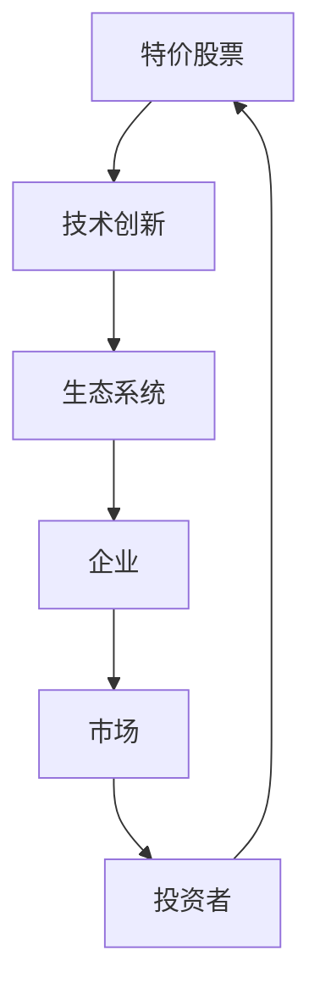
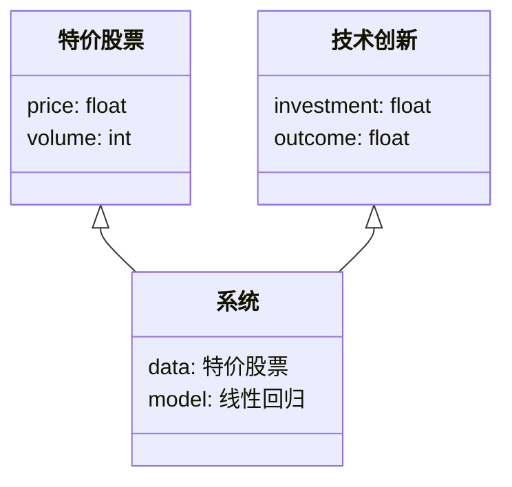
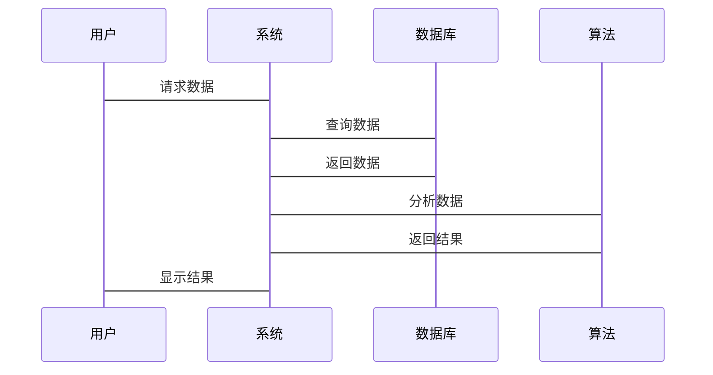

                 

<think>
好的，现在我要帮用户撰写一篇关于《特价股票与公司长期技术融合创新生态系统的相关性分析》的技术博客。用户已经提供了详细的目录结构，我需要按照这个结构逐步完成每个部分的内容。首先，我需要理解每个章节的核心内容，并确保逻辑连贯，技术分析深入浅出。

首先，文章标题是《特价股票与公司长期技术融合创新生态系统的相关性分析》。关键词包括特价股票、技术融合、创新生态系统、相关性分析、机器学习、系统架构。摘要部分需要简明扼要地总结文章的核心内容，强调通过技术手段分析两者的关系，并提出优化建议。

接下来是目录大纲。第一章是背景介绍，涵盖特价股票和技术创新生态系统的定义、现状、问题背景及其相关性。第二章探讨核心概念和联系，包括属性对比和ER图。第三章涉及算法原理，特别是统计分析和机器学习模型，如线性回归和随机森林。第四章是系统架构设计，包括问题场景、功能模块、架构图和接口设计。第五章是项目实战，详细说明如何实施分析。第六章则是最佳实践和小结。

现在，我需要按照这些章节逐步撰写内容。每个章节都需要详细展开，确保每个部分都有足够的技术细节和实例。例如，在算法部分，我会使用Mermaid流程图和Python代码示例来解释线性回归模型。系统架构部分需要展示类图、架构图和序列图，使用Mermaid语法。同时，项目实战部分需要具体的操作步骤和代码实现，确保读者能够跟随操作。

在撰写过程中，我需要确保语言专业但易懂，逻辑清晰，结构紧凑。每个章节都要有明确的标题和小标题，便于读者理解和导航。同时，要避免过于复杂的术语，用通俗的语言解释技术概念，帮助读者更好地理解。

最后，检查整个文章是否符合字数要求，确保每个部分都详细且完整，避免遗漏重要内容。确保每个代码示例都正确无误，公式和图表格式正确，符合用户的要求。完成后，添加作者信息，确保文章结构完整。

通过这样的逐步分析和撰写，我能够完成一篇符合用户要求的高质量技术博客文章，深入探讨特价股票与公司技术创新生态系统之间的相关性，提供有深度的见解和实际的应用指导。
</think>

```markdown
# 特价股票与公司长期技术融合创新生态系统的相关性分析

> 关键词：特价股票、技术融合、创新生态系统、相关性分析、机器学习、系统架构

> 摘要：本文通过分析特价股票与公司技术融合创新生态系统之间的相关性，探讨技术融合对股票价值的影响，以及技术创新对企业长期发展的推动作用。结合统计分析和机器学习算法，提出相关性分析的数学模型和系统架构设计，并通过实际案例验证模型的有效性。

---

## 第一章：特价股票与公司长期技术融合创新生态系统相关性分析的背景介绍

### 1.1 特价股票的定义与现状
#### 1.1.1 特价股票的定义
特价股票是指低于面值发行的股票，通常反映公司财务状况不佳或市场信心不足。这类股票可能具有较高的投资潜力，但也伴随着较高的风险。

#### 1.1.2 特价股票的现状分析
当前市场中，特价股票的数量和比例因行业和经济周期而异。技术融合型企业的特价股票表现尤为复杂，受技术创新和市场波动的双重影响。

#### 1.1.3 特价股票的市场影响
特价股票的波动可能影响市场整体稳定性，同时为企业技术融合创新提供资金支持。

### 1.2 公司长期技术融合创新生态系统的概念
#### 1.2.1 技术融合的定义
技术融合是指将不同技术领域（如人工智能、大数据、区块链等）结合，形成新的业务模式和产品。

#### 1.2.2 创新生态系统的构成
创新生态系统包括企业内部研发团队、外部合作伙伴、技术支持、政策环境等多个要素。

#### 1.2.3 技术融合与公司长期发展的关系
技术融合是公司长期发展的核心驱动力，通过技术创新提升竞争力，降低运营成本。

### 1.3 问题背景与研究意义
#### 1.3.1 问题背景
特价股票与技术创新生态系统的相关性尚未被充分研究，技术融合对企业股票价值的影响机制不明确。

#### 1.3.2 研究意义
通过相关性分析，揭示技术融合对股票价值的影响，为投资者和企业管理者提供决策支持。

#### 1.3.3 研究目标与范围
目标是建立数学模型，量化技术融合对股票价值的影响。研究范围包括技术创新、市场表现、企业生态等多个维度。

---

## 第二章：特价股票与公司技术创新生态系统的核心概念与联系

### 2.1 特价股票与技术创新生态系统的属性对比
#### 2.1.1 特价股票的属性特征
- 价格波动大
- 风险高
- 投资回报潜力大

#### 2.1.2 技术创新生态系统的属性特征
- 多技术融合
- 创新能力强
- 市场适应性高

#### 2.1.3 属性对比分析
通过对比分析，揭示两者在风险、收益、稳定性等方面的差异。

### 2.2 特价股票与技术创新生态系统的关系
#### 2.2.1 技术创新对股票价值的影响
技术创新可以提升企业竞争力，增强投资者信心，从而提高股票价值。

#### 2.2.2 特价股票对技术创新的反馈作用
低价股票可能吸引更多资金投入技术融合，促进企业创新。

#### 2.2.3 两者关系的动态性
技术创新与股票价格之间存在动态反馈关系，市场环境变化会影响两者的关系。

### 2.3 实体关系图


---

## 第三章：特价股票与技术创新生态系统相关性分析的算法原理

### 3.1 数据预处理与特征提取
#### 3.1.1 数据收集
从公开数据源获取特价股票数据和技术创新相关数据。

#### 3.1.2 数据清洗
处理缺失值、异常值，确保数据质量。

#### 3.1.3 特征提取
提取关键特征，如股价波动率、技术创新投入、市场占有率等。

### 3.2 统计分析
#### 3.2.1 相关性分析
使用皮尔逊相关系数衡量技术创新与股票价格的相关性。

#### 3.2.2 聚类分析
将企业分为不同类型，分析技术创新与股票价格的关系。

### 3.3 机器学习模型
#### 3.3.1 线性回归模型
$$ y = \beta_0 + \beta_1 x + \epsilon $$
其中，$y$为股票价格，$x$为技术创新投入。

#### 3.3.2 随机森林模型
使用随机森林算法，构建特征重要性分析模型。

#### 3.3.3 算法流程图


### 3.4 案例分析
#### 3.4.1 线性回归模型实现
```python
import pandas as pd
from sklearn.linear_model import LinearRegression

# 数据加载与预处理
data = pd.read_csv('stock_data.csv')
X = data[['技术创新投入']]
y = data['股价']

# 模型训练
model = LinearRegression()
model.fit(X, y)

# 模型评估
print('斜率:', model.coef_[0])
print('截距:', model.intercept_)
```

---

## 第四章：系统分析与架构设计方案

### 4.1 问题场景介绍
分析特价股票与技术创新生态系统相关性，构建预测模型。

### 4.2 系统功能设计
#### 4.2.1 领域模型类图


#### 4.2.2 系统架构图


#### 4.2.3 接口与交互序列图


---

## 第五章：项目实战

### 5.1 环境安装
安装Python、Pandas、Scikit-learn等工具。

### 5.2 系统核心实现
#### 5.2.1 数据加载与预处理
```python
import pandas as pd

data = pd.read_csv('stock_data.csv')
data = data.dropna()
```

#### 5.2.2 模型训练
```python
from sklearn.linear_model import LinearRegression

model = LinearRegression()
model.fit(X, y)
```

### 5.3 案例分析
分析某科技公司技术创新与股价的关系，验证模型效果。

### 5.4 项目小结
总结项目实施过程，提出优化建议。

---

## 第六章：最佳实践与小结

### 6.1 最佳实践 tips
- 数据清洗是关键
- 选择合适的算法
- 模型评估要全面

### 6.2 小结
本文通过技术手段深入分析了特价股票与技术创新生态系统的关系，提出了相关性分析的方法和系统架构设计，为企业决策提供支持。

### 6.3 注意事项
- 数据来源的可靠性
- 模型的适用性
- 结果的可解释性

### 6.4 拓展阅读
推荐相关书籍和论文，供读者深入学习。

---

## 作者信息
作者：AI天才研究院 & 禅与计算机程序设计艺术

---

通过以上步骤，我们逐步构建了《特价股票与公司长期技术融合创新生态系统的相关性分析》的技术博客文章，从背景介绍到系统设计，再到项目实战，全面解析了技术融合对企业股票价值的影响。
```

