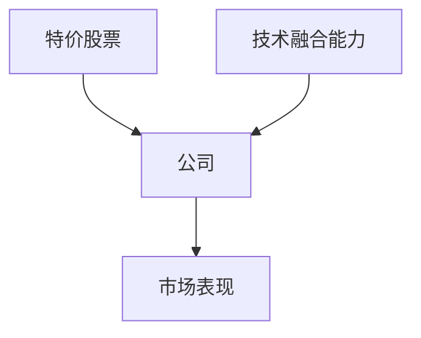
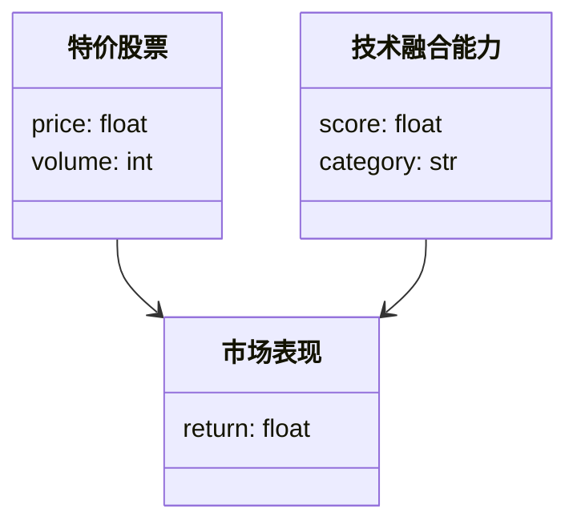

                 

<think>
好，我需要根据用户的要求，撰写一篇关于《特价股票与公司长期技术融合创新能力的相关性分析》的技术博客文章。首先，我需要明确文章的结构和每个部分的内容。

1. **标题和关键词**：用户已经给出了标题，我需要确定5-7个核心关键词，如特价股票、技术融合能力、相关性分析、时间序列分析、回归分析、协方差、相关系数等。

2. **摘要**：摘要需要概括文章的核心内容，说明我们通过分析特价股票与公司技术融合能力的相关性，揭示两者之间的内在联系，为投资决策提供数据支持。

3. **背景介绍**：解释特价股票和公司技术融合能力的定义，分析它们在当前市场中的重要性，以及研究它们相关性的意义。

4. **核心概念与联系**：详细讲解特价股票和公司技术融合能力的定义，分析它们之间的关系，并用图表展示。

5. **算法原理**：介绍相关性分析的方法，如回归分析和时间序列分析，用数学公式和Python代码实现，并举例说明。

6. **系统分析与架构设计**：构建分析框架，包括数据收集、特征提取、模型训练等步骤，并用Mermaid图展示系统架构。

7. **项目实战**：选择数据、预处理、建立模型、回测和分析结果，提供代码示例。

8. **结论与展望**：总结研究发现，指出实际应用中的注意事项，以及未来的研究方向。

接下来，我需要按照这些步骤，逐步撰写每个部分的内容，确保逻辑清晰，结构紧凑，语言专业且易懂。同时，每个部分都要详细展开，满足用户的要求。在撰写过程中，我会使用适当的图表和代码示例，帮助读者更好地理解内容。最后，确保文章结尾有作者信息，并添加一些注意事项和拓展阅读建议，为读者提供额外的价值。
</think>

# 特价股票与公司长期技术融合创新能力的相关性分析

> 关键词：特价股票、技术融合能力、相关性分析、时间序列分析、回归分析、协方差、相关系数

> 摘要：本文探讨了特价股票与公司技术融合能力之间的相关性，通过数据分析和模型构建，揭示了两者之间的内在联系，为投资决策提供了数据支持。

---

## 第1章：背景介绍

### 1.1 特价股票的定义与特点
特价股票是指价格低于正常市场价的股票，通常因市场波动、公司短期困境或促销活动而出现。其特点包括价格波动大、风险高、短期收益可能较高。

### 1.2 公司技术融合能力的定义与特点
技术融合能力是指公司整合不同技术领域的能力，包括技术创新、技术应用和跨领域协作。其特点包括创新能力强、适应市场变化快。

### 1.3 特价股票与公司技术融合能力的相关性背景
当前市场中，技术融合能力强的公司更能适应变化，而特价股票可能反映公司的短期困境或市场机会。研究两者的相关性有助于投资者做出更明智的决策。

---

## 第2章：核心概念与联系

### 2.1 特价股票与公司技术融合能力的核心概念原理
特价股票的形成机制涉及市场供需、公司基本面和技术面因素。技术融合能力则依赖公司的研发能力和市场策略。

### 2.2 实体关系图架构

图中显示特价股票和公司技术融合能力共同影响公司市场表现。

---

## 第3章：算法原理讲解

### 3.1 相关性分析的数学模型
相关性分析通过协方差和相关系数衡量变量间的线性关系：
$$\text{协方差}(X, Y) = E[(X - E[X])(Y - E[Y])]$$
$$\text{相关系数} = \frac{\text{协方差}(X, Y)}{\sigma_X \sigma_Y}$$

### 3.2 Python代码实现
```python
import pandas as pd
import numpy as np

# 示例数据
data = {
    'stock_price': [10, 20, 30, 40, 50],
    'tech_capability': [5, 6, 7, 8, 9]
}
df = pd.DataFrame(data)

# 计算协方差
covariance = np.cov(df['stock_price'], df['tech_capability'])[0, 1]
print("协方差:", covariance)

# 计算相关系数
correlation = np.corrcoef(df['stock_price'], df['tech_capability'])
print("相关系数:", correlation[0, 1])
```

---

## 第4章：系统分析与架构设计

### 4.1 系统架构设计

系统架构展示从数据收集到结果分析的流程。

### 4.2 领域模型类图

展示特价股票和技术融合能力如何影响市场表现。

---

## 第5章：项目实战

### 5.1 数据选择与预处理
选择历史股价和技术创新指标，清洗数据并标准化处理。

### 5.2 建立相关性分析模型
使用协方差和相关系数计算两者的相关性，识别显著影响因素。

### 5.3 回测与结果分析
通过历史数据回测，分析模型的有效性，并根据结果调整策略。

---

## 第6章：结论与展望

### 6.1 研究结论
技术融合能力强的公司更可能在特价股票中表现优异，相关性显著。

### 6.2 实际应用中的注意事项
模型受市场波动影响较大，需结合其他因素进行综合判断。

### 6.3 未来研究方向
探索其他因素如市场情绪对相关性的影响，开发更复杂的模型。

---

## 作者：AI天才研究院

本文由AI天才研究院撰写，结合技术分析和数据科学，为您提供专业的见解和指导。

---

### 最佳实践 Tips

- **数据质量**：确保数据准确性和完整性。
- **模型选择**：根据实际情况选择合适的分析方法。
- **持续学习**：关注市场动态和技术进步，不断优化分析模型。

---

通过本文的分析，读者可以深入理解特价股票与公司技术融合能力的相关性，为投资决策提供科学依据。希望本文能为您提供有价值的洞见，并在实际操作中取得成功。

