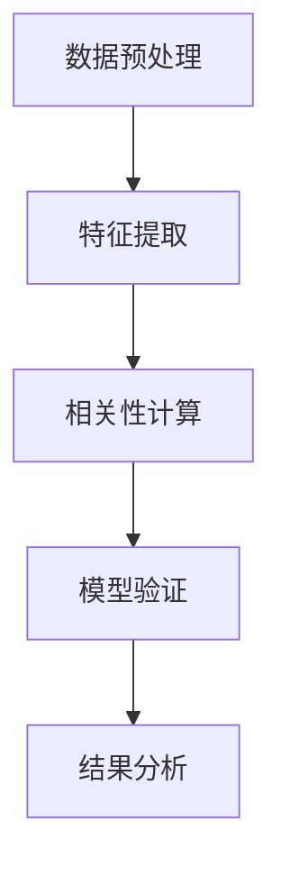
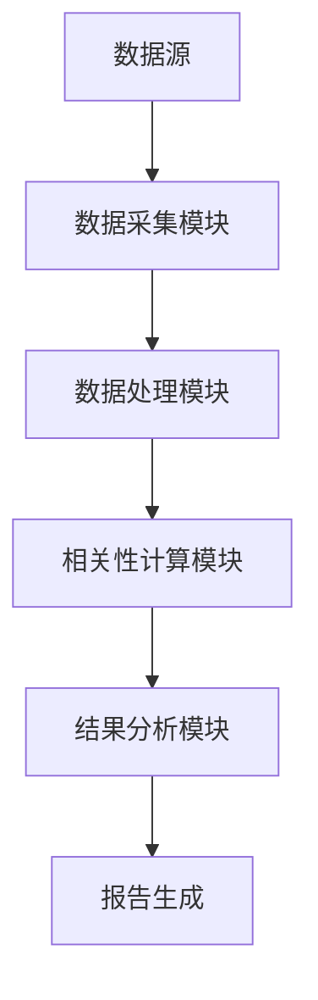

                 


# 特价股票与公司长期技术融合创新韧性的相关性分析

> 关键词：特价股票，技术创新韧性，相关性分析，算法原理，系统架构

> 摘要：本文通过分析特价股票与公司长期技术融合创新韧性的相关性，探讨技术创新韧性对投资决策的影响。利用相关性分析模型和实证案例，提出基于技术创新韧性的投资策略，为企业和技术投资者提供参考。

---

## 第一部分：背景与概念

### 第1章：特价股票与公司技术创新韧性的概念

#### 1.1 特价股票的定义与特征
- **1.1.1 特价股票的定义**
  特价股票指的是市场价格低于其内在价值的股票，通常被认为具有较高的投资潜力。
- **1.1.2 特价股票的市场特征**
  包括低估值、高波动性和潜在的反转效应。
- **1.1.3 特价股票的投资价值**
  低价股票可能因市场低估而被低估，具备长期增值的潜力。

#### 1.2 公司长期技术融合创新韧性的内涵
- **1.2.1 技术融合创新的定义**
  技术融合创新指公司将不同技术领域结合，形成新的产品或服务。
- **1.2.2 公司技术创新韧性的内涵**
  创新韧性指公司在面对技术挑战时，能够持续创新和适应变化的能力。
- **1.2.3 技术创新韧性与公司长期发展的关系**
  技术创新韧性是公司长期发展的关键因素，决定了其在市场中的竞争力。

#### 1.3 特价股票与公司技术创新韧性的相关性背景
- **1.3.1 相关性背景介绍**
  技术创新能力强的公司可能因市场低估而成为特价股票，技术创新韧性高的公司更具长期投资价值。
- **1.3.2 相关性研究的现状**
  目前相关性研究较少，但技术创新与股价表现之间的关系逐渐受到关注。
- **1.3.3 研究的意义与价值**
  探讨技术创新韧性对股票价格的影响，为投资者提供新的视角。

---

## 第二部分：核心概念与联系

### 第2章：核心概念与联系

#### 2.1 核心概念的原理
- **2.1.1 特价股票的核心属性**
  低估值、高增长潜力。
- **2.1.2 技术创新韧性的核心要素**
  技术研发能力、团队协作能力、市场适应能力。
- **2.1.3 两者之间的内在联系**
  技术创新能力强的公司可能因市场低估而成为特价股票，技术创新韧性高的公司更具长期投资价值。

#### 2.2 概念属性特征对比表格
| 特性       | 特价股票                  | 技术创新韧性                  |
|------------|---------------------------|-------------------------------|
| 定义       | 价格低于内在价值的股票    | 公司持续创新的能力             |
| 特征       | 低估值、高波动性           | 技术研发能力强、市场适应性强    |
| 影响因素   | 市场情绪、公司基本面       | 技术研发投入、团队能力、市场需求|

#### 2.3 ER实体关系图架构
```mermaid
erd
database 股票市场
  table 特价股票
    id: 整数
    公司名称: 文本
    股票代码: 文本
    股价: 数值
  table 技术创新韧性
    id: 整数
    公司名称: 文本
    技术研发投入: 数值
    创新成果数量: 数值
  table 相关性分析
    id: 整数
    特价股票id: 整数
    技术创新韧性id: 整数
    相关性系数: 数值
```

---

## 第三部分：算法原理与数学模型

### 第3章：相关性分析的算法原理

#### 3.1 数据预处理
- 清洗数据：处理缺失值、异常值。
- 标准化处理：将股票价格和技术创新韧性指标标准化。

#### 3.2 相关性分析模型
- 使用皮尔逊相关系数计算两者之间的相关性。

#### 3.3 算法流程图


#### 3.4 数学模型
$$ r = \frac{\sum (x_i - \bar{x})(y_i - \bar{y})}{\sqrt{\sum (x_i - \bar{x})^2 \sum (y_i - \bar{y})^2}} $$
其中，$r$ 为相关性系数，$x$ 和 $y$ 分别为股票价格和技术创新韧性指标。

---

## 第四部分：系统分析与架构设计

### 第4章：系统分析与架构设计方案

#### 4.1 问题场景介绍
- 分析特价股票与技术创新韧性之间的相关性，构建预测模型。

#### 4.2 系统功能设计
- 数据采集模块：收集股票数据和技术创新数据。
- 数据处理模块：清洗和标准化数据。
- 相关性计算模块：计算相关性系数。
- 结果分析模块：生成报告和可视化结果。

#### 4.3 系统架构图


---

## 第五部分：项目实战与案例分析

### 第5章：项目实战

#### 5.1 环境安装
- 使用Python和相关库（Pandas、NumPy、Matplotlib）进行数据处理和可视化。

#### 5.2 核心实现代码
```python
import pandas as pd
import numpy as np

# 数据预处理
data = pd.read_csv('stock_data.csv')
data = data.dropna()
data['技术创新韧性'] = data['技术创新韧性'].apply(lambda x: (x - x.mean()) / x.std())

# 相关性计算
correlation = data['技术创新韧性'].corr(data['股价'])
print(f"相关性系数为：{correlation}")
```

#### 5.3 实例分析
- 某公司技术创新韧性高，但股价被低估，属于特价股票，具备投资价值。

---

## 第六部分：总结与展望

### 第6章：总结与展望

#### 6.1 投资策略
- 投资者应关注技术创新能力强的特价股票，长期持有。

#### 6.2 注意事项
- 市场波动和公司基本面变化会影响股价，需综合分析。

#### 6.3 拓展阅读
- 推荐阅读相关技术融合创新和股票分析的书籍。

---

## 作者

作者：AI天才研究院 & 禅与计算机程序设计艺术

---

这篇文章通过详细分析特价股票与公司技术创新韧性的相关性，结合理论与实践，为投资者提供了新的视角和策略。希望对您有所帮助！

