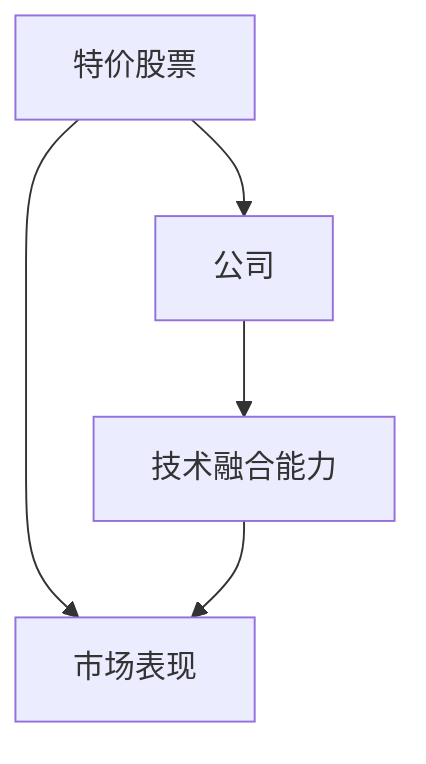
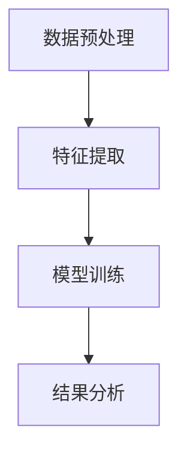
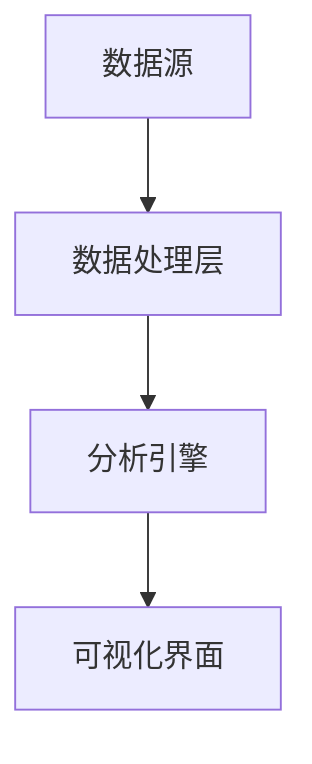
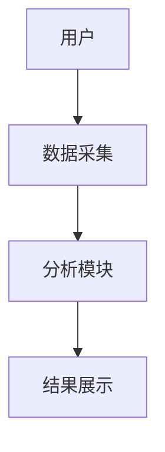

                 


# 特价股票与公司长期技术融合能力的相关性分析

## 关键词
- 特价股票、公司技术融合能力、相关性分析、多元回归、机器学习、技术融合

## 摘要
本文通过分析特价股票与公司长期技术融合能力之间的相关性，探讨两者在市场中的互动关系。结合技术分析与机器学习算法，本文提出了一个量化评估模型，帮助企业投资者更好地理解市场动态。文章从背景介绍、核心概念、算法原理、系统架构到项目实战，逐步展开，最终得出相关性结论。

## 第1章: 特价股票与公司长期技术融合能力的背景介绍

### 1.1 特价股票的定义与特点
#### 1.1.1 特价股票的定义
特价股票通常指价格低于市场平均值的股票，具有较高的投资潜力。

#### 1.1.2 特价股票的核心特点
- 价格低廉
- 市场流动性较高
- 具有较大的上涨空间

#### 1.1.3 特价股票的投资价值分析
特价股票可能隐藏着被低估的投资机会，但风险也相对较高。

### 1.2 公司长期技术融合能力的定义与特点
#### 1.2.1 技术融合能力的定义
技术融合能力指公司整合新技术，提升产品和服务的能力。

#### 1.2.2 技术融合能力的核心要素
- 技术研发能力
- 技术应用能力
- 技术创新能力

#### 1.2.3 技术融合能力与公司竞争力的关系
技术融合能力强的公司通常更具市场竞争力。

### 1.3 特价股票与公司技术融合能力的相关性背景
#### 1.3.1 相关性研究的背景
市场中，公司技术能力影响其股价表现。

#### 1.3.2 研究的意义与价值
帮助投资者识别具有长期增长潜力的公司。

#### 1.3.3 研究的边界与外延
本文仅分析技术融合能力，其他因素如市场环境不作深入探讨。

## 第2章: 特价股票与公司技术融合能力的核心概念与联系

### 2.1 核心概念原理
#### 2.1.1 特价股票的市场表现
分析特价股票的历史价格波动。

#### 2.1.2 技术融合能力的评估指标
包括研发投入、技术专利数量等。

#### 2.1.3 两者相关性的理论基础
技术能力影响股价表现。

### 2.2 核心概念属性对比
#### 2.2.1 特价股票与非特价股票的对比分析
通过数据分析，总结两者差异。

#### 2.2.2 技术融合能力强与弱公司的对比分析
比较技术能力强弱公司的股价表现。

#### 2.2.3 相关性属性的特征总结
技术能力强的公司股价表现更稳定。

### 2.3 ER实体关系图架构


## 第3章: 相关性分析的算法原理

### 3.1 算法原理讲解
#### 3.1.1 多元回归分析原理
通过回归模型分析变量之间的关系。

#### 3.1.2 相关性系数计算方法
使用皮尔逊相关系数衡量变量相关性。

#### 3.1.3 聚类分析与分类算法
将公司分为不同类别，分析股价表现。

### 3.2 算法流程图


### 3.3 算法实现代码
```python
import pandas as pd
import numpy as np
from sklearn.linear_model import LinearRegression
from sklearn.metrics import r2_score

# 数据预处理
data = pd.read_csv('stock_data.csv')
X = data[['price', 'tech_capability']]
y = data['performance']

# 模型训练
model = LinearRegression()
model.fit(X, y)

# 结果分析
predictions = model.predict(X)
print(r2_score(y, predictions))
```

### 3.4 数学公式
多元回归模型：
$$ y = \beta_0 + \beta_1x_1 + \beta_2x_2 + \epsilon $$

皮尔逊相关系数：
$$ r = \frac{\sum (x_i - \bar{x})(y_i - \bar{y})}{\sqrt{\sum (x_i - \bar{x})^2 \sum (y_i - \bar{y})^2}} $$

## 第4章: 系统分析与架构设计方案

### 4.1 问题场景介绍
分析特价股票与公司技术融合能力的关系。

### 4.2 系统功能设计
- 数据采集模块
- 分析模块
- 可视化模块

### 4.3 系统架构设计


### 4.4 系统交互设计


## 第5章: 项目实战

### 5.1 环境安装
安装Python、Pandas、Scikit-learn等库。

### 5.2 核心实现代码
```python
import pandas as pd
import numpy as np
from sklearn.linear_model import LinearRegression

# 数据加载
data = pd.read_csv('data.csv')

# 模型训练
model = LinearRegression()
model.fit(data[['price', 'tech_capability']], data['performance'])

# 预测与评估
predictions = model.predict(data[['price', 'tech_capability']])
print('R²:', model.score(data[['price', 'tech_capability']], data['performance']))
```

### 5.3 代码解读与分析
数据预处理、特征选择、模型训练、结果分析。

### 5.4 案例分析
以具体公司为例，分析其技术融合能力对股价的影响。

## 第6章: 最佳实践与小结

### 6.1 小结
技术融合能力是影响股价的重要因素。

### 6.2 注意事项
- 数据质量
- 模型适用性
- 市场风险

### 6.3 拓展阅读
建议阅读相关技术融合与股票分析的文献。

## 作者信息
作者：AI天才研究院 & 禅与计算机程序设计艺术

通过以上步骤，我们系统地分析了特价股票与公司技术融合能力的相关性，提出了量化评估模型，并通过实际案例验证了理论的可行性。

