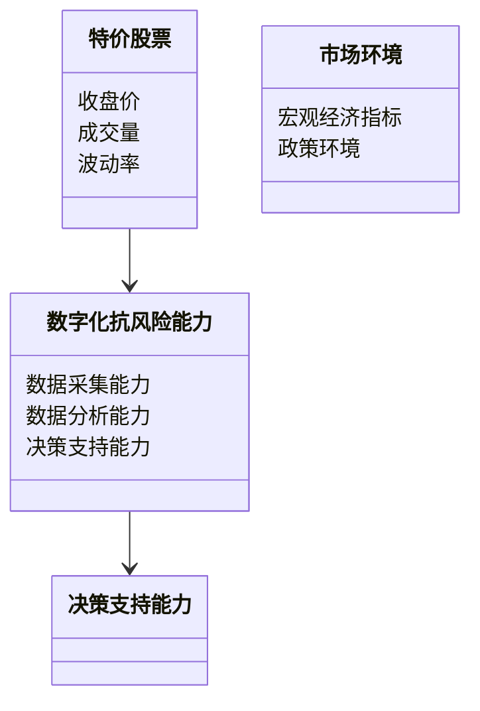
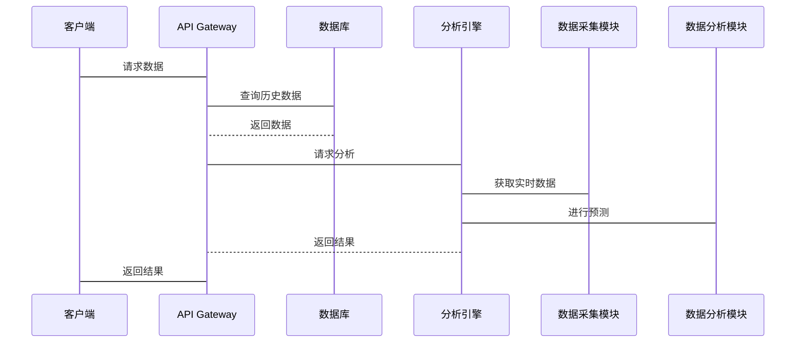

                 


# 特价股票与公司长期数字化抗风险能力的关联性研究

> 关键词：特价股票、数字化抗风险能力、关联性分析、系统架构、机器学习

> 摘要：本文通过分析特价股票与公司长期数字化抗风险能力之间的关联性，探讨如何利用数字化手段提升公司的抗风险能力，并优化投资策略。文章从核心概念、算法原理、系统架构设计等多维度展开，结合实际案例，为投资者和企业管理者提供科学的决策支持。

---

## 第一部分: 特价股票与公司数字化抗风险能力的背景介绍

### 第1章: 特价股票的定义与特点

#### 1.1 特价股票的定义
- 特价股票的定义与分类
- 特价股票的特点：高波动性、低估值、高风险回报比
- 特价股票的市场表现与投资价值

#### 1.2 公司数字化抗风险能力的定义
- 数字化抗风险能力的核心概念
- 数字化抗风险能力的构成要素：数据采集、分析、决策支持
- 数字化抗风险能力与公司长期发展的关系

#### 1.3 特价股票与公司数字化抗风险能力的关联性背景
- 问题背景：经济波动对股票市场的冲击
- 研究意义：提升公司的抗风险能力，优化投资策略
- 研究目标：建立特价股票与公司数字化抗风险能力的关联模型

---

## 第二部分: 特价股票与公司数字化抗风险能力的核心概念与联系

### 第2章: 特价股票的理论基础

#### 2.1 特价股票的形成机制
- 市场供需关系
- 公司基本面分析
- 市场情绪与投资者行为

#### 2.2 特价股票的市场影响
- 对投资者的影响：高回报与高风险并存
- 对市场的ystematic risk和unsystematic risk的影响
- 特价股票与市场周期的关系

#### 2.3 特价股票与公司财务状况的关系
- 公司财务健康状况与股票价格的关联
- 财务指标（如市盈率、市净率）与股票价格的互动关系

### 第3章: 公司数字化抗风险能力的理论基础

#### 3.1 数字化抗风险能力的构成要素
- 数据采集与处理能力
- 数据分析与预测能力
- 决策支持与优化能力

#### 3.2 数字化抗风险能力的评估指标
- 数据质量：完整性、准确性、实时性
- 分析能力：预测模型的准确率、稳定性
- 决策效率：决策支持的响应时间、效果

#### 3.3 数字化抗风险能力与公司竞争力的关系
- 数字化能力如何增强公司的市场竞争力
- 数字化能力如何优化公司的运营效率
- 数字化能力与公司长期发展的战略关系

### 第4章: 特价股票与公司数字化抗风险能力的关联性分析

#### 4.1 特价股票与公司数字化抗风险能力的内在联系
- 特价股票的高波动性与公司抗风险能力的动态调整
- 数字化能力如何影响公司对特价股票的应对策略
- 特价股票市场的不确定性与公司数字化抗风险能力的匹配性

#### 4.2 特价股票与公司数字化抗风险能力的相互作用机制
- 数字化能力如何帮助公司捕捉特价股票的投资机会
- 特价股票市场的变化如何倒逼公司提升数字化能力
- 特价股票与公司数字化能力的协同效应

---

## 第三部分: 特价股票与公司数字化抗风险能力的关联性模型构建

### 第5章: 关联性模型的构建思路

#### 5.1 模型构建的目标
- 建立特价股票与公司数字化抗风险能力之间的量化关系
- 通过模型预测公司数字化能力对特价股票的影响
- 优化投资策略，降低风险，提高收益

#### 5.2 模型构建的方法
- 数据挖掘与机器学习算法
- 统计分析与回归分析
- 多元分析与因果关系推理

#### 5.3 模型构建的步骤
1. 数据收集与预处理
2. 特征提取与变量选择
3. 模型训练与验证
4. 模型优化与部署

---

## 第四部分: 特价股票与公司数字化抗风险能力的实证分析

### 第6章: 数据来源与处理

#### 6.1 数据来源
- 历史股票数据：特价股票的收盘价、成交量等
- 公司数字化能力数据：数据采集、分析、决策能力的量化指标
- 市场环境数据：宏观经济指标、政策环境等

#### 6.2 数据预处理
- 数据清洗：处理缺失值、异常值
- 数据标准化：归一化处理
- 数据特征提取：提取关键特征，如波动率、市盈率等

### 第7章: 关联性模型的数学表达

#### 7.1 模型的变量定义
- 自变量：公司数字化能力指标（如数据处理能力、分析能力）
- 因变量：特价股票的市场表现（如收益率、波动率）

#### 7.2 模型的假设条件
- 数据独立性
- 线性关系
- 正态分布

#### 7.3 模型的数学公式
$$ y = \beta_0 + \beta_1x_1 + \beta_2x_2 + \epsilon $$

其中：
- $y$ 表示特价股票的市场表现
- $x_1$ 表示公司数字化能力指标1
- $x_2$ 表示公司数字化能力指标2
- $\beta_0$、$\beta_1$、$\beta_2$ 为回归系数
- $\epsilon$ 为误差项

---

## 第五部分: 系统分析与架构设计方案

### 第8章: 系统功能设计

#### 8.1 领域模型（Mermaid 类图）


#### 8.2 系统架构设计（Mermaid 架构图）


#### 8.3 系统接口设计与交互流程（Mermaid 序列图）


---

## 第六部分: 项目实战与应用

### 第9章: 环境安装与核心实现

#### 9.1 环境安装
- 安装Python、机器学习库（如scikit-learn、TensorFlow）
- 数据处理工具：Pandas、NumPy
- 可视化工具：Matplotlib、Seaborn

#### 9.2 核心实现
- 数据预处理：清洗、归一化
- 特征提取：选择关键特征
- 模型训练：线性回归、随机森林等
- 模型优化：调参、交叉验证

#### 9.3 代码示例
```python
import pandas as pd
import numpy as np
from sklearn.linear_model import LinearRegression
from sklearn.metrics import mean_squared_error

# 数据加载
data = pd.read_csv('stock_data.csv')

# 特征提取
X = data[['市盈率', '市净率', '波动率']]
y = data['收益率']

# 模型训练
model = LinearRegression()
model.fit(X, y)

# 预测与评估
y_pred = model.predict(X)
mse = mean_squared_error(y, y_pred)
print(f'MSE: {mse}')
```

---

## 第七部分: 总结与展望

### 第10章: 总结与小结

#### 10.1 研究总结
- 主要发现：公司数字化能力显著影响特价股票的市场表现
- 关键结论：数字化能力越强，公司的抗风险能力越高，投资回报越稳定

#### 10.2 局限性与未来研究方向
- 研究局限：数据样本的限制、模型的适用性
- 未来方向：结合更复杂的机器学习模型（如深度学习）
- 拓展研究：考虑更多市场变量（如政策、突发事件）

---

## 作者：AI天才研究院 & 禅与计算机程序设计艺术

---

**注意**：以上目录大纲仅为示例，实际撰写时需要根据具体研究内容进行调整和补充。

