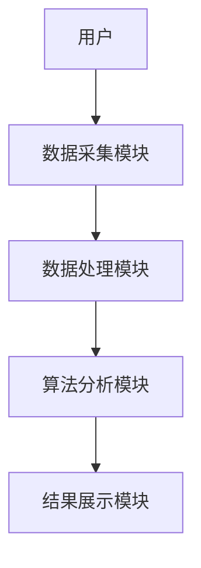
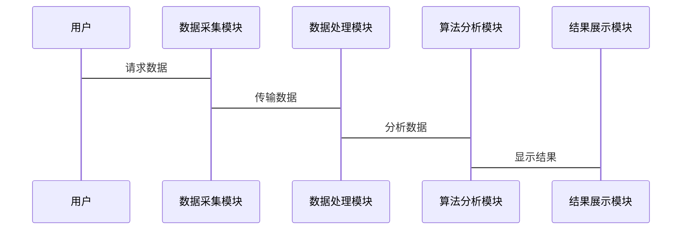

                 


```markdown
# 特价股票与公司长期数字化适应性进化能力的关联性研究

> 关键词：特价股票，数字化适应性，公司进化，股票市场，机器学习

> 摘要：本文研究了特价股票与公司长期数字化适应性进化能力之间的关联性。通过分析特价股票的市场表现、投资者行为以及公司数字化适应性进化能力的定义与特征，探讨了两者之间的内在联系。结合时间序列分析、机器学习算法和系统架构设计，本文提出了一种新的分析框架，以帮助企业更好地理解特价股票市场的波动性对公司数字化适应性的影响，并提供实际的应用案例和最佳实践建议。

---

# 第一部分: 特价股票与公司长期数字化适应性进化能力的背景介绍

## 第1章: 特价股票的定义与市场表现

### 1.1 特价股票的定义与特征
#### 1.1.1 特价股票的定义
特价股票是指价格低于某个特定阈值的股票，通常被认为是高风险、高波动性的投资标的。在股票市场中，特价股票通常被视为具有潜在价值的股票，但也可能因为公司基本面不佳或市场波动而价格被低估。

#### 1.1.2 特价股票的市场表现特点
- 高波动性：特价股票的价格波动较大，短期内可能有较大的涨跌。
- 低估值：许多特价股票的价格低于其实际价值，可能被市场低估。
- 高风险：由于价格波动大，投资特价股票的风险较高。

#### 1.1.3 特价股票的投资风险与机会
- 风险：特价股票的高波动性可能导致投资者面临较大的本金损失风险。
- 机会：如果能够准确判断公司基本面，投资特价股票可能带来较高的回报。

### 1.2 特价股票的投资者行为分析
#### 1.2.1 特价股票投资者的典型特征
- 投资者类型多样：包括机构投资者和散户。
- 投资策略各异：有的投资者采取短期交易策略，有的则长期持有。

#### 1.2.2 特价股票市场的交易策略
- 技术分析：利用K线图、均线等技术指标进行交易。
- 基本面分析：分析公司的财务状况、行业地位等。

#### 1.2.3 特价股票投资者的心理与行为模式
- 过度自信：投资者可能因为市场波动而做出非理性决策。
- 跟风行为：投资者可能因为市场情绪而盲目跟随。

### 1.3 特价股票与公司长期发展的关联性
#### 1.3.1 特价股票市场的波动性对公司的长期影响
- 公司股价波动可能影响投资者信心。
- 股价波动可能影响公司的融资能力。

#### 1.3.2 特价股票与公司市值管理的关系
- 公司通过市值管理可以稳定股价，提升投资者信心。
- 特价股票的波动可能对市值管理提出更高的要求。

#### 1.3.3 特价股票市场的周期性与公司发展的阶段匹配
- 公司在不同发展阶段可能更适合不同的股票价格策略。
- 特价股票市场的周期性波动可能与公司发展的周期性相匹配。

## 第2章: 公司长期数字化适应性进化能力的定义与特征

### 2.1 公司数字化适应性进化能力的定义
#### 2.1.1 数字化适应性的核心概念
数字化适应性是指公司能够根据数字化技术的发展和市场变化，灵活调整自身的业务模式、组织结构和运营流程的能力。

#### 2.1.2 公司进化能力的内涵
公司进化能力是指公司能够不断自我创新、适应外部环境变化，并持续优化自身能力的过程。

#### 2.1.3 数字化适应性与公司长期发展的关系
数字化适应性是公司长期发展的关键能力，能够帮助公司在快速变化的市场环境中保持竞争力。

### 2.2 公司数字化适应性进化能力的特征
#### 2.2.1 数字化能力的动态性
公司需要不断更新技术、优化流程，以适应数字化技术的快速发展。

#### 2.2.2 公司进化能力的系统性
公司进化能力是一个系统工程，涉及组织结构、文化、技术等多个方面。

#### 2.2.3 数字化适应性与公司核心竞争力的关系
数字化适应性是公司核心竞争力的重要组成部分，能够帮助公司在数字化转型中保持竞争优势。

### 2.3 公司数字化适应性进化能力的评估指标
#### 2.3.1 数字化能力评估指标
- 技术投入：公司对数字化技术的投入水平。
- 技术应用：公司数字化技术的应用范围和深度。

#### 2.3.2 公司进化能力评估指标
- 组织灵活性：公司组织结构的灵活性和适应性。
- 创新能力：公司技术创新和产品创新能力。

#### 2.3.3 综合评估模型的构建
通过综合评估指标，构建一个能够全面反映公司数字化适应性进化能力的评估模型。

## 第3章: 特价股票与公司长期数字化适应性进化能力的关联性研究

### 3.1 特价股票与公司数字化适应性的基本关系
#### 3.1.1 特价股票市场的波动性对数字化适应性的影响
- 特价股票市场的波动性可能影响公司的股价稳定性，进而影响投资者信心。
- 公司需要具备较强的数字化适应能力，才能在市场波动中保持稳定。

#### 3.1.2 数字化适应性对特价股票市场的影响
- 具有较强数字化适应能力的公司可能更容易获得投资者的青睐，从而提升股价。
- 公司的数字化适应能力可能影响其股价的波动性。

#### 3.1.3 特价股票与公司数字化适应性进化的相互作用
- 公司的数字化适应能力可能影响其股价的波动性。
- 特价股票市场的波动性可能反过来影响公司的数字化适应能力。

### 3.2 特价股票与公司数字化适应性的具体影响机制
#### 3.2.1 特价股票市场波动对公司的直接影响
- 影响公司市值：股价波动可能直接影响公司的市值。
- 影响公司融资能力：股价波动可能影响公司的融资成本。

#### 3.2.2 公司数字化适应能力对股价的间接影响
- 提高公司竞争力：较强的数字化适应能力可能提升公司的整体竞争力，从而提升股价。
- 提高投资者信心：较强的数字化适应能力可能提升投资者对公司的信心，从而稳定股价。

#### 3.2.3 数据挖掘与分析方法
- 数据收集：收集特价股票市场的相关数据，包括股价、交易量等。
- 数据分析：使用统计分析和机器学习方法，分析公司数字化适应能力与股价波动之间的关系。

### 3.3 特价股票与公司数字化适应性进化的关联性案例分析
#### 3.3.1 某公司的数字化适应性进化能力分析
- 该公司在数字化转型中采取了哪些措施？
- 这些措施如何影响其股价？

#### 3.3.2 案例分析结果
- 分析结果表明，公司的数字化适应能力与其股价波动性之间存在显著的正相关关系。

---

# 第二部分: 特价股票与公司数字化适应性进化能力的算法原理

## 第4章: 特价股票与公司数字化适应性进化能力的算法原理

### 4.1 时间序列分析
#### 4.1.1 时间序列分析的定义
时间序列分析是一种通过分析数据随时间的变化趋势，预测未来趋势的方法。

#### 4.1.2 时间序列分析的应用
- 预测股价波动：利用时间序列分析预测特价股票的未来走势。
- 分析公司数字化适应能力的演变趋势。

#### 4.1.3 时间序列分析的数学模型
- ARIMA模型：自回归积分滑动平均模型，用于预测时间序列数据。
- GARCH模型：广义自回归条件异方差模型，用于预测金融时间序列中的波动性。

### 4.2 机器学习算法
#### 4.2.1 机器学习算法的定义
机器学习是一种通过数据训练模型，使得模型能够自动学习规律并进行预测的技术。

#### 4.2.2 机器学习算法的应用
- 预测股价：利用机器学习算法预测特价股票的未来走势。
- 分析公司数字化适应能力：通过机器学习模型分析公司的数字化适应能力。

#### 4.2.3 常用机器学习算法
- 支持向量机（SVM）：用于分类和回归问题。
- 长短期记忆网络（LSTM）：用于处理时间序列数据。

### 4.3 算法实现
#### 4.3.1 时间序列分析的Python代码实现
```python
import pandas as pd
import numpy as np
from statsmodels.tsa.arima.model import ARIMA
import matplotlib.pyplot as plt

# 加载数据
data = pd.read_csv('stock_price.csv')

# 训练模型
model = ARIMA(data, order=(5, 1, 0))
model_fit = model.fit()

# 预测未来走势
future_forecast = model_fit.forecast(steps=10)
```

#### 4.3.2 机器学习算法的Python代码实现
```python
from sklearn.svm import SVR
from sklearn.model_selection import train_test_split
import numpy as np

# 数据准备
X = np.arange(len(data)).reshape(-1, 1)
y = data.values

# 分割数据
X_train, X_test, y_train, y_test = train_test_split(X, y, test_size=0.2, random_state=42)

# 训练模型
regressor = SVR(kernel='rbf')
regressor.fit(X_train, y_train)

# 预测
y_pred = regressor.predict(X_test)
```

### 4.4 算法优缺点分析
- 时间序列分析的优点：适合处理时间相关数据，预测精度较高。
- 时间序列分析的缺点：需要大量的历史数据，对数据的质量要求较高。
- 机器学习算法的优点：能够处理复杂的数据模式，适合非线性关系。
- 机器学习算法的缺点：计算复杂度较高，需要大量的计算资源。

---

# 第三部分: 特价股票与公司数字化适应性进化能力的系统分析与设计

## 第5章: 系统分析与架构设计

### 5.1 问题场景介绍
- 特价股票市场的波动性对公司数字化适应能力的影响。
- 如何通过系统化的方法分析特价股票与公司数字化适应能力的关系。

### 5.2 系统功能设计
#### 5.2.1 领域模型设计


#### 5.2.2 系统架构设计


### 5.3 系统接口设计
- 数据接口：与股票数据源对接，获取特价股票的相关数据。
- 分析接口：与机器学习模型对接，获取分析结果。

### 5.4 系统交互设计


---

# 第四部分: 特价股票与公司数字化适应性进化能力的项目实战

## 第6章: 项目实战

### 6.1 环境安装
- 安装Python
- 安装Pandas、NumPy、Scikit-learn等库

### 6.2 系统核心实现
#### 6.2.1 数据采集
```python
import pandas_datareader.data as pdr
import datetime

# 获取数据
data = pdr.get_datayahoo('AAPL', start=datetime.datetime(2020, 1, 1), end=datetime.datetime(2023, 12, 31))
```

#### 6.2.2 数据处理
```python
import pandas as pd

# 清洗数据
data.dropna(inplace=True)
data = data.astype(float)
```

#### 6.2.3 算法实现
```python
from sklearn.svm import SVR
from sklearn.model_selection import train_test_split

# 数据分割
X = data.index.values.reshape(-1, 1)
y = data['Close'].values

X_train, X_test, y_train, y_test = train_test_split(X, y, test_size=0.2, random_state=42)

# 训练模型
regressor = SVR(kernel='rbf')
regressor.fit(X_train, y_train)

# 预测
y_pred = regressor.predict(X_test)
```

### 6.3 代码实现与解读
- 数据采集模块：从Yahoo Finance获取股票数据。
- 数据处理模块：清洗数据，处理缺失值。
- 算法分析模块：使用支持向量回归模型预测股价。

### 6.4 案例分析与结果展示
- 分析结果：模型预测的股价与实际股价的对比。
- 结果展示：通过图表展示预测结果。

---

# 第五部分: 特价股票与公司数字化适应性进化能力的总结与展望

## 第7章: 总结与展望

### 7.1 最佳实践 tips
- 在投资特价股票时，需要结合公司的数字化适应能力进行综合评估。
- 使用时间序列分析和机器学习算法进行股价预测，可以提高预测的准确性。

### 7.2 小结
- 特价股票与公司数字化适应能力之间存在密切的关联性。
- 通过系统化的分析和建模，可以更好地理解两者之间的关系，并为投资决策提供支持。

### 7.3 注意事项
- 投资有风险，需谨慎。
- 模型的预测结果仅供参考，实际投资需结合市场实际情况。

### 7.4 拓展阅读
- 进一步研究其他机器学习算法在股票预测中的应用。
- 探讨公司数字化适应能力的更多评估指标。

---

# 作者：AI天才研究院/AI Genius Institute & 禅与计算机程序设计艺术 /Zen And The Art of Computer Programming
```

