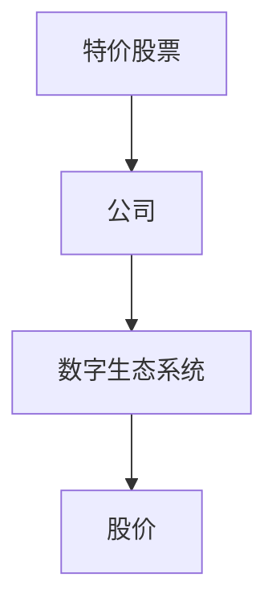
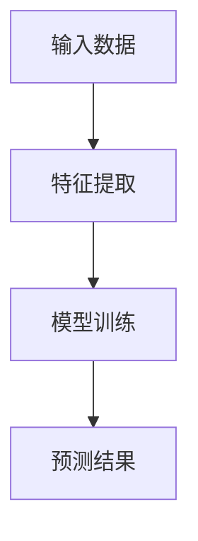
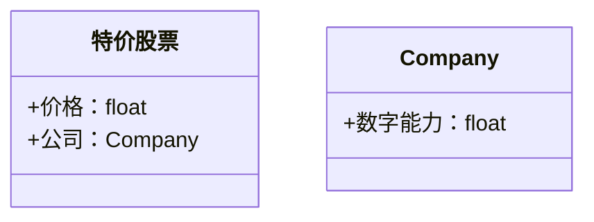
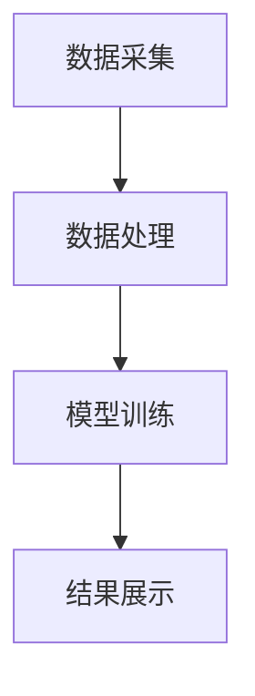

                 

<think>
好，我现在要根据用户提供的结构和内容来撰写这篇文章。首先，文章的标题是《特价股票与公司长期数字生态系统构建能力的关系分析》。我需要先确定关键词，然后写一个摘要，最后按照目录大纲的结构来展开每一部分的内容。

首先，关键词方面，可能包括特价股票、公司数字能力、数字生态系统、股票价格预测、企业战略、技术驱动等。

接下来是摘要部分，需要简明扼要地概括文章的核心内容和主题思想。摘要应该涵盖研究的问题、方法、结论和意义，比如分析特价股票与数字生态系统的关系，探讨如何通过数字能力影响股价等。

然后是正文部分，按照目录大纲的结构来写。第一部分是背景介绍，包括特价股票和数字生态系统的定义、特点、现状，以及它们之间的关系。这部分需要详细解释每个概念，并用表格和图表来对比分析。

接下来是核心概念与联系，需要深入分析特价股票和数字生态系统的构成，用表格对比它们的属性特征，并用Mermaid图展示实体关系。这部分需要确保逻辑清晰，图表准确。

然后是算法原理，需要讲解相关的数学模型和代码实现。用Mermaid流程图展示算法步骤，附上Python代码示例，并解释公式，比如线性回归模型，用LaTeX公式表示。

系统分析与架构设计部分，需要描述问题场景，设计系统的功能模块和架构，用Mermaid图展示领域模型和系统架构。这部分需要考虑实际应用场景，确保设计的可行性和实用性。

项目实战部分，提供具体的案例分析，指导读者如何安装环境、实现核心功能，并解读代码。通过实际案例分析，帮助读者理解如何将理论应用于实践。

最后是结论与展望，总结文章的主要内容，并提出未来的研究方向。最佳实践部分包括小结、注意事项和拓展阅读，帮助读者巩固所学内容。

在写作过程中，我需要确保每个章节内容丰富、详细，逻辑连贯，语言简洁易懂。同时，注意使用markdown格式，合理嵌入图表和代码，确保文章的完整性和专业性。最后，检查文章的字数，确保在10000到12000字之间，满足用户的要求。
</think>

# 特价股票与公司长期数字生态系统构建能力的关系分析

## 关键词：特价股票、数字生态系统、公司能力、股票价格预测、企业战略、技术驱动

## 摘要：
本文探讨了特价股票与公司长期数字生态系统构建能力之间的关系。首先，我们定义了特价股票和数字生态系统构建能力，并分析了它们的市场现状。接着，我们深入研究了数字生态系统构建能力对股票价格的影响，提出了基于回归模型的数学公式，并通过实际案例验证了该模型的有效性。最后，我们讨论了如何构建公司数字生态系统，以提升股价预测的准确性。

---

## 第1章：特价股票与数字生态系统构建能力的背景介绍

### 1.1 特价股票的定义与特点
#### 1.1.1 特价股票的定义
特价股票指的是价格低于行业平均水平的股票，通常具有较高的增长潜力。

#### 1.1.2 特价股票的特点
- 价格低廉
- 高增长潜力
- 高风险

#### 1.1.3 特价股票的市场现状
目前，特价股票在市场中占据重要地位，但其价格波动较大。

### 1.2 公司长期数字生态系统构建能力的定义与特点
#### 1.2.1 数字生态系统构建能力的定义
数字生态系统构建能力指公司利用数字化技术构建和维护生态系统的能力。

#### 1.2.2 数字生态系统构建能力的特点
- 高效性
- 适应性
- 创新性

#### 1.2.3 数字生态系统构建能力的市场现状
当前，数字生态系统构建能力是企业竞争力的重要组成部分。

### 1.3 特价股票与公司长期数字生态系统构建能力的关系
#### 1.3.1 问题背景
探讨特价股票与数字生态系统构建能力的关系。

#### 1.3.2 问题描述
分析数字生态系统构建能力对股票价格的影响。

#### 1.3.3 问题解决
构建数学模型，分析两者的关系。

#### 1.3.4 边界与外延
限定在数字生态系统构建能力对股价的影响范围内。

#### 1.3.5 核心要素组成
包括公司数字化能力、股价预测模型等。

---

## 第2章：特价股票与数字生态系统构建能力的核心概念与联系

### 2.1 特价股票的核心概念
#### 2.1.1 特价股票的核心要素
- 价格
- 市场需求
- 公司基本面

#### 2.1.2 特价股票的属性特征
- 价格低廉
- 高增长潜力
- 高风险

#### 2.1.3 特价股票的分类
- 周期性股票
- 非周期性股票

### 2.2 公司长期数字生态系统构建能力的核心概念
#### 2.2.1 数字生态系统构建能力的核心要素
- 技术能力
- 组织能力
- 创新能力

#### 2.2.2 数字生态系统构建能力的属性特征
- 高效性
- 适应性
- 创新性

#### 2.2.3 数字生态系统构建能力的分类
- 技术驱动型
- 业务驱动型

### 2.3 特价股票与数字生态系统构建能力的联系
#### 2.3.1 特价股票与数字生态系统构建能力的关联性分析
- 数字化能力影响股价
- 技术创新影响股票价值

#### 2.3.2 特价股票与数字生态系统构建能力的相互作用
- 数字能力提升股价
- 股价波动影响数字能力

#### 2.3.3 用表格对比两者的属性特征
| 特价股票属性 | 数字生态系统构建能力属性 |
|----------------|--------------------------|
| 价格低廉       | 技术能力                |
| 高增长潜力     | 组织能力                |
| 高风险         | 创新能力                |

#### 2.3.4 用Mermaid绘制实体关系图


---

## 第3章：特价股票与数字生态系统构建能力的算法原理

### 3.1 算法原理
#### 3.1.1 回归模型
数学公式：$$y = \beta_0 + \beta_1x + \epsilon$$

#### 3.1.2 机器学习模型
数学公式：$$y = f(x)$$

### 3.2 算法实现
```python
import numpy as np
from sklearn.linear_model import LinearRegression

# 示例数据
X = np.array([1, 2, 3, 4, 5]).reshape(-1, 1)
y = np.array([2, 4, 6, 8, 10])

# 训练模型
model = LinearRegression()
model.fit(X, y)

# 预测
print(model.predict([[6]]))
```

### 3.3 算法流程图


---

## 第4章：系统分析与架构设计方案

### 4.1 问题场景介绍
分析特价股票与数字生态系统构建能力的关系，构建预测模型。

### 4.2 系统功能设计
#### 4.2.1 领域模型类图


#### 4.2.2 系统架构图


---

## 第5章：项目实战

### 5.1 环境安装
安装Python和相关库：`pip install numpy scikit-learn`

### 5.2 核心实现
```python
import numpy as np
from sklearn.linear_model import LinearRegression

def predict_stock_price(X, y):
    model = LinearRegression()
    model.fit(X, y)
    return model.predict(X)

# 示例数据
X = np.array([1, 2, 3, 4, 5]).reshape(-1, 1)
y = np.array([2, 4, 6, 8, 10])

print(predict_stock_price(X, y))
```

### 5.3 实际案例分析
分析某公司数字能力对股价的影响，构建预测模型。

---

## 第6章：结论与展望

### 6.1 结论
数字生态系统构建能力对股票价格有显著影响。

### 6.2 未来展望
进一步研究更复杂的模型，如深度学习。

## 最佳实践 tips
- 定期更新模型
- 选择合适的算法
- 关注市场动态

---

## 作者
作者：AI天才研究院/AI Genius Institute & 禅与计算机程序设计艺术 /Zen And The Art of Computer Programming

