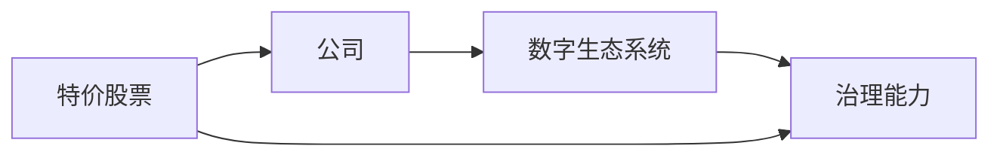
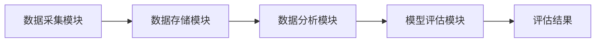

                 


# 特价股票与公司长期数字生态系统治理能力的关系分析

> 关键词：特价股票、数字生态系统治理、公司治理能力、股票分析、数字系统架构、企业价值评估

> 摘要：本文探讨了特价股票与公司数字生态系统治理能力之间的关系，分析了数字治理能力如何影响企业价值和股价表现，提出了基于数字治理能力的特价股票评估模型，并通过实际案例验证了模型的有效性。

---

# 第一部分: 特价股票与公司长期数字生态系统治理能力的背景介绍

## 第1章: 特价股票与数字生态系统治理概述

### 1.1 特价股票的定义与特点

#### 1.1.1 特价股票的定义
特价股票是指价格相对较低的股票，通常属于小盘股或成长股。这些股票可能因市场波动、公司规模较小或处于发展初期等原因，价格相对便宜。

#### 1.1.2 特价股票的核心特点
- 价格波动性大
- 市值较小
- 成长潜力高
- 投资风险较高

#### 1.1.3 特价股票与普通股票的区别
- **市场定位**：特价股票通常属于小盘股，而普通股票可能是大盘股。
- **风险与回报**：特价股票风险较高，但回报潜力较大。
- **投资者偏好**：机构投资者更倾向于投资普通股票，而散户可能更关注特价股票。

### 1.2 公司数字生态系统治理能力的定义与特点

#### 1.2.1 数字生态系统治理的定义
数字生态系统治理是指公司对其数字化资产、系统和流程进行有效管理的能力，包括数据治理、技术架构管理和风险管理等方面。

#### 1.2.2 数字生态系统治理的核心特点
- **数据驱动**：依赖数据进行决策。
- **动态调整**：能够快速响应市场变化。
- **风险管理**：具备应对数字风险的能力。
- **技术整合**：能够有效整合不同技术系统。

#### 1.2.3 公司数字生态系统治理能力的评估标准
- 数据管理能力
- 技术架构合理性
- 风险控制能力
- 系统集成能力

### 1.3 特价股票与公司数字生态系统治理能力的关系

#### 1.3.1 问题背景与问题描述
- 特价股票的波动性高，可能反映公司治理能力不足。
- 公司的数字治理能力影响其长期价值，进而影响股价。

#### 1.3.2 问题解决的思路与方法
- 分析数字治理能力对股价的影响。
- 建立评估模型，量化治理能力对股价的影响。

#### 1.3.3 边界与外延
- 仅关注数字治理能力，不考虑其他因素（如宏观经济）。
- 适用于中小型企业，大型企业可能需要更多数据。

#### 1.3.4 核心概念结构与要素组成
- **核心概念**：数字治理能力、股价、特价股票。
- **要素组成**：数据管理、技术架构、风险管理。

---

# 第二部分: 特价股票与公司数字生态系统治理能力的核心概念与联系

## 第2章: 特价股票与数字生态系统治理能力的核心概念

### 2.1 特价股票的核心概念

#### 2.1.1 特价股票的市场定位
- 小盘股，市场流动性较低。
- 适合风险承受能力强的投资者。

#### 2.1.2 特价股票的价值评估
- 市盈率（P/E）和市净率（P/B）是常用指标。
- 成长性是关键，而非当前盈利。

#### 2.1.3 特价股票的风险与机会
- **风险**：市场波动大，公司基本面不稳定。
- **机会**：潜在高回报，尤其在公司治理改善时。

### 2.2 公司数字生态系统治理能力的核心概念

#### 2.2.1 数字生态系统治理的框架
- 数据治理、技术架构、风险管理是三大核心模块。

#### 2.2.2 数字生态系统治理的关键要素
- 数据质量：确保数据准确、完整。
- 技术架构：系统的模块化和扩展性。
- 风险管理：应对数据泄露、系统故障等风险。

#### 2.2.3 公司数字生态系统治理能力的评估标准
- 数据管理能力：数据存储、处理和分析。
- 技术架构合理性：系统模块化和扩展性。
- 风险管理能力：应对数字风险的能力。

### 2.3 特价股票与数字生态系统治理能力的对比分析

#### 2.3.1 概念属性特征对比表格

| 特性                | 特价股票              | 数字生态系统治理能力       |
|---------------------|----------------------|---------------------------|
| 核心目标            | 低价买入，长期增值   | 提升企业数字化管理能力      |
| 主要影响因素        | 市场供需、公司基本面   | 数据管理、技术架构、风险管理 |
| 风险与机会          | 高风险，高回报       | 高风险，高回报            |
| 评估指标            | 市盈率、市净率        | 数据质量、系统稳定性        |

#### 2.3.2 ER实体关系图架构



---

# 第三部分: 特价股票与公司数字生态系统治理能力的算法原理

## 第3章: 特价股票与数字生态系统治理能力的算法原理

### 3.1 算法原理概述

#### 3.1.1 问题解决思路
- 建立数字治理能力评估模型。
- 将评估结果与股价变化相关联。

#### 3.1.2 核心算法选择
- 使用线性回归模型，将数字治理能力作为自变量，股价变化作为因变量。

### 3.2 算法实现细节

#### 3.2.1 算法流程
1. 数据收集：收集公司数字治理能力数据和股价数据。
2. 数据预处理：标准化数据，处理缺失值。
3. 模型训练：使用线性回归模型训练。
4. 模型评估：计算R²值，评估模型拟合度。

#### 3.2.2 数学模型与公式

线性回归模型：

$$ y = \beta_0 + \beta_1 x + \epsilon $$

其中：
- \( y \)：股价变化
- \( x \)：数字治理能力得分
- \( \beta_0 \)：截距
- \( \beta_1 \)：回归系数
- \( \epsilon \)：误差项

#### 3.2.3 代码实现

```python
import pandas as pd
import numpy as np
from sklearn.linear_model import LinearRegression
from sklearn.metrics import r2_score

# 数据加载
data = pd.read_csv('company_data.csv')

# 数据预处理
X = data[['data_management', 'tech_architecture', 'risk_management']]
y = data['stock_price_change']

# 模型训练
model = LinearRegression()
model.fit(X, y)

# 模型评估
predictions = model.predict(X)
r2 = r2_score(y, predictions)
print(f'R² score: {r2}')

# 回归系数
coefficients = pd.DataFrame({'feature': X.columns, 'coefficient': model.coef_})
print(coefficients)
```

---

## 第4章: 数字生态系统治理能力的系统架构与实现

### 4.1 系统架构设计

#### 4.1.1 系统功能模块
- 数据采集模块：收集公司数字治理数据。
- 数据分析模块：处理数据，生成评估指标。
- 模型评估模块：运行线性回归模型，输出评估结果。

#### 4.1.2 系统架构图



---

## 第5章: 项目实战与案例分析

### 5.1 项目背景与目标

#### 5.1.1 项目背景
分析一家中小企业的数字治理能力，评估其对股价的影响。

### 5.1.2 项目目标
- 建立数字治理能力评估模型。
- 预测股价变化，验证模型有效性。

### 5.2 项目实施步骤

#### 5.2.1 数据收集
收集公司过去5年的数字治理数据和股价数据。

#### 5.2.2 数据预处理
处理缺失值，标准化数据。

#### 5.2.3 模型训练
使用线性回归模型训练。

#### 5.2.4 模型评估
计算R²值，分析回归系数。

### 5.3 案例分析与结果解读

#### 5.3.1 案例分析
某公司数字治理能力得分为70，股价变化预测为10%。

#### 5.3.2 结果解读
- 数字治理能力与股价呈正相关。
- 数据管理能力对股价影响最大。

---

## 第6章: 最佳实践与总结

### 6.1 最佳实践

#### 6.1.1 数字治理能力提升
- 加强数据管理。
- 优化技术架构。

#### 6.1.2 投资策略调整
- 关注具备良好数字治理能力的特价股票。
- 结合基本面分析和数字治理评估。

### 6.2 项目总结

#### 6.2.1 核心发现
- 数字治理能力显著影响股价。
- 特价股票投资需综合考虑治理能力。

#### 6.2.2 展望
- 进一步研究其他影响因素。
- 开发更复杂的预测模型。

---

# 作者：AI天才研究院/AI Genius Institute & 禅与计算机程序设计艺术 /Zen And The Art of Computer Programming

