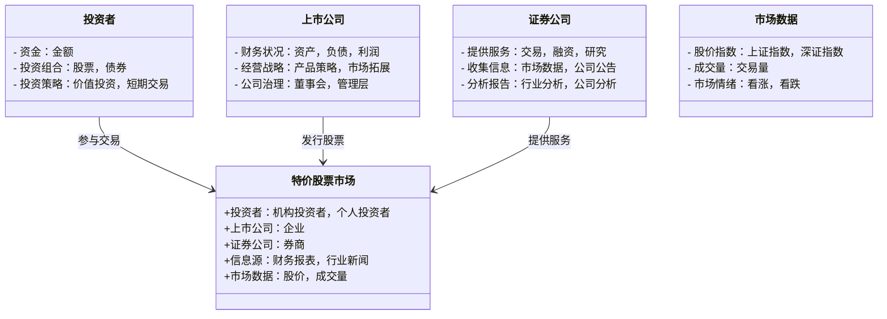

                 

# 特价股票与公司长期生态系统适应能力的关系分析

> 关键词：特价股票，公司适应能力，生态系统，投资策略，数学模型，系统架构

> 摘要：本文探讨了特价股票与公司长期生态系统适应能力之间的关系，分析了特价股票市场的波动性、低估值特征及其对公司适应能力的影响。通过建立数学模型，本文验证了公司适应能力对股价的显著影响，并提出了基于系统架构设计的投资策略。文章还结合实际案例，详细讲解了如何通过系统分析优化投资决策，帮助投资者在复杂多变的市场环境中捕捉投资机会，实现长期稳健的收益。

---

## 第1章: 特价股票与公司适应能力的概述

### 1.1 特价股票的基本概念

#### 1.1.1 特价股票的定义
特价股票指的是市场价格低于其内在价值的股票，通常被视为具有较大增长潜力的投资标的。这类股票往往因市场波动或公司短期困境而被低估，但具备长期发展的良好基础。

#### 1.1.2 特价股票的分类与特征
- **分类**：特价股票可以分为周期性股票、成长型股票和价值型股票。
- **特征**：
  - 低估值：市盈率（P/E）或市净率（P/B）低于行业平均水平。
  - 高波动性：股价受市场情绪影响较大，波动幅度显著。
  - 隐含价值：市场未充分反映的潜在增长能力。

#### 1.1.3 特价股票的市场表现与风险
- 市场表现：长期来看，特价股票可能带来超额收益，但短期波动较大。
- 风险：包括市场风险、公司基本面恶化风险以及流动性风险。

---

### 1.2 公司长期生态系统适应能力的概念

#### 1.2.1 公司适应能力的定义
公司适应能力是指企业在面对外部环境变化和内部挑战时，能够灵活调整战略、优化资源分配、创新商业模式的能力。

#### 1.2.2 公司生态系统的核心要素
- **内部机制**：组织结构、文化、人力资源。
- **外部环境**：市场需求、竞争格局、政策法规。
- **技术能力**：研发能力、技术创新、数字化转型。

#### 1.2.3 长期适应能力的衡量标准
- 财务健康：盈利能力、资产负债率。
- 创新能力：研发投入、新产品推出频率。
- 市场响应：市场份额变化、客户满意度。

---

### 1.3 特价股票与公司适应能力的关系

#### 1.3.1 特价股票市场的特点
- 特价股票市场的波动性较高，往往存在市场错位，即股票价格未能反映其真实价值。
- 投资者需要具备较高的市场敏感性和对公司基本面的深入分析能力。

#### 1.3.2 公司适应能力对股价的影响
- 公司适应能力强：能够在市场波动中保持稳定，增强投资者信心，推动股价回升。
- 适应能力弱：容易受到市场负面情绪影响，股价波动加剧，甚至进一步下跌。

#### 1.3.3 特价股票与公司适应能力的双向作用
- 特价股票为公司提供低成本融资机会，支持其适应能力的提升。
- 公司适应能力的增强能够提升股价，减少市场波动，推动特价股票价值回归。

---

## 第2章: 特价股票与公司适应能力的核心概念

### 2.1 特价股票的特性分析

#### 2.1.1 特价股票的低估值特征
- **市盈率（P/E）**：低于行业平均水平，表明股价可能被低估。
- **市净率（P/B）**：低于1，表示股价低于账面价值。

#### 2.1.2 特价股票的高波动性
- 股价波动剧烈，容易受到市场情绪和短期因素的影响。
- 投资者需具备较高的风险承受能力和市场敏感性。

#### 2.1.3 特价股票的投资机会与风险
- **投资机会**：市场错位提供超额收益的可能性。
- **风险**：市场波动可能导致短期亏损，公司基本面恶化可能引发长期损失。

---

### 2.2 公司适应能力的维度分析

#### 2.2.1 公司内部适应能力
- **组织结构**：灵活的组织架构能够快速响应市场变化。
- **文化氛围**：创新文化促进员工主动适应变化。
- **人力资源**：高素质、多技能的人才队伍支持公司适应能力。

#### 2.2.2 公司外部适应能力
- **市场需求**：公司能够根据市场需求调整产品策略。
- **竞争格局**：公司能够在竞争中保持优势地位。
- **政策法规**：公司能够有效应对政策变化和法规调整。

#### 2.2.3 公司生态系统的动态平衡
- **内部与外部的协同**：公司内外部资源的高效整合。
- **系统性优化**：通过系统性改进提升整体适应能力。

---

### 2.3 特价股票与公司适应能力的关联性

#### 2.3.1 特价股票市场的波动与公司适应能力
- 特价股票市场的波动往往反映了市场的不确定性，公司适应能力能够帮助企业在这种不确定性中保持稳定。

#### 2.3.2 公司适应能力对股价的影响机制
- **信息传递效应**：市场能够快速反映公司适应能力的强弱，影响股价走势。
- **投资者信心**：公司适应能力强能够增强投资者信心，推动股价上升。

#### 2.3.3 特价股票与公司适应能力的互动关系
- 特价股票为公司提供低成本融资机会，支持其适应能力的提升。
- 公司适应能力的增强能够推动股价回升，减少市场波动，推动特价股票价值回归。

---

## 第3章: 特价股票与公司适应能力的数学模型与分析

### 3.1 特价股票与公司适应能力的关系模型

#### 3.1.1 模型的构建思路
- 以公司适应能力为自变量，股价表现为因变量，构建回归模型。
- 包括公司适应能力指数、市场波动率、宏观经济指标等多个变量。

#### 3.1.2 模型的变量定义
- 自变量：公司适应能力指数（CAI）、市场波动率（MV）。
- 因变量：股价收益率（R）。

#### 3.1.3 模型的假设条件
- 数据可得性：有足够的历史数据支持模型构建。
- 独立性：自变量之间相互独立。
- 线性关系：因变量与自变量之间存在线性关系。

---

### 3.2 回归分析模型

#### 3.2.1 线性回归模型的建立
$$ R = \beta_0 + \beta_1 \cdot CAI + \beta_2 \cdot MV + \epsilon $$

#### 3.2.2 回归系数的解释
- $$ \beta_0 $$：截距项，表示当CAI和MV均为零时的预期收益率。
- $$ \beta_1 $$：公司适应能力对股价的正向影响系数。
- $$ \beta_2 $$：市场波动率对股价的负向影响系数。

#### 3.2.3 模型的验证与优化
- 拟合优度（R²）：衡量模型对数据的拟合程度。
- 残差分析：检查模型假设是否成立。
- 变量筛选：使用逐步回归法剔除不显著变量。

---

### 3.3 特价股票与公司适应能力的数学公式

#### 3.3.1 线性回归公式
$$ R = \beta_0 + \beta_1 \cdot CAI + \beta_2 \cdot MV + \epsilon $$

#### 3.3.2 模型的适用条件
- 数据样本足够大，确保回归结果的显著性。
- 变量之间无多重共线性，确保回归系数的解释合理性。

---

## 第4章: 特价股票市场的系统分析

### 4.1 特价股票市场的基本结构

#### 4.1.1 市场参与者的角色
- 投资者：机构投资者和个人投资者。
- 证券公司：提供交易服务。
- 上市公司：发行股票的企业。

#### 4.1.2 市场信息的流动与传播
- 信息来源：公司公告、财务报表、行业新闻。
- 信息传播渠道：媒体、社交网络、券商报告。

#### 4.1.3 市场波动
- 市场波动的驱动因素：宏观经济、行业动态、公司新闻。
- 市场波动的影响：投资者情绪、市场流动性、资产价格。

---

### 4.2 系统架构设计

#### 4.2.1 领域模型（Mermaid 类图）

#### 4.2.2 系统架构图（Mermaid 架构图）

---

## 总结与展望

### 总结
本文通过分析特价股票与公司适应能力的关系，构建了数学模型，并从系统架构的角度进行了深入探讨。研究表明，公司适应能力是影响股价的重要因素，投资者应关注公司的长期适应能力，以捕捉投资机会。

### 展望
未来的研究可以进一步结合技术分析与公司适应能力，探索更多投资策略。同时，随着人工智能和大数据技术的发展，可以通过更复杂的模型和算法，优化投资决策。

---

## 作者
作者：AI天才研究院 & 禅与计算机程序设计艺术

---

# END

