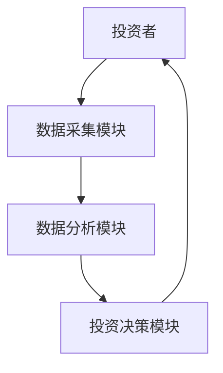

                 

# 特价股票与公司长期竞争优势的关联性

**关键词**：特价股票、长期竞争优势、投资策略、量化分析、财务指标

**摘要**：  
本文深入探讨了特价股票与公司长期竞争优势之间的关联性，分析了长期竞争优势的来源及其对股价的影响，提出了量化分析方法和投资策略。通过案例分析和系统设计，帮助投资者识别具有长期竞争优势的特价股票，制定有效的投资计划，并通过风险管理确保投资收益。

---

## 第1章 特价股票与公司长期竞争优势的概述

### 1.1 特价股票的定义与特征

#### 1.1.1 特价股票的定义  
特价股票是指市场价格低于其内在价值的股票。通常表现为市盈率（P/E）或市净率（P/B）低于行业平均水平或历史平均水平。

#### 1.1.2 特价股票的特征  
- 价格低估：市场价格低于内在价值。  
- 高分红率：部分特价股票公司具有较高的股息支付率。  
- 低波动性：相对于市场整体波动，特价股票的波动性较低。  

#### 1.1.3 特价股票与普通股票的区别  
| 属性       | 特价股票       | 普通股票       |
|------------|----------------|----------------|
| 价格       | 低于内在价值   | 接近或高于内在价值 |
| 风险       | 较低           | 较高           |
| 投资策略   | 长期持有       | 短期交易       |

### 1.2 长期竞争优势的定义与分类

#### 1.2.1 长期竞争优势的定义  
长期竞争优势是指公司在行业内持续保持竞争优势的能力，通常表现为成本优势、技术领先、市场占有率高等。

#### 1.2.2 长期竞争优势的分类  
- 成本优势：公司具有更低的生产成本。  
- 技术优势：公司在技术开发上具有领先地位。  
- 市场优势：公司占据较大的市场份额。  
- 资源优势：公司拥有独特的资源储备。  

### 1.3 特价股票与长期竞争优势的关联性

#### 1.3.1 特价股票与长期竞争优势的关系  
- 特价股票通常出现在具有长期竞争优势的公司中，因为这些公司能够维持稳定的盈利和增长。  
- 长期竞争优势是支撑股价长期上涨的核心因素，而特价股票则是投资者买入的良机。  

#### 1.3.2 特价股票如何反映公司的长期竞争优势  
- 公司的长期竞争优势通过财务指标（如ROE、毛利率）和市场表现（如市场份额）体现。  
- 特价股票的出现通常是因为市场对公司的长期竞争优势认识不足，导致股价被低估。  

---

## 第2章 公司长期竞争优势的来源与分析

### 2.1 长期竞争优势的核心要素

#### 2.1.1 市场地位  
市场地位是公司长期竞争优势的核心要素之一，包括市场份额、品牌影响力等。  

#### 2.1.2 资源优势  
资源优势包括原材料供应、人力资源等，能够降低公司成本，提高竞争力。  

#### 2.1.3 技术创新  
技术创新是公司保持长期竞争优势的重要手段，能够推动产品升级和市场拓展。  

#### 2.1.4 成本优势  
成本优势是公司能够在价格竞争中占据优势，同时保持盈利能力。  

#### 2.1.5 组织能力  
高效的组织能力能够确保公司战略的有效执行，提升运营效率。  

### 2.2 长期竞争优势的评估方法

#### 2.2.1 财务指标分析  
常用的财务指标包括：  
- 净利润率（Net Profit Margin）  
- 资产回报率（ROA）  
- 股东权益回报率（ROE）  

#### 2.2.2 市场分析  
分析公司的市场地位、竞争对手和行业趋势。  

#### 2.2.3 竞争对手分析  
通过比较竞争对手的财务数据和市场表现，评估公司的竞争优势。  

#### 2.2.4 行业趋势分析  
分析行业的发展趋势，判断公司长期竞争优势的可持续性。  

### 2.3 长期竞争优势的动态变化

#### 2.3.1 行业环境的变化对竞争优势的影响  
行业政策、技术变革等因素会影响公司的长期竞争优势。  

#### 2.3.2 公司内部因素对竞争优势的影响  
公司内部管理、研发投入等因素直接影响竞争优势的强弱。  

#### 2.3.3 竞争优势的可持续性分析  
评估公司竞争优势的持续时间，判断其是否能够长期保持。  

---

## 第3章 特价股票的量化分析与投资策略

### 3.1 特价股票的量化指标

#### 3.1.1 市盈率（P/E）分析  
市盈率 = 股价 / 每股净利润  

#### 3.1.2 市净率（P/B）分析  
市净率 = 股价 / 每股净资产  

#### 3.1.3 股息率分析  
股息率 = 每股股息 / 股价  

### 3.2 长期竞争优势的量化评估

#### 3.2.1 财务健康状况分析  
评估公司的盈利能力、资产负债情况和现金流状况。  

#### 3.2.2 资产质量分析  
分析公司的固定资产、无形资产等的质量和价值。  

#### 3.2.3 盈利能力分析  
通过净利率、毛利率等指标评估公司的盈利能力。  

#### 3.2.4 市场占有率分析  
通过市场份额数据评估公司在行业中的地位。  

### 3.3 特价股票与长期竞争优势的量化关联

#### 3.3.1 量化模型的构建  
- 选取财务指标和市场指标，构建量化评估模型。  
- 通过回归分析等方法，评估长期竞争优势对股价的影响。  

#### 3.3.2 数据分析与实证研究  
- 收集历史数据，进行实证分析。  
- 验证长期竞争优势对股价的推动作用。  

#### 3.3.3 模型的验证与优化  
- 通过实证结果优化模型。  
- 确保模型能够准确预测股价走势。  

---

## 第4章 特价股票投资的系统设计与实战

### 4.1 投资目标与策略制定

#### 4.1.1 投资目标的设定  
明确投资目标，如追求稳定收益或资本增值。  

#### 4.1.2 投资策略的选择  
根据市场环境和个人风险承受能力选择投资策略。  

#### 4.1.3 风险管理与收益平衡  
设置止损点，合理分配资金比例，平衡风险与收益。  

### 4.2 数据收集与分析系统

#### 4.2.1 数据来源与收集方法  
- 数据来源：股票市场数据、财务报表、行业报告等。  
- 数据收集工具：金融数据库、编程脚本等。  

#### 4.2.2 数据分析工具的选择  
- 使用Python进行数据分析，如Pandas、NumPy等库。  
- 使用Matplotlib或Seaborn进行可视化分析。  

### 4.3 系统架构设计

#### 4.3.1 问题场景介绍  
投资者需要通过量化分析识别具有长期竞争优势的特价股票。  

#### 4.3.2 系统功能设计  
- 数据采集模块：收集股票数据和财务数据。  
- 数据分析模块：计算估值指标，评估长期竞争优势。  
- 投资决策模块：生成投资建议和风险管理策略。  

#### 4.3.3 系统架构设计  

#### 4.3.4 系统接口设计  
- 数据接口：与金融数据库对接。  
- 用户界面：可视化界面供投资者查看分析结果。  

---

## 作者：AI天才研究院/AI Genius Institute & 禅与计算机程序设计艺术 /Zen And The Art of Computer Programming

---

通过以上内容，我们系统地分析了特价股票与公司长期竞争优势的关联性，从理论到实践，为投资者提供了科学的投资策略和方法。希望本文能为投资者在识别特价股票和评估公司长期竞争优势方面提供有价值的参考。

