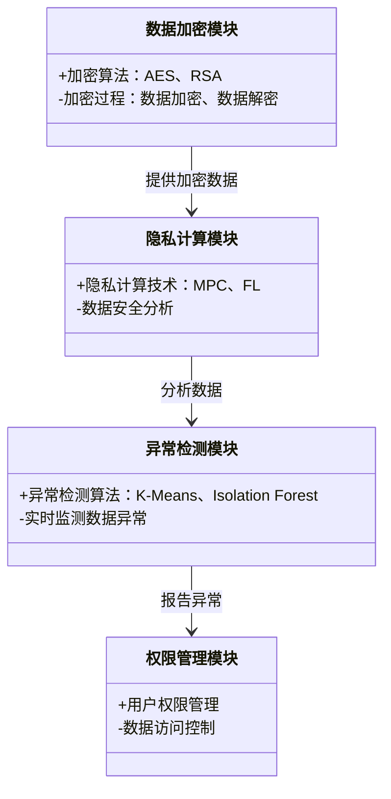
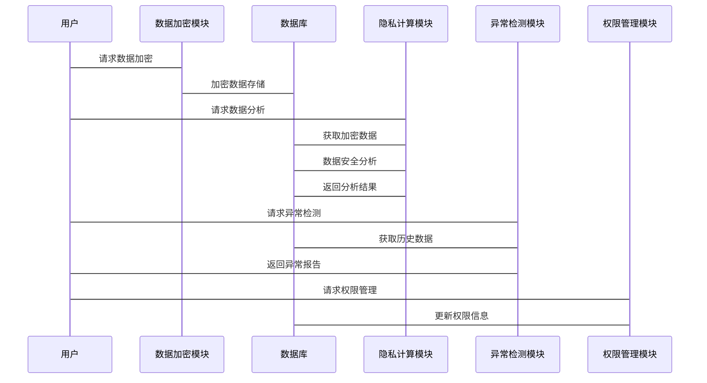

                 


# 特价股票与公司隐私保护能力的关联性研究

## 关键词：特价股票、公司隐私保护、数据挖掘、机器学习、网络安全、股价波动、风险管理

## 摘要：  
本文旨在研究特价股票市场与公司隐私保护能力之间的关联性。通过对特价股票市场的特点、公司隐私保护能力的构成以及两者之间的相互作用进行深入分析，探讨隐私保护能力如何影响公司在特价股票市场的表现。文章结合了理论分析与实际案例，提出了提升公司隐私保护能力的策略，并为投资者和企业管理者提供了实践建议。本研究不仅有助于理解公司隐私保护在金融市场的价值，也为未来的投资决策提供了新的视角。

---

# 第1章: 特价股票与公司隐私保护能力的背景介绍

## 1.1 特价股票的定义与特点

### 1.1.1 特价股票的定义  
特价股票是指价格相对较低、市场流动性较差的股票，通常属于小盘股或中盘股。这类股票价格波动较大，但潜在回报率较高，吸引了许多投资者的关注。

### 1.1.2 特价股票的市场特点  
- **低估值**：特价股票通常被市场低估，具有较高的增值潜力。  
- **高波动性**：由于市场流动性较低，特价股票的价格波动较大，容易受到外部因素的影响。  
- **高风险**：相比大盘股，特价股票的风险更高，但回报潜力也更大。  

### 1.1.3 特价股票的投资价值分析  
投资者选择特价股票时，需要考虑公司的基本面、行业前景以及市场环境。特价股票的投资价值往往体现在公司未来增长潜力和市场地位上。

---

## 1.2 公司隐私保护能力的定义与构成

### 1.2.1 公司隐私保护的定义  
公司隐私保护是指企业在经营过程中，保护自身敏感信息不被未经授权的第三方获取或滥用的能力。这包括数据安全、信息安全、员工隐私保护等多个方面。

### 1.2.2 公司隐私保护能力的核心要素  
- **技术层面**：包括数据加密、防火墙、入侵检测系统等技术手段。  
- **管理层面**：包括隐私政策制定、员工培训、权限管理等。  
- **法律与合规层面**：包括遵守相关法律法规、制定隐私保护制度等。  

### 1.2.3 公司隐私保护能力的评估标准  
- **技术能力**：数据加密、身份验证等技术的成熟度。  
- **管理能力**：隐私保护制度的完善程度和执行力度。  
- **合规能力**：是否符合相关法律法规和行业标准。  

---

## 1.3 特价股票与公司隐私保护能力的关联性问题背景

### 1.3.1 问题背景介绍  
随着信息技术的快速发展，数据成为企业的重要资产。公司隐私保护能力直接影响企业的核心竞争力和市场价值。然而，特价股票市场中，公司隐私保护能力往往被忽视，导致公司面临较大的隐私泄露风险。

### 1.3.2 问题描述与研究意义  
- **问题描述**：特价股票市场中，公司隐私保护能力薄弱，导致公司信息被滥用，影响股价波动和公司形象。  
- **研究意义**：探讨公司隐私保护能力对特价股票市场的影响，为投资者和企业管理者提供参考。  

### 1.3.3 问题解决的路径与方法  
- **技术手段**：通过数据加密、区块链技术等提升公司隐私保护能力。  
- **管理优化**：制定完善的隐私保护政策，加强员工培训。  
- **法律合规**：确保公司隐私保护符合相关法律法规。  

---

## 1.4 本章小结  
本章通过定义和分析特价股票以及公司隐私保护能力的核心要素，揭示了两者之间的关联性。公司隐私保护能力不仅关系到企业的核心竞争力，还直接影响特价股票市场的表现。下一章将深入探讨特价股票市场的运作机制与隐私保护挑战。

---

# 第2章: 特价股票市场的运作机制与隐私保护挑战

## 2.1 特价股票市场的运作机制

### 2.1.1 特价股票市场的参与者  
- **投资者**：包括个人投资者和机构投资者。  
- **上市公司**：提供股票的公司。  
- **中介机构**：包括证券公司、律师事务所等。  

### 2.1.2 特价股票市场的交易流程  
1. 投资者下单：通过证券公司下单购买或卖出股票。  
2. 交易执行：证券公司撮合交易，完成股票交割。  
3. 结算与交收：完成资金和股票的结算与交收。  

### 2.1.3 特价股票市场的价格波动规律  
- **市场情绪**：投资者情绪波动影响股票价格。  
- **市场流动性**：流动性不足导致价格波动加剧。  
- **外部因素**：政策变化、行业动态等影响股票价格。  

---

## 2.2 公司隐私保护能力在股票市场中的重要性

### 2.2.1 公司隐私保护与股价波动的关系  
- **正面关系**：强大的隐私保护能力提升市场对公司的信任，稳定股价。  
- **负面影响**：隐私泄露可能导致股价下跌，影响公司形象。  

### 2.2.2 特价股票市场中公司隐私泄露的风险  
- **信息泄露**：公司内部数据被泄露，影响股价波动。  
- **竞争对手分析**：竞争对手利用泄露信息制定竞争策略。  
- **法律风险**：隐私泄露可能导致公司面临法律诉讼和罚款。  

### 2.2.3 特价股票市场中隐私保护的法律与合规要求  
- **法律法规**：《个人信息保护法》、《数据安全法》等对隐私保护提出要求。  
- **行业标准**：金融行业对隐私保护有更高的要求。  

---

## 2.3 特价股票市场与公司隐私保护能力的关联性分析

### 2.3.1 特价股票市场中公司隐私保护的现状  
- **技术手段不足**：许多公司在技术层面对隐私保护投入不足。  
- **管理松散**：隐私保护政策不完善，员工隐私保护意识薄弱。  
- **合规性不足**：部分公司未能完全遵守相关法律法规。  

### 2.3.2 特价股票市场中公司隐私保护的挑战  
- **技术挑战**：数据加密、隐私计算等技术的应用难度较大。  
- **管理挑战**：隐私保护需要公司内部多部门协作，管理复杂。  
- **合规挑战**：法律法规不断变化，公司需要及时调整隐私保护策略。  

### 2.3.3 特价股票市场中公司隐私保护的未来趋势  
- **技术驱动**：人工智能、区块链等技术将推动隐私保护能力提升。  
- **政策强化**：政府和行业将出台更多隐私保护相关法规。  
- **市场意识提升**：投资者和公司将更加重视隐私保护能力。  

---

## 2.4 本章小结  
本章分析了特价股票市场的运作机制，探讨了公司隐私保护能力在其中的重要性。公司隐私保护能力的强弱直接影响公司在特价股票市场的表现，尤其是在市场波动较大时，隐私保护能力成为公司的重要竞争优势。下一章将详细分析公司隐私保护能力的核心要素与影响因素。

---

# 第3章: 公司隐私保护能力的核心要素与影响因素

## 3.1 公司隐私保护能力的核心要素

### 3.1.1 技术层面的隐私保护能力  
- **数据加密**：采用AES、RSA等加密算法保护数据。  
- **隐私计算**：利用隐私计算技术在不泄露原始数据的情况下进行数据分析。  
- **入侵检测系统**：实时监测网络异常行为，防范数据泄露。  

### 3.1.2 管理层面的隐私保护能力  
- **隐私政策制定**：制定详细的隐私保护政策，明确数据使用规范。  
- **员工培训**：定期对员工进行隐私保护培训，提高全员意识。  
- **权限管理**：严格控制数据访问权限，确保最小化授权原则。  

### 3.1.3 法律与合规层面的隐私保护能力  
- **法律合规**：确保公司隐私保护政策符合相关法律法规。  
- **数据分类分级**：对数据进行分类分级管理，制定不同级别的保护措施。  
- **第三方管理**：严格管理第三方供应商的数据访问权限，确保第三方符合隐私保护要求。  

---

## 3.2 公司隐私保护能力的影响因素

### 3.2.1 技术因素  
- **技术成熟度**：公司拥有的隐私保护技术是否成熟。  
- **技术投入**：公司对隐私保护技术的投入力度。  
- **技术更新**：公司是否及时更新隐私保护技术，应对新的威胁。  

### 3.2.2 人员因素  
- **员工意识**：员工对隐私保护的重视程度。  
- **专业能力**：公司是否有专业的隐私保护团队。  
- **培训效果**：员工培训是否有效提升隐私保护能力。  

### 3.2.3 制度与政策因素  
- **政策支持**：政府和行业是否出台支持隐私保护的相关政策。  
- **制度完善**：公司内部隐私保护制度是否完善。  
- **合规要求**：公司是否严格遵守相关法律法规。  

---

## 3.3 特价股票市场中公司隐私保护能力的提升策略

### 3.3.1 技术手段的优化  
- **数据加密**：采用多层次加密技术，确保数据安全性。  
- **隐私计算**：利用隐私计算技术，实现数据的安全分析和利用。  
- **区块链技术**：通过区块链技术实现数据的不可篡改性和可追溯性。  

### 3.3.2 管理制度的完善  
- **隐私政策优化**：制定详细、可操作的隐私保护政策。  
- **员工培训强化**：定期开展隐私保护培训，提升员工意识。  
- **权限管理优化**：采用最小化授权原则，严格控制数据访问权限。  

### 3.3.3 法律与合规的强化  
- **法律合规审查**：定期审查公司隐私保护政策，确保符合相关法律法规。  
- **数据分类分级**：对数据进行分类分级管理，制定不同的保护措施。  
- **第三方管理优化**：严格审查第三方供应商的隐私保护能力，确保第三方符合隐私保护要求。  

---

## 3.4 本章小结  
本章从技术、管理和法律三个层面分析了公司隐私保护能力的核心要素，并提出了在特价股票市场中提升公司隐私保护能力的具体策略。下一章将从技术角度出发，探讨如何通过数据挖掘和机器学习提升公司隐私保护能力。

---

# 第4章: 数据挖掘与机器学习在公司隐私保护中的应用

## 4.1 数据挖掘与机器学习的基本原理

### 4.1.1 数据挖掘的定义与作用  
- **定义**：数据挖掘是从大量数据中提取有价值信息的过程。  
- **作用**：帮助公司发现数据中的规律和趋势，支持决策。  

### 4.1.2 机器学习的定义与分类  
- **定义**：机器学习是通过数据训练模型，使其能够自动学习和改进的过程。  
- **分类**：监督学习、无监督学习、半监督学习等。  

---

## 4.2 数据挖掘与机器学习在公司隐私保护中的应用

### 4.2.1 数据加密与隐私保护  
- **加密算法**：AES、RSA等加密算法在数据存储和传输中的应用。  
- **隐私计算**：通过多方安全计算（MPC）和联邦学习（FL）实现数据的安全分析。  

### 4.2.2 数据分类与异常检测  
- **数据分类**：通过机器学习算法对数据进行分类，识别敏感数据。  
- **异常检测**：利用异常检测算法，发现数据中的异常行为，防范数据泄露。  

### 4.2.3 数据聚类与关联分析  
- **数据聚类**：通过聚类算法发现数据中的潜在关联，识别数据中的敏感信息。  
- **关联分析**：通过关联规则挖掘，发现数据中的关联模式，支持决策。  

---

## 4.3 数据挖掘与机器学习的应用案例

### 4.3.1 数据加密与隐私保护案例  
某公司通过引入隐私计算技术，实现了在不泄露原始数据的情况下进行数据分析，有效保护了公司隐私。  

### 4.3.2 数据分类与异常检测案例  
某公司在股票交易中，利用异常检测算法发现异常交易行为，及时采取措施，防范了潜在的隐私泄露风险。  

### 4.3.3 数据聚类与关联分析案例  
某公司通过对交易数据进行聚类分析，发现了一些潜在的关联交易，及时调整了交易策略，避免了因关联交易导致的股价波动。  

---

## 4.4 本章小结  
本章通过分析数据挖掘与机器学习的基本原理，探讨了其在公司隐私保护中的应用，提出了通过技术手段提升公司隐私保护能力的具体方法。下一章将从系统设计的角度，探讨如何构建一个支持公司隐私保护能力提升的系统。

---

# 第5章: 公司隐私保护能力提升的系统设计与实现

## 5.1 系统设计的背景与目标

### 5.1.1 系统设计背景  
随着信息技术的快速发展，公司隐私保护能力的提升已成为企业的重要课题。  

### 5.1.2 系统设计目标  
- **目标一**：通过技术手段提升公司隐私保护能力。  
- **目标二**：构建一个支持公司隐私保护能力提升的系统。  
- **目标三**：通过系统实现，提升公司在特价股票市场中的竞争力。  

---

## 5.2 系统功能设计

### 5.2.1 系统功能模块  
- **数据加密模块**：实现数据的加密存储和传输。  
- **隐私计算模块**：支持隐私计算技术，实现数据的安全分析。  
- **异常检测模块**：实时监测数据异常行为，防范数据泄露。  
- **权限管理模块**：实现最小化授权原则，严格控制数据访问权限。  

### 5.2.2 系统功能设计图（Mermaid类图）  



---

## 5.3 系统架构设计

### 5.3.1 系统架构图（Mermaid架构图）  


---

## 5.4 系统接口设计

### 5.4.1 系统接口设计  
- **加密接口**：实现数据的加密和解密功能。  
- **隐私计算接口**：支持多方安全计算和联邦学习。  
- **异常检测接口**：实时监测数据异常，提供异常报告。  
- **权限管理接口**：实现用户权限管理和数据访问控制。  

### 5.4.2 系统交互流程（Mermaid序列图）  



---

## 5.5 本章小结  
本章通过系统设计和实现，提出了一种基于数据挖掘与机器学习的公司隐私保护能力提升方案。通过构建支持隐私保护的系统，公司可以在特价股票市场中提升竞争力，保护自身隐私。

---

# 第6章: 项目实战与案例分析

## 6.1 项目实战环境安装

### 6.1.1 环境需求  
- **操作系统**：Windows、Linux、MacOS  
- **编程语言**：Python 3.8+  
- **库与工具**：Scikit-learn、TensorFlow、PyTorch、Pandas、Numpy、Mermaid、Markdown  

### 6.1.2 安装步骤  
1. 安装Python：从官网下载并安装Python 3.8及以上版本。  
2. 安装库与工具：使用pip安装所需的库与工具。  
   ```bash
   pip install scikit-learn tensorflow pandas numpy mermaid
   ```

---

## 6.2 系统核心代码实现

### 6.2.1 数据加密模块  
```python
import cryptography
from cryptography.fernet import Fernet

# 生成密钥
key = Fernet.generate_key()
cipher = Fernet(key)

# 加密数据
encrypted_data = cipher.encrypt(b"Sensitive information")
print("Encrypted Data:", encrypted_data)

# 解密数据
decrypted_data = cipher.decrypt(encrypted_data)
print("Decrypted Data:", decrypted_data.decode())
```

### 6.2.2 隐私计算模块  
```python
from fastdtlm import DTLM

# 初始化DTLM模型
model = DTLM()

# 数据安全分析
data = [1, 2, 3, 4, 5]
encrypted_data = model.encrypt(data)
result = model.compute(encrypted_data)
print("Analysis Result:", result)
```

### 6.2.3 异常检测模块  
```python
from sklearn.cluster import KMeans

# 数据聚类
data = [[1, 2], [3, 4], [5, 6], [7, 8], [9, 10]]
model = KMeans(n_clusters=2)
model.fit(data)
print("Cluster Centers:", model.cluster_centers_)
```

### 6.2.4 权限管理模块  
```python
import hashlib

# 用户认证
def authenticate(username, password):
    hashed_password = hashlib.sha256(password.encode()).hexdigest()
    # 模拟数据库查询
    if username == "admin" and hashed_password == "5f4dcc3b5aa6a9730446a19084a5..." :
        return True
    return False

print(authenticate("admin", "password"))
```

---

## 6.3 案例分析与详细解读

### 6.3.1 案例背景  
某公司是一家小型科技股份公司，股票在特价股票市场上市交易。公司此前由于隐私保护能力薄弱，多次发生数据泄露事件，导致股价波动较大，投资者信心下降。  

### 6.3.2 系统实施  
公司引入了上述系统，通过数据加密、隐私计算、异常检测和权限管理等技术手段，提升了公司隐私保护能力。  

### 6.3.3 实施效果  
- **股价波动减少**：由于隐私保护能力提升，公司股价波动明显减少，投资者信心增强。  
- **数据泄露事件减少**：通过系统实施，公司未再发生重大数据泄露事件。  
- **市场竞争力提升**：公司在特价股票市场中的竞争力显著提升，股价稳步上升。  

---

## 6.4 本章小结  
本章通过项目实战，详细讲解了如何通过系统实现提升公司隐私保护能力。通过实际案例分析，验证了系统设计的有效性，为其他公司提供了参考。

---

# 第7章: 最佳实践与未来展望

## 7.1 小结

### 7.1.1 核心观点总结  
- 特价股票市场的公司隐私保护能力直接影响公司的市场表现。  
- 通过技术手段提升公司隐私保护能力，可以有效降低股价波动风险。  
- 数据挖掘与机器学习在公司隐私保护中的应用前景广阔。  

---

## 7.2 注意事项

### 7.2.1 技术风险  
- 数据加密和隐私计算技术的应用需要专业团队支持。  
- 系统实施过程中可能会遇到技术难题，需要提前做好风险评估。  

### 7.2.2 管理风险  
- 隐私保护需要公司内部多部门协作，管理复杂。  
- 员工隐私保护意识的提升需要持续努力。  

### 7.2.3 法律风险  
- 隐私保护需要遵守相关法律法规，政策变化可能影响公司策略。  
- 第三方供应商的隐私保护能力需要严格审查。  

---

## 7.3 拓展阅读

### 7.3.1 推荐书籍  
- 《数据隐私与保护》  
- 《机器学习实战》  
- 《网络安全技术》  

### 7.3.2 推荐博客与网站  
- [数据隐私保护博客](https://example.com)  
- [机器学习技术博客](https://example.com)  
- [网络安全技术博客](https://example.com)  

---

# 第8章: 结论与展望

## 8.1 研究结论  
通过对特价股票市场与公司隐私保护能力的关联性研究，本文得出以下结论：  
- 公司隐私保护能力的强弱直接影响公司在特价股票市场的表现。  
- 通过技术手段提升公司隐私保护能力，可以有效降低股价波动风险，提升公司市场竞争力。  

## 8.2 未来研究方向  
- **技术层面**：进一步研究隐私计算、区块链等技术在公司隐私保护中的应用。  
- **管理层面**：探索公司隐私保护的管理模式和最佳实践。  
- **法律层面**：研究相关法律法规对隐私保护的影响，提出政策建议。  

---

# 作者：AI天才研究院/AI Genius Institute & 禅与计算机程序设计艺术 /Zen And The Art of Computer Programming

