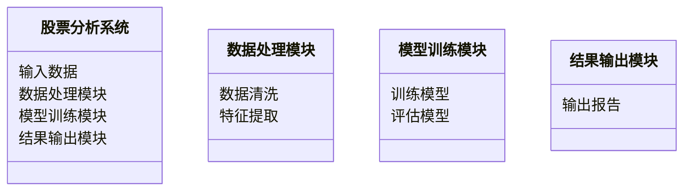
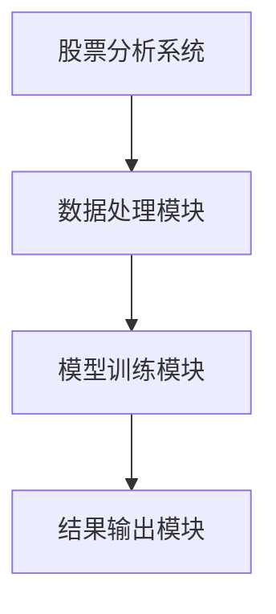

                 


---

# 特价股票与公司隐藏资产价值发现的方法

## 关键词：特价股票，公司隐藏资产，资产价值评估，量化投资，机器学习

## 摘要：  
本文深入探讨了如何利用技术手段发现公司隐藏资产，并通过这些资产的潜在价值来识别特价股票。文章从背景介绍、核心概念、算法原理、系统设计、项目实战和最佳实践等多方面展开，结合实际案例和数学模型，为投资者提供了一套系统的方法论，帮助他们在投资决策中发现隐藏资产的价值，提升投资回报。

---

## 第1章: 特价股票与公司隐藏资产概述

### 1.1 特价股票的基本概念  
#### 1.1.1 特价股票的定义  
特价股票是指市场价格低于其内在价值的股票，通常由于市场信息不对称、短期情绪波动或市场参与者低估等原因导致。  

#### 1.1.2 特价股票的分类  
- 周期性特价股票：受行业周期影响，价格波动较大。  
- 估值特价股票：市场价格低于行业平均估值水平。  
- 事件驱动特价股票：因突发事件导致价格下跌，但公司基本面良好。  

#### 1.1.3 特价股票的市场特征  
- 价格波动性较大。  
- 市盈率、市净率等估值指标低于行业平均水平。  
- 公司基本面良好，但市场关注度较低。  

### 1.2 公司隐藏资产的定义与特征  
#### 1.2.1 公司隐藏资产的概念  
隐藏资产是指公司在财务报表中未充分反映，但实际存在的资产，如无形资产、潜在资产或或有资产。  

#### 1.2.2 隐藏资产的分类  
- 无形资产：专利权、商标权、品牌价值等。  
- 潜在资产：未开发的土地、闲置设备等。  
- 或有资产：法律诉讼中的潜在赔偿收入。  

#### 1.2.3 隐藏资产的识别难度  
- 财务报表的局限性。  
- 公司内部信息不透明。  
- 市场参与者对隐藏资产的认知差异。  

### 1.3 特价股票与公司隐藏资产的关系  
#### 1.3.1 隐藏资产对股票价值的影响  
隐藏资产的发现通常会导致公司估值的提升，从而推高股价。  

#### 1.3.2 特价股票的市场机会  
- 特价股票的市场价格低于其真实价值，隐藏资产的发现为投资者提供了超额收益的机会。  

#### 1.3.3 投资者如何利用隐藏资产发现特价股票  
- 通过分析公司财务报表，识别隐藏资产。  
- 结合行业对标，评估公司潜在价值。  

### 1.4 本章小结  
本章介绍了特价股票的基本概念和公司隐藏资产的定义与分类，分析了隐藏资产对股票价值的影响，为后续章节的分析奠定了基础。

---

## 第2章: 隐藏资产的分类与识别策略

### 2.1 隐藏资产的主要类型  
#### 2.1.1 无形资产  
- 专利权、商标权、品牌价值等。  
- 评估方法：市场比较法、收益法。  

#### 2.1.2 潜在资产  
- 未开发的土地、闲置设备等。  
- 评估方法：成本法、市场比较法。  

#### 2.1.3 或有资产  
- 法律诉讼中的潜在赔偿收入。  
- 评估方法：概率分析法、情景分析法。  

### 2.2 隐藏资产的识别方法  
#### 2.2.1 财务报表分析法  
- 通过资产负债表、利润表和现金流量表识别隐藏资产。  
- 关注科目间的勾稽关系，寻找异常项。  

#### 2.2.2 行业对标法  
- 对比同行业公司的财务指标，识别差异。  
- 通过行业平均值评估公司潜在资产。  

#### 2.2.3 市场调研法  
- 调研公司业务模式，发现潜在资产。  
- 关注公司公告、新闻报道中的隐藏资产线索。  

### 2.3 隐藏资产的评估模型  
#### 2.3.1 资产重估法  
- 通过市场比较法重估公司资产价值。  
- 公式：$$V = \alpha \times V_{\text{market}} + \beta \times V_{\text{book}}$$  

#### 2.3.2 现金流折现法  
- 将隐藏资产的未来现金流折现，评估其现值。  
- 公式：$$V = \sum_{t=1}^{n} \frac{CF_t}{(1 + r)^t}$$  

#### 2.3.3 相对估值法  
- 通过与同行业公司的估值倍数对比，评估公司价值。  
- 公式：$$V = P/E \times \text{EPS}$$  

### 2.4 本章小结  
本章详细介绍了隐藏资产的分类与识别策略，并提出了多种评估模型，为后续章节的分析提供了方法论支持。

---

## 第3章: 特价股票的筛选与投资策略

### 3.1 特价股票的筛选标准  
#### 3.1.1 市盈率（P/E）分析  
- 选择P/E低于行业平均水平的公司。  
- 公式：$$P/E = \frac{\text{股价}}{\text{每股收益}}$$  

#### 3.1.2 市净率（P/B）分析  
- 选择P/B低于1的公司。  
- 公式：$$P/B = \frac{\text{股价}}{\text{每股净资产}}$$  

#### 3.1.3 市销率（P/S）分析  
- 选择P/S低于行业平均水平的公司。  
- 公式：$$P/S = \frac{\text{股价}}{\text{每股收入}}$$  

### 3.2 特价股票的行业选择  
#### 3.2.1 行业周期分析  
- 选择处于周期性底部的行业。  

#### 3.2.2 行业竞争格局  
- 选择市场集中度低的行业。  

#### 3.2.3 行业政策影响  
- 选择政策支持的行业。  

### 3.3 隐藏资产对股价的影响  
#### 3.3.1 隐藏资产的市场反应  
- 隐藏资产的发现通常会推高股价。  

#### 3.3.2 隐藏资产的估值提升  
- 隐藏资产的重估会增加公司市值。  

#### 3.3.3 隐藏资产的风险因素  
- 隐藏资产的法律风险和市场风险。  

### 3.4 本章小结  
本章提出了特价股票的筛选标准和行业选择策略，并分析了隐藏资产对股价的影响，为投资者提供了实际操作的指导。

---

## 第4章: 隐藏资产与股票价值的数学模型

### 4.1 隐藏资产价值的数学建模  
#### 4.1.1 资产重估模型  
- 使用市场比较法和收益法评估隐藏资产价值。  
- 公式：$$V = \alpha \times V_{\text{market}} + \beta \times V_{\text{book}}$$  

#### 4.1.2 现金流折现模型  
- 将隐藏资产的未来现金流折现，评估其现值。  
- 公式：$$V = \sum_{t=1}^{n} \frac{CF_t}{(1 + r)^t}$$  

### 4.2 机器学习在隐藏资产识别中的应用  
#### 4.2.1 数据预处理  
- 数据清洗、特征提取。  

#### 4.2.2 特征提取  
- 使用主成分分析（PCA）提取关键特征。  

#### 4.2.3 模型训练  
- 使用随机森林或支持向量机（SVM）进行分类。  

#### 4.2.4 模型评估  
- 使用准确率、召回率和F1分数评估模型性能。  

### 4.3 算法实现  
```python
import pandas as pd
from sklearn.ensemble import RandomForestClassifier
from sklearn.metrics import accuracy_score

# 数据预处理
data = pd.read_csv('data.csv')
X = data.drop('target', axis=1)
y = data['target']

# 特征提取
from sklearn.decomposition import PCA
pca = PCA(n_components=10)
X_pca = pca.fit_transform(X)

# 模型训练
model = RandomForestClassifier(n_estimators=100)
model.fit(X_pca, y)

# 模型评估
y_pred = model.predict(X_pca)
print("准确率:", accuracy_score(y, y_pred))
```

### 4.4 本章小结  
本章结合数学模型和机器学习算法，提出了隐藏资产价值评估的新方法，为投资者提供了更精确的分析工具。

---

## 第5章: 系统分析与架构设计

### 5.1 系统功能设计  
#### 5.1.1 领域模型  


### 5.2 系统架构设计  


### 5.3 系统接口设计  
- 输入接口：接收股票数据和财务报表。  
- 输出接口：输出分析报告和投资建议。  

### 5.4 本章小结  
本章详细设计了股票分析系统的功能模块和架构，为后续的系统实现奠定了基础。

---

## 第6章: 项目实战与案例分析

### 6.1 项目实战  
#### 6.1.1 环境安装  
- 安装Python、Pandas、Scikit-learn等库。  

#### 6.1.2 核心实现  
```python
import pandas as pd
from sklearn.ensemble import RandomForestClassifier
from sklearn.metrics import accuracy_score

# 数据读取
data = pd.read_csv('data.csv')
X = data.drop('target', axis=1)
y = data['target']

# 特征提取
from sklearn.decomposition import PCA
pca = PCA(n_components=10)
X_pca = pca.fit_transform(X)

# 模型训练
model = RandomForestClassifier(n_estimators=100)
model.fit(X_pca, y)

# 模型评估
y_pred = model.predict(X_pca)
print("准确率:", accuracy_score(y, y_pred))
```

#### 6.1.3 案例分析  
- 案例公司：某科技公司，隐藏资产为专利权。  
- 分析结果：专利权价值被低估，股价具有上升空间。  

### 6.2 本章小结  
本章通过实际案例展示了如何利用技术手段发现公司隐藏资产，并识别特价股票。

---

## 第7章: 最佳实践与总结

### 7.1 最佳实践  
- 定期更新模型，适应市场变化。  
- 结合多种方法，提高分析准确性。  

### 7.2 小结  
本文通过理论分析和实践案例，详细介绍了如何发现公司隐藏资产，并利用这些资产的潜在价值识别特价股票，为投资者提供了实用的分析方法和工具。

---

## 作者：AI天才研究院/AI Genius Institute & 禅与计算机程序设计艺术 /Zen And The Art of Computer Programming

