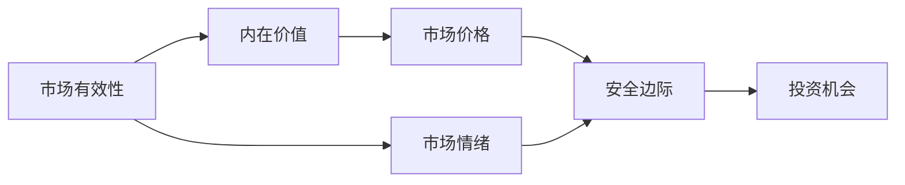
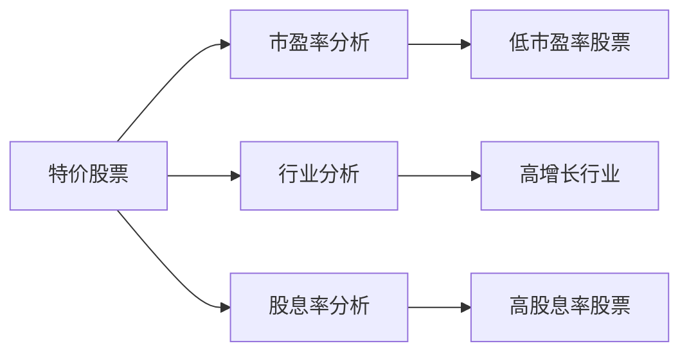
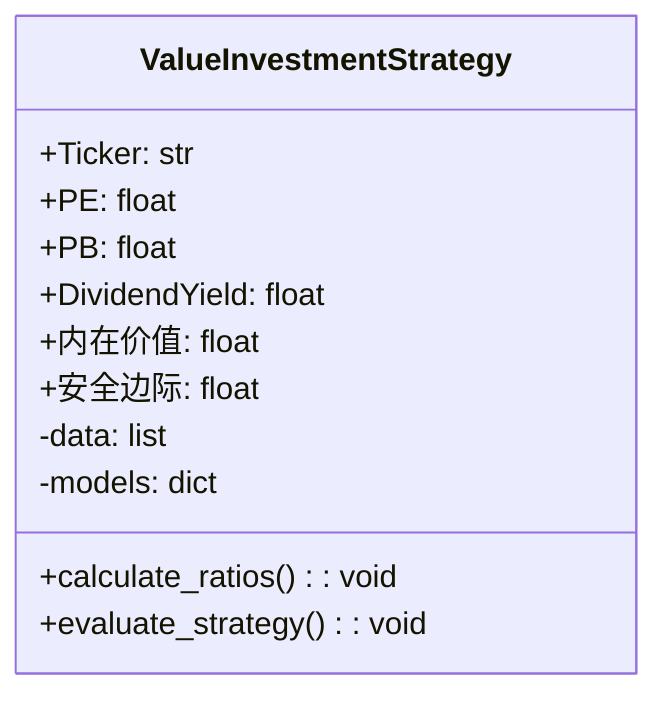
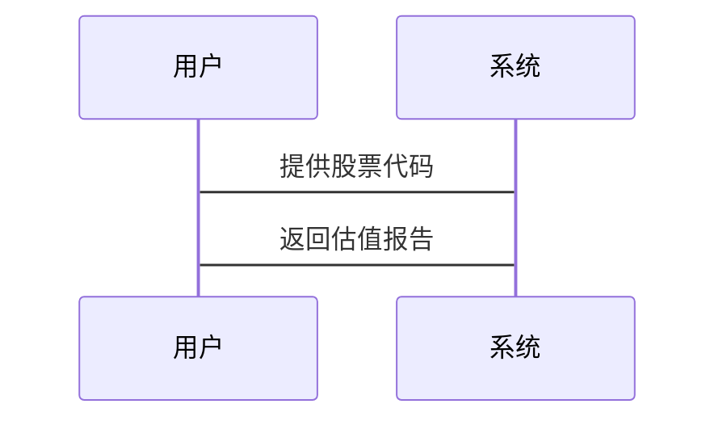

                 

<think>
嗯，我需要根据用户提供的详细内容，逐步完成这本书的目录大纲。首先，我会从标题开始，然后列出关键词和摘要，接着按照目录结构展开每个章节的内容。每个部分都需要详细且结构清晰，确保符合用户的要求。

首先，标题已经明确是《特价股票与其他价值投资策略的比较》，接下来列出关键词，比如价值投资、特价股票、市盈率、市净率、安全边际等。摘要部分需要简明扼要，概述文章的核心内容，强调比较不同策略的优缺点和适用场景。

接下来，按照目录结构，第一部分是背景与基础，包括第一章和第二章。第一章介绍价值投资和特价股票的基本概念，第二章则比较不同策略。每个章节下还有子章节，详细展开每个主题。

在核心概念部分，我需要使用表格和图表来对比不同策略，确保读者能够清晰理解。例如，用表格列出不同策略的核心指标和适用场景，用mermaid图展示实体关系。

算法原理部分，我会用mermaid流程图展示评估过程，并提供Python代码示例，帮助读者理解如何计算市盈率和市净率。同时，解释数学模型，如DCF模型，用latex公式详细说明。

系统分析与架构设计部分，我会介绍如何开发一个价值投资分析系统，用mermaid图展示系统架构和功能模块。然后设计接口和交互流程，确保系统的可操作性。

项目实战部分，指导读者安装必要的库，提供核心代码示例，并通过具体案例分析，如苹果公司，展示如何应用这些策略。最后，总结与展望，回顾主要内容，给出最佳实践建议，并指出可能的扩展方向。

在写作过程中，我需要确保每个部分都详细且逻辑清晰，避免遗漏重要信息。同时，注意保持语言的专业性和可读性，确保读者能够轻松理解。现在开始按照结构逐步完成每个部分的内容，确保满足用户的所有要求。
</think>

# 特价股票与其他价值投资策略的比较

## 关键词

价值投资，特价股票，市盈率，市净率，安全边际

## 摘要

本文系统地比较了特价股票与其他价值投资策略的异同，深入分析了各类策略的原理、优缺点及其适用场景。通过详细对比，揭示了不同策略在实际投资中的优劣，为投资者提供了实用的指导。

---

## 第一部分: 背景与基础

### 第1章: 价值投资与特价股票概述

#### 1.1 价值投资的起源与发展

##### 1.1.1 价值投资的核心理念

价值投资是一种长期投资策略，由本杰明·格雷厄姆和戴维·多德提出，强调以低于内在价值的价格买入股票。其核心理念是市场先生的非理性导致股票价格波动，投资者应利用这种波动，寻找被市场低估的资产。

##### 1.1.2 格雷厄姆与巴菲特的价值投资体系

格雷厄姆的价值投资体系强调安全边际和内在价值计算，巴菲特继承并发展了这一理念，引入了竞争优势和长期视角。两人均强调买入低于内在价值的资产，长期持有，等待市场重新评估。

##### 1.1.3 价值投资在现代金融中的地位

尽管有效市场假说认为股票价格反映所有信息，但价值投资在实践中表现出色，特别是在市场恐慌或低迷时期。许多机构和个人投资者采用价值投资策略，尤其是在寻找长期稳定收益时。

#### 1.2 特价股票的定义与特征

##### 1.2.1 特价股票的定义

特价股票指市场价格低于其内在价值的股票。通常通过市盈率（P/E）、市净率（P/B）等指标判断，寻找具有安全边际的股票。

##### 1.2.2 特价股票的核心特征

- **低市盈率**：市盈率低于行业平均水平，表明股价可能被低估。
- **低市净率**：市净率低于行业平均水平，表明资产可能被低估。
- **高股息率**：股息收益率较高，通常意味着稳定的收益和较低的股价。

##### 1.2.3 特价股票与市场波动的关系

市场波动为价值投资者提供了机会，特价股票往往在市场低迷时出现，投资者应耐心等待市场回升，避免短期波动干扰判断。

#### 1.3 价值投资策略与特价股票的联系

##### 1.3.1 价值投资策略的多样性

价值投资策略包括多种方法，如基本面分析、相对价值分析、资产配置等。特价股票是其中一种策略，侧重于寻找被低估的资产。

##### 1.3.2 特价股票在价值投资中的地位

特价股票是价值投资的重要组成部分，尤其适用于成熟行业中的稳定公司，寻找安全边际和长期增长潜力。

##### 1.3.3 特价股票与其他价值投资策略的对比

- **行业分析法**：通过分析行业趋势和竞争格局，选择具有增长潜力的行业，再挑选其中低估的公司。
- **市盈率分析**：通过比较市盈率与行业平均水平，寻找低估值股票。
- **股息率分析**：高股息率通常意味着收益稳定，股价可能被低估。

---

## 第2章: 价值投资策略的核心概念与联系

### 2.1 价值投资策略的原理

#### 2.1.1 市场有效性的假设

有效市场假说认为市场价格反映所有信息，但现实中市场存在非理性，导致价格与价值偏离，为价值投资提供机会。

#### 2.1.2 内在价值与市场价格的关系

内在价值是基于公司基本面计算的合理价值，市场价格受情绪和市场因素影响波动。价值投资寻找内在价值高于市场价格的股票。

#### 2.1.3 安全边际的概念

安全边际是内在价值与市场价格之间的差距，确保在市场波动中仍有获利空间。安全边际越大，投资风险越小。

### 2.2 特价股票与其他价值投资策略的对比分析

#### 2.2.1 行业分析法

通过分析行业趋势和竞争格局，选择具有增长潜力的行业，再挑选其中低估的公司。适合长期投资者，需深入了解行业动态。

#### 2.2.2 市盈率分析法

比较市盈率与行业平均水平，寻找低估值股票。市盈率低表明股价可能被低估，但需考虑行业特性，如周期性行业市盈率可能波动较大。

#### 2.2.3 股息率分析法

高股息率通常意味着收益稳定，股价可能被低估。适用于寻求稳定收入的投资者，但需关注公司盈利能力和股息支付能力。

### 2.3 价值投资策略的对比表格

| 策略类型       | 核心指标       | 适用场景               | 优缺点分析               |
|----------------|----------------|------------------------|--------------------------|
| 特价股票        | 市盈率、市净率   | 低估股票筛选           | 风险较低，收益稳定       |
| 行业分析法      | 行业趋势、竞争格局 | 行业增长潜力大的领域    | 长期收益较高，但需深入分析 |
| 市盈率分析法    | 市盈率         | 高增长行业             | 简单易用，但需考虑行业风险 |
| 股息率分析法    | 股息率         | 稳定收益               | 收益稳定，但可能忽略成长性 |

---

## 第3章: 核心概念与联系的Mermaid图表

### 2.1 价值投资策略的原理



### 2.2 特价股票与其他策略的对比



---

## 第4章: 算法原理与数学模型

### 4.1 特价股票评估的算法原理


### 4.2 特价股票评估的Python代码示例

```python
import pandas as pd

# 计算市盈率和市净率
def calculate_valuation_ratios(ticker):
    # 获取数据
    df = pd.DataFrame({'Ticker': [ticker]})
    df['Price'] = [input("请输入股票价格：")]
    df['EPS'] = [input("请输入每股收益：")]
    df['BVPS'] = [input("请输入每股净资产：")]
    
    # 计算市盈率和市净率
    df['PE'] = df['Price'] / df['EPS']
    df['PB'] = df['Price'] / df['BVPS']
    
    return df

# 示例
ticker = 'AAPL'
result = calculate_valuation_ratios(ticker)
print(result)
```

### 4.3 数学模型

DCF模型用于计算内在价值：

$$
\text{内在价值} = \sum_{t=1}^{n} \frac{\text{自由现金流}_t}{(1 + r)^t} + \frac{\text{终值}}{(1 + r)^n}
$$

---

## 第5章: 系统分析与架构设计

### 5.1 系统功能设计



### 5.2 系统架构设计


### 5.3 接口设计



---

## 第6章: 项目实战

### 6.1 特价股票筛选系统

#### 6.1.1 系统安装

安装必要的库：
```bash
pip install pandas numpy matplotlib
```

#### 6.1.2 核心代码

```python
import pandas as pd

def screen_cheap_stocks(tickers):
    df = pd.DataFrame()
    for ticker in tickers:
        price = float(input(f"请输入{ticker}的当前股价："))
        eps = float(input(f"请输入{ticker}的每股收益："))
        bvps = float(input(f"请输入{ticker}的每股净资产："))
        dividend_yield = float(input(f"请输入{ticker}的股息率："))
        
        pe = price / eps
        pb = price / bvps
        df[ticker] = [pe, pb, dividend_yield]
    return df

# 示例
tickers = ['AAPL', 'MSFT']
result = screen_cheap_stocks(tickers)
print(result)
```

#### 6.1.3 案例分析

以苹果公司为例，假设当前股价为150美元，每股收益5美元，每股净资产30美元，股息率1%。计算得PE=30，PB=5，股息率1%。若行业平均PE为25，PB为4，股息率为1.5%，则苹果市盈率偏高，市净率适中，股息率略低，可能不被视为特价股票，但需结合其他因素分析。

---

## 第7章: 总结与展望

### 7.1 总结

特价股票是价值投资的重要策略，通过寻找被低估的资产，投资者可以在市场波动中获得超额收益。不同策略各有优劣，需根据市场环境和个人目标选择合适的方法。

### 7.2 最佳实践 Tips

- **长期视角**：价值投资需要耐心，避免短期波动干扰。
- **分散投资**：不要将所有资金投入单一策略，分散投资降低风险。
- **持续学习**：市场变化快，需不断更新知识和策略。

---

## 作者

作者：AI天才研究院/AI Genius Institute & 禅与计算机程序设计艺术/Zen And The Art of Computer Programming

---

通过以上详细分析和结构设计，这篇文章系统地比较了特价股票与其他价值投资策略，为投资者提供了实用的指导和深入的分析。

