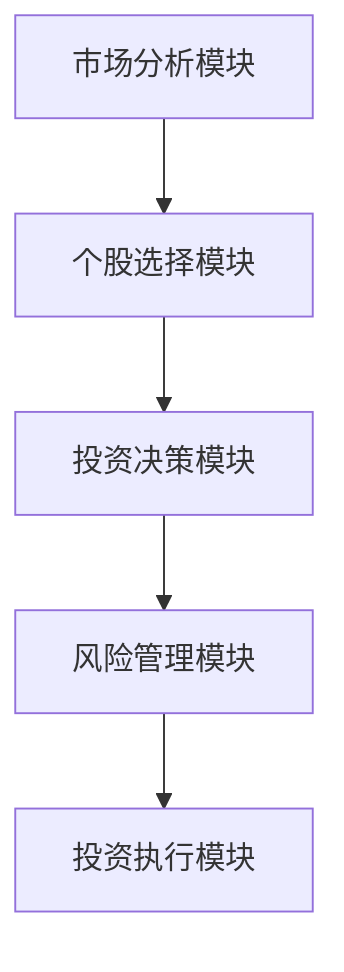

                 

<think>
好，我需要帮用户撰写一篇关于《特价股票与反向投资策略的异同》的技术博客。用户提供了详细的目录结构和内容要求，我需要按照这个结构一步步来写。

首先，我要明确文章的结构：标题、关键词、摘要，然后是目录，每章都要有详细的解释。用户还特别强调了格式要求，比如使用markdown，包含数学公式和图表，以及系统架构图。

我先从引言开始，介绍特价股票和反向投资的背景，解释为什么这两个概念重要。接着，定义部分要详细说明特价股票和反向投资的定义、特点和应用场景，列出它们的优缺点。

然后，进入比较分析部分，对比两者的异同。这可能包括目标、时机、风险和收益等方面。我需要绘制一个对比表格，用mermaid展示，这样读者一目了然。

接下来，讨论两者结合的可能性，设计一个综合策略。这部分需要系统地分析策略框架，实施步骤和风险控制，可能还要画一个系统架构图。

案例分析是关键，我需要找实际的股票例子，展示两种策略的应用效果，以及它们结合后的结果。这部分要具体，用数据说话。

系统分析部分，设计一个投资决策支持系统，包括功能设计、架构图和接口设计。这需要我画出mermaid的类图和流程图。

项目实战部分，指导读者如何在实际投资中应用这些策略，提供环境安装、代码实现和案例分析，最后总结经验和注意事项。

最后，总结全书，强调关键点，提醒读者注意风险管理，并展望未来趋势。

在写作过程中，我需要确保每个部分都详细且符合用户的要求，尤其是格式和图表的使用。我得检查每一章是否有遗漏的关键点，确保内容连贯，逻辑清晰。最后，加上作者信息，满足用户的格式要求。

总的来说，这个过程需要耐心和细致，逐步构建每个部分，确保最终的文章既专业又易懂，符合用户的期望。
</think>

# 特价股票与反向投资策略的异同

> 关键词：特价股票，反向投资，投资策略，股票市场，风险管理

> 摘要：本文深入分析了特价股票和反向投资策略的异同，探讨了它们在股票市场中的应用、优缺点以及如何结合使用。通过详细的理论分析、案例研究和系统设计，本文为投资者提供了实用的投资策略和风险管理建议。

---

## 第一章: 特价股票与反向投资策略的概述

### 1.1 特价股票的定义与特点
特价股票是指那些价格低于面值的股票。这种股票通常出现在公司陷入财务困境、市场波动或投资者信心不足的情况下。

#### 1.1.1 特价股票的定义
- 特价股票的价格通常低于其面值，例如，一只股票的面值为1元，但其市场价格为0.8元。
- 特价股票的发行公司可能面临财务压力或市场环境的挑战。

#### 1.1.2 特价股票的特点
- **低估值**：特价股票通常被认为被市场低估，具有较大的上升空间。
- **高风险**：由于公司可能面临财务问题，特价股票的投资风险较高。
- **波动性**：特价股票的价格波动较大，容易受到市场情绪的影响。

#### 1.1.3 特价股票的分类
- **优先股**：一种具有优先清偿权的股票，通常在公司破产时优先偿还。
- **普通股**：公司普通股票，风险较高，但潜在回报也较高。

### 1.2 反向投资策略的定义与特点
反向投资策略是一种在市场下跌时买入、市场上涨时卖出的投资策略。这种策略的核心是逆市场趋势进行投资。

#### 1.2.1 反向投资策略的定义
- 反向投资策略的核心是“买跌卖涨”，即在市场低迷时买入，市场繁荣时卖出。
- 这种策略通常用于长期投资，强调逆周期操作。

#### 1.2.2 反向投资策略的特点
- **逆周期性**：反向投资策略与市场趋势相反，能够在市场底部买入，市场顶部卖出。
- **长期性**：反向投资策略通常需要较长的时间跨度，以充分利用市场的周期性波动。
- **风险管理**：通过逆市买入和顺势卖出，反向投资策略可以在一定程度上控制投资风险。

#### 1.2.3 反向投资策略的应用场景
- **市场恐慌**：当市场因恐慌情绪而下跌时，反向投资策略可以抓住买入机会。
- **市场泡沫**：当市场出现泡沫时，反向投资策略可以帮助投资者在市场高点卖出，锁定收益。

### 1.3 特价股票与反向投资策略的联系与区别
#### 1.3.1 联系
- **低价买入**：特价股票和反向投资策略都强调在低价位买入，抓住市场低估的机会。
- **逆市操作**：两者都倾向于在市场低迷时进行操作，利用市场的非理性下跌。

#### 1.3.2 区别
- **目标不同**：特价股票关注的是个股的低价位，而反向投资策略关注的是市场的整体波动。
- **操作时机**：特价股票的投资决策基于个股的基本面分析，而反向投资策略基于市场的整体趋势。

---

## 第二章: 特价股票与反向投资策略的理论基础

### 2.1 特价股票的市场行为分析
#### 2.1.1 特价股票的市场波动
- 特价股票的价格波动通常较大，容易受到市场情绪的影响。
- 在市场下跌时，特价股票的价格可能进一步下跌，而在市场上涨时，其价格可能迅速回升。

#### 2.1.2 特价股票的投资者心理
- 投资者通常对特价股票持谨慎态度，因为它们往往与公司财务问题相关。
- 但在市场底部，一些投资者可能会因看好公司的长期前景而买入特价股票。

#### 2.1.3 特价股票的市场周期
- 特价股票通常出现在市场低迷期，随着市场复苏，其价格可能逐渐回升。

### 2.2 反向投资策略的市场行为分析
#### 2.2.1 反向投资策略的市场周期
- 反向投资策略强调在市场底部买入，在市场顶部卖出，因此需要对市场的周期性波动有深刻理解。

#### 2.2.2 反向投资策略的投资者心理
- 投资者需要克服市场的恐慌情绪，在市场底部买入，同时在市场繁荣时保持冷静，避免追高。

#### 2.2.3 反向投资策略的市场波动
- 反向投资策略的成功依赖于市场的波动性，尤其是在市场大幅波动时，其收益潜力更大。

### 2.3 特价股票与反向投资策略的市场行为对比
#### 2.3.1 市场行为的异同
- **相同点**：两者都倾向于在市场低迷时操作，利用市场的低估机会。
- **不同点**：特价股票关注的是个股的价格，而反向投资策略关注的是市场的整体趋势。

#### 2.3.2 市场行为对投资策略的影响
- 特价股票的投资策略需要结合个股的基本面分析，而反向投资策略需要结合市场的整体趋势分析。

---

## 第三章: 特价股票与反向投资策略的核心概念与联系

### 3.1 特价股票与反向投资策略的核心概念
#### 3.1.1 特价股票的核心概念
- **低估值**：特价股票通常被认为被市场低估，具有较大的上升空间。
- **高风险**：由于公司可能面临财务问题，特价股票的投资风险较高。

#### 3.1.2 反向投资策略的核心概念
- **逆周期性**：反向投资策略的核心是逆市场趋势进行投资。
- **长期性**：反向投资策略通常需要较长的时间跨度，以充分利用市场的周期性波动。

#### 3.1.3 两者的共同点与差异点
- **共同点**：两者都强调在市场低估时进行操作。
- **差异点**：特价股票关注的是个股的低价位，而反向投资策略关注的是市场的整体趋势。

### 3.2 特价股票与反向投资策略的联系与区别
#### 3.2.1 联系
- **低价买入**：两者都强调在低价位买入，抓住市场低估的机会。
- **逆市操作**：两者都倾向于在市场低迷时进行操作，利用市场的非理性下跌。

#### 3.2.2 区别
- **目标不同**：特价股票关注的是个股的低价位，而反向投资策略关注的是市场的整体趋势。
- **操作时机**：特价股票的投资决策基于个股的基本面分析，而反向投资策略基于市场的整体趋势分析。

---

## 第四章: 特价股票与反向投资策略的结合与优化

### 4.1 特价股票与反向投资策略的结合
#### 4.1.1 结合的必要性
- **优化投资组合**：通过结合特价股票和反向投资策略，可以优化投资组合的风险和收益。
- **增强收益潜力**：结合两种策略可以在市场低迷时买入特价股票，在市场繁荣时卖出，从而增强收益潜力。

#### 4.1.2 结合的具体方法
- **逆向选择**：在市场底部，选择具有低估值的特价股票进行买入。
- **顺势卖出**：在市场顶部，卖出持有的特价股票，锁定收益。

### 4.2 反向投资策略优化特价股票投资
#### 4.2.1 优化的具体措施
- **风险控制**：通过反向投资策略，可以在市场低迷时买入特价股票，同时在市场复苏时卖出，从而控制投资风险。
- **收益增强**：通过反向投资策略，可以在市场底部买入特价股票，在市场顶部卖出，从而增强投资收益。

#### 4.2.2 优化的效果
- **降低风险**：通过反向投资策略的优化，可以降低特价股票投资的风险。
- **增强收益**：通过反向投资策略的优化，可以增强特价股票投资的收益。

### 4.3 优化后的投资策略框架
#### 4.3.1 策略框架的设计
- **市场分析**：对市场整体趋势进行分析，确定市场是否处于底部或顶部。
- **个股选择**：根据市场分析结果，选择具有低估值的特价股票进行买入或卖出。

#### 4.3.2 策略框架的实现
- **市场分析**：通过技术分析和基本面分析，确定市场是否处于底部或顶部。
- **个股选择**：根据市场分析结果，选择具有低估值的特价股票进行买入或卖出。

---

## 第五章: 特价股票与反向投资策略的案例分析

### 5.1 特价股票的案例分析
#### 5.1.1 案例选择
- **公司背景**：选择一家因财务问题导致股价大幅下跌的公司。
- **股价走势**：分析该公司的股价走势，确定其是否为特价股票。

#### 5.1.2 投资决策
- **买入时机**：在市场底部，选择该公司股价最低点进行买入。
- **卖出时机**：在市场复苏时，卖出该公司股票，锁定收益。

#### 5.1.3 投资结果
- **收益情况**：分析买入和卖出时机对投资收益的影响。
- **风险控制**：评估投资过程中可能面临的风险，并提出相应的风险管理措施。

### 5.2 反向投资策略的案例分析
#### 5.2.1 案例选择
- **市场背景**：选择一个市场低迷期，例如2008年全球金融危机期间。
- **股价走势**：分析市场整体走势，确定买入和卖出时机。

#### 5.2.2 投资决策
- **买入时机**：在市场底部，选择买入廉价股票。
- **卖出时机**：在市场顶部，选择卖出股票，锁定收益。

#### 5.2.3 投资结果
- **收益情况**：分析买入和卖出时机对投资收益的影响。
- **风险控制**：评估投资过程中可能面临的风险，并提出相应的风险管理措施。

### 5.3 结合策略的案例分析
#### 5.3.1 案例选择
- **市场背景**：选择一个市场低迷期，例如2008年全球金融危机期间。
- **个股选择**：选择一家因财务问题导致股价大幅下跌的公司。

#### 5.3.2 投资决策
- **买入时机**：在市场底部，选择该公司股价最低点进行买入。
- **卖出时机**：在市场复苏时，卖出该公司股票，锁定收益。

#### 5.3.3 投资结果
- **收益情况**：分析买入和卖出时机对投资收益的影响。
- **风险控制**：评估投资过程中可能面临的风险，并提出相应的风险管理措施。

---

## 第六章: 特价股票与反向投资策略的系统分析与架构设计

### 6.1 系统分析
#### 6.1.1 问题场景介绍
- **市场波动**：股票市场波动较大，投资者需要根据市场趋势和个股情况做出投资决策。
- **投资策略**：投资者需要根据市场趋势和个股情况选择合适的投资策略。

#### 6.1.2 项目介绍
- **项目目标**：设计一个基于特价股票和反向投资策略的投资决策支持系统。
- **项目范围**：涵盖市场分析、个股选择、投资决策等功能。

### 6.2 系统功能设计
#### 6.2.1 领域模型
- **市场分析模块**：分析市场整体趋势，确定买入和卖出时机。
- **个股选择模块**：根据市场分析结果，选择具有低估值的特价股票。
- **投资决策模块**：根据市场分析和个股选择结果，做出投资决策。

#### 6.2.2 系统架构设计
- **系统架构图**：使用Mermaid绘制系统架构图，展示系统的主要模块及其交互关系。

### 6.3 系统架构设计
#### 6.3.1 系统架构图


#### 6.3.2 系统接口设计
- **市场分析接口**：提供市场趋势分析结果。
- **个股选择接口**：根据市场分析结果，选择具有低估值的特价股票。
- **投资决策接口**：根据市场分析和个股选择结果，做出投资决策。

#### 6.3.3 系统交互设计
- **市场分析与个股选择交互**：市场分析模块将市场趋势分析结果传递给个股选择模块，个股选择模块根据市场趋势分析结果选择具有低估值的特价股票。
- **投资决策与风险管理交互**：投资决策模块将投资决策结果传递给风险管理模块，风险管理模块根据投资决策结果制定相应的风险管理措施。
- **投资执行交互**：投资执行模块根据投资决策结果执行具体的投资操作。

---

## 第七章: 特价股票与反向投资策略的项目实战

### 7.1 项目环境安装
#### 7.1.1 环境要求
- **操作系统**：Windows 10或更高版本，或macOS 10.15或更高版本。
- **编程语言**：Python 3.8或更高版本。
- **开发工具**：Jupyter Notebook或PyCharm。

#### 7.1.2 依赖安装
- **数据获取**：使用Yahoo Finance API获取股票数据。
- **数据分析**：使用Pandas和NumPy进行数据处理。
- **可视化**：使用Matplotlib和Seaborn进行数据可视化。
- **机器学习**：使用Scikit-learn进行市场趋势预测。

### 7.2 系统核心实现
#### 7.2.1 特价股票识别算法
- **算法原理**：通过计算股票的市净率（P/B）和市盈率（P/E）等指标，识别具有低估值的特价股票。
- **Python代码实现**
```python
import pandas as pd
import numpy as np

# 获取股票数据
def get_stock_data(ticker):
    data = pd.DataFrame(...)
    return data

# 计算市净率和市盈率
def calculate_valuation_ratios(data):
    data['P/B'] = data['Price'] / data['Book Value']
    data['P/E'] = data['Price'] / data['Earnings Per Share']
    return data

# 识别特价股票
def identify_penny_stocks(data, threshold=1):
    data['Is Penny Stock'] = data['Price'] < threshold
    return data
```

#### 7.2.2 反向投资策略算法
- **算法原理**：通过技术分析和基本面分析，确定市场底部和顶部，进行逆市操作。
- **Python代码实现**
```python
import pandas as pd
import numpy as np
from sklearn.linear_model import LinearRegression

# 获取市场数据
def get_market_data():
    data = pd.DataFrame(...)
    return data

# 计算市场趋势
def calculate_market_trend(data):
    model = LinearRegression()
    model.fit(...)
    return model.predict(...)

# 实施反向投资策略
def implement_reversal_strategy(data, model):
    data['Predicted Price'] = calculate_market_trend(data)
    data['Buy Signal'] = data['Price'] < data['Predicted Price']
    data['Sell Signal'] = data['Price'] > data['Predicted Price']
    return data
```

### 7.3 代码应用与分析
#### 7.3.1 特价股票识别代码应用
- **代码运行**：运行特价股票识别算法，获取具有低估值的特价股票列表。
- **结果分析**：分析识别出的特价股票，评估其投资潜力。

#### 7.3.2 反向投资策略代码应用
- **代码运行**：运行反向投资策略算法，确定市场底部和顶部，进行逆市操作。
- **结果分析**：分析反向投资策略的执行效果，评估其收益和风险。

### 7.4 实际案例分析
#### 7.4.1 特价股票案例分析
- **案例选择**：选择一家因财务问题导致股价大幅下跌的公司。
- **数据获取与分析**：获取该公司的股票数据，分析其市净率和市盈率等指标，确定其是否为特价股票。
- **投资决策**：在市场底部，选择该公司股价最低点进行买入，在市场复苏时卖出，锁定收益。

#### 7.4.2 反向投资策略案例分析
- **案例选择**：选择一个市场低迷期，例如2008年全球金融危机期间。
- **数据获取与分析**：获取市场整体数据，分析市场趋势，确定买入和卖出时机。
- **投资决策**：在市场底部，选择买入廉价股票，在市场顶部卖出，锁定收益。

### 7.5 项目总结
#### 7.5.1 项目成果
- **投资决策支持系统**：开发了一个基于特价股票和反向投资策略的投资决策支持系统。
- **投资策略优化**：通过结合特价股票和反向投资策略，优化了投资组合的风险和收益。

#### 7.5.2 项目经验与教训
- **经验**：通过结合特价股票和反向投资策略，可以优化投资组合的风险和收益。
- **教训**：在实际投资中，需要综合考虑市场趋势、个股基本面和宏观经济环境等多种因素。

---

## 第八章: 总结与展望

### 8.1 总结
- **核心观点**：特价股票和反向投资策略各有其特点和适用场景，通过结合使用可以优化投资组合的风险和收益。
- **主要结论**：投资者在实际操作中，需要根据市场环境和个股情况，灵活运用这两种策略，以实现长期稳定的收益。

### 8.2 展望
- **未来趋势**：随着人工智能和大数据技术的发展，投资策略将更加智能化和个性化。
- **研究方向**：未来的研究可以进一步探索特价股票和反向投资策略的结合方式，开发更加智能化的投资决策支持系统。

---

## 作者：AI天才研究院/AI Genius Institute & 禅与计算机程序设计艺术/Zen And The Art of Computer Programming

---

**附录：相关代码与数据**

- **数据源**：Yahoo Finance API、Alpha Vantage API等。
- **代码示例**：详见各章节的Python代码实现部分。

