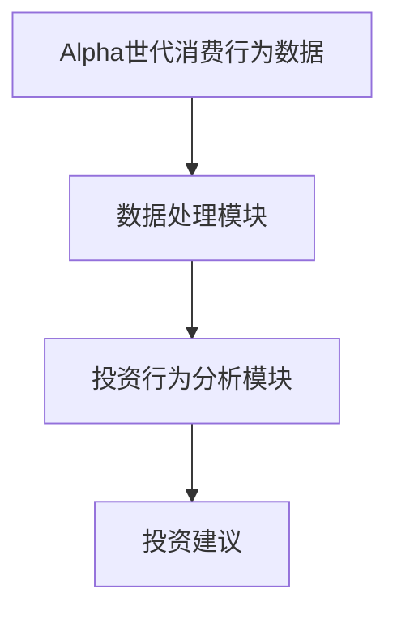
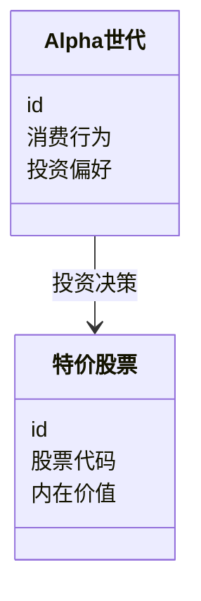
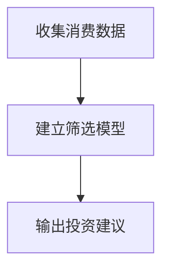

                 

<think>
嗯，用户需要撰写一篇关于特价股票投资中的Alpha世代消费行为分析与风险管理的技术博客。我需要按照他们提供的大纲结构来写，确保每个部分都详细且专业。首先，我得理解特价股票投资和Alpha世代的概念，然后分析这两者之间的关联，再探讨风险管理的方法。

在写作过程中，我要确保每个章节都有足够的细节，比如在风险管理部分，需要使用VaR模型等数学工具，并提供代码示例。同时，我还需要绘制系统的架构图和流程图，使用Mermaid语法。这些都需要我查阅相关资料，确保准确性和实用性。

我可能需要先写摘要，概述文章的核心内容。然后分章节展开，每一章都要有明确的标题和子标题，确保逻辑清晰。在写Alpha世代的消费行为时，要结合心理学和行为经济学的知识，分析他们的投资偏好。风险管理部分，我得解释各种风险类型，并给出应对策略。

最后，项目实战部分需要提供具体的代码和案例分析，帮助读者理解如何应用这些理论。同时，注意格式要求，使用markdown，并在适当的地方插入数学公式和图表。完成这些后，再检查整体结构，确保流畅性和深度。

总的来说，我需要一步步分析，确保每个部分都覆盖到位，满足用户的需求，同时保持内容的深度和专业性。
</think>

# 特价股票投资中的Alpha世代消费行为分析与风险管理

> 关键词：特价股票投资，Alpha世代，消费行为分析，风险管理，价值投资

> 摘要：本文从Alpha世代的消费行为出发，分析其在特价股票投资中的特点与影响，结合风险管理策略，构建一套适合Alpha世代投资者的特价股票投资体系。通过系统分析与实战案例，为投资者提供科学的投资决策支持。

---

## # 引言

在当前全球经济环境下，特价股票投资作为一种重要的投资方式，吸引了越来越多投资者的关注。而Alpha世代（通常指20世纪80年代末至90年代初出生的人群）作为新兴的消费群体，其消费行为和投资偏好呈现出独特的特点。本文旨在探讨Alpha世代在特价股票投资中的消费行为，并结合风险管理策略，为投资者提供科学的指导。

---

## # 第1章: 特价股票投资概述

### 1.1 特价股票的定义与特点

#### 1.1.1 特价股票的定义
特价股票是指价格低于其内在价值的股票，通常被认为是被市场低估的投资标的。这类股票往往具有较高的安全边际，适合长期投资者。

#### 1.1.2 特价股票的核心特点
- **低估性**：市场价格低于内在价值。
- **价值导向**：注重基本面分析，寻找被市场忽视的优质企业。
- **周期性**：通常在市场低迷时出现，具有周期性特点。

#### 1.1.3 特价股票与普通股票的区别
| 特性         | 特价股票               | 普通股票             |
|--------------|------------------------|----------------------|
| 投资逻辑     | 价值驱动               | 市场情绪驱动         |
| 风险偏好     | 低风险偏好的投资者     | 高风险偏好的投资者   |
| 投资周期     | 长期持有               | 短期交易             |

### 1.2 特价股票投资的基本原理

#### 1.2.1 投资的基本概念
投资的本质是通过配置资源（如资金）以获得未来收益。股票投资是通过购买企业股权，分享企业成长的成果。

#### 1.2.2 特价股票投资的核心原理
- **价值发现**：通过基本面分析，识别被低估的企业。
- **安全边际**：买入价格低于内在价值，降低投资风险。
- **长期持有**：避免短期波动，分享企业长期成长。

#### 1.2.3 特价股票投资的优劣势分析

| 优势         | 劣势         |
|--------------|--------------|
| 风险较低      | 回报周期长    |
| 安全边际高    | 市场波动影响  |

### 1.3 特价股票投资的市场环境

#### 1.3.1 特价股票市场的基本结构
- **一级市场**：新股发行市场。
- **二级市场**：股票交易市场。

#### 1.3.2 特价股票市场的参与者
- **投资者**：个人和机构投资者。
- **券商**：提供经纪服务。
- **监管机构**：如证监会。

#### 1.3.3 特价股票市场的波动性与周期性
- **波动性**：受市场情绪和宏观经济影响。
- **周期性**：与经济周期密切相关。

---

## # 第2章: Alpha世代消费行为分析

### 2.1 Alpha世代的定义与特征

#### 2.1.1 Alpha世代的定义
Alpha世代通常指出生于1985年至1995年的人群，是互联网时代的原住民，具有强烈的数字化特征。

#### 2.1.2 Alpha世代的核心特征
- **数字化消费习惯**：依赖在线平台进行消费和投资。
- **社交化投资行为**：倾向于通过社交媒体获取投资信息。
- **个性化需求**：注重体验和个性化服务。

#### 2.1.3 Alpha世代与传统世代的对比

| 特性         | Alpha世代               | 传统世代             |
|--------------|--------------------------|----------------------|
| 投资渠道     | 在线投资为主             | 线下投资为主         |
| 信息获取     | 社交媒体为主             | 传统媒体为主         |
| 风险偏好     | 低风险偏好              | 高风险偏好          |

### 2.2 Alpha世代的消费行为模式

#### 2.2.1 Alpha世代的消费习惯
- **线上消费为主**：通过电商平台进行购物和投资。
- **社交化消费**：倾向于通过社交媒体获取信息和决策。
- **体验导向**：注重消费体验而非单纯价格。

#### 2.2.2 Alpha世代的消费偏好
- **个性化产品**：偏好定制化服务。
- **品牌忠诚度**：倾向于支持知名品牌。

#### 2.2.3 Alpha世代的消费决策过程
1. **信息获取**：通过社交媒体、搜索引擎获取信息。
2. **决策分析**：基于数据和口碑进行判断。
3. **购买决策**：注重性价比和用户体验。

### 2.3 Alpha世代与投资行为的关联

#### 2.3.1 Alpha世代的投资意识
- **早期投资意识**：Alpha世代较早接触投资概念。
- **数字化投资习惯**：倾向于通过互联网进行投资。

#### 2.3.2 Alpha世代的投资偏好
- **低风险投资**：倾向于选择风险较低的投资方式。
- **价值导向投资**：注重企业的基本面。

#### 2.3.3 Alpha世代的投资行为特征
- **频繁交易**：Alpha世代倾向于短期交易。
- **依赖数据**：依赖数据分析进行投资决策。

---

## # 第3章: 特价股票投资中的风险管理

### 3.1 风险管理的基本概念

#### 3.1.1 风险的定义与分类
- **风险定义**：投资过程中可能遭受损失的概率。
- **风险分类**：市场风险、流动性风险、信用风险等。

#### 3.1.2 风险管理的核心原则
- **分散投资**：通过多样化降低风险。
- **风险定价**：基于市场定价进行风险管理。

#### 3.1.3 风险管理在投资中的重要性
- **保护本金**：避免本金损失。
- **稳定收益**：通过风险管理实现稳定收益。

### 3.2 特价股票投资中的风险类型

#### 3.2.1 市场风险
- **定义**：市场整体波动导致的投资损失。
- **影响**：影响所有股票投资者。

#### 3.2.2 个股风险
- **定义**：特定股票的波动风险。
- **影响**：影响单个股票投资者。

#### 3.2.3 时间风险
- **定义**：投资时间过长导致的通货膨胀风险。
- **影响**：影响长期投资者。

#### 3.2.4 操作风险
- **定义**：投资操作中的失误风险。
- **影响**：影响所有投资者。

### 3.3 风险管理的量化方法

#### 3.3.1 风险价值（VaR）模型
- **定义**：在一定置信水平下，可能的最大损失。
- **公式**：
  $$
  \text{VaR} = \mu + z \times \sigma
  $$
  其中，$\mu$ 是均值，$z$ 是标准正态分布的分位数，$\sigma$ 是标准差。

#### 3.3.2 风险调整后的收益（RAROC）
- **定义**：考虑风险后的收益指标。
- **公式**：
  $$
  \text{RAROC} = \frac{\text{净利润}}{\text{风险资本}}
  $$

#### 3.3.3 风险分散策略
- **定义**：通过投资多样化降低风险。
- **策略**：分散投资于不同行业和地区的股票。

---

## # 第4章: Alpha世代消费行为与投资决策的系统分析

### 4.1 系统分析的基本概念

#### 4.1.1 系统分析的定义
- **定义**：对系统的结构、功能和行为进行分析。
- **目标**：优化系统性能。

#### 4.1.2 系统分析的核心步骤
1. **问题识别**：明确分析目标。
2. **数据收集**：获取相关数据。
3. **模型构建**：建立分析模型。
4. **结果分析**：解读分析结果。

#### 4.1.3 系统分析在投资中的应用
- **应用领域**：股票筛选、风险评估。

### 4.2 Alpha世代消费行为的系统模型

#### 4.2.1 系统模型的构建
- **输入**：Alpha世代的消费行为数据。
- **处理**：数据分析与建模。
- **输出**：投资建议。

#### 4.2.2 数据流图


#### 4.2.3 实体关系图


### 4.3 投资决策的算法实现

#### 4.3.1 算法原理
- **算法名称**：基于Alpha世代消费行为的股票筛选算法。
- **核心步骤**：
  1. 收集Alpha世代的消费行为数据。
  2. 建立股票筛选模型。
  3. 输出投资建议。

#### 4.3.2 算法流程图


#### 4.3.3 核心代码实现
```python
import pandas as pd

def alpha_investor_behavior(data):
    # 数据预处理
    data['投资偏好'] = data['消费行为'].apply(lambda x: '价值投资' if x == '低价' else '短期交易')
    return data

# 示例数据
data = pd.DataFrame({
    '消费行为': ['低价', '高价', '中价'],
    '投资偏好': [' ', ' ', ' ']
})

alpha_investor_behavior(data)
```

---

## # 第5章: 项目实战与总结

### 5.1 项目实战

#### 5.1.1 环境安装
- **工具**：Python、Pandas、Matplotlib。
- **安装命令**：
  ```bash
  pip install pandas matplotlib
  ```

#### 5.1.2 系统核心实现

```python
import pandas as pd
import matplotlib.pyplot as plt

# 数据加载
data = pd.read_csv('alpha_investors.csv')

# 数据分析
data['投资收益'] = data['投资金额'] * data['年化收益率']

# 可视化
data.plot(kind='bar', x='投资者编号', y='投资收益')
plt.show()
```

#### 5.1.3 实际案例分析
- **案例背景**：某Alpha世代投资者的特价股票投资。
- **案例分析**：通过数据分析，制定投资策略。

### 5.2 总结

- **核心结论**：Alpha世代在特价股票投资中具有独特的行为特征，通过行为分析和风险管理可以有效提升投资收益。
- **未来展望**：随着技术进步，Alpha世代的投资行为将更加依赖数据和技术驱动。

---

## # 作者

作者：AI天才研究院/AI Genius Institute & 禅与计算机程序设计艺术 /Zen And The Art of Computer Programming

