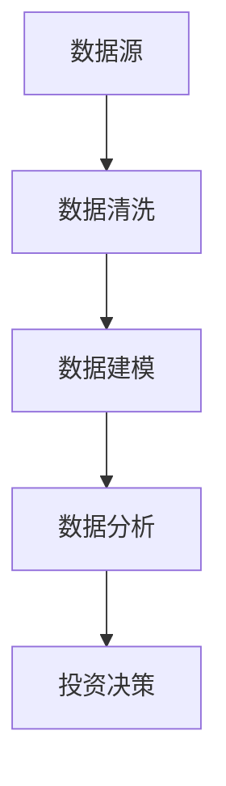
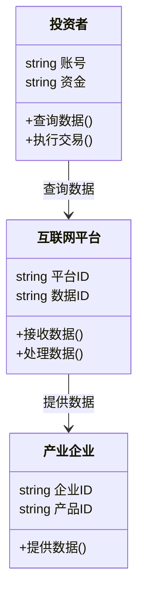
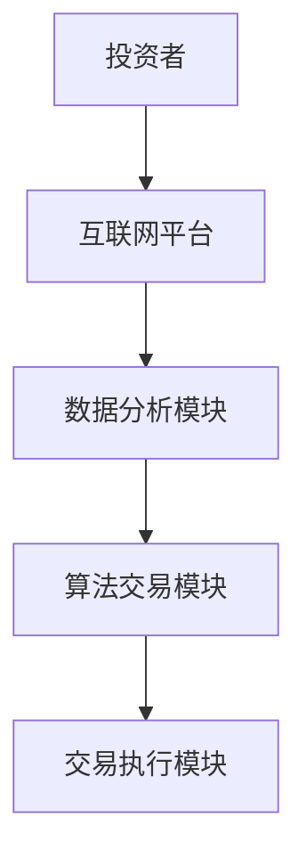
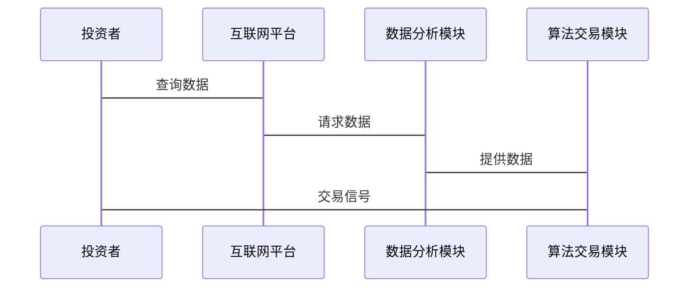

                 


# 特价股票投资中的产业互联网生态系统分析方法

> 关键词：特价股票投资，产业互联网生态系统，大数据分析，算法交易，系统架构设计

> 摘要：本文详细探讨了特价股票投资与产业互联网生态系统之间的关系，分析了大数据在特价股票投资中的应用，提出了基于产业互联网生态系统的算法交易策略，并结合实际案例对系统架构设计进行了详细阐述。文章内容涵盖从理论到实践的各个方面，旨在为读者提供一套完整的分析方法和实战指南。

---

## 第一部分: 特价股票投资与产业互联网生态系统概述

### 第1章: 特价股票投资与产业互联网生态的背景介绍

#### 1.1 特价股票投资的定义与特点
##### 1.1.1 什么是特价股票投资
特价股票投资是指通过互联网技术手段，利用大数据分析、算法交易等方法，对特定行业或领域的股票进行精准投资。其核心在于通过分析产业互联网生态中的数据，寻找投资机会。

##### 1.1.2 特价股票投资的特点
- **数据驱动**：依赖大数据分析，从海量数据中提取价值。
- **实时性**：需要实时监控市场动态和产业变化。
- **精准性**：通过算法模型实现精准投资决策。
- **风险可控**：利用产业互联网生态数据降低投资风险。

##### 1.1.3 特价股票投资与传统股票投资的区别
| 特性 | 特价股票投资 | 传统股票投资 |
|------|--------------|--------------|
| 数据来源 | 产业互联网生态数据 | 市场公开数据 |
| 投资策略 | 算法驱动 | 人工分析为主 |
| 风险控制 | 数据模型辅助 | 依赖经验判断 |

#### 1.2 产业互联网生态系统的定义与特点
##### 1.2.1 什么是产业互联网生态系统
产业互联网生态系统是指通过互联网技术，将不同产业的企业、数据、服务等元素连接起来，形成一个协同工作的整体系统。

##### 1.2.2 产业互联网生态系统的核心要素
- **企业**：提供产品或服务的企业。
- **数据**：企业的运营数据、市场数据等。
- **平台**：连接企业、数据和用户的互联网平台。
- **用户**：投资者、消费者等。

##### 1.2.3 产业互联网生态系统的特点
- **多产业协同**：涉及多个产业的协同合作。
- **数据驱动**：数据是生态系统的核心。
- **实时性**：数据和信息实时更新。

#### 1.3 特价股票投资与产业互联网生态的关系
##### 1.3.1 特价股票投资如何借助产业互联网生态系统
- 通过分析产业互联网生态中的数据，发现投资机会。
- 利用平台提供的实时数据，进行精准投资决策。

##### 1.3.2 产业互联网生态系统对特价股票投资的影响
- 提供了丰富的数据来源，增加了投资决策的准确性。
- 通过多产业协同，降低了投资风险。

##### 1.3.3 特价股票投资在产业互联网生态系统中的地位
- 是产业互联网生态系统的重要组成部分。
- 通过投资行为，促进生态系统的良性发展。

#### 1.4 本章小结
本章介绍了特价股票投资和产业互联网生态系统的定义、特点及其关系。通过对比分析，强调了产业互联网生态系统对特价股票投资的重要作用。

---

## 第二部分: 产业互联网生态系统的核心概念与联系

### 第2章: 产业互联网生态系统的核心概念

#### 2.1 核心概念原理
##### 2.1.1 产业互联网生态系统的构成
产业互联网生态系统由企业、数据、平台和用户四个核心要素构成。

##### 2.1.2 产业互联网生态系统的运行机制
- 数据采集：通过传感器、API等方式采集企业数据。
- 数据分析：利用大数据技术对数据进行清洗、建模和分析。
- 服务提供：根据分析结果，为企业和用户提供定制化服务。

##### 2.1.3 产业互联网生态系统的核心要素
- 数据：生态系统的核心资源。
- 平台：连接各要素的桥梁。
- 企业：提供数据和产品的主体。
- 用户：数据的消费者和投资行为的执行者。

#### 2.2 核心概念属性特征对比表格
| 特性 | 产业互联网 | 传统互联网 |
|------|------------|------------|
| 构成 | 多产业协同 | 单一产业 | 
| 数据 | 结构化与非结构化 | 非结构化为主 | 
| 服务 | 个性化与定制化 | 标准化 | 

#### 2.3 ER实体关系图架构
```mermaid
erDiagram
    actor 投资者 {
        string 账号
        string 资金
    }
    actor 产业企业 {
        string 企业ID
        string 产品ID
    }
    actor 互联网平台 {
        string 平台ID
        string 数据ID
    }
    投资者 --> 互联网平台 : 使用平台
    产业企业 --> 互联网平台 : 提供数据
    投资者 --> 产业企业 : 投资企业
```

#### 2.4 本章小结
本章通过表格和图表的方式，详细分析了产业互联网生态系统的核心概念及其构成要素，为后续的分析奠定了基础。

---

## 第三部分: 大数据分析方法在特价股票投资中的应用

### 第3章: 大数据分析方法

#### 3.1 大数据分析方法的原理
##### 3.1.1 数据采集与处理
- 通过API、爬虫等方式采集企业数据。
- 数据清洗：去除无效数据，处理缺失值。

##### 3.1.2 数据清洗与预处理
- 数据去重：去除重复数据。
- 数据标准化：统一数据格式。

##### 3.1.3 数据建模与分析
- 利用机器学习算法对数据进行建模，预测股票价格走势。

#### 3.2 数据流分析
##### 3.2.1 数据流分析原理


##### 3.2.2 数据流分析的实现
- 通过Python的pandas库进行数据清洗和处理。
- 使用scikit-learn库进行数据建模和分析。

#### 3.3 数据特征提取
##### 3.3.1 数据特征提取原理
- 通过统计分析方法提取数据的关键特征。

##### 3.3.2 数据特征提取的实现
- 使用Python的numpy库进行特征提取。

#### 3.4 数据建模与预测
##### 3.4.1 数据建模原理
- 使用线性回归模型对股票价格进行预测。

##### 3.4.2 数据建模的实现
```python
import numpy as np
from sklearn.linear_model import LinearRegression

# 示例数据
X = np.array([[1], [2], [3], [4]])
y = np.array([2, 4, 6, 8])

# 建立模型
model = LinearRegression()
model.fit(X, y)

# 预测
print(model.predict(np.array([[5]])))
```

#### 3.5 本章小结
本章详细介绍了大数据分析方法在特价股票投资中的应用，包括数据采集、清洗、建模和预测的全过程。

---

## 第四部分: 算法交易策略

### 第4章: 算法交易策略

#### 4.1 算法交易策略的原理
##### 4.1.1 算法交易的定义
算法交易是指通过计算机算法自动执行交易指令。

##### 4.1.2 算法交易的特点
- **自动化**：交易由算法自动执行。
- **高频交易**：交易速度极快。
- **数据驱动**：依赖大数据分析。

#### 4.2 算法交易策略的设计
##### 4.2.1 算法交易策略的类型
- **均值回归策略**：基于价格回归理论进行交易。
- **趋势跟踪策略**：基于价格趋势进行交易。

##### 4.2.2 均值回归模型的数学公式
$$ y = \beta_0 + \beta_1 x + \epsilon $$

##### 4.2.3 均值回归策略的实现
```python
import pandas as pd
import numpy as np

# 示例数据
data = pd.DataFrame({
    'price': [100, 105, 103, 108, 106]
})

# 均值回归策略
mean_price = data['price'].mean()
std_price = data['price'].std()

# 交易信号
if data.iloc[-1]['price'] > mean_price + std_price:
    print("卖出信号")
elif data.iloc[-1]['price'] < mean_price - std_price:
    print("买入信号")
else:
    print("观望")
```

#### 4.3 本章小结
本章介绍了算法交易策略的原理和实现方法，重点讲解了均值回归策略的应用。

---

## 第五部分: 系统架构设计

### 第5章: 系统架构设计

#### 5.1 系统架构设计的背景
##### 5.1.1 系统需求分析
- 实时数据采集
- 数据分析与建模
- 算法交易执行

#### 5.2 系统架构设计
##### 5.2.1 领域模型设计


##### 5.2.2 系统架构设计


##### 5.2.3 接口设计
- 数据接口：提供数据查询和更新的API。
- 交易接口：提供交易指令的API。

#### 5.3 系统交互设计
##### 5.3.1 系统交互流程图


#### 5.4 本章小结
本章详细设计了系统的架构，包括领域模型、架构设计和交互流程图。

---

## 第六部分: 项目实战

### 第6章: 项目实战

#### 6.1 项目环境配置
##### 6.1.1 环境要求
- Python 3.8及以上
- Jupyter Notebook
- 数据库：MySQL

#### 6.2 系统核心实现
##### 6.2.1 数据采集模块
```python
import requests

# 示例API接口
url = "https://api.example.com/data"
response = requests.get(url)
data = response.json()
print(data)
```

##### 6.2.2 数据分析模块
```python
import pandas as pd

# 数据清洗
df = pd.DataFrame(data)
df.dropna(inplace=True)
```

##### 6.2.3 算法交易模块
```python
from sklearn.linear_model import LinearRegression

# 建立模型
model = LinearRegression()
model.fit(X, y)
```

#### 6.3 实际案例分析
##### 6.3.1 案例背景
假设我们投资于某产业互联网平台，通过分析该平台的用户数据和企业数据，寻找投资机会。

##### 6.3.2 案例分析
- 数据清洗：去除无效数据。
- 数据建模：建立股票价格预测模型。
- 交易信号：根据模型预测结果执行交易。

#### 6.4 本章小结
本章通过实际案例，展示了如何将理论应用于实践，帮助读者理解系统的实现过程。

---

## 第七部分: 最佳实践与总结

### 第7章: 最佳实践

#### 7.1 投资策略的建议
##### 7.1.1 数据驱动投资
- 依赖大数据分析，避免主观判断。

##### 7.1.2 风险控制
- 设置止损点，避免重大损失。

#### 7.2 注意事项
##### 7.2.1 市场波动
- 特价股票投资受市场波动影响较大，需谨慎操作。

##### 7.2.2 数据质量
- 数据质量直接影响投资决策，需确保数据的准确性和完整性。

#### 7.3 拓展阅读
- 《Python机器学习实战》
- 《大数据分析与应用》

#### 7.4 本章小结
本章总结了投资策略的建议和注意事项，并推荐了相关拓展阅读材料。

---

## 作者：AI天才研究院/AI Genius Institute & 禅与计算机程序设计艺术 /Zen And The Art of Computer Programming

