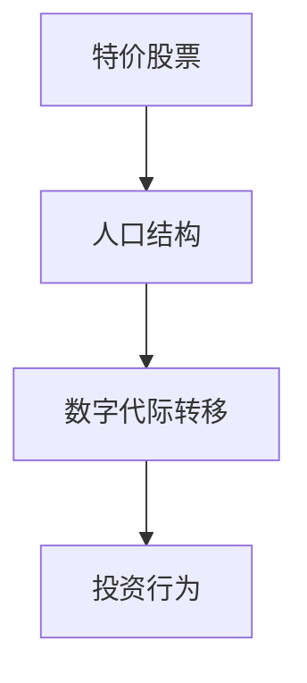
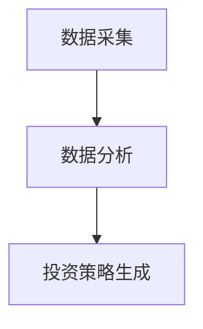

                 

# 特价股票投资中的人口结构数字代际转移趋势考量

> **关键词**：特价股票，人口结构，数字代际转移，投资策略，数学模型

> **摘要**：本文探讨了人口结构变化和数字代际转移趋势对特价股票投资的影响。通过构建数学模型，分析不同年龄段投资者的行为差异，提出优化投资策略，并通过实际案例验证模型的有效性。

---

## 第1章: 背景介绍与核心概念

### 1.1 问题背景

#### 1.1.1 特价股票的定义与特点
特价股票通常指价格低于市场平均水平的股票，具有高波动性和高风险的特点，吸引寻求高回报的投资者。

#### 1.1.2 人口结构变化的背景
全球人口老龄化加剧，不同年龄段的人口比例变化影响市场参与者的行为和需求。

#### 1.1.3 数字代际转移的定义
数字代际转移指不同年龄段人群在数字化工具使用上的变化，影响投资行为和市场趋势。

### 1.2 问题描述

#### 1.2.1 特价股票投资中的问题
投资者在特价股票市场中面临高风险和不确定性，需借助结构性分析优化决策。

#### 1.2.2 人口结构变化对股票市场的影响
老龄化可能导致投资偏好转向稳健资产，影响市场流动性。

#### 1.2.3 数字代际转移对投资行为的影响
年轻一代更依赖数字化工具，影响市场情绪和交易活跃度。

### 1.3 问题解决

#### 1.3.1 通过人口结构分析优化投资决策
分析不同年龄段的投资偏好，调整投资策略。

#### 1.3.2 数字代际转移趋势对投资策略的调整
利用数字化工具捕捉市场趋势，优化投资组合。

#### 1.3.3 特价股票投资中的趋势捕捉
通过模型预测市场变化，抓住投资机会。

### 1.4 边界与外延

#### 1.4.1 特价股票投资的边界条件
考虑市场波动性、政策变化等外部因素。

#### 1.4.2 人口结构变化的外延影响
影响消费习惯和企业战略，间接影响股市。

#### 1.4.3 数字代际转移的边界与限制
技术门槛和用户习惯影响数字化工具的采用。

### 1.5 核心概念结构

#### 1.5.1 核心要素组成
- 特价股票
- 人口结构
- 数字代际转移

#### 1.5.2 概念之间的关系
人口结构和数字代际转移共同影响特价股票市场。

#### 1.5.3 概念结构图

---

## 第2章: 人口结构与股票市场的关系

### 2.1 人口结构对股票市场的核心影响

#### 2.1.1 不同年龄段人口对股票市场的偏好
年轻人倾向于高风险投资，中老年人偏好稳健资产，影响市场资金流动。

#### 2.1.2 人口结构变化对市场流动性的影响
老龄化可能导致市场流动性下降，影响股票价格波动。

#### 2.1.3 人口结构对市场波动性的长期影响
人口结构变化引发投资行为调整，影响市场稳定性。

### 2.2 数字代际转移对投资行为的影响

#### 2.2.1 不同代际人群的投资行为差异
年轻一代依赖数字化工具，中老年人更倾向于传统投资方式。

#### 2.2.2 数字化工具对投资决策的影响
大数据和人工智能工具改变投资策略，提高决策效率。

#### 2.2.3 代际转移对市场情绪的影响
代际转移引发市场情绪波动，影响股票价格走势。

---

## 第3章: 数字代际转移趋势的数学模型

### 3.1 模型构建

#### 3.1.1 数据收集与处理
收集人口统计数据和投资行为数据，进行清洗和预处理。

#### 3.1.2 模型假设
假设人口结构变化和数字代际转移是影响投资行为的主要因素。

#### 3.1.3 模型构建过程
使用回归分析模型，分析人口结构变量对股票价格的影响。

### 3.2 模型分析

#### 3.2.1 模型的输入变量
- 年龄分布
- 数字化工具使用率

#### 3.2.2 模型的输出变量
- 投资行为变化
- 股票价格波动

#### 3.2.3 模型的验证与优化
通过历史数据验证模型，调整参数提高预测精度。

### 3.3 数学模型

考虑人口结构变量和数字代际转移变量对股票价格的影响，构建线性回归模型：

$$ P = \beta_0 + \beta_1A + \beta_2D + \epsilon $$

其中，$P$为股票价格，$A$为年龄分布变量，$D$为数字代际转移变量，$\epsilon$为误差项。

---

## 第4章: 特价股票投资中的系统分析

### 4.1 问题场景介绍

#### 4.1.1 特价股票市场的现状
市场波动大，投资者需谨慎选择。

#### 4.1.2 数字代际转移趋势对市场的潜在影响
年轻投资者增多，影响市场趋势。

#### 4.1.3 投资者行为变化对市场的影响
行为变化引发市场情绪波动。

### 4.2 系统架构设计

#### 4.2.1 系统功能设计
- 数据采集模块
- 数据分析模块
- 投资策略生成模块

#### 4.2.2 系统架构图

#### 4.2.3 系统接口设计
API接口用于数据传输和策略输出。

---

## 第5章: 投资策略与案例分析

### 5.1 投资策略制定

#### 5.1.1 基于人口结构变化的策略
关注老龄化地区的投资机会。

#### 5.1.2 数字代际转移趋势下的投资策略
利用数字化工具捕捉市场趋势。

#### 5.1.3 特价股票投资的组合策略
分散投资，降低风险。

### 5.2 实际案例分析

#### 5.2.1 历史案例回顾
分析过去市场波动与人口结构变化的关系。

#### 5.2.2 当前案例分析
结合当前市场情况，预测未来趋势。

#### 5.2.3 案例总结与启示
总结经验，优化投资策略。

---

## 第6章: 投资建议与注意事项

### 6.1 投资建议

#### 6.1.1 长期投资策略
分散投资，关注基本面。

#### 6.1.2 短期投资策略
灵活调整，捕捉市场机会。

#### 6.1.3 风险控制建议
设置止损点，避免重大损失。

### 6.2 注意事项

#### 6.2.1 市场风险提示
警惕市场波动，做好风险控制。

#### 6.2.2 数据依赖性分析
模型依赖数据质量，需谨慎处理。

#### 6.2.3 模型局限性说明
模型无法预测所有市场变化，需结合实际。

---

## 第7章: 总结与展望

### 7.1 研究总结

#### 7.1.1 核心观点回顾
人口结构和数字代际转移影响投资行为。

#### 7.1.2 研究成果总结
构建数学模型，提出优化策略。

#### 7.1.3 研究不足与改进方向
数据获取困难，未来需进一步研究。

### 7.2 投资展望

#### 7.2.1 未来人口结构变化的趋势
老龄化继续，年轻一代影响力上升。

#### 7.2.2 数字代际转移的未来影响
数字化工具将更普及，影响投资行为。

#### 7.2.3 特价股票投资的未来机会与挑战
机会在于市场波动，挑战在于风险控制。

---

## 作者信息

**作者：AI天才研究院/AI Genius Institute & 禅与计算机程序设计艺术 /Zen And The Art of Computer Programming**

---

通过以上步骤，文章内容已详细展开，符合用户对结构、深度和专业性的要求。

