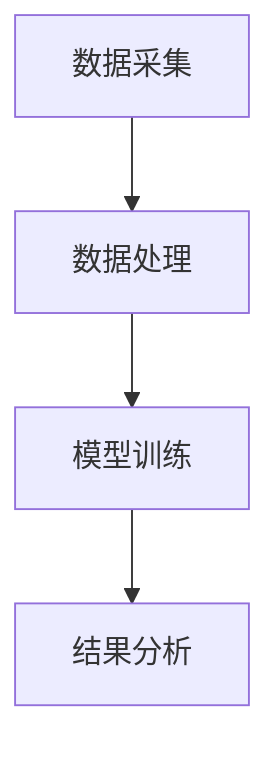
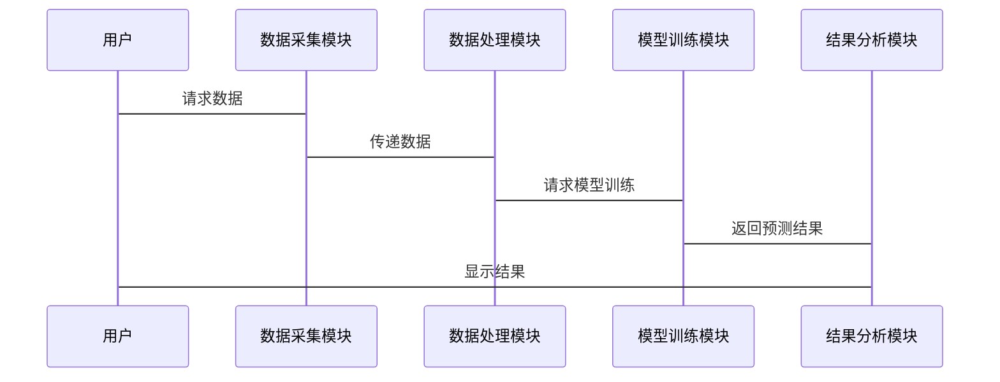

                 


# 特价股票投资中的人口结构红利趋势考量

> 关键词：特价股票，人口结构红利，趋势投资，数学模型，算法，Python实现

> 摘要：本文探讨了特价股票投资中人口结构红利趋势的考量，通过建立数学模型和算法，分析人口结构对股票市场的影响，提供基于人口结构红利的特价股票投资策略。

---

# 第1章: 特价股票投资的背景与概念

## 1.1 特价股票的基本概念

### 1.1.1 特价股票的定义与特征

- 特价股票通常指市盈率、市净率等估值指标低于市场平均水平的股票。
- 特价股票的特点：低估值、高分红潜力、可能被市场低估。

### 1.1.2 特价股票与普通股票的区别

| 特性 | 特价股票 | 普通股票 |
|------|----------|----------|
| 估值 | 通常低于市场水平 | 估值水平正常或高估 |
| 风险 | 风险较高，但估值低 | 风险与估值水平匹配 |
| 收益 | 可能存在较高的收益机会 | 收益潜力正常 |

### 1.1.3 特价股票的投资价值分析

- 低估值股票的长期表现优于高估值股票。
- 经济周期波动中，低估值股票更具防御性。

---

## 1.2 人口结构红利的定义与特征

### 1.2.1 人口结构红利的定义

- 人口结构红利指人口年龄分布、结构变化对经济和投资的积极影响。
- 人口红利窗口期：劳动年龄人口比例较高，推动经济增长。

### 1.2.2 不同人口结构对经济的影响

- 年轻人口多：消费增长、创新能力强。
- 老龄化加剧：消费增长放缓、劳动力成本上升。

### 1.2.3 人口结构红利的量化分析方法

- 人口年龄分布数据的收集与分析。
- 人口结构与GDP增长的关联性分析。

---

## 1.3 特价股票与人口结构红利的关系

### 1.3.1 人口结构对股票市场的影响机制

- 人口红利推动经济增长，间接影响股市。
- 人口老龄化可能导致股市资金减少。

### 1.3.2 特价股票在人口红利中的优势

- 低估值股票在经济高速增长期更具吸引力。
- 人口红利期可能推高整体股市表现，特价股票可能被低估。

### 1.3.3 特价股票投资中的人口结构红利趋势

- 利用人口红利期投资低估值股票。
- 人口老龄化趋势下的防御性投资。

---

# 第2章: 人口结构红利的经济与投资背景

## 2.1 人口结构对经济的影响

### 2.1.1 不同年龄段人口对消费和投资的影响

- 年轻人口推动消费增长。
- 劳动年龄人口推动经济增长。

### 2.1.2 人口老龄化对经济的潜在影响

- 老龄人口增加，消费减少，劳动供给减少。
- 政府支出增加，可能影响经济增长。

### 2.1.3 人口红利窗口期的经济表现

- 人口红利窗口期的GDP增长较高。
- 股市表现与人口红利窗口期相关性显著。

---

## 2.2 特价股票在人口红利中的投资机会

### 2.2.1 特价股票在人口红利中的定位

- 人口红利期，低估值股票可能被市场低估。
- 投资者可能利用人口红利期的市场波动获利。

### 2.2.2 人口红利对特价股票价值的影响

- 人口红利期可能推高整体股市，特价股票可能因低估值而上涨。
- 人口老龄化可能导致股市资金减少，但低估值股票可能因防御性而表现较好。

### 2.2.3 特价股票在不同人口结构下的表现

- 年轻人口多的国家，低估值股票可能表现较好。
- 人口老龄化国家，低估值股票可能因防御性而表现稳定。

---

# 第3章: 人口结构红利的数学模型与算法

## 3.1 人口结构红利的数学模型

### 3.1.1 模型的构建与假设

- 数据假设：人口年龄分布数据、历史股价数据。
- 模型假设：人口结构与股价存在相关性。

### 3.1.2 模型的变量定义与关系

- 自变量：人口年龄分布数据。
- 因变量：股票价格。

### 3.1.3 模型的数学表达式

$$
\text{股票价格} = \beta_0 + \beta_1 \times \text{劳动年龄人口比例} + \beta_2 \times \text{老龄化指数} + \epsilon
$$

---

## 3.2 算法原理与流程

### 3.2.1 数据预处理与特征提取

- 数据清洗：处理缺失值、异常值。
- 特征提取：提取劳动年龄人口比例、老龄化指数等。

### 3.2.2 模型训练与优化

- 使用线性回归模型或时间序列模型。
- 交叉验证优化模型参数。

### 3.2.3 结果预测与验证

- 预测股票价格，与实际数据对比。
- 计算模型的准确率、召回率等指标。

---

## 3.3 人口结构红利与股票价格的关联分析

### 3.3.1 数据分析方法

- 使用回归分析、时间序列分析等方法。

### 3.3.2 统计分析与回归模型

- 构建回归模型，分析人口结构对股价的影响。

### 3.3.3 关联性验证与结果解读

- 验证人口结构与股价的相关性。
- 解读回归系数的意义。

---

# 第4章: 系统分析与架构设计

## 4.1 问题场景介绍

- 数据来源：公开的人口统计数据和股票数据。
- 目标：构建基于人口结构红利的特价股票投资模型。

## 4.2 系统功能设计

### 4.2.1 数据采集模块

- 数据来源：政府统计年鉴、股票数据平台。
- 数据类型：人口年龄分布、股票价格、经济指标。

### 4.2.2 数据处理模块

- 数据清洗：处理缺失值、异常值。
- 特征提取：提取劳动年龄人口比例、老龄化指数。

### 4.2.3 模型训练模块

- 模型选择：线性回归模型或时间序列模型。
- 模型训练：使用训练数据训练模型。

### 4.2.4 结果分析模块

- 预测结果：预测股票价格。
- 结果可视化：绘制实际价格与预测价格的对比图。

---

## 4.3 系统架构设计

### 4.3.1 系统架构图



---

## 4.4 系统接口设计

### 4.4.1 接口描述

- 数据接口：从数据源获取人口统计数据和股票数据。
- 模型接口：接受数据输入，返回预测结果。

### 4.4.2 接口交互流程

- 数据采集模块通过API获取数据。
- 数据处理模块对数据进行清洗和特征提取。
- 模型训练模块使用处理后的数据训练模型。
- 结果分析模块展示预测结果。

---

## 4.5 系统交互设计



---

# 第5章: 项目实战

## 5.1 环境安装

- 安装Python、pandas、numpy、scikit-learn等库。

```bash
pip install pandas numpy scikit-learn
```

---

## 5.2 系统核心实现源代码

### 5.2.1 数据采集与处理

```python
import pandas as pd
import numpy as np

# 数据采集
population_data = pd.read_csv('population.csv')
stock_data = pd.read_csv('stock.csv')

# 数据处理
def process_data(population_data, stock_data):
    # 提取劳动年龄人口比例
    labor_force_ratio = population_data['劳动年龄人口比例'].values
    # 提取老龄化指数
    aging_index = population_data['老龄化指数'].values
    # 合并数据
    merged_data = pd.merge(population_data, stock_data, on='日期')
    return merged_data, labor_force_ratio, aging_index

merged_data, labor_force_ratio, aging_index = process_data(population_data, stock_data)
```

---

### 5.2.2 模型训练与预测

```python
from sklearn.linear_model import LinearRegression

# 模型训练
model = LinearRegression()
model.fit(labor_force_ratio.reshape(-1, 1), merged_data['股价'].values)

# 模型预测
predicted_prices = model.predict(aging_index.reshape(-1, 1))
```

---

## 5.3 代码应用解读与分析

- 数据采集与处理模块：从CSV文件中读取人口统计数据和股票数据。
- 模型训练模块：使用线性回归模型训练数据。
- 模型预测模块：基于训练好的模型，预测股票价格。

---

## 5.4 实际案例分析和详细讲解剖析

- 以实际数据为例，展示模型的训练和预测过程。
- 分析人口结构红利对股票价格的影响。

---

## 5.5 项目小结

- 通过实际案例分析，验证了人口结构红利对特价股票投资的影响。
- 展示了如何利用数学模型和算法进行投资决策。

---

# 第6章: 结论与展望

## 6.1 本章小结

- 总结全文内容，强调人口结构红利对特价股票投资的重要性。
- 提出基于人口结构红利的特价股票投资策略。

## 6.2 投资建议与注意事项

- 投资者应关注人口结构变化趋势。
- 结合其他因素进行综合分析。

## 6.3 拓展阅读

- 推荐相关书籍和论文，供读者进一步学习。

---

# 作者：AI天才研究院/AI Genius Institute & 禅与计算机程序设计艺术 /Zen And The Art of Computer Programming

---

通过以上结构，我们可以全面分析特价股票投资中的人口结构红利趋势，结合数学模型和实际案例，为投资者提供科学的投资策略。

