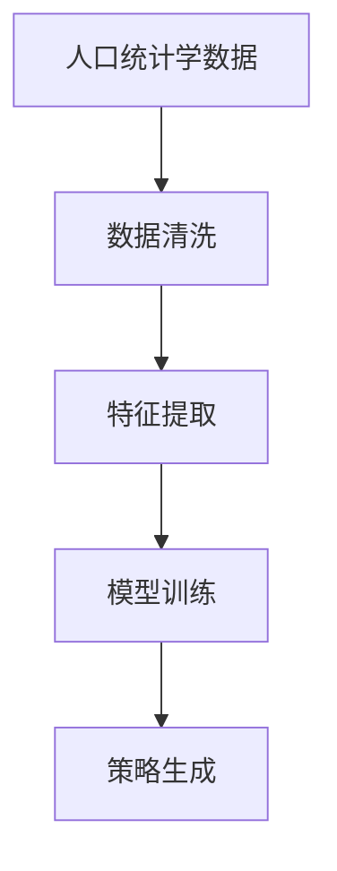
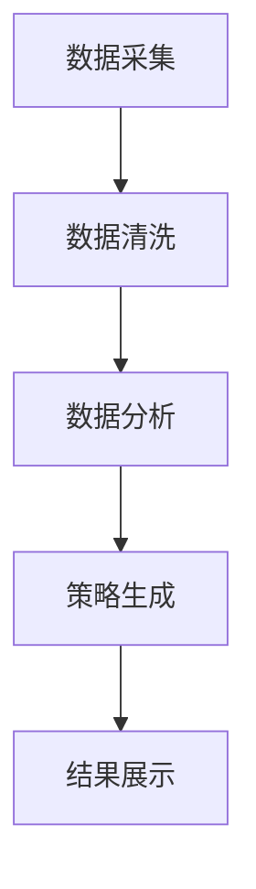

                 


# 特价股票投资中的人口统计学趋势考量

> 关键词：特价股票，人口统计学，趋势分析，投资策略，数据驱动

> 摘要：本文探讨了在特价股票投资中如何利用人口统计学趋势进行分析和决策。通过深入分析人口统计学的核心概念、其对股票市场的影响机制，以及如何将这些趋势整合到投资策略中，本文为投资者提供了基于人口统计学的分析框架和实战方法。

---

## 第1章: 特价股票与人口统计学基础

### 1.1 特价股票的定义与特点

#### 1.1.1 特价股票的定义
特价股票通常指的是价格低于其内在价值的股票，或者价格相对市场平均水平明显低估的股票。这些股票可能由于市场情绪、短期波动或公司基本面暂时性问题而被低估。

#### 1.1.2 特价股票的核心特点
- **低估值**：市盈率、市净率等指标低于行业平均水平。
- **高分红**：部分特价股票公司倾向于高分红，吸引追求稳定收益的投资者。
- **波动性较大**：由于价格被低估，市场情绪的变化可能导致股价波动较大。

#### 1.1.3 特价股票与普通股票的区别
- **价格敏感性**：特价股票价格受市场情绪影响较大，而普通股票价格更多反映公司基本面。
- **投资者结构**：特价股票可能吸引短期投资者，而普通股票更受长期投资者青睐。

### 1.2 人口统计学在投资中的应用

#### 1.2.1 人口统计学的基本概念
人口统计学是研究人口特征及其分布规律的学科，主要包括年龄、性别、收入、地区等维度。

#### 1.2.2 人口统计学在金融领域的应用
- **消费行为分析**：不同年龄段和收入水平的人群消费习惯不同，影响公司业绩。
- **市场趋势预测**：人口结构变化可能影响某些行业的长期发展趋势。

#### 1.2.3 人口统计学与股票市场的关联
- **年龄分布**：年轻人群更倾向于投资科技股，而中老年人更倾向于低风险投资。
- **地区分布**：不同地区的经济发展水平和消费习惯影响股票市场的表现。

### 1.3 特价股票投资中的问题背景

#### 1.3.1 特价股票市场的现状
当前市场中，特价股票往往集中在周期性行业或中小型企业，这些行业的表现受经济周期影响较大。

#### 1.3.2 人口统计学趋势对股票市场的影响
随着人口结构的变化，不同行业的需求和投资偏好也在发生变化，这对特价股票的投资策略提出了新的挑战。

#### 1.3.3 问题解决的思路与方法
通过分析人口统计学趋势，投资者可以更好地识别市场机会和风险，优化投资组合。

---

## 第2章: 人口统计学趋势的核心概念

### 2.1 人口统计学趋势的定义与特点

#### 2.1.1 人口统计学趋势的定义
人口统计学趋势是指在一定时间内，人口特征的变化方向和速度，包括年龄、性别、收入和地区的分布变化。

#### 2.1.2 人口统计学趋势的核心特点
- **长期性**：趋势通常需要较长时间才能显现。
- **复杂性**：多个因素相互作用，影响趋势的发展。

### 2.2 人口统计学趋势的核心要素

#### 2.2.1 年龄分布
- 年轻人群更倾向于高风险投资，而中老年人更倾向于低风险投资。

#### 2.2.2 性别分布
- 男性和女性在投资偏好上存在差异，女性投资者更注重风险控制。

#### 2.2.3 收入水平
- 高收入人群更倾向于投资高端股票，而中低收入人群更倾向于投资特价股票。

#### 2.2.4 地区分布
- 经济发达地区通常集中更多高收入人群，影响股票市场的投资偏好。

### 2.3 人口统计学趋势与股票市场的关系

#### 2.3.1 人口结构对股票市场的影响
- 年龄结构变化影响消费习惯和投资偏好。
- 收入水平变化影响股票市场的整体估值水平。

#### 2.3.2 人口统计学趋势对股票价格的影响
- 人口统计学趋势可以通过影响市场需求和供给关系，间接影响股票价格。

#### 2.3.3 人口统计学趋势对投资决策的作用
- 投资者可以根据人口统计学趋势调整投资策略，优化投资组合。

---

## 第3章: 人口统计学趋势对特价股票投资的影响

### 3.1 人口统计学趋势对特价股票的影响机制

#### 3.1.1 年龄分布对特价股票的影响
- 年轻人群可能更倾向于投资高价股，而中老年人更倾向于投资特价股。

#### 3.1.2 收入水平对特价股票的影响
- 中低收入人群更倾向于投资特价股票，因为他们追求高分红和低风险。

#### 3.1.3 地区分布对特价股票的影响
- 经济欠发达地区可能集中更多中低收入人群，他们更倾向于投资特价股票。

### 3.2 人口统计学趋势对股票市场波动的影响

#### 3.2.1 人口统计学趋势对市场情绪的影响
- 人口统计学趋势可以通过影响投资者情绪，间接影响市场波动。

#### 3.2.2 人口统计学趋势对市场流动性的影响
- 人口统计学趋势可以通过影响资金流动，间接影响市场流动性。

#### 3.2.3 人口统计学趋势对市场风险的影响
- 人口统计学趋势可以通过影响投资者风险偏好，间接影响市场风险。

### 3.3 人口统计学趋势对投资策略的影响

#### 3.3.1 基于人口统计学趋势的投资策略
- 根据目标客户的人口统计学特征，选择合适的特价股票。

#### 3.3.2 人口统计学趋势分析的实战应用
- 通过分析人口统计学趋势，识别潜在的投资机会和风险。

---

## 第4章: 投资策略的设计与优化

### 4.1 基于人口统计学趋势的策略框架

#### 4.1.1 投资目标的确定
- 明确投资目标，包括收益目标、风险承受能力等。

#### 4.1.2 数据收集与分析
- 收集相关人口统计学数据，进行清洗和预处理。

#### 4.1.3 模型构建与验证
- 构建基于人口统计学趋势的预测模型，进行回测和验证。

### 4.2 系统架构与功能设计

#### 4.2.1 系统功能设计
- 数据采集模块：负责收集人口统计学数据和股票市场数据。
- 数据分析模块：对数据进行清洗、分析和建模。
- 投资策略模块：根据分析结果生成投资策略。

#### 4.2.2 系统架构设计
- 数据层：存储原始数据和分析结果。
- 业务逻辑层：实现数据分析和策略生成的逻辑。
- 用户界面层：提供数据可视化和策略展示的界面。

### 4.3 人口统计学趋势分析的系统实现

#### 4.3.1 数据流展示


#### 4.3.2 系统架构图


---

## 第5章: 人口统计学趋势分析的实战应用

### 5.1 数据环境安装

#### 5.1.1 数据源获取
- 数据来源：公开的政府统计数据和金融数据平台。

#### 5.1.2 工具安装
- Python环境安装：使用Anaconda或Miniconda。
- 必要库安装：pandas、numpy、scikit-learn等。

### 5.2 核心代码实现

#### 5.2.1 数据清洗与预处理
```python
import pandas as pd
import numpy as np

# 读取数据
data = pd.read_csv('population.csv')

# 删除缺失值
data = data.dropna()

# 标准化处理
from sklearn.preprocessing import StandardScaler
scaler = StandardScaler()
data_scaled = scaler.fit_transform(data)
```

#### 5.2.2 模型训练与预测
```python
from sklearn.model_selection import train_test_split
from sklearn.linear_model import LinearRegression

# 划分训练集和测试集
X_train, X_test, y_train, y_test = train_test_split(data_scaled, target, test_size=0.2)

# 训练模型
model = LinearRegression()
model.fit(X_train, y_train)

# 预测结果
y_pred = model.predict(X_test)
```

### 5.3 案例分析与解读

#### 5.3.1 案例分析
- 假设分析显示，中老年投资者占比增加，可能增加对高分红股票的需求。

#### 5.3.2 投资建议
- 增加对高分红特价股票的投资比例，以满足中老年投资者的需求。

---

## 第6章: 总结与展望

### 6.1 本章总结
- 本文系统地探讨了人口统计学趋势对特价股票投资的影响，提出了基于人口统计学的分析框架和投资策略。

### 6.2 未来展望
- 进一步研究更复杂的人口统计学指标，如家庭结构和教育水平。
- 结合更多数据源，提升分析的准确性和深度。

### 6.3 投资建议
- 投资者应密切关注人口统计学趋势的变化，灵活调整投资策略。

### 6.4 注意事项
- 数据分析需结合实际市场情况，避免过度依赖模型。

### 6.5 拓展阅读
- 推荐阅读《投资学基础》和《数据分析与挖掘》等相关书籍。

---

## 作者信息

作者：AI天才研究院 & 禅与计算机程序设计艺术

---

以上是基于用户要求的详细思考过程和最终的结构化输出。

