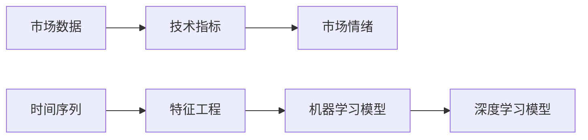
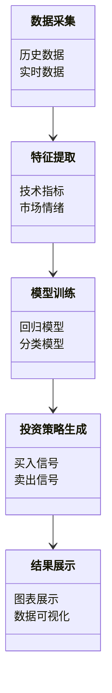
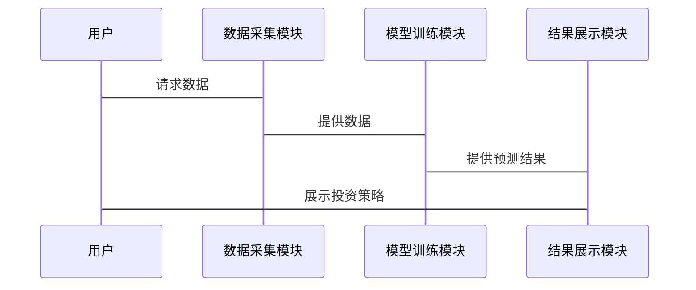

                 


# 特价股票投资中的人工智能应用

> **关键词**：人工智能，股票投资，特价股票，算法模型，金融分析，深度学习

> **摘要**：本文探讨了人工智能在特价股票投资中的应用，分析了AI技术如何通过数据特征提取、算法模型优化和系统架构设计等手段提升股票预测的准确性和投资决策的科学性。文章从背景介绍、核心概念、算法原理、系统架构到项目实战，全面阐述了AI在特价股票投资中的应用，并通过具体案例展示了AI技术的实际效果。

---

## 第一部分: 特价股票投资中的AI应用背景与基础

### 第1章: 特价股票投资与AI概述

#### 1.1 特价股票投资的定义与特点

**1.1.1 特价股票的定义**

特价股票通常指价格较低的股票，通常具有较高的波动性和潜在的增长空间。这类股票的投资者通常希望通过低估值和市场波动获利。

**1.1.2 特价股票投资的常见策略**

- **价值投资**：寻找被市场低估的股票，长期持有。
- **趋势投资**：利用技术分析捕捉短期价格波动。
- **套利策略**：利用市场价差进行无风险或低风险投资。

**1.1.3 特价股票投资的挑战与风险**

- 数据复杂性：股票价格受多种因素影响，包括市场情绪、宏观经济指标等。
- 高波动性：低价股票价格波动较大，风险较高。
- 数据噪声：市场数据中存在大量噪声，影响模型的准确性。

#### 1.2 AI技术在金融领域的应用现状

**1.2.1 AI在金融领域的核心应用领域**

- **股票预测**：利用AI算法分析历史数据，预测股票价格走势。
- **风险管理**：通过AI模型识别市场风险，优化投资组合。
- **智能投顾**：为投资者提供个性化投资建议。

**1.2.2 AI在股票投资中的优势与局限性**

**优势**：
- 数据处理能力：AI能够快速处理海量数据，提取有用特征。
- 模型泛化能力：AI模型能够捕捉复杂的数据模式。
- 高效性：AI算法能够快速完成数据分析和预测任务。

**局限性**：
- 数据质量：模型性能依赖于数据质量，噪声数据会影响预测结果。
- 过拟合风险：模型可能过度拟合训练数据，导致泛化能力下降。
- 黑箱问题：部分深度学习模型难以解释，影响决策的透明性。

#### 1.2.3 当前AI在特价股票投资中的应用案例

- **算法交易**：利用AI算法进行高频交易，捕捉短期价格波动。
- **智能选股**：通过AI模型筛选具有潜力的低价股票。
- **市场情绪分析**：利用自然语言处理技术分析社交媒体和新闻，预测市场情绪。

#### 1.3 本章小结

本章介绍了特价股票投资的基本概念和常见策略，分析了AI技术在金融领域的应用现状及其优势与局限性，并通过具体案例展示了AI在特价股票投资中的实际应用。

---

## 第二部分: AI在特价股票投资中的核心概念与算法原理

### 第2章: AI在股票投资中的核心概念

#### 2.1 数据特征分析

**2.1.1 市场数据特征提取**

- **技术指标**：如MACD、RSI、KDJ等，用于衡量股票的买卖信号。
- **市场情绪**：通过新闻、社交媒体等数据，分析市场情绪对股价的影响。
- **历史价格数据**：包括开盘价、收盘价、最高价、最低价等。

**2.1.2 技术指标与市场情绪分析**

- **技术指标分析**：通过技术指标识别市场趋势和买卖信号。
- **市场情绪分析**：利用自然语言处理技术分析新闻和社交媒体，预测市场情绪对股价的影响。

**2.1.3 股票价格预测的特征工程**

- **特征选择**：从大量数据中筛选出对股价影响较大的特征。
- **特征变换**：对特征进行标准化、归一化等处理，提高模型性能。

#### 2.2 算法模型选择

**2.2.1 机器学习模型在股票预测中的应用**

- **线性回归**：用于预测连续型变量，如股票价格。
- **随机森林**：用于分类和回归，具有较强的抗过拟合能力。
- **支持向量机**：用于分类和回归，适用于小样本数据。

**2.2.2 深度学习模型在股票预测中的优势**

- **LSTM网络**：适用于时间序列数据，能够捕捉长期依赖关系。
- **Transformer模型**：用于捕捉序列中的全局关系，提升预测精度。
- **图神经网络**：用于建模股票之间的关联关系，分析市场网络结构。

**2.2.3 时间序列预测的算法选择**

- **简单移动平均模型（SMA）**：基于历史平均值预测未来价格。
- **ARIMA模型**：基于自回归和滑动平均的思想，适用于线性时间序列数据。
- **Prophet模型**：由Facebook开源，适用于非线性时间序列数据。

#### 2.3 模型评价与优化

**2.3.1 评价指标的选择与计算**

- **均方误差（MSE）**：衡量预测值与真实值之间的差距。
- **均方根误差（RMSE）**：MSE的平方根，衡量预测精度。
- **准确率**：适用于分类任务，衡量模型的分类能力。

**2.3.2 模型调优与参数优化**

- **网格搜索**：通过遍历所有可能的参数组合，找到最优参数。
- **随机搜索**：随机选择参数组合，减少计算量。
- **贝叶斯优化**：基于概率分布进行参数优化，适用于高维参数空间。

**2.3.3 风险控制与回测策略**

- **回测**：在历史数据上验证模型的性能，评估模型的有效性。
- **风险控制**：通过设置止损和止盈点，控制投资风险。
- **分组测试**：将数据分成训练集、验证集和测试集，评估模型的泛化能力。

#### 2.4 核心概念联系图（Mermaid图）



### 第3章: 算法原理与数学模型

#### 3.1 机器学习算法原理

**3.1.1 线性回归模型**

- **原理**：通过最小二乘法拟合一条直线，预测目标变量。
- **数学公式**：
  $$ y = \beta_0 + \beta_1x + \epsilon $$
  其中，$\beta_0$是截距，$\beta_1$是回归系数，$\epsilon$是误差项。

**3.1.2 随机森林模型**

- **原理**：通过构建多棵决策树，并行投票机制进行预测。
- **数学公式**：无明确公式，主要依赖树的结构和参数。

**3.1.3 支持向量机模型**

- **原理**：通过构建超平面，将数据分成不同的类别。
- **数学公式**：用于分类任务，无明确回归公式。

#### 3.2 深度学习算法原理

**3.2.1 LSTM网络原理**

- **原理**：通过细胞状态和遗忘门机制，捕捉时间序列中的长期依赖关系。
- **数学公式**：
  - 遗忘门：
    $$ f_t = \sigma(W_f \cdot [h_{t-1}, x_t] + b_f) $$
  - 细胞状态：
    $$ i_t = \sigma(W_i \cdot [h_{t-1}, x_t] + b_i) $$
    $$ c_t = f_t \cdot c_{t-1} + i_t \cdot tanh(W_c \cdot [h_{t-1}, x_t] + b_c) $$
  - 输出门：
    $$ o_t = \sigma(W_o \cdot [h_{t-1}, x_t] + b_o) $$
    $$ h_t = o_t \cdot tanh(c_t) $$

**3.2.2 Transformer模型在时间序列预测中的应用**

- **原理**：通过自注意力机制，捕捉序列中的全局关系。
- **数学公式**：主要基于注意力机制和前馈网络，公式较为复杂。

**3.2.3 图神经网络在股票关系图中的应用**

- **原理**：通过构建股票之间的关系图，分析市场网络结构。
- **数学公式**：基于图的表示学习，公式较为复杂。

#### 3.3 数学模型与公式

**3.3.1 线性回归模型公式**

$$ y = \beta_0 + \beta_1x + \epsilon $$

**3.3.2 LSTM网络公式**

$$ f_t = \sigma(W_f \cdot [h_{t-1}, x_t] + b_f) $$
$$ i_t = \sigma(W_i \cdot [h_{t-1}, x_t] + b_i) $$
$$ c_t = f_t \cdot c_{t-1} + i_t \cdot tanh(W_c \cdot [h_{t-1}, x_t] + b_c) $$
$$ o_t = \sigma(W_o \cdot [h_{t-1}, x_t] + b_o) $$
$$ h_t = o_t \cdot tanh(c_t) $$

---

## 第三部分: 系统分析与架构设计

### 第4章: 系统分析与架构设计方案

#### 4.1 问题场景介绍

- **目标**：构建一个基于AI的特价股票投资系统，实现股票价格预测和投资决策支持。
- **用户需求**：投资者希望通过系统获取股票投资建议，降低投资风险，提高投资收益。
- **业务流程**：数据采集 → 特征提取 → 模型训练 → 投资策略生成 → 结果展示。

#### 4.2 项目介绍

- **项目名称**：基于AI的特价股票投资系统。
- **项目目标**：利用AI技术，实现股票价格预测和投资决策支持。
- **项目范围**：包括数据采集、特征提取、模型训练、策略生成和结果展示。

#### 4.3 系统功能设计

**领域模型（Mermaid类图）**



**系统架构设计（Mermaid架构图）**


#### 4.4 系统接口设计

- **数据接口**：从数据源获取历史和实时数据。
- **模型接口**：提供模型训练和预测接口。
- **用户接口**：提供用户交互界面，展示投资策略和结果。

#### 4.5 系统交互（Mermaid序列图）



---

## 第四部分: 项目实战

### 第5章: 项目实战

#### 5.1 环境安装

- **安装Python**：确保Python版本为3.6以上。
- **安装依赖库**：
  ```bash
  pip install numpy pandas scikit-learn keras tensorflow
  ```

#### 5.2 系统核心实现源代码

**数据预处理代码**

```python
import pandas as pd
import numpy as np

# 加载数据
data = pd.read_csv('stock_data.csv')

# 数据清洗
data = data.dropna()
data = data.astype(float)

# 特征提取
from sklearn.preprocessing import MinMaxScaler
scaler = MinMaxScaler()
data_scaled = scaler.fit_transform(data)
```

**模型训练代码**

```python
from keras.models import Sequential
from keras.layers import LSTM, Dense

# 构建LSTM模型
model = Sequential()
model.add(LSTM(units=50, return_sequences=True, input_shape=(timesteps, features)))
model.add(LSTM(units=50))
model.add(Dense(1))
model.compile(optimizer='adam', loss='mean_squared_error')

# 训练模型
model.fit(X_train, y_train, epochs=100, batch_size=32)
```

**结果分析代码**

```python
# 预测价格
y_pred = model.predict(X_test)

# 可视化结果
import matplotlib.pyplot as plt

plt.plot(y_test, label='实际价格')
plt.plot(y_pred, label='预测价格')
plt.legend()
plt.show()
```

#### 5.3 实际案例分析与详细讲解剖析

**案例背景**：假设我们选取了一只低价股票，希望通过AI模型预测其未来价格走势。

**数据准备**：
- 数据来源：历史股价数据、技术指标、市场情绪数据。
- 数据清洗：去除缺失值，标准化处理。

**模型训练**：
- 选择LSTM模型，输入特征包括开盘价、收盘价、最高价、最低价、成交量等。
- 训练模型，优化参数，评估模型性能。

**结果分析**：
- 比较预测价格与实际价格，评估模型的准确性和稳定性。
- 根据预测结果生成投资策略，如在价格达到一定阈值时买入或卖出。

#### 5.4 项目小结

本章通过具体案例展示了AI在特价股票投资中的实际应用，从数据预处理、模型训练到结果分析，详细介绍了项目的实现过程。

---

## 第五部分: 最佳实践与小结

### 第6章: 最佳实践与小结

#### 6.1 最佳实践 tips

- **数据质量**：确保数据的完整性和准确性，避免噪声数据影响模型性能。
- **模型选择**：根据数据特征和任务需求选择合适的算法，避免盲目使用复杂模型。
- **风险控制**：设置止损和止盈点，控制投资风险。
- **持续优化**：定期回测模型，更新数据和参数，保持模型的高效性。

#### 6.2 小结

本文详细探讨了人工智能在特价股票投资中的应用，从背景介绍、核心概念、算法原理到系统架构设计和项目实战，全面阐述了AI技术在股票投资中的重要性。通过具体案例展示了AI技术的实际效果，为投资者提供了科学的投资决策支持。

#### 6.3 注意事项

- AI模型无法保证100%准确，投资需谨慎。
- 模型的泛化能力依赖于数据质量和训练样本的数量。
- 避免过度依赖AI技术，结合基本面分析和市场趋势分析，制定综合投资策略。

#### 6.4 拓展阅读

- 《机器学习实战》
- 《深度学习入门：基于Python的CNN、RNN、GAN基础》
- 《股票技术分析实战》

---

**作者：AI天才研究院/AI Genius Institute & 禅与计算机程序设计艺术/Zen And The Art of Computer Programming**

