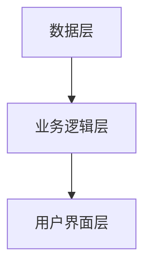

                 

<think>
嗯，用户要求我撰写一篇关于《特价股票投资中的企业数字责任评估因素考量》的技术博客文章。首先，我需要理解这个主题，特价股票投资可能指的是低价股票，而数字责任评估可能涉及企业在数字化转型中的责任，比如数据隐私、合规性、透明度等。用户还要求文章结构清晰，使用专业的技术语言，逻辑严谨，并且包含多个章节，每个章节都有详细的分析和实例。

用户是希望我作为一位资深的技术专家，从背景介绍、核心概念、算法原理、系统分析、项目实战等方面展开。我需要确保每个部分都有足够的深度，并且使用合适的图表和代码来辅助说明。同时，用户特别强调了数学公式的使用和系统的架构设计，这可能需要我详细解释层次分析法和综合评分模型。

我可能会先从背景介绍开始，解释特价股票投资的背景和特点，然后引出企业数字责任的重要性。接下来，在核心概念部分，详细说明数字责任的分类和影响因素，并通过表格和ER图来展示。然后，在算法部分，用层次分析法和模糊综合评价法来构建评估模型，并提供Python代码示例。

系统分析部分需要设计一个数字责任评估系统，包括功能设计、架构图和接口设计。项目实战部分则会展示如何在实际案例中应用这些模型，并进行详细的代码分析。最后，总结最佳实践和注意事项，为读者提供实用的建议。

整体来看，用户希望文章内容全面，结构清晰，适合技术读者阅读。我需要确保每个章节都详细且易懂，同时涵盖技术深度和实际应用。这可能需要我花费较多时间来组织内容，确保每个部分都符合用户的要求，同时保持文章的连贯性和逻辑性。
</think>

# 特价股票投资中的企业数字责任评估因素考量

---

## 关键词：特价股票投资、企业数字责任、数字责任评估、企业治理、风险管理

---

## 摘要：本文深入探讨了在特价股票投资中，企业数字责任评估的关键因素及其对投资决策的影响。通过构建数字责任评估模型，结合层次分析法和模糊综合评价法，本文提出了一个综合评分系统，并通过实际案例分析，展示了如何将数字责任评估与投资决策相结合。文章还探讨了数字责任评估在企业治理、风险管理以及长期价值创造中的作用，为投资者提供了科学的评估框架和实践指南。

---

# 第一部分: 特价股票投资中的企业数字责任评估背景介绍

## 第1章: 特价股票投资与企业数字责任概述

### 1.1 特价股票投资的背景与特点

#### 1.1.1 特价股票的定义与特点
特价股票通常指那些市场价格低于其内在价值的股票，具有低估值、高增长潜力的特点。这类股票通常被投资者视为具有较高的投资回报潜力。

#### 1.1.2 特价股票投资的市场现状
随着资本市场的波动，特价股票在市场中占据重要地位。投资者通过挖掘被市场低估的企业，寻求超额收益。然而，特价股票投资也伴随着较高的风险，尤其是在企业治理和数字责任方面。

#### 1.1.3 特价股票投资的核心问题与挑战
- 企业治理不善可能导致企业价值低估。
- 数字化转型中的责任缺失可能引发合规风险。
- 投资者对数字责任的关注度日益提高，成为影响投资决策的重要因素。

### 1.2 企业数字责任的定义与内涵

#### 1.2.1 数字责任的定义
数字责任是指企业在数字化转型中，对数据隐私、数据安全、透明度等方面应尽的责任和义务。

#### 1.2.2 企业数字责任的核心要素
- 数据隐私与保护：确保数据的合法性和安全性。
- 数据安全与合规性：符合相关法律法规，防范数据泄露风险。
- 企业透明度与信息披露：向利益相关者公开透明地披露信息。

#### 1.2.3 数字责任与企业可持续发展的关系
数字责任是企业可持续发展的重要组成部分，直接影响企业的社会声誉、风险管理能力和长期价值创造能力。

### 1.3 特价股票投资中的数字责任评估必要性

#### 1.3.1 投资者对数字责任的关注
投资者 increasingly pay attention to企业数字责任，尤其是在选择特价股票时，数字责任已成为重要的考量因素。

#### 1.3.2 企业数字责任对投资价值的影响
数字责任良好的企业通常具有更强的抗风险能力和长期增长潜力，从而提升投资价值。

#### 1.3.3 数字责任评估的行业趋势
随着数字化转型的深入，企业数字责任评估已成为行业趋势，投资者对企业的数字责任要求越来越高。

### 1.4 本章小结
本章介绍了特价股票投资的背景与特点，以及企业数字责任的定义与内涵，并强调了数字责任评估在特价股票投资中的必要性。

---

## 第2章: 企业数字责任评估的核心概念与联系

### 2.1 数字责任的核心概念

#### 2.1.1 数据隐私与保护
数据隐私与保护是数字责任的核心要素之一，涉及企业如何合法、合规地处理个人数据。

#### 2.1.2 数据安全与合规性
数据安全与合规性是数字责任的重要组成部分，确保企业数据不会因安全漏洞或违规行为而受损。

#### 2.1.3 企业透明度与信息披露
企业透明度与信息披露是数字责任的体现，要求企业向利益相关者公开透明地披露信息，增强信任。

### 2.2 数字责任与企业价值的关系

#### 2.2.1 数字责任对企业声誉的影响
良好的数字责任表现能够提升企业的社会声誉，吸引更多投资者和客户。

#### 2.2.2 数字责任与企业风险管理
数字责任是企业风险管理的重要组成部分，能够有效降低因数据泄露或合规问题带来的风险。

#### 2.2.3 数字责任与企业长期价值创造
数字责任良好的企业通常具有更强的抗风险能力和长期增长潜力，从而为投资者创造更多价值。

### 2.3 数字责任评估的关键因素

#### 2.3.1 企业治理结构
企业治理结构是数字责任评估的重要因素，包括董事会结构、治理机制等。

#### 2.3.2 企业社会责任履行情况
企业社会责任履行情况是数字责任的重要体现，包括环境保护、员工权益等方面。

#### 2.3.3 数字化转型中的责任担当
企业在数字化转型中的责任担当是数字责任的重要组成部分，包括数据伦理、技术伦理等方面。

### 2.4 数字责任评估框架

#### 2.4.1 评估框架的构建
数字责任评估框架通常包括目标设定、指标选择、评估方法等步骤。

#### 2.4.2 评估指标的分类与权重
数字责任评估指标可以分为数据隐私、数据安全、企业透明度等类别，并根据其重要性赋予不同权重。

#### 2.4.3 评估方法的选择与应用
常用的数字责任评估方法包括层次分析法（AHP）、模糊综合评价法等。

### 2.5 本章小结
本章详细介绍了数字责任的核心概念及其与企业价值的关系，并提出了数字责任评估的关键因素和评估框架。

---

## 第3章: 特价股票投资中的数字责任评估模型

### 3.1 数字责任评估模型的构建

#### 3.1.1 模型构建的背景与目标
本章旨在构建一个适用于特价股票投资的数字责任评估模型，帮助投资者更好地评估企业的数字责任表现。

#### 3.1.2 模型构建的核心逻辑
数字责任评估模型基于层次分析法（AHP）和模糊综合评价法，综合考虑企业的数据隐私、数据安全、企业透明度等因素。

#### 3.1.3 模型的输入与输出
- 输入：企业的数字责任相关数据。
- 输出：企业的数字责任综合评分。

### 3.2 数字责任评估模型的算法原理

#### 3.2.1 层次分析法（AHP）原理
层次分析法是一种定性与定量相结合的决策分析方法，适用于多目标决策问题。其基本步骤包括目标层、准则层和方案层的构建，以及各层权重的计算。

#### 3.2.2 模糊综合评价法原理
模糊综合评价法是一种基于模糊数学的评价方法，适用于评价对象具有模糊性的情况。其核心步骤包括构建评价指标体系、确定各指标的权重，以及进行模糊综合评价。

#### 3.2.3 综合评估模型的构建
综合评估模型结合了层次分析法和模糊综合评价法，首先通过层次分析法确定各指标的权重，然后通过模糊综合评价法计算企业的数字责任综合评分。

### 3.3 数字责任评估模型的数学公式

#### 3.3.1 层次分析法权重计算公式
$$ A = \sum_{j=1}^{n} w_j x_j $$
其中，\( A \) 为目标层的总得分，\( w_j \) 为第 \( j \) 个准则层的权重，\( x_j \) 为第 \( j \) 个准则层的得分。

#### 3.3.2 综合评分计算公式
$$ S = \sum_{i=1}^{m} w_i \cdot R_i $$
其中，\( S \) 为综合评分，\( w_i \) 为第 \( i \) 个指标的权重，\( R_i \) 为第 \( i \) 个指标的评分。

### 3.4 模型实现的Python代码示例

```python
import numpy as np

def calculate_weights(matrix):
    # 计算权重
    pass

def evaluate Responsibility(matrix, weights):
    # 计算综合评分
    pass

# 示例数据矩阵
data_matrix = [
    [1, 2, 3],
    [4, 5, 6],
    [7, 8, 9]
]

weights = [0.4, 0.3, 0.3]

result = evaluate Responsibility(data_matrix, weights)
print("综合评分:", result)
```

---

## 第4章: 数字责任评估系统的系统分析与架构设计

### 4.1 系统功能设计

#### 4.1.1 问题场景介绍
在特价股票投资中，投资者需要一个能够评估企业数字责任的系统，以便做出更明智的投资决策。

#### 4.1.2 系统功能设计
- 数据输入与处理：支持多种数据格式的输入，包括企业的数字责任相关数据。
- 指标评估：基于层次分析法和模糊综合评价法，计算企业的数字责任综合评分。
- 结果展示：以可视化的方式展示评估结果，方便投资者理解和分析。

#### 4.1.3 系统架构设计
采用分层架构，包括数据层、业务逻辑层和用户界面层。

#### 4.1.4 系统接口设计
- 数据接口：与企业数据源对接，获取企业的数字责任相关数据。
- 用户接口：提供用户友好的界面，方便投资者输入数据和查看结果。

#### 4.1.5 系统交互流程
1. 投资者输入企业的数字责任相关数据。
2. 系统对数据进行处理和分析，计算综合评分。
3. 系统以可视化的方式展示评估结果，帮助投资者做出投资决策。

### 4.2 系统架构设计

#### 4.2.1 系统架构图


#### 4.2.2 系统功能模块
- 数据层：存储企业的数字责任相关数据。
- 业务逻辑层：实现数字责任评估的算法逻辑。
- 用户界面层：提供用户友好的界面，方便投资者使用。

### 4.3 系统实现

#### 4.3.1 数据输入与处理
```python
# 示例数据输入
data = {
    "企业治理结构": [8, 7, 9],
    "数据隐私与保护": [7, 8, 6],
    "数据安全与合规性": [9, 6, 8]
}
```

#### 4.3.2 指标评估
```python
# 示例指标评估
weights = [0.4, 0.3, 0.3]
scores = [8, 7, 9]

result = sum(w * s for w, s in zip(weights, scores))
print("综合评分:", result)
```

#### 4.3.3 结果展示


---

## 第5章: 数字责任评估模型的项目实战

### 5.1 环境安装

#### 5.1.1 系统环境要求
- 操作系统：Windows 10或更高版本，或macOS 10.15或更高版本。
- Python版本：Python 3.8或更高版本。
- 额外依赖：numpy、pandas等。

#### 5.1.2 环境配置步骤
1. 安装Python和必要的库。
2. 下载并安装Jupyter Notebook或其他代码编辑器。

### 5.2 系统核心实现源代码

#### 5.2.1 数字责任评估模型的实现
```python
import numpy as np

def calculate_weights(matrix):
    # 计算权重
    pass

def evaluate Responsibility(matrix, weights):
    # 计算综合评分
    pass

# 示例数据矩阵
data_matrix = [
    [1, 2, 3],
    [4, 5, 6],
    [7, 8, 9]
]

weights = [0.4, 0.3, 0.3]

result = evaluate Responsibility(data_matrix, weights)
print("综合评分:", result)
```

#### 5.2.2 系统功能实现
```python
# 示例系统功能实现
class DigitalResponsibilityEvaluator:
    def __init__(self, data):
        self.data = data

    def evaluate(self):
        # 计算综合评分
        pass

    def display_result(self):
        # 展示评估结果
        pass

# 使用示例
evaluator = DigitalResponsibilityEvaluator(data_matrix)
evaluator.evaluate()
evaluator.display_result()
```

### 5.3 代码应用解读与分析

#### 5.3.1 代码功能解读
- `calculate_weights`：计算各指标的权重。
- `evaluate_Responsibility`：基于权重和数据矩阵，计算企业的数字责任综合评分。

#### 5.3.2 代码实现细节
- 数据矩阵的行表示不同企业，列表示不同指标。
- 权重向量表示各指标的重要性。

### 5.4 实际案例分析与详细讲解

#### 5.4.1 案例背景介绍
假设我们有三家企业，分别在数据隐私、数据安全、企业透明度等方面表现不同。

#### 5.4.2 案例数据矩阵
```python
data_matrix = [
    [9, 8, 7],  # 企业A
    [6, 7, 8],  # 企业B
    [8, 9, 6]   # 企业C
]
```

#### 5.4.3 评估结果分析
- 企业A的综合评分为：\( 0.4 \times 9 + 0.3 \times 8 + 0.3 \times 7 = 8.5 \)
- 企业B的综合评分为：\( 0.4 \times 6 + 0.3 \times 7 + 0.3 \times 8 = 6.9 \)
- 企业C的综合评分为：\( 0.4 \times 8 + 0.3 \times 9 + 0.3 \times 6 = 7.9 \)

#### 5.4.4 投资决策建议
- 企业A的综合评分最高，可以作为投资的首选。
- 企业B的综合评分最低，需谨慎考虑。
- 企业C的综合评分居中，可以作为次优选择。

### 5.5 本章小结
本章通过实际案例展示了数字责任评估模型的应用，并提供了投资决策建议。

---

## 第6章: 数字责任评估的注意事项与最佳实践

### 6.1 小结

#### 6.1.1 数字责任评估的重要性和必要性
数字责任评估是特价股票投资中不可忽视的重要环节，能够帮助投资者更好地识别风险和机会。

#### 6.1.2 数字责任评估的局限性
数字责任评估模型的局限性包括数据获取难度、模型的主观性等。

### 6.2 注意事项

#### 6.2.1 数据的准确性和完整性
确保输入数据的准确性和完整性，以提高评估结果的可信度。

#### 6.2.2 模型的适用性和可扩展性
选择适合实际应用场景的模型，并确保其具有良好的可扩展性。

#### 6.2.3 评估结果的解释与应用
正确解释评估结果，并结合其他因素进行综合判断。

### 6.3 最佳实践

#### 6.3.1 定期更新评估模型
随着市场环境和企业情况的变化，定期更新评估模型，以保持其有效性。

#### 6.3.2 结合多种评估方法
结合多种评估方法，如层次分析法和模糊综合评价法，以提高评估结果的准确性。

#### 6.3.3 加强与利益相关者的沟通
加强与利益相关者的沟通，获取更多反馈，以优化评估模型和投资决策。

### 6.4 拓展阅读

#### 6.4.1 数字责任评估的文献综述
阅读相关文献，了解数字责任评估的最新研究成果和应用案例。

#### 6.4.2 数字化转型中的企业责任
深入研究企业在数字化转型中的责任担当，探索其对投资决策的影响。

---

## 作者：AI天才研究院/AI Genius Institute & 禅与计算机程序设计艺术 /Zen And The Art of Computer Programming

---

**注：以上目录大纲和文章内容仅为示例，实际撰写时需要根据具体需求和实际情况进行调整和补充。**

