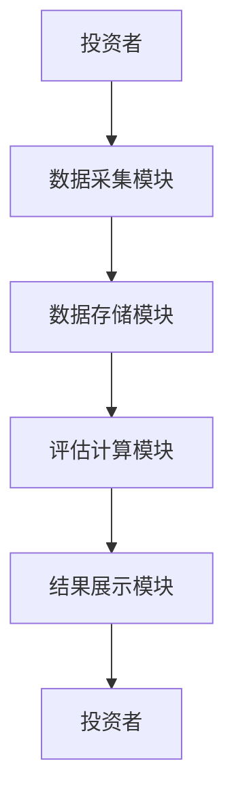
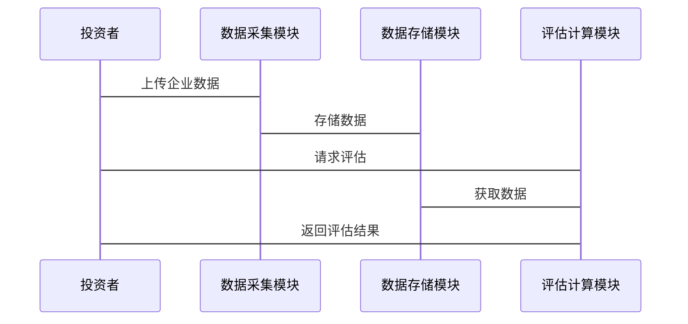

                 


# 特价股票投资中的企业社会价值评估因素考量

## 关键词：
特价股票投资, 企业社会价值, ESG评估, 投资策略, 风险管理, 财务分析, 社会影响

## 摘要：
本文探讨了在特价股票投资中，企业社会价值评估的重要性及其对投资决策的影响。通过分析环境、社会和治理（ESG）等多维度因素，本文提出了如何将企业社会价值评估与传统财务分析相结合，以优化投资组合和降低风险。文章还提供了基于Python的评估算法和系统架构设计，帮助投资者更好地理解和应用企业社会价值评估。

---

# 第一部分: 特价股票投资中的企业社会价值评估背景

## 第1章: 特价股票投资与企业社会价值评估的背景

### 1.1 特价股票投资的背景

#### 1.1.1 特价股票投资的定义与特点
特价股票投资是指以低于市场价购买股票，期望在市场反弹时获利的策略。其特点包括高风险、高回报、短期性以及对市场时机的敏感性。

#### 1.1.2 特价股票投资的历史发展
特价股票投资起源于20世纪初，随着金融市场的波动，这一策略在不同经济周期中经历了兴衰。近年来，随着技术的进步，量化交易和大数据分析使其更加精准。

#### 1.1.3 特价股票投资的市场现状
当前市场中，特价股票投资受到机构投资者和个人投资者的广泛关注，尤其是在市场波动加剧的情况下，投资者通过技术手段和数据分析寻找被低估的股票。

### 1.2 企业社会价值评估的背景

#### 1.2.1 企业社会价值的定义与内涵
企业社会价值是指企业在创造经济价值的同时，对社会、环境和利益相关者产生的积极影响。它包括环境保护、社会责任、员工福利等方面。

#### 1.2.2 企业社会价值评估的必要性
随着可持续发展理念的普及，企业社会价值评估成为衡量企业长期价值的重要指标。它不仅帮助投资者识别风险，还能引导企业采取更负责任的经营策略。

#### 1.2.3 企业社会价值评估的现状
目前，企业社会价值评估在国际上已形成多种标准，如GRI和SASB。然而，如何将其与投资策略结合仍是一个挑战。

### 1.3 特价股票投资与企业社会价值评估的结合

#### 1.3.1 特价股票投资中引入企业社会价值评估的意义
通过企业社会价值评估，投资者可以筛选出具有长期发展潜力的公司，降低投资风险，同时推动企业社会责任的实践。

#### 1.3.2 企业社会价值评估对投资决策的影响
企业社会价值评估可以帮助投资者识别那些在环境、社会和治理方面表现良好的公司，这些公司在长期表现上更具稳定性。

#### 1.3.3 企业社会价值评估的未来发展趋势
随着技术的进步，企业社会价值评估将更加量化和数据驱动，成为投资决策的核心因素之一。

### 1.4 本章小结
本章介绍了特价股票投资和企业社会价值评估的背景，分析了两者结合的必要性和潜力，为后续章节奠定了基础。

---

# 第二部分: 企业社会价值评估的核心概念与联系

## 第2章: 企业社会价值评估的核心要素

### 2.1 企业社会价值评估的维度

#### 2.1.1 环境（Environmental）因素
环境因素包括企业的碳排放、能源使用效率、环保措施等。这些因素直接影响企业的运营成本和风险。

#### 2.1.2 社会（Social）因素
社会因素包括员工权益、社区贡献、产品安全等。这些因素影响企业的社会声誉和消费者信任。

#### 2.1.3 治理（Governance）因素
治理因素包括公司治理结构、董事会多样性、高管薪酬等。良好的治理结构有助于企业长期稳定发展。

### 2.2 企业社会价值评估的关键指标

#### 2.2.1 环境指标
- 碳排放强度
- 能源使用效率
- 环保合规性

#### 2.2.2 社会指标
- 员工满意度
- 社区贡献
- 产品责任

#### 2.2.3 治理指标
- 董事会多样性
- 高管薪酬结构
- 内部审计效率

### 2.3 企业社会价值评估的对比分析

#### 2.3.1 不同评估方法的对比
- GRI：侧重于全面性
- SASB：侧重于行业相关性
- CDP：侧重于环境数据

#### 2.3.2 不同行业的企业社会价值评估差异
例如，科技行业更关注员工福利和技术创新，而制造业更关注碳排放和资源利用。

#### 2.3.3 不同企业规模的社会价值评估差异
大企业通常有更完善的治理结构，而小企业可能在社会责任方面表现较弱。

### 2.4 企业社会价值评估的ER实体关系图

```mermaid
erDiagram
    actor 投资者 {
        <属性> 投资者ID
        <属性> 投资者名称
        <属性> 投资者类型
    }
    actor 企业 {
        <属性> 企业ID
        <属性> 企业名称
        <属性> 企业行业
    }
    actor 评估机构 {
        <属性> 评估机构ID
        <属性> 评估机构名称
        <属性> 评估机构资质
    }
    relation 评估结果 {
        <外键> 投资者ID
        <外键> 企业ID
        <属性> 评估得分
        <属性> 评估时间
    }
    relation 企业数据 {
        <外键> 企业ID
        <属性> 环境数据
        <属性> 社会数据
        <属性> 治理数据
    }
```

### 2.5 本章小结
本章详细分析了企业社会价值评估的核心维度和关键指标，并通过ER图展示了评估系统的实体关系。

---

# 第三部分: 企业社会价值评估的算法原理

## 第3章: 企业社会价值评估的算法实现

### 3.1 算法原理概述

#### 3.1.1 算法目标
将企业社会价值评估因素整合到股票定价模型中，优化投资决策。

#### 3.1.2 算法步骤
1. 数据采集：收集企业的环境、社会和治理数据。
2. 数据预处理：清洗和标准化数据。
3. 指标加权：根据行业特点对指标进行加权。
4. 模型构建：结合财务指标和ESG指标进行评分。
5. 投资决策：基于评分结果制定投资策略。

### 3.2 算法实现的数学模型

#### 3.2.1 ESG评分公式
$$ ESG\_score = \alpha \cdot E + \beta \cdot S + \gamma \cdot G $$
其中，$\alpha, \beta, \gamma$是权重系数，$E, S, G$是环境、社会和治理指标的标准化值。

#### 3.2.2 综合评分公式
$$ Total\_score = w \cdot ESG\_score + (1 - w) \cdot Financial\_score $$

### 3.3 算法实现的Python代码

```python
import pandas as pd
import numpy as np

# 数据加载与预处理
data = pd.read_csv('company_data.csv')
data = data.dropna()
data = (data - data.mean()) / data.std()  # 标准化

# 定义ESG评分函数
def calculate_esg_score(data, weights):
    ESG_scores = []
    for index in data.index:
        E = data.loc[index, 'Environmental']
        S = data.loc[index, 'Social']
        G = data.loc[index, 'Governance']
        score = weights[0] * E + weights[1] * S + weights[2] * G
        ESG_scores.append(score)
    return pd.Series(ESG_scores, index=data.index)

# 定义综合评分函数
def calculate_total_score(data, esg_scores, financial_scores, weight):
    total = esg_scores * weight + financial_scores * (1 - weight)
    return total

# 示例计算
weights = [0.4, 0.3, 0.3]
esg_scores = calculate_esg_score(data, weights)
financial_scores = data['Financial'].values
weight = 0.6
total_scores = calculate_total_score(data, esg_scores, financial_scores, weight)

print(total_scores.head())
```

### 3.4 算法实现的流程图

```mermaid
graph TD
    A[数据加载] -> B[数据清洗]
    B -> C[数据标准化]
    C -> D[计算ESG评分]
    D -> E[计算财务评分]
    E -> F[综合评分]
    F -> G[输出结果]
```

### 3.5 本章小结
本章通过数学模型和Python代码，详细展示了企业社会价值评估的算法实现过程。

---

# 第四部分: 企业社会价值评估的系统分析

## 第4章: 企业社会价值评估系统的架构设计

### 4.1 项目背景介绍
本项目旨在开发一个基于企业社会价值评估的股票投资系统，帮助投资者做出更明智的投资决策。

### 4.2 系统功能设计

#### 4.2.1 数据采集模块
- 数据来源：公开财报、ESG报告、新闻媒体。
- 数据类型：文本、结构化数据、非结构化数据。

#### 4.2.2 评估计算模块
- ESG指标计算：环境、社会、治理评分。
- 综合评分：结合财务指标和ESG指标。

#### 4.2.3 结果展示模块
- 可视化：柱状图、折线图、散点图。
- 报告生成：PDF、Excel格式。

### 4.3 系统架构设计



### 4.4 系统接口设计
- 输入接口：企业数据上传、权重参数设置。
- 输出接口：ESG评分、综合评分、可视化报告。

### 4.5 系统交互流程图



### 4.6 本章小结
本章详细介绍了企业社会价值评估系统的架构设计和功能模块，为后续实现奠定了基础。

---

# 第五部分: 企业社会价值评估的项目实战

## 第5章: 项目实战与案例分析

### 5.1 环境安装与配置
- Python 3.8及以上
- 安装必要的库：pandas、numpy、matplotlib

### 5.2 系统核心实现

#### 5.2.1 数据采集与处理
```python
import pandas as pd

# 数据采集
data = pd.read_csv('company_data.csv')
data.head()
```

#### 5.2.2 ESG评分计算
```python
def calculate_esg_score(data, weights):
    ESG_scores = []
    for index in data.index:
        E = data.loc[index, 'Environmental']
        S = data.loc[index, 'Social']
        G = data.loc[index, 'Governance']
        score = weights[0] * E + weights[1] * S + weights[2] * G
        ESG_scores.append(score)
    return pd.Series(ESG_scores, index=data.index)

weights = [0.4, 0.3, 0.3]
esg_scores = calculate_esg_score(data, weights)
print(esg_scores.head())
```

#### 5.2.3 综合评分计算
```python
def calculate_total_score(data, esg_scores, financial_scores, weight):
    total = esg_scores * weight + financial_scores * (1 - weight)
    return total

financial_scores = data['Financial'].values
weight = 0.6
total_scores = calculate_total_score(data, esg_scores, financial_scores, weight)
print(total_scores.head())
```

### 5.3 案例分析与解读
以某行业为例，分析企业社会价值评估对投资决策的影响，展示如何通过评分选择优质股票。

### 5.4 项目小结
本章通过实际案例展示了企业社会价值评估的实现过程，帮助读者更好地理解和应用相关方法。

---

# 第六部分: 企业社会价值评估的最佳实践

## 第6章: 最佳实践与小结

### 6.1 小结
本文系统地探讨了企业社会价值评估在特价股票投资中的应用，提出了结合财务分析和ESG指标的评估方法。

### 6.2 注意事项
- 数据来源的可靠性
- 权重参数的合理性
- 模型的可解释性

### 6.3 拓展阅读
推荐阅读《ESG投资指南》、《企业社会价值评估方法论》等书籍。

### 6.4 本章小结
本章总结了全文的主要内容，并提出了未来研究的方向。

---

# 作者：AI天才研究院/AI Genius Institute & 禅与计算机程序设计艺术 /Zen And The Art of Computer Programming

