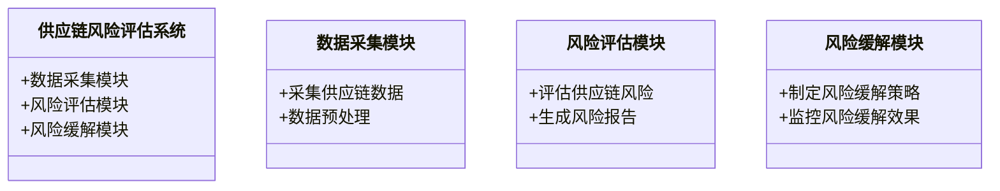
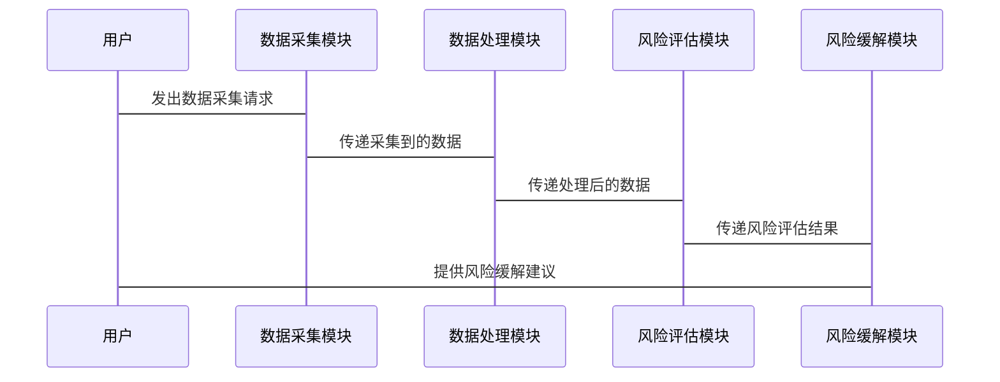

                 

<think>
嗯，我现在需要根据用户的指示，为《特价股票投资中的供应链风险评估》这篇文章撰写目录大纲。让我一步一步地思考如何构建这个大纲。

首先，用户希望文章结构清晰，章节标题吸引人，内容专业且逻辑性强。文章需要涵盖供应链风险评估在特价股票投资中的应用，包括背景、概念、算法、数学模型、系统架构、项目实战和最佳实践等方面。

**第一步：确定文章的核心关键词和摘要**
- 关键词应包括供应链风险、股票投资、供应链管理、风险评估、数学模型等，确保涵盖文章的主要内容。
- 摘要需要简洁地概括文章的主题，即探讨供应链风险在特价股票投资中的影响及评估方法，帮助投资者优化决策。

**第二步：规划文章的结构**
用户已经提供了一个详细的目录大纲，分为六个部分，每个部分都有具体的章节和小节。我需要确保每个部分都细化到位，并且逻辑连贯。

**第三步：细化每个章节的内容**
- **背景与意义**部分需要介绍供应链的基本概念、特价股票的特点，以及供应链风险评估的重要性。
- **核心概念与联系**部分需要详细解释供应链风险的类型、评估指标，以及其与股票投资的关系。
- **算法原理**部分应介绍蒙特卡洛模拟、模糊综合评价法和机器学习方法，提供步骤和优缺点分析。
- **数学模型**部分需要构建风险评分模型和优化模型，使用Latex公式进行详细推导。
- **系统分析与架构设计**部分应描述系统功能模块，设计数据流图和架构图，展示系统的结构和交互。
- **项目实战**部分需要指导读者如何安装工具、编写代码，并分析实际案例。
- **最佳实践**部分总结关键点，提出注意事项和拓展阅读建议。

**第四步：确保内容的完整性和详细性**
每个章节都需要包含丰富的细节，如定义、原理、步骤、公式、图表和代码示例。使用Mermaid流程图和类图来直观展示算法和系统架构。同时，提供实际案例分析，帮助读者理解理论的应用。

**第五步：检查格式和结构**
确保文章使用Markdown格式，符合用户的要求，包括关键词、摘要、目录和各章节内容。每个部分的标题要吸引人，内容逻辑清晰，结构紧凑。

通过以上步骤，我能够构建一个详细且逻辑清晰的目录大纲，确保文章内容全面，满足用户的需求。接下来，我将根据这些思考编写完整的文章内容。
</think>

# 特价股票投资中的供应链风险评估

**关键词**：供应链风险、股票投资、供应链管理、风险评估、数学模型

**摘要**：本文探讨供应链风险在特价股票投资中的重要性，分析供应链风险的来源及其对投资的影响。通过介绍多种评估方法，如蒙特卡洛模拟和机器学习算法，构建数学模型，并提供系统架构和实战案例，帮助投资者优化决策。

---

# 第一部分：供应链风险评估的背景与意义

## 第1章：供应链风险评估的背景与意义

### 1.1 供应链的基本概念与特点

#### 1.1.1 供应链的定义与组成
供应链是指围绕核心企业，将供应商、制造商、分销商、零售商和最终用户等联结成一个完整的链条。它包括物流、信息流和资金流，确保产品从生产到交付的高效运作。

#### 1.1.2 供应链管理的核心目标
供应链管理的目标是优化资源分配、降低成本、提高效率和增强客户满意度。通过协调各环节的活动，实现供应链的整体最优。

#### 1.1.3 供应链在股票投资中的作用
供应链的稳定性直接影响企业的运营能力和盈利能力。投资者通过分析供应链风险，可以评估企业的抗风险能力和投资价值。

### 1.2 特价股票投资的特点与动机

#### 1.2.1 特价股票的定义与分类
特价股票通常指价格低于市场价或历史价的股票，分为周期性特价、事件驱动特价和市场波动特价。投资者常在市场低迷时购买特价股票，期望在市场回升时获利。

#### 1.2.2 投资者参与特价股票的动机
投资者参与特价股票投资通常出于抄底心理、市场机会和分散投资的需求。特价股票可能隐藏着低估的价值，但也伴随着较高的风险。

#### 1.2.3 特价股票市场的风险特征
特价股票市场波动大，信息不对称严重，市场流动性不足，导致风险较高。投资者需要谨慎评估市场和公司基本面，避免盲目跟风。

### 1.3 供应链风险评估的重要性

#### 1.3.1 供应链风险的来源与类型
供应链风险主要来源于供应商风险、物流风险、库存风险和需求预测风险。供应商问题可能导致原材料短缺，物流问题可能延误交付，库存积压或不足影响运营，需求预测不准确导致资源浪费。

#### 1.3.2 供应链风险对股票投资的影响
供应链问题直接影响企业的生产能力和盈利能力，进而影响股价表现。供应链风险较高的企业可能面临股价波动大、收益不稳定的风险。

#### 1.3.3 供应链风险评估的必要性
通过评估供应链风险，投资者可以识别潜在风险点，制定应对策略，降低投资风险，提高投资决策的科学性和准确性。

### 1.4 本章小结
本章介绍了供应链的基本概念、特价股票的特点及其投资动机，分析了供应链风险的来源和类型，并强调了供应链风险评估在投资决策中的重要性。

---

# 第二部分：供应链风险评估的核心概念与联系

## 第2章：供应链风险评估的核心概念

### 2.1 供应链风险的定义与分类

#### 2.1.1 供应链风险的定义
供应链风险是指在供应链各环节中可能发生的不确定性事件，影响供应链的稳定性和高效运作。

#### 2.1.2 供应链风险的主要类型
- **供应风险**：供应商无法按时交付原材料或零部件。
- **生产风险**：生产过程中的设备故障或人员问题。
- **物流风险**：运输延误或物流成本增加。
- **需求风险**：需求预测不准确导致库存积压或短缺。
- **价格风险**：原材料或能源价格波动影响成本。

#### 2.1.3 每种风险类型的特征与影响
- **供应风险**：可能导致生产中断，影响交货时间，损害客户关系。
- **生产风险**：增加生产成本，降低效率，影响产品质量。
- **物流风险**：增加运输成本，延长交货时间，影响客户满意度。
- **需求风险**：库存积压或短缺，影响资金周转，增加财务压力。
- **价格风险**：成本上升，影响企业利润，削弱市场竞争力。

### 2.2 供应链风险评估的指标体系

#### 2.2.1 风险暴露程度的评估指标
- **风险暴露程度**：衡量企业在特定风险下的暴露程度。
- **风险影响范围**：评估风险对供应链各环节的影响范围。

#### 2.2.2 风险影响范围的评估指标
- **影响范围**：评估风险对供应链整体或特定环节的影响程度。
- **影响时间**：评估风险对供应链的影响持续时间。

#### 2.2.3 风险缓解能力的评估指标
- **缓解能力**：评估企业在面对风险时的应对措施和能力。
- **恢复能力**：评估企业在遭受风险后的恢复速度和能力。

### 2.3 供应链风险与股票投资的关系

#### 2.3.1 供应链风险对股价波动的影响
供应链问题可能导致企业利润下降，影响股价表现。例如，原材料价格上涨可能导致生产成本增加，进而影响企业盈利能力，导致股价下跌。

#### 2.3.2 供应链风险对投资回报的影响
供应链风险较高的企业可能面临更多的不确定性，投资回报不稳定。投资者需要综合评估企业的供应链管理能力，选择风险较低的企业进行投资。

#### 2.3.3 供应链风险在投资决策中的应用
投资者可以通过分析企业的供应链管理能力，评估其抗风险能力，进而制定投资策略。例如，选择供应链管理能力强的企业，可以降低投资风险，提高投资回报。

### 2.4 本章小结
本章详细解释了供应链风险的定义和分类，介绍了供应链风险评估的指标体系，并探讨了供应链风险与股票投资之间的关系。

---

# 第三部分：供应链风险评估的算法原理与数学模型

## 第3章：供应链风险评估的算法原理

### 3.1 基于概率的供应链风险评估方法

#### 3.1.1 蒙特卡洛模拟在供应链风险评估中的应用
蒙特卡洛模拟是一种基于概率的模拟方法，用于评估供应链中的不确定性和风险。通过模拟各种可能的供应链情景，评估风险的影响程度。

#### 3.1.2 蒙特卡洛模拟的步骤与实现
1. 确定供应链中的关键变量和概率分布。
2. 生成随机数，模拟供应链中的各种情景。
3. 计算每个情景下的风险指标。
4. 统计分析结果，评估供应链风险。

#### 3.1.3 蒙特卡洛模拟的优缺点分析
- **优点**：能够考虑多种变量的不确定性，提供全面的风险评估。
- **缺点**：计算复杂，需要大量的数据和计算资源。

### 3.2 基于模糊理论的供应链风险评估方法

#### 3.2.1 模糊综合评价法的原理
模糊综合评价法是一种基于模糊理论的评估方法，适用于处理供应链风险中的模糊性和不确定性。

#### 3.2.2 模糊综合评价法的步骤
1. 确定供应链风险的评价指标。
2. 构建模糊评价矩阵。
3. 计算各指标的模糊权重。
4. 综合评价，得出供应链风险的综合评价结果。

#### 3.2.3 模糊综合评价法的优缺点分析
- **优点**：能够处理模糊性和不确定性，适合供应链风险评估。
- **缺点**：计算过程复杂，需要专家参与。

### 3.3 基于机器学习的供应链风险评估方法

#### 3.3.1 机器学习在供应链风险评估中的应用
机器学习算法可以通过历史数据，学习供应链风险的模式和特征，预测未来的风险。

#### 3.3.2 常用算法（如随机森林、支持向量机）的实现步骤
1. 收集和整理供应链相关数据。
2. 数据预处理，包括数据清洗和特征选择。
3. 选择合适的机器学习算法，训练模型。
4. 验证模型的准确性和稳定性。
5. 使用模型进行供应链风险预测。

#### 3.3.3 机器学习方法的优缺点分析
- **优点**：能够处理复杂的数据关系，提高风险预测的准确性。
- **缺点**：需要大量的数据和计算资源，模型解释性较差。

### 3.4 本章小结
本章介绍了三种供应链风险评估的方法：蒙特卡洛模拟、模糊综合评价法和机器学习方法，分析了每种方法的原理、步骤和优缺点。

---

## 第4章：供应链风险评估的数学模型

### 4.1 供应链风险评分模型

#### 4.1.1 风险评分模型的构建
供应链风险评分模型通过量化各风险因素的影响程度，计算企业的供应链风险评分。公式如下：

$$
\text{风险评分} = \sum (\text{风险因素权重} \times \text{风险因素影响程度})
$$

#### 4.1.2 风险评分模型的实现步骤
1. 确定供应链风险的各因素及其权重。
2. 收集各风险因素的影响程度数据。
3. 计算各风险因素的评分。
4. 综合各因素评分，得出企业供应链风险评分。

### 4.2 供应链风险优化模型

#### 4.2.1 优化模型的构建
供应链风险优化模型旨在在供应链各环节中找到最优的资源配置，降低整体风险。目标函数为最小化供应链风险，约束条件包括资源限制和时间限制。

$$
\min \sum (\text{风险因素权重} \times \text{风险因素影响程度})
$$

#### 4.2.2 优化模型的求解方法
1. 确定目标函数和约束条件。
2. 选择合适的优化算法，如线性规划或遗传算法。
3. 求解模型，得到最优解。
4. 验证模型的可行性和有效性。

### 4.3 本章小结
本章构建了供应链风险评分模型和优化模型，详细介绍了模型的构建和求解方法。

---

# 第四部分：供应链风险评估的系统分析与架构设计

## 第5章：供应链风险评估的系统分析与架构设计

### 5.1 问题场景介绍

#### 5.1.1 供应链风险评估的需求分析
企业需要实时监控供应链中的风险因素，及时发现和处理潜在问题，确保供应链的稳定性和高效运作。

#### 5.1.2 供应链风险评估的关键问题
- 如何实时采集和处理供应链数据？
- 如何快速识别和评估供应链风险？
- 如何制定有效的风险缓解策略？

### 5.2 系统功能设计

#### 5.2.1 领域模型设计（Mermaid 类图）


### 5.3 系统架构设计（Mermaid 架构图）
```mermaid
container 供应链风险评估系统 {
    data flow: 数据源 -> 数据采集模块 -> 数据处理模块 -> 风险评估模块 -> 风险缓解模块 -> 输出结果
    component: 数据采集模块
    component: 数据处理模块
    component: 风险评估模块
    component: 风险缓解模块
}
```

### 5.4 系统接口设计

#### 5.4.1 数据接口
- 数据采集模块与数据源的接口：负责采集供应链各环节的数据，如供应商信息、物流信息、库存数据等。
- 数据处理模块与风险评估模块的接口：负责将处理后的数据传递给风险评估模块，供其进行风险评估。

#### 5.4.2 用户接口
- 风险评估模块与用户的接口：提供用户友好的界面，显示风险评估结果和风险缓解建议。
- 风险缓解模块与用户的接口：提供风险缓解策略的制定和实施情况的反馈。

### 5.5 系统交互设计（Mermaid 序列图）


### 5.6 本章小结
本章通过系统分析和架构设计，展示了供应链风险评估系统的功能模块、数据流和系统交互过程，为系统的实现提供了理论基础。

---

# 第五部分：供应链风险评估的项目实战

## 第6章：供应链风险评估的项目实战

### 6.1 环境安装与配置

#### 6.1.1 工具安装
- **Python**：安装Python 3.8及以上版本。
- **数据处理库**：安装Pandas、NumPy等库。
- **机器学习库**：安装Scikit-learn、XGBoost等库。
- **可视化工具**：安装Matplotlib或Seaborn。

#### 6.1.2 数据源获取
从企业内部数据库或公开数据源获取供应链相关数据，包括供应商信息、物流数据、库存数据和销售数据等。

### 6.2 核心代码实现

#### 6.2.1 数据预处理
```python
import pandas as pd
import numpy as np

# 读取数据
data = pd.read_csv('supply_chain.csv')

# 数据清洗
data = data.dropna()
data = data.replace({np.nan: 0})

# 特征选择
selected_features = ['供应商可靠性', '物流准时率', '库存周转率', '需求预测准确性']
data = data[selected_features]
```

#### 6.2.2 风险评估模型实现
```python
from sklearn.ensemble import RandomForestClassifier
from sklearn.metrics import accuracy_score

# 数据分割
X = data.drop(columns=['需求预测准确性'])
y = data['需求预测准确性']

# 训练模型
model = RandomForestClassifier(n_estimators=100, random_state=42)
model.fit(X, y)

# 预测
y_pred = model.predict(X)
print("模型准确率:", accuracy_score(y, y_pred))
```

#### 6.2.3 风险缓解策略制定
```python
import matplotlib.pyplot as plt

# 绘制风险分布图
plt.figure(figsize=(10, 6))
plt.bar(selected_features, model.feature_importances_)
plt.title('各风险因素的重要性')
plt.show()
```

### 6.3 实际案例分析

#### 6.3.1 案例背景
某制造企业面临原材料供应不稳定的问题，导致生产中断，影响交货时间。企业希望通过供应链风险评估，制定有效的风险缓解策略。

#### 6.3.2 数据分析与评估
通过数据采集和分析，发现企业的主要风险来源于供应商不稳定和物流延迟。模型预测结果显示，供应商可靠性对需求预测准确性的影响最大。

#### 6.3.3 风险缓解策略
1. 与多个供应商建立合作关系，分散供应风险。
2. 优化物流管理，选择可靠的物流公司，缩短交货时间。
3. 建立安全库存，应对突发事件。

### 6.4 项目总结

#### 6.4.1 项目成果
通过供应链风险评估，企业成功识别了主要风险因素，并制定了有效的风险缓解策略，提高了供应链的稳定性和效率。

#### 6.4.2 经验总结
供应链风险评估需要结合企业的实际情况，选择合适的评估方法和工具。同时，持续监控和优化供应链管理，是降低供应链风险的关键。

---

# 第六部分：供应链风险评估的最佳实践

## 第7章：供应链风险评估的最佳实践

### 7.1 小结

#### 7.1.1 核心要点回顾
- 供应链风险评估是特价股票投资中的重要环节。
- 多种评估方法和数学模型可用于供应链风险评估。
- 系统设计和项目实战是供应链风险评估的重要组成部分。

### 7.2 注意事项

#### 7.2.1 数据质量的重要性
数据质量直接影响评估结果的准确性，需确保数据的完整性、准确性和及时性。

#### 7.2.2 模型选择的合理性
根据企业的实际情况和数据特征，选择合适的评估方法和模型，避免盲目使用复杂算法。

#### 7.2.3 持续监控与优化
供应链环境复杂多变，需持续监控供应链风险，及时调整风险缓解策略。

### 7.3 拓展阅读

#### 7.3.1 推荐书籍
- 《供应链管理：操作与战略》
- 《风险管理：理论与实践》

#### 7.3.2 相关研究
- 供应链风险管理领域的最新研究进展。
- 机器学习在供应链风险评估中的应用研究。

### 7.4 本章小结
本章总结了供应链风险评估的核心要点，提出了注意事项和拓展阅读建议，帮助读者更好地理解和应用供应链风险评估。

---

# 作者：AI天才研究院/AI Genius Institute & 禅与计算机程序设计艺术 /Zen And The Art of Computer Programming

