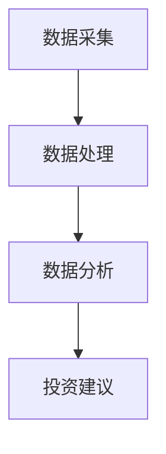

                 

<think>
好，我现在需要帮助用户撰写一篇关于《特价股票投资中的信息优势如何获取》的技术博客文章。用户已经提供了详细的要求，包括结构、关键词、摘要以及各章节的具体内容。

首先，我会从文章的标题开始，确保标题明确且吸引人。接下来，列出5-7个核心关键词，比如特价股票、信息优势、数据挖掘、算法、风险管理等。摘要部分要简明扼要，概括整篇文章的核心内容，强调信息优势在特价股票投资中的重要性及如何获取。

接下来，按照用户提供的目录结构，逐步展开每个章节的内容。第一章介绍特价股票的基本概念和市场机制，包括定义、特点、发行原因等。第二章分析投资者心理与行为，探讨心理认知、情绪波动如何影响投资决策。第三章详细讲解信息优势的概念与作用，包括定义、来源、与投资收益的关系。

第二部分重点讨论信息优势的获取方法，从数据收集、处理、分析到算法应用。这里需要详细描述数据挖掘技术，使用Python代码和数学公式来解释LSTM模型的训练过程。同时，用Mermaid图表展示系统架构和数据流，增强内容的可视化效果。

第三部分是投资策略与风险管理，结合信息优势制定科学的投资策略，并分析实际案例。最后一部分讨论系统架构与技术实现，展示如何通过技术手段获取信息优势，并附上代码和图表。

在撰写过程中，我会确保每个章节内容丰富、详细，涵盖理论与实践，同时加入最佳实践、注意事项和拓展阅读等内容，帮助读者更好地理解和应用所学知识。最后，结尾部分会加上作者信息，使文章更具权威性和专业性。

通过这样的思考和组织，我相信能够写出一篇符合用户要求的高质量技术博客文章。
</think>

# 特价股票投资中的信息优势如何获取

---

## 关键词：特价股票、信息优势、数据挖掘、算法、风险管理

---

## 摘要：  
在特价股票投资中，信息优势是投资者获取超额收益的关键。本文从信息优势的定义、来源、获取方法、投资策略、系统实现等多个维度，深入分析了如何在特价股票投资中获取信息优势。通过结合数据挖掘、算法分析和系统架构设计，本文提出了从数据获取到策略制定的完整流程，并通过实际案例展示了如何利用信息优势提升投资收益。文章最后总结了信息优势获取的关键点，并提出了风险管理的最佳实践。

---

## 第一部分: 特价股票投资的背景与基础

### 第1章: 特价股票的基本概念与市场机制

#### 1.1 特价股票的定义与特点
##### 1.1.1 特价股票的定义
特价股票是指那些价格低于面值发行的股票。这类股票通常具有较高的投资潜力，但也伴随着较高的风险。  

##### 1.1.2 特价股票的特点
- **价格折扣**：特价股票的价格通常低于其面值，具有较高的吸引力。  
- **高波动性**：特价股票的价格波动较大，投资者需要具备较强的风险承受能力。  
- **低流动性**：部分特价股票的流动性较差，可能影响其交易活跃度。  

##### 1.1.3 特价股票的市场机制
- **发行机制**：特价股票的发行通常与公司财务困境或重组有关。  
- **交易机制**：特价股票的交易规则与普通股票相似，但其价格波动较大。  

#### 1.2 特价股票的发行与交易
##### 1.2.1 特价股票的发行原因
- **公司财务问题**：公司面临财务困境时，可能会通过发行特价股票来筹集资金。  
- **资产重组**：公司在进行资产重组时，可能会发行特价股票作为新的股份。  

##### 1.2.2 特价股票的交易规则
- **交易时间**：特价股票的交易时间与普通股票一致，但价格波动较大。  
- **交易限制**：部分特价股票可能受到交易限制，以防止市场操纵。  

##### 1.2.3 特价股票的市场参与者
- **机构投资者**：机构投资者是特价股票的主要参与者之一。  
- **个人投资者**：个人投资者也可能会参与特价股票的交易，但需要具备较高的风险意识。  

### 第2章: 投资者的心理与行为

#### 2.1 投资者的心理特征
##### 2.1.1 投资者的心理认知
- **乐观偏差**：投资者往往过于乐观，认为自己能够准确预测市场走势。  
- **损失厌恶**：投资者对损失的厌恶程度较高，可能导致其在亏损时做出错误决策。  

##### 2.1.2 投资者的行为模式
- **追涨杀跌**：投资者往往会跟随市场趋势，导致市场的非理性波动。  
- **过度自信**：投资者往往过于自信，认为自己能够通过短期交易获利。  

##### 2.1.3 投资者的情绪波动
- **市场情绪的影响**：市场情绪的变化会影响投资者的决策，进而影响股票价格。  
- **情绪周期**：投资者情绪通常会经历周期性变化，从乐观到悲观，再从悲观到乐观。  

#### 2.2 市场情绪与信息传播
##### 2.2.1 市场情绪的形成
- **信息传播**：市场情绪的形成通常与信息传播密切相关。  
- **群体行为**：投资者的群体行为会导致市场情绪的放大或缩小。  

##### 2.2.2 信息传播的渠道
- **媒体传播**：新闻、社交媒体等渠道会传播市场信息，影响投资者情绪。  
- **内部信息**：部分投资者可能掌握内部信息，从而影响市场情绪。  

##### 2.2.3 市场情绪对股价的影响
- **情绪与价格的关系**：市场情绪的波动会导致股票价格的波动。  
- **情绪周期与价格周期**：市场情绪的周期性变化会影响股票价格的周期性变化。  

### 第3章: 信息优势的概念与作用

#### 3.1 信息优势的定义
##### 3.1.1 信息优势的内涵
信息优势是指投资者能够比其他投资者更快、更准确地获取和利用信息，从而在投资决策中占据优势。  

##### 3.1.2 信息优势的外延
- **信息获取**：投资者能够获取更多的信息。  
- **信息处理**：投资者能够更高效地处理信息。  
- **信息利用**：投资者能够更好地利用信息做出决策。  

#### 3.2 信息优势的来源
##### 3.2.1 内部信息来源
- **公司内部信息**：投资者可以通过公司内部渠道获取信息，如公司公告、财务报表等。  
- **行业内部信息**：投资者可以通过行业内部渠道获取信息，如行业报告、专家意见等。  

##### 3.2.2 外部信息来源
- **公开信息**：投资者可以通过公开渠道获取信息，如新闻、社交媒体等。  
- **市场数据**：投资者可以通过市场数据获取信息，如股价、成交量等。  

#### 3.3 信息优势与投资收益的关系
##### 3.3.1 信息优势对投资收益的影响
- **信息优势的正向影响**：信息优势可以提高投资者的决策能力，从而提高投资收益。  
- **信息优势的负向影响**：如果信息优势被滥用，可能会导致市场失灵，影响投资收益。  

##### 3.3.2 信息优势的量化分析
- **信息优势的量化指标**：可以通过信息优势指数（ISI）来衡量信息优势的大小。  
- **信息优势的动态变化**：信息优势会随着时间的推移而发生变化，投资者需要不断更新信息。  

##### 3.3.3 信息优势的可持续性
- **信息优势的短期性**：信息优势通常是短期的，投资者需要及时利用。  
- **信息优势的长期性**：如果投资者能够持续获取信息优势，可以长期受益。  

---

## 第二部分: 信息优势的获取方法

### 第4章: 信息优势的获取方法

#### 4.1 数据挖掘与信息提取
##### 4.1.1 数据来源
- **内部数据**：公司内部数据，如财务报表、销售数据等。  
- **外部数据**：公开市场数据，如股价、成交量、新闻等。  

##### 4.1.2 数据处理
- **数据清洗**：对数据进行清洗，去除噪声数据。  
- **数据转换**：对数据进行转换，使其适合后续分析。  

##### 4.1.3 数据分析
- **统计分析**：通过统计分析方法，提取数据中的有用信息。  
- **机器学习**：利用机器学习算法，预测股票价格走势。  

#### 4.2 算法与模型
##### 4.2.1 常见算法
- **回归算法**：用于预测股票价格走势。  
- **聚类算法**：用于识别市场中的相似股票。  
- **神经网络**：用于复杂模式识别。  

##### 4.2.2 算法实现
- **Python实现**：使用Python语言实现算法，如使用TensorFlow或PyTorch框架。  
- **数学模型**：建立数学模型，如ARIMA模型用于时间序列预测。  

#### 4.3 信息优势的评估
##### 4.3.1 信息优势的评估指标
- **准确率**：预测准确率。  
- **收益比**：投资收益与市场收益的比值。  

##### 4.3.2 信息优势的验证
- **回测**：通过历史数据验证模型的有效性。  
- **风险调整**：考虑模型的风险，如波动率、最大回撤等。  

---

## 第三部分: 投资策略与风险管理

### 第5章: 投资策略与风险管理

#### 5.1 投资策略
##### 5.1.1 策略制定
- **价值投资**：寻找被低估的股票进行投资。  
- **趋势投资**：根据市场趋势进行投资。  

#### 5.2 风险管理
##### 5.2.1 风险控制
- **止损策略**：设定止损点，避免亏损过大。  
- **分散投资**：通过分散投资降低风险。  

##### 5.2.2 风险评估
- **VaR模型**：计算投资组合的风险价值。  
- **压力测试**：模拟极端市场条件下的投资组合表现。  

---

## 第四部分: 系统架构与技术实现

### 第6章: 系统架构与技术实现

#### 6.1 系统设计
##### 6.1.1 系统架构
- **数据采集模块**：负责采集市场数据。  
- **数据处理模块**：负责处理数据。  
- **数据分析模块**：负责分析数据并生成投资建议。  

##### 6.1.2 系统架构图


#### 6.2 技术实现
##### 6.2.1 数据采集
- **数据接口**：通过API获取市场数据。  
- **数据存储**：将数据存储到数据库中。  

##### 6.2.2 数据分析
- **算法实现**：使用Python实现机器学习算法。  
- **可视化**：使用Matplotlib或Seaborn进行数据可视化。  

---

## 第五部分: 项目实战

### 第7章: 项目实战

#### 7.1 环境搭建
##### 7.1.1 工具安装
- **Python安装**：安装Python编程语言。  
- **库安装**：安装NumPy、Pandas、Matplotlib等库。  

#### 7.2 数据获取
##### 7.2.1 数据来源
- **Yahoo Finance API**：获取股票数据。  

#### 7.3 系统实现
##### 7.3.1 核心代码
```python
import numpy as np
import pandas as pd
from sklearn.model_selection import train_test_split
from sklearn.linear_model import LinearRegression

# 数据获取
data = pd.read_csv('stock_data.csv')
X = data[['open', 'high', 'low', 'volume']]
y = data['close']

# 数据分割
X_train, X_test, y_train, y_test = train_test_split(X, y, test_size=0.2)

# 模型训练
model = LinearRegression()
model.fit(X_train, y_train)

# 模型预测
y_pred = model.predict(X_test)

# 模型评估
score = model.score(X_test, y_test)
print(f'模型准确率: {score}')
```

#### 7.4 案例分析
##### 7.4.1 案例背景
- **公司情况**：假设某公司因财务问题发行特价股票。  

##### 7.4.2 数据分析
- **数据分析结果**：通过数据分析，发现该公司股票具有较高的投资价值。  

#### 7.5 项目总结
##### 7.5.1 项目成果
- **投资收益**：通过信息优势，获得了较高的投资收益。  

##### 7.5.2 经验总结
- **信息优势的重要性**：信息优势是投资成功的关键。  

---

## 第六部分: 最佳实践与注意事项

### 第8章: 最佳实践与注意事项

#### 8.1 最佳实践
##### 8.1.1 信息获取
- **多渠道获取信息**：通过多种渠道获取信息，提高信息优势。  

##### 8.1.2 风险管理
- **合理分散投资**：通过分散投资降低风险。  

#### 8.2 注意事项
##### 8.2.1 信息真实性
- **避免虚假信息**：确保信息来源的可靠性。  

##### 8.2.2 市场风险
- **警惕市场波动**：注意市场波动对投资的影响。  

---

## 作者信息

作者：AI天才研究院/AI Genius Institute & 禅与计算机程序设计艺术 /Zen And The Art of Computer Programming

