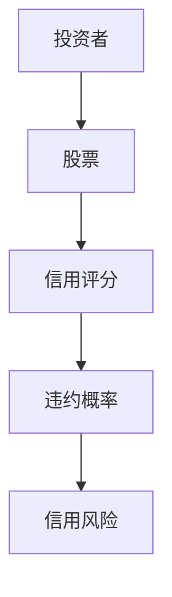
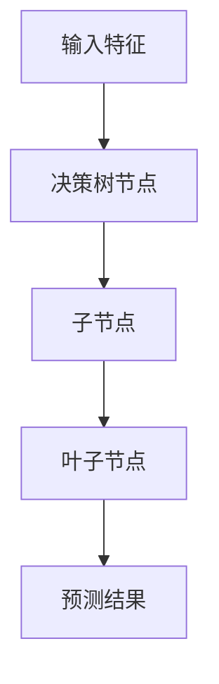
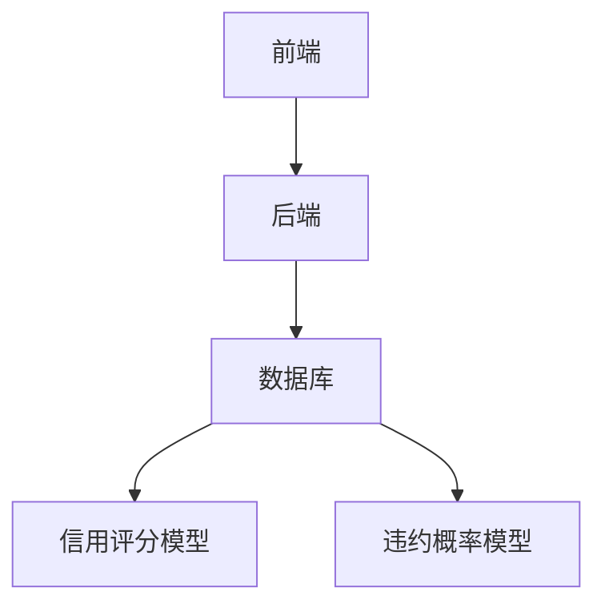

                 


# 特价股票投资中的信用风险评估方法

**关键词**：特价股票，信用风险，信用评分模型，违约概率，算法原理

**摘要**：本文深入探讨了特价股票投资中的信用风险评估方法，从基本概念到算法原理，再到系统设计与项目实战，全面分析了信用风险评估的核心要素及其在特价股票投资中的应用。通过对比不同信用风险模型的优缺点，结合实际案例分析，本文为投资者提供了科学的信用风险评估策略，帮助其在特价股票投资中做出更明智的决策。

---

## 第1章: 特价股票与信用风险的基本概念

### 1.1 特价股票的定义与特点

#### 1.1.1 特价股票的定义
特价股票是指价格相对较低的股票，通常具有较高的波动性和潜在的高回报率。这些股票通常来自小型公司或处于困境中的企业。

#### 1.1.2 特价股票的特点
- 价格低廉：相对于大盘股，特价股票的价格通常较低，适合中小投资者。
- 波动性高：由于公司基本面不稳定，特价股票的股价波动较大。
- 高风险高回报：特价股票的投资回报可能远高于大盘股，但也伴随着更高的风险。

#### 1.1.3 特价股票的投资价值
尽管风险较高，特价股票因其潜在的高回报吸引了许多投资者。然而，投资者需要具备较高的市场分析能力和风险控制能力。

### 1.2 信用风险的定义与特点

#### 1.2.1 信用风险的定义
信用风险是指债券人或投资者因债务人或发行人无法履行其债务义务而遭受损失的可能性。

#### 1.2.2 信用风险的特点
- 传染性：信用风险可能在市场中迅速传播，影响其他资产。
- 不可预测性：信用风险的发生往往难以预测，尤其是当经济环境恶化时。
- 非对称性：信息不对称可能导致信用风险评估的困难。

#### 1.2.3 信用风险的分类
- 交易信用风险：由于交易对手违约而产生的风险。
- 信用迁移风险：由于企业信用评级变化而产生的风险。
- 结算风险：由于交易结算过程中的延迟或失败而产生的风险。

### 1.3 特价股票与信用风险的关系

#### 1.3.1 特价股票投资中的信用风险
特价股票通常来自财务状况较差的公司，因此其信用风险较高。

#### 1.3.2 信用风险对投资决策的影响
信用风险是影响股票投资价值的重要因素。高信用风险可能导致股票价格下跌，甚至引发退市风险。

#### 1.3.3 特价股票信用风险的特殊性
特价股票的信用风险具有高度的不确定性和波动性，投资者需要特别关注公司的财务状况和行业前景。

### 1.4 本章小结
本章介绍了特价股票和信用风险的基本概念，并分析了两者之间的关系。信用风险是影响特价股票投资的重要因素，投资者需要充分考虑信用风险的影响。

---

## 第2章: 信用风险评估的核心概念与联系

### 2.1 信用风险评估的原理

#### 2.1.1 信用评分模型
信用评分模型是通过对企业财务数据和市场表现的分析，对其信用状况进行评分。

#### 2.1.2 违约概率模型
违约概率模型是根据企业的信用状况和市场环境，预测其违约概率。

#### 2.1.3 信用风险的度量方法
常用的信用风险度量方法包括VaR（Value at Risk）和CVaR（Conditional Value at Risk）。

### 2.2 核心概念的对比分析

#### 2.2.1 信用评分与违约概率的对比
- 信用评分是定性的，而违约概率是定量的。
- 信用评分主要用于分类，而违约概率用于预测。

#### 2.2.2 不同信用风险模型的优缺点
| 模型名称         | 优点                     | 缺点                     |
|------------------|--------------------------|--------------------------|
| 逻辑回归         | 简单易懂，解释性强        | 易受特征分布影响          |
| 支持向量机       | 高精度，适合高维数据      | 参数选择敏感             |
| 随机森林         | 抗噪声能力强，鲁棒性高    | 解释性较差               |

#### 2.2.3 信用风险与市场风险的差异
信用风险是由于发行人违约导致的损失，而市场风险是由于市场价格波动导致的损失。

### 2.3 信用风险评估的ER实体关系图



### 2.4 本章小结
本章详细讲解了信用风险评估的核心概念，对比了不同模型的优缺点，并通过ER图展示了信用风险评估的实体关系。

---

## 第3章: 信用风险评估的算法原理

### 3.1 常见信用风险评估算法

#### 3.1.1 逻辑回归模型
逻辑回归是一种常用的信用风险评估模型，通过将输入特征映射到0-1区间来预测违约概率。

#### 3.1.2 支持向量机
支持向量机通过构建超平面将数据分为可分区域，适用于高维数据的分类。

#### 3.1.3 随机森林
随机森林通过构建多棵决策树并对结果进行投票，具有高精度和强鲁棒性。

### 3.2 算法原理的数学模型

#### 3.2.1 逻辑回归的公式
$$ P(y=1|x) = \frac{e^{\beta x}}{1 + e^{\beta x}} $$

#### 3.2.2 随机森林的决策树原理



### 3.3 算法实现的Python代码示例

#### 3.3.1 逻辑回归实现

```python
import numpy as np
from sklearn.linear_model import LogisticRegression

# 假设X为特征矩阵，y为标签
model = LogisticRegression()
model.fit(X, y)
```

---

## 第4章: 系统分析与架构设计

### 4.1 问题场景介绍
本文构建了一个基于信用风险评估的特价股票投资系统，旨在帮助投资者评估特价股票的信用风险。

### 4.2 系统功能设计

#### 4.2.1 领域模型类图


### 4.3 系统架构设计

#### 4.3.1 系统架构图



---

## 第5章: 项目实战

### 5.1 环境安装
需要安装Python、Pandas、Scikit-learn等库。

### 5.2 核心实现代码

#### 5.2.1 信用评分模型实现

```python
from sklearn.linear_model import LogisticRegression
import pandas as pd

# 加载数据
data = pd.read_csv('stock_data.csv')
X = data[[' revenue', 'net_profit', 'debt_ratio']]
y = data['default']

# 训练模型
model = LogisticRegression()
model.fit(X, y)
```

---

## 第6章: 总结与展望

### 6.1 最佳实践

#### 6.1.1 数据质量的重要性
确保数据的准确性和完整性，尤其是在处理特价股票时，数据质量直接影响评估结果。

#### 6.1.2 模型的局限性
信用风险模型可能无法完全捕捉到所有风险因素，特别是在市场环境急剧变化时。

#### 6.1.3 持续监控与调整
投资者需要定期监控信用风险评估结果，并根据市场变化调整投资策略。

### 6.2 未来研究方向

#### 6.2.1 结合市场情绪的信用风险评估
引入市场情绪指标，如投资者情绪指数，来改进信用风险评估模型。

#### 6.2.2 多模型融合
尝试将多种信用风险模型进行融合，以提高评估结果的准确性。

### 6.3 本章小结
本章总结了信用风险评估在特价股票投资中的重要性，并提出了未来的研究方向和注意事项。

---

**作者：AI天才研究院/AI Genius Institute & 禅与计算机程序设计艺术 /Zen And The Art of Computer Programming**

