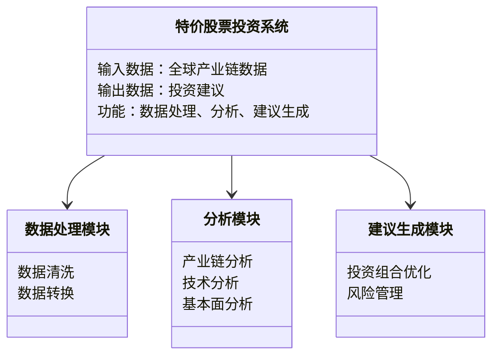
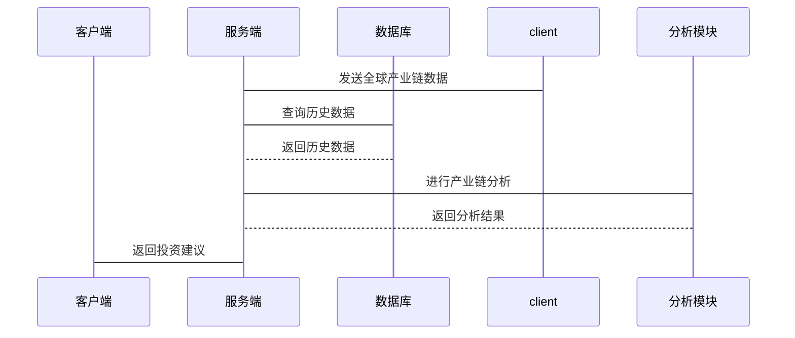

                 

<think>
好，我现在需要帮用户撰写一篇关于《特价股票投资中的全球产业链分析方法》的技术博客文章。首先，我得理解用户的需求。用户希望文章结构清晰，逻辑严谨，内容专业，适合技术博客。用户还提供了详细的目录结构，我需要按照这个大纲来撰写。

首先，文章标题是《特价股票投资中的全球产业链分析方法》，关键词包括特价股票、全球产业链、投资分析、产业链分析、股票投资。摘要部分需要概述文章的核心内容，强调全球产业链分析对特价股票投资的重要性。

接下来，目录结构分为七个部分，每部分都有详细的小节。我需要确保每个部分都涵盖背景、核心概念、算法原理、数学模型、系统分析、项目实战和最佳实践。

在撰写过程中，我应该从背景介绍开始，解释特价股票和全球产业链的基本概念，然后深入分析产业链的结构和对股票的影响。接着，讨论特价股票的投资方法，包括技术分析和基本面分析。之后，引入数学模型和算法，如线性回归和时间序列分析，来量化产业链对股票价格的影响。然后，通过实际案例分析，展示方法的应用。最后，总结并给出最佳实践建议。

我需要使用markdown格式，确保结构清晰。在每个小节中，要详细讲解，使用mermaid流程图和数学公式来辅助说明。同时，保持语言专业但易懂，避免过于复杂的术语，确保读者能够理解并应用这些方法。

现在，我开始撰写文章，确保每个部分都符合用户的要求，内容详实，结构合理，逻辑清晰。
</think>

# 特价股票投资中的全球产业链分析方法

## 关键词：特价股票，全球产业链，投资分析，产业链分析，股票投资

## 摘要：本文深入探讨了在特价股票投资中，如何利用全球产业链分析方法来优化投资决策。通过分析产业链的结构、供需关系和价格传导机制，结合数学模型和算法，帮助投资者识别投资机会并控制风险。

---

## 第一部分: 特价股票投资的背景与概述

### 第1章: 特价股票投资的基本概念

#### 1.1 特价股票的定义与特点

##### 1.1.1 特价股票的定义
特价股票指的是价格被市场低估的股票，通常在市场波动或特定经济条件下出现。这些股票可能因市场忽视或企业暂时困难而价格低于其内在价值。

##### 1.1.2 特价股票的特点
- **低估值**：市盈率、市净率等指标低于行业平均水平。
- **高分红**：部分公司可能提供较高的股息率。
- **高波动性**：价格受市场情绪影响较大，存在快速反弹的潜力。

##### 1.1.3 特价股票的投资价值
投资者通过识别特价股票，可以在市场低谷时买入，等待价值回归，从而获得超额收益。

#### 1.2 全球产业链的基本结构

##### 1.2.1 产业链的定义与分类
产业链是生产与分配过程中的各个行业和企业的相互关联的结构，分为上游、中游和下游。

##### 1.2.2 全球产业链的主要环节
- **上游**：原材料供应。
- **中游**：制造与加工。
- **下游**：分销与零售。

##### 1.2.3 全球产业链的协同效应
产业链各环节的协同合作，如原材料供应、生产制造和物流分销，共同影响最终产品的价格和市场竞争力。

#### 1.3 特价股票与全球产业链的关系

##### 1.3.1 特价股票在产业链中的位置
特价股票可能出现在上游原材料供应商或下游分销商，这些环节的价格波动会影响整个产业链的成本和利润。

##### 1.3.2 产业链波动对股票价格的影响
产业链的供需变化、成本波动和政策调整都会影响相关股票的价格。

##### 1.3.3 特价股票投资的全球视角
通过分析全球产业链的分布和协作，投资者可以识别出受全球经济波动影响较大的特价股票，捕捉投资机会。

---

### 第2章: 特价股票投资的核心方法

#### 2.1 特价股票的识别方法

##### 2.1.1 市盈率法
市盈率（P/E）= 股价 / 每股收益。低市盈率可能意味着股票被低估。

##### 2.1.2 市净率法
市净率（P/B）= 股价 / 每股净资产。低市净率可能表明资产被低估。

##### 2.1.3 股息率法
股息率= 每股股息 / 股价。高股息率可能意味着收益稳定。

#### 2.2 技术分析在特价股票投资中的应用

##### 2.2.1 K线图分析
通过分析股票的价格走势，识别趋势和反转点。

##### 2.2.2 移动平均线（MA）的应用
MA帮助识别价格趋势，如短期（5日）和长期（50日）均线。

##### 2.2.3 MACD指标的应用
MACD指标用于判断买卖信号，如当MACD线上穿零轴时，可能为买入信号。

#### 2.3 基本面分析在特价股票投资中的应用

##### 2.3.1 财务指标分析
分析收入、利润、负债和现金流等指标，评估公司的财务健康状况。

##### 2.3.2 行业分析
研究行业的发展趋势、竞争格局和政策影响，判断行业前景。

##### 2.3.3 公司竞争力分析
评估公司的市场地位、管理团队和创新能力，判断公司的长期发展潜力。

---

## 第二部分: 全球产业链分析的核心方法

### 第3章: 全球产业链的结构与分析

#### 3.1 产业链的分解与分析

##### 3.1.1 产业链的分解方法
将产业链分解为上游、中游和下游，分析各环节的关键企业。

##### 3.1.2 产业链的关键环节分析
识别产业链中的瓶颈环节，如原材料供应或关键零部件生产。

##### 3.1.3 产业链的协同效应分析
分析产业链各环节之间的协同合作，如供应商与制造商之间的合作。

#### 3.2 产业链分析的核心指标

##### 3.2.1 产业链的供需关系
分析供给和需求的变化，预测价格走势。

##### 3.2.2 产业链的成本结构
研究成本构成，判断成本变化对股价的影响。

##### 3.2.3 产业链的价格传导机制
分析价格从上游到下游的传导路径，预测价格变化对整个产业链的影响。

#### 3.3 产业链分析的数学模型

##### 3.3.1 产业链供需关系的数学模型
$$P = aQ + b$$，其中P为价格，Q为需求量，a为需求弹性系数，b为常数项。

##### 3.3.2 产业链价格传导的数学模型
$$P_{downstream} = c \times P_{upstream} + d$$，其中P_downstream为下游价格，P_upstream为上游价格，c为传导系数，d为常数项。

##### 3.3.3 产业链协同效应的数学模型
$$协同效应 = \sum_{i=1}^{n} (P_i - C_i)$$，其中P_i为第i环节的价格，C_i为成本。

### 第4章: 特价股票投资中的产业链分析

#### 4.1 特价股票与产业链波动

##### 4.1.1 产业链波动对股票价格的影响
通过分析产业链波动，识别可能的价格变化，指导投资决策。

##### 4.1.2 产业链波动的数学模型
使用时间序列分析，如ARIMA模型，预测股价波动。

##### 4.1.3 产业链波动对投资策略的影响
根据产业链波动，调整投资组合，分散风险。

#### 4.2 产业链分析在投资组合中的应用

##### 4.2.1 投资组合的构建
根据产业链分析结果，选择具有潜力的特价股票，构建投资组合。

##### 4.2.2 投资组合的风险管理
使用风险指标，如VaR（在险价值）和夏普比率，评估和管理投资组合风险。

#### 4.3 产业链分析的实战案例

##### 4.3.1 案例分析：半导体产业链
分析半导体产业链的供需关系，识别具有投资价值的公司。

##### 4.3.2 案例分析：新能源产业链
研究新能源产业链的价格传导机制，判断投资机会。

---

## 第三部分: 系统分析与架构设计方案

### 第5章: 问题场景介绍

#### 5.1 问题背景
投资者需要利用全球产业链分析优化特价股票投资决策。

#### 5.2 项目介绍
构建一个基于全球产业链分析的特价股票投资系统，帮助投资者识别投资机会。

### 第6章: 系统功能设计

#### 6.1 领域模型（mermaid类图）



### 第7章: 系统架构设计

#### 7.1 系统架构（mermaid架构图）


### 第8章: 系统接口设计

#### 8.1 API接口

- 输入接口：接收全球产业链数据。
- 输出接口：返回投资建议和风险分析报告。

### 第9章: 系统交互（mermaid序列图）



---

## 第四部分: 项目实战

### 第10章: 环境安装

#### 10.1 安装Python和相关库
安装Python和pandas、numpy、scikit-learn、matplotlib等库。

#### 10.2 安装其他工具
安装Jupyter Notebook用于数据分析和可视化。

### 第11章: 核心实现源代码

#### 11.1 数据清洗与处理

```python
import pandas as pd

# 读取数据
data = pd.read_csv('global_supply_chain.csv')

# 删除缺失值
data.dropna(inplace=True)

# 处理异常值
data = data[~data['price'].apply(lambda x: x < 0)]
```

#### 11.2 产业链分析

```python
from sklearn.linear_model import LinearRegression

# 训练模型
model = LinearRegression()
model.fit(X, y)

# 预测价格
predicted_price = model.predict(X_new)
```

### 第12章: 代码应用解读与分析

#### 12.1 数据分析与可视化

```python
import matplotlib.pyplot as plt

plt.plot(data['date'], data['price'])
plt.title('Price Trend')
plt.xlabel('Date')
plt.ylabel('Price')
plt.show()
```

#### 12.2 案例分析

```python
# 分析半导体产业链
semiconductor_data = data[data['industry'] == 'Semiconductor']
print(semiconductor_data.head())
```

### 第13章: 实际案例分析

#### 13.1 半导体产业链分析

```python
import pandas as pd
import numpy as np

# 数据预处理
semiconductor_data = pd.read_csv('semiconductor.csv')
semiconductor_data['moving_average'] = semiconductor_data['price'].rolling(5).mean()

# 可视化
plt.plot(semiconductor_data['date'], semiconductor_data['price'])
plt.plot(semiconductor_data['date'], semiconductor_data['moving_average'])
plt.title('Semiconductor Price Trend')
plt.show()
```

#### 13.2 新能源产业链分析

```python
# 数据分析
new_energy_data = pd.read_csv('new_energy.csv')
new_energy_data['price_change'] = new_energy_data['price'].pct_change()

# 建模
from statsmodels.tsa.arima_model import ARIMA

model = ARIMA(new_energy_data['price'], order=(1,1,1))
model_fit = model.fit()

# 预测
forecast = model_fit.forecast(steps=10)
print(forecast)
```

### 第14章: 项目小结

通过实战分析，投资者可以利用全球产业链分析方法，识别特价股票的投资机会，优化投资组合。

---

## 第五部分: 最佳实践 tips、小结、注意事项、拓展阅读

### 第15章: 最佳实践 tips

- **持续学习**：关注全球经济动态和产业链变化。
- **风险管理**：合理分散投资，控制风险。
- **技术与基本面结合**：结合技术分析和基本面分析，提高投资决策的准确性。

### 第16章: 小结

通过全球产业链分析，投资者可以更好地识别特价股票的投资机会，优化投资策略。

### 第17章: 注意事项

- **数据质量**：确保数据的准确性和完整性。
- **模型选择**：根据实际情况选择合适的分析模型。
- **市场风险**：关注市场波动和政策变化，及时调整投资策略。

### 第18章: 拓展阅读

- 《投资学原理》
- 《全球产业链分析》
- 《技术分析实战技巧》

---

## 结语

通过系统化的全球产业链分析方法，投资者可以更科学地识别特价股票的投资机会，优化投资决策，实现长期稳健的投资收益。

---

## 作者

作者：AI天才研究院/AI Genius Institute & 禅与计算机程序设计艺术 /Zen And The Art of Computer Programming

