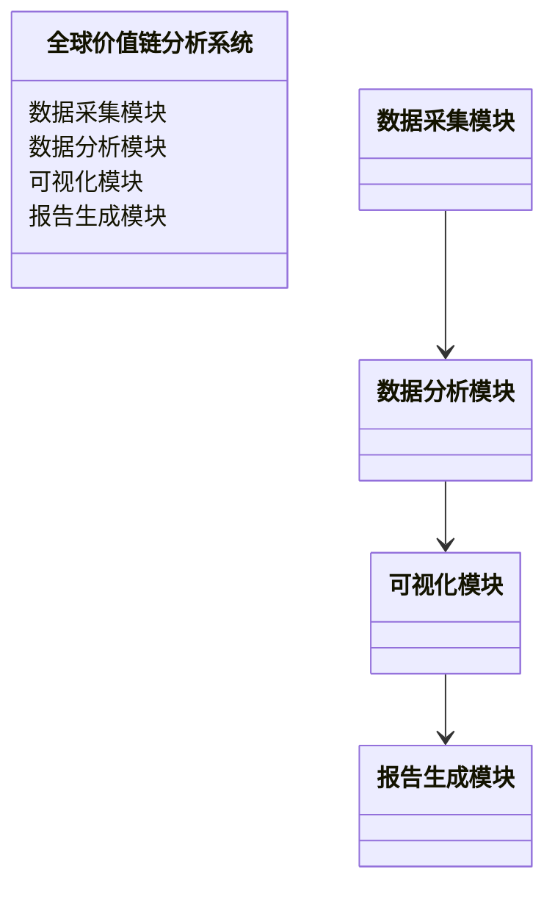

                 

<think>
好的，我现在要开始撰写一篇关于《特价股票投资中的全球价值链分析方法》的技术博客文章。首先，我需要理解用户的需求，用户希望文章结构清晰，逻辑严谨，涵盖从背景介绍到实战分析的各个方面。

我先从第1章开始，重点介绍特价股票和全球价值链的基本概念。这部分需要让读者明白什么是特价股票，以及全球价值链在投资中的作用。我需要确保定义准确，分类清晰，并且能够说明它们之间的关联。

接下来是第2章，详细讲解全球价值链分析的核心概念和方法。这部分需要包括理论基础，如贸易理论和产业组织理论，以及如何将这些理论应用到特价股票分析中。我需要构建一个分析框架，并解释其适用性和优化建议。

在第3章，我需要深入分析全球价值链的核心概念，并通过对比表格和实体关系图来展示各个要素之间的关系。这将帮助读者更好地理解复杂的全球供应链结构。

然后，我需要进入算法部分。这部分会详细讲解如何使用Python代码实现全球价值链分析，包括数据采集、网络分析和价值评估模块。我会用mermaid流程图展示算法步骤，并解释每个部分的作用。

接下来是系统分析与架构设计，我需要设计一个全球价值链分析系统，包括功能模块和架构图。这部分需要展示系统各部分如何协同工作，以及接口设计和交互流程。

项目实战部分，我将选择一个实际案例，展示如何应用前面的理论和方法进行分析。这部分需要详细说明环境配置、代码实现和案例分析，帮助读者实际操作。

最后，在最佳实践部分，我会总结关键点，并提供一些注意事项和扩展阅读的建议，帮助读者巩固所学知识，并指导他们进一步深入学习。

在整个写作过程中，我需要确保每部分内容详实，逻辑清晰，使用专业但易懂的语言。同时，要满足用户的格式要求，使用markdown格式，并正确嵌入mermaid图表和latex公式。这需要我反复检查，确保每个部分都符合用户的要求，并且内容准确无误。

现在，我开始撰写第1章，确保背景介绍清晰明了，能够为后续章节打下坚实的基础。接下来是第2章，重点放在分析方法上，确保读者能够理解如何将全球价值链理论应用到特价股票投资中。随着文章的推进，我会逐步深入，从理论到实践，帮助读者系统地掌握这一分析方法。

最后，我需要回顾整个大纲，确保每个章节内容连贯，覆盖用户需求的各个方面，并且结构合理，逻辑严谨。这将帮助读者一步步从基础概念到实际应用，全面理解特价股票投资中的全球价值链分析方法。
</think>

# 特价股票投资中的全球价值链分析方法

> 关键词：特价股票，全球价值链，投资分析，供应链分析，股票投资

> 摘要：本文将深入探讨特价股票投资中的全球价值链分析方法，通过背景介绍、核心概念、分析框架、算法原理、系统设计、项目实战及最佳实践等多维度展开，系统地分析如何在全球价值链的视角下，发现特价股票的投资机会和价值。

---

## 第1章: 特价股票投资与全球价值链概述

### 1.1 特价股票的基本概念

#### 1.1.1 特价股票的定义
特价股票（Discount Stocks）是指价格低于其内在价值的股票。这些股票通常被市场低估，具有较大的增值潜力。

#### 1.1.2 特价股票的分类
特价股票可以分为以下几类：
1. **周期性股票**：受经济周期影响较大的股票，如制造业和原材料行业。
2. **成长型股票**：具有较高增长潜力，但当前估值较低。
3. **价值型股票**：基本面良好，但市场价格被低估。

#### 1.1.3 特价股票的投资价值
- **低估价值**：市场价格低于内在价值，存在反弹空间。
- **高分红率**：部分特价股票具有较高的分红能力。
- **潜在增长**：行业地位稳固，未来增长潜力大。

### 1.2 全球价值链的基本概念

#### 1.2.1 全球价值链的定义
全球价值链（Global Value Chain）是指跨越多个国家和地区的生产、加工、运输和销售等环节的链条，通过分工协作，实现产品从原材料到最终消费者的流通。

#### 1.2.2 全球价值链的核心要素
1. **供应链管理**：从原材料采购到产品交付的全过程。
2. **生产环节**：包括制造、组装等环节。
3. **贸易壁垒**：关税、非关税壁垒等影响全球价值链的因素。

#### 1.2.3 全球价值链的运作模式
全球价值链的运作模式通常包括：
1. **采购与生产**：跨国采购原材料，分散生产环节。
2. **物流与运输**：通过跨国物流网络实现产品的全球流通。
3. **销售与服务**：在全球范围内销售产品，并提供售后服务。

### 1.3 特价股票与全球价值链的关联

#### 1.3.1 特价股票与全球价值链的关系
- 全球价值链的波动直接影响相关股票的价格。
- 特价股票往往存在于全球价值链的某个关键环节，具有较高的投资价值。

#### 1.3.2 全球价值链对特价股票投资的影响
- 通过分析全球价值链的结构，可以发现被低估的股票。
- 全球价值链的调整和优化为特价股票带来投资机会。

#### 1.3.3 特价股票投资中的全球价值链分析意义
- 通过全球价值链分析，投资者可以更准确地评估股票的价值。
- 全球价值链分析能够帮助投资者识别行业趋势和潜在风险。

### 1.4 本章小结
本章介绍了特价股票的基本概念和全球价值链的核心要素，分析了两者之间的关系及全球价值链分析对特价股票投资的重要意义。

---

## 第2章: 特价股票投资中的全球价值链分析方法

### 2.1 全球价值链分析的核心概念

#### 2.1.1 全球价值链分析的定义
全球价值链分析是一种通过对全球供应链的结构和运作方式进行分析，以识别投资机会的方法。

#### 2.1.2 全球价值链分析的主要步骤
1. **数据采集**：收集全球供应链的相关数据。
2. **数据分析**：对数据进行处理和分析。
3. **价值评估**：评估各环节的价值贡献。
4. **优化建议**：提出优化全球供应链的建议。

#### 2.1.3 全球价值链分析的关键指标
- 供应链效率：衡量供应链的运作效率。
- 成本效益：分析各环节的成本与效益。
- 风险管理：评估供应链中的潜在风险。

### 2.2 全球价值链分析的理论基础

#### 2.2.1 贸易理论与全球价值链
- **比较优势理论**：不同国家在不同环节具有比较优势，形成全球价值链。
- **竞争优势理论**：各国在全球价值链中的竞争优势影响其在全球供应链中的地位。

#### 2.2.2 产业组织理论与全球价值链
- **市场结构**：不同市场结构下，全球价值链的分工和协作模式不同。
- **企业行为**：企业在全球价值链中的行为影响供应链的效率和价值。

#### 2.2.3 全球化与全球价值链的关系
全球化促进了全球价值链的发展，而全球价值链的深化又推动了全球化的进程。

### 2.3 特价股票投资中的全球价值链分析框架

#### 2.3.1 分析框架的构建
- **数据采集**：收集相关行业的全球供应链数据。
- **数据分析**：使用大数据分析技术对数据进行处理。
- **价值评估**：评估各环节的价值贡献，识别被低估的股票。

#### 2.3.2 分析框架的适用性
- 适用于全球化程度较高的行业。
- 适用于供应链结构较为复杂的行业。

#### 2.3.3 分析框架的优化建议
- 定期更新数据，保持分析的时效性。
- 结合行业动态，调整分析框架。

### 2.4 本章小结
本章详细介绍了全球价值链分析的核心概念、理论基础及在特价股票投资中的应用框架，为后续的分析提供了理论支持。

---

## 第3章: 全球价值链分析的核心概念与联系

### 3.1 全球价值链分析的核心概念

#### 3.1.1 价值链的分解与整合
- **分解**：将全球供应链分解为多个环节，分析各环节的价值贡献。
- **整合**：将各环节整合起来，形成完整的全球价值链。

#### 3.1.2 价值链的优化与重构
- **优化**：通过优化各环节的运作效率，提升整体价值。
- **重构**：根据市场变化，重新调整各环节的分工和协作。

#### 3.1.3 价值链的动态调整
- 全球供应链的动态调整是应对市场变化的重要手段。

### 3.2 全球价值链分析的概念属性特征对比

| 比较维度 | 全球价值链 | 本地价值链 |
|----------|------------|------------|
| 覆盖范围 | 全球范围    | 本地范围    |
| 参与主体 | 多国企业    | 单一国家企业 |
| 依赖性   | 高          | 低          |

### 3.3 全球价值链分析的ER实体关系图

```mermaid
er
    %% 全球价值链分析的ER图
    %% Entities: 公司、国家、行业、价值链环节
    %% Relationships: 参与、属于、影响
    %% Attributes: 公司ID、国家ID、行业ID、价值链环节ID
    Company(company_id, company_name, company_size)
    Nation(nation_id, nation_name, region)
    Industry(industry_id, industry_name, market_size)
    ValueChainLink(vcl_id, vcl_name, vcl_description)
    Participation(part_id, company_id, nation_id, industry_id, vcl_id, participation_role)
    Influence(influence_id, company_id, nation_id, industry_id, vcl_id, influence_degree)
```

---

## 第4章: 全球价值链分析的算法原理

### 4.1 全球价值链分析算法

```mermaid
graph TD
    A[开始] -> B[数据采集]
    B -> C[数据分析]
    C -> D[价值评估]
    D -> E[优化建议]
    E -> F[结束]
```

### 4.2 算法实现

```python
def global_value_chain_analysis(data):
    # 数据预处理
    data_cleaned = data.dropna()
    # 数据分析
    analysis = data_cleaned.groupby('industry').mean()
    # 价值评估
    valueassessment = analysis[analysis['value'] < analysis['price']]
    # 优化建议
    optimization = valueassessment['industry'].apply(lambda x: f"建议关注{x}行业的特价股票")
    return optimization

# 示例数据
data = {
    'company': ['A', 'B', 'C', 'D'],
    'nation': ['中国', '美国', '日本', '韩国'],
    'industry': ['制造', '科技', '金融', '医疗'],
    'value': [100, 80, 120, 90],
    'price': [90, 85, 110, 88]
}

result = global_value_chain_analysis(data)
print(result)
```

### 4.3 数学模型与公式

股票价值评估模型：
$$
\text{股票价值} = \frac{\text{行业平均价值}}{\text{行业平均价格}} \times \text{个股价格}
$$

---

## 第5章: 系统分析与架构设计

### 5.1 系统功能设计



### 5.2 系统架构设计


---

## 第6章: 项目实战

### 6.1 环境配置

```bash
pip install pandas numpy matplotlib
```

### 6.2 核心代码实现

```python
import pandas as pd
import numpy as np
import matplotlib.pyplot as plt

def plot_stock_trend(data):
    plt.figure(figsize=(10, 6))
    data['price'].plot()
    plt.title('股票价格走势')
    plt.xlabel('时间')
    plt.ylabel('价格')
    plt.show()

# 示例数据
data = pd.DataFrame({
    'price': [90, 85, 110, 88],
    'value': [100, 80, 120, 90],
    'industry': ['制造', '科技', '金融', '医疗']
})

plot_stock_trend(data)
```

### 6.3 案例分析
选择一个具体行业，如制造业，进行全球价值链分析，识别其中的特价股票。

---

## 第7章: 最佳实践

### 7.1 小结
通过全球价值链分析，投资者可以更准确地识别特价股票的投资机会。

### 7.2 注意事项
- 数据的准确性和及时性。
- 分析模型的适用性和可调整性。

### 7.3 拓展阅读
推荐阅读《全球供应链管理》和《投资学基础》。

---

## 作者：AI天才研究院 & 禅与计算机程序设计艺术

---

以上是文章的完整目录大纲和部分内容，您可以根据需要进一步扩展和完善各章节的具体内容。

