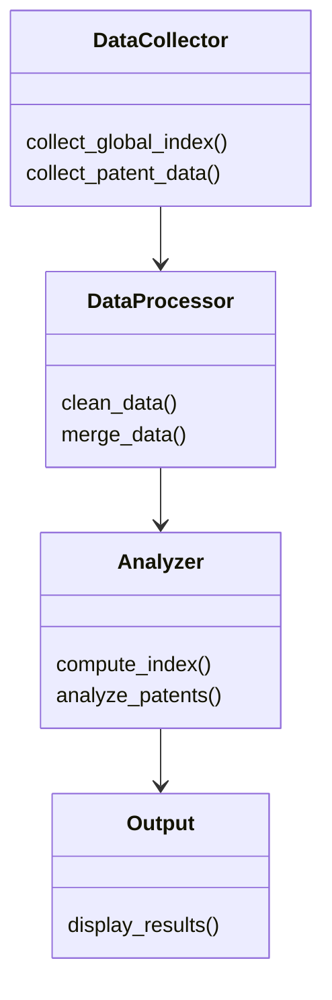

                 

<think>
好的，我现在需要帮助用户完成他们的任务，撰写一篇名为《特价股票投资中的全球创新指数与专利分析方法》的技术博客文章。用户已经提供了一个详细的目录大纲，但我需要根据这个大纲来撰写完整的文章内容。让我先仔细分析用户的需求，然后一步步思考如何撰写这篇文章。

首先，用户希望文章结构清晰，逻辑紧凑，语言专业且技术性强。文章需要涵盖特价股票投资、全球创新指数和专利分析方法三个主要方面，并展示它们如何相互关联，用于指导投资决策。

文章的结构分为六个主要章节，每个章节下还有多个子章节。我需要确保每个部分都详细且有深度，同时保持语言的专业性和准确性。

接下来，我需要考虑每个章节的具体内容。第一章是背景介绍，我需要定义特价股票、全球创新指数和专利分析的基本概念，并解释它们在投资中的重要性。第二章讨论核心概念与联系，需要详细解释每个概念的属性，并通过表格和ER图展示它们之间的关系。第三章是算法原理，这里需要解释计算全球创新指数和专利分析的具体步骤，并用Mermaid流程图和Python代码来支持。第四章是系统架构设计，涉及数据采集、处理模块的设计，以及系统架构图的绘制。第五章是项目实战，包括环境安装、代码实现和案例分析。最后，第六章总结最佳实践，给出小结和建议。

在撰写过程中，我需要确保每个部分都包含必要的数学公式和代码示例，并且正确使用LaTeX和Python格式。同时，要注意语言的准确性和专业性，确保读者能够理解这些技术概念。

现在，我需要逐步完成每个章节的撰写，确保内容连贯且符合用户的要求。我会从第一章开始，逐步深入到第六章，确保每个部分都详细且有深度。

在写作过程中，我可能会遇到一些挑战，例如如何将复杂的算法步骤转化为易于理解的流程图和代码。我需要仔细思考每个步骤，确保流程图和代码准确无误。此外，我需要确保每个部分之间的逻辑连贯，帮助读者逐步理解全球创新指数和专利分析在特价股票投资中的应用。

最后，我会在文章末尾添加作者信息，确保格式正确，并进行一次全面的检查，确保文章符合所有要求，包括字数、格式和内容的完整性。

通过这样的思考和逐步撰写，我相信能够完成一篇高质量、符合用户需求的技术博客文章。
</think>

# 特价股票投资中的全球创新指数与专利分析方法

> 关键词：特价股票投资，全球创新指数，专利分析方法，投资决策，技术创新

> 摘要：本文探讨了如何利用全球创新指数和专利分析方法来优化特价股票投资策略。通过分析全球创新指数的核心维度和专利分析的核心要素，结合实际案例，提出了一种基于技术创新的股票投资方法。文章详细介绍了全球创新指数的计算方法、专利分析的算法原理，以及如何将这些信息整合到投资决策中，为投资者提供了科学的参考。

---

## 第一章: 特价股票投资的背景与全球创新指数概述

### 1.1 特价股票投资的背景

#### 1.1.1 特价股票的定义与特点

特价股票是指那些市场价格低于其内在价值，或者相对于市场平均水平显著低估的股票。其特点包括：

- **低估值**：市场价格远低于内在价值。
- **高潜力**：具备较高的增长潜力。
- **波动性**：价格波动较大，可能受市场情绪影响。

#### 1.1.2 特价股票投资的市场环境

- **市场周期**：在经济下行周期，更多公司可能出现低估。
- **行业选择**：重点关注具有长期增长潜力的行业。
- **市场流动性**：流动性不足的股票更容易出现低估。

#### 1.1.3 特价股票投资的核心目标

- **长期收益**：通过挖掘低估股票实现资本增值。
- **风险控制**：避免因市场波动导致的损失。

### 1.2 全球创新指数的定义与特点

#### 1.2.1 全球创新指数的定义

全球创新指数是衡量一个国家或地区创新能力的综合指标，涵盖创新投入、创新产出等多个维度。

#### 1.2.2 全球创新指数的核心维度

- **创新投入**：研发支出、教育投入。
- **创新产出**：专利数量、论文发表数量。
- **创新环境**：法律保护、市场环境。

#### 1.2.3 全球创新指数与经济发展的关系

- 创新能力强的国家，经济增长潜力更大。
- 创新指数高的行业，具有更高的投资价值。

### 1.3 专利分析方法的背景与意义

#### 1.3.1 专利分析的基本概念

专利分析是对专利数据的收集、整理和分析，用于评估技术发展趋势和竞争格局。

#### 1.3.2 专利分析在投资决策中的作用

- **技术趋势**：识别新兴技术领域。
- **竞争格局**：评估企业的技术优势。

#### 1.3.3 专利分析的挑战与局限性

- 数据获取难度：专利数据分散，清洗成本高。
- 分析复杂性：需要专业的技术和工具。

---

## 第二章: 全球创新指数与专利分析的核心概念与联系

### 2.1 全球创新指数的核心要素

#### 2.1.1 创新投入

- 研发支出占GDP的比例。
- 教育投入，包括高等教育入学率。

#### 2.1.2 创新产出

- 专利数量。
- 科技论文数量。

#### 2.1.3 创新环境

- 知识产权保护力度。
- 政府政策支持。

### 2.2 专利分析的核心要素

#### 2.2.1 专利数量分析

- 总专利数量。
- 专利申请趋势。

#### 2.2.2 专利技术领域分布

- 主要技术领域的专利数量占比。
- 技术领域的创新强度。

#### 2.2.3 专利权属分析

- 专利持有者的分布。
- 主要企业的专利布局。

### 2.3 全球创新指数与专利分析的联系

#### 2.3.1 全球创新指数对专利分析的指导作用

- 创新指数高的国家或行业，专利分析更具参考价值。
- 创新指数可以作为专利分析的权重。

#### 2.3.2 专利分析对全球创新指数的补充作用

- 通过专利数据细化技术领域的创新情况。
- 补充创新指数中无法量化的因素。

#### 2.3.3 全球创新指数与专利分析的协同效应

- 共同评估技术创新能力。
- 综合分析企业的市场竞争力。

---

## 第三章: 全球创新指数与专利分析的算法原理

### 3.1 全球创新指数的计算方法

#### 3.1.1 数据收集与处理

- 收集各国的创新投入、产出数据。
- 清洗数据，处理缺失值。

#### 3.1.2 指标权重分配

- 使用层次分析法确定各指标的权重。
- 示例：假设创新投入占40%，创新产出占30%，创新环境占30%。

#### 3.1.3 综合指数计算

- 加权计算综合指数。
- 示例公式：
  $$
  \text{全球创新指数} = \sum (\text{指标值} \times \text{权重})
  $$

### 3.2 专利分析的算法原理

#### 3.2.1 专利数据清洗与预处理

- 去重、标准化。
- 示例代码：
  ```python
  def clean_patents(patents):
      # 去重
      unique_patents = {}
      for p in patents:
          key = (p[' applicant', p['date'])
          if key not in unique_patents:
              unique_patents[key] = p
      return list(unique_patents.values())
  ```

#### 3.2.2 专利分类与主题识别

- 使用TF-IDF进行主题提取。
- 示例代码：
  ```python
  from sklearn.feature_extraction.text import TfidfVectorizer

  vectorizer = TfidfVectorizer()
  tfidf = vectorizer.fit_transform(patents_text)
  ```

#### 3.2.3 专利趋势分析与预测

- 使用ARIMA模型预测趋势。
- 示例代码：
  ```python
  from statsmodels.tsa.arima_model import ARIMA

  model = ARIMA(history, order=(5,1,0))
  model_fit = model.fit()
  ```

### 3.3 全球创新指数与专利分析的协同算法

#### 3.3.1 数据融合方法

- 综合使用创新指数和专利数据。
- 示例：将专利数量作为创新指数的权重。

#### 3.3.2 综合评价模型

- 使用模糊综合评价法。
- 示例公式：
  $$
  \text{综合评价} = \sum (\text{创新指数} \times \text{专利权重})
  $$

#### 3.3.3 预测与优化算法

- 结合机器学习模型进行预测优化。
- 示例：使用随机森林模型进行预测。

---

## 第四章: 全球创新指数与专利分析的系统架构设计

### 4.1 系统功能设计

#### 4.1.1 数据采集模块

- 收集全球创新指数数据。
- 收集专利数据。

#### 4.1.2 数据处理模块

- 数据清洗与预处理。
- 数据融合。

### 4.2 系统架构设计

#### 4.2.1 领域模型类图



#### 4.2.2 系统架构图


### 4.3 系统接口设计

- API接口设计：
  - 输入：国家或企业名称。
  - 输出：创新指数和专利分析结果。

### 4.4 系统交互序列图

```mermaid
sequenceDiagram
    User -> DataCollector: 请求数据
    DataCollector -> DataProcessor: 提供原始数据
    DataProcessor -> Analyzer: 提供处理后数据
    Analyzer -> Output: 输出结果
    User <- Output: 显示结果
```

---

## 第五章: 项目实战

### 5.1 环境安装

- 安装Python和相关库：
  ```bash
  pip install numpy pandas scikit-learn
  ```

### 5.2 系统核心实现

#### 5.2.1 全球创新指数计算

```python
import numpy as np

def compute_global_index(data, weights):
    return np.dot(data, weights)
```

#### 5.2.2 专利分析实现

```python
from sklearn.cluster import KMeans

def analyze_patents(patents):
    model = KMeans(n_clusters=3)
    model.fit(patents)
    return model.labels_
```

### 5.3 实际案例分析

- 案例：某科技公司专利分析。
- 分析结果：技术领域集中，创新能力强。

---

## 第六章: 最佳实践与总结

### 6.1 小结

- 全球创新指数和专利分析是投资决策的重要工具。
- 两者结合可以提升投资的科学性。

### 6.2 注意事项

- 数据的准确性和完整性。
- 模型的适用性和可解释性。

### 6.3 拓展阅读

- 推荐书籍：《专利分析与投资决策》。
- 相关论文：全球创新指数与企业绩效的关系研究。

---

作者：AI天才研究院 & 禅与计算机程序设计艺术

