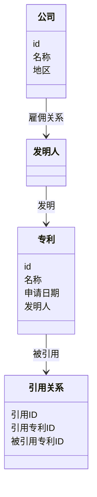

                 


```markdown
# 特价股票投资中的全球创新指数与专利引用网络分析方法

> 关键词：特价股票投资，全球创新指数，专利引用网络，大数据分析，人工智能技术

> 摘要：本文深入探讨了在特价股票投资中，如何利用全球创新指数和专利引用网络分析方法，结合大数据与人工智能技术，构建量化分析模型，优化投资策略。文章通过详细分析全球创新指数的核心概念、专利引用网络的构建原理，以及基于图论的网络分析算法，展示了如何将这些创新性方法应用于实际投资决策中，帮助投资者更准确地评估公司创新能力，识别投资机会，降低投资风险。

---

## 第一章：特价股票投资的背景与全球创新指数概述

### 1.1 特价股票投资的背景

#### 1.1.1 特价股票的定义与特点
特价股票是指在特定市场条件下，价格被低估的股票。其特点包括高性价比、低市盈率、低市净率等，通常被视为价值投资的标的。

#### 1.1.2 特价股票投资的市场背景
近年来，全球资本市场波动加剧，投资者寻找稳定收益的需求增加。特价股票因其低估值特性，成为投资者关注的焦点。

#### 1.1.3 特价股票投资的核心问题
如何准确评估公司价值，识别真正的低估股票，避免陷入价值陷阱。

### 1.2 全球创新指数的定义与特点

#### 1.2.1 全球创新指数的定义
全球创新指数是衡量一个国家或企业在技术创新、知识产权保护、研发投入等方面的综合指标。

#### 1.2.2 全球创新指数的核心要素
包括技术创新能力、知识产权数量、研发支出比例等。

#### 1.2.3 全球创新指数与股票投资的关系
创新能力强的企业更具竞争优势，创新指数高的企业往往具有更高的投资价值。

### 1.3 专利引用网络分析的基本概念

#### 1.3.1 专利引用网络的定义
专利引用网络是通过专利之间的引用关系构建的网络，用于分析技术发展和创新趋势。

#### 1.3.2 专利引用网络的构建方法
通过数据挖掘技术，提取专利数据，建立引用关系图。

#### 1.3.3 专利引用网络与创新指数的关系
专利引用网络分析是评估企业创新指数的重要手段，能够揭示企业的技术影响力和创新能力。

---

## 第二章：全球创新指数与专利引用网络的核心概念

### 2.1 全球创新指数的核心概念

#### 2.1.1 创新指数的计算方法
创新指数通常通过加权评分法计算，涉及多个指标的综合评估。

#### 2.1.2 创新指数的评价体系
包括技术创新、知识产权、研发投入等多维度评价。

#### 2.1.3 创新指数的动态变化
创新指数随时间变化，需定期更新和评估。

### 2.2 专利引用网络的核心概念

#### 2.2.1 专利引用网络的构建原理
通过专利数据库，提取专利信息，建立引用关系。

#### 2.2.2 专利引用网络的属性特征
包括节点度数、中心性、社区结构等。

#### 2.2.3 专利引用网络的实体关系
使用ER图展示专利、引用关系、发明人等实体之间的关系。

```mermaid
er
    title 专利引用网络实体关系图
    class 公司 {
        id
        名称
        地区
    }
    class 专利 {
        id
        名称
        申请日期
        发明人
    }
    class 引用关系 {
        引用ID
        引用专利ID
        被引用专利ID
    }
    公司 --> 发明人: 雇佣关系
    发明人 --> 专利: 发明
    专利 --> 引用关系: 被引用
```

---

## 第三章：基于图论的专利引用网络分析算法原理

### 3.1 创新指数计算算法

#### 3.1.1 创新指数计算模型
$$创新指数 = \sum_{i=1}^{n} w_i \cdot x_i$$
其中，\( w_i \) 为指标权重，\( x_i \) 为指标值。

#### 3.1.2 基于TF-IDF的专利相似度计算
使用TF-IDF算法计算专利之间的相似度。

### 3.2 专利引用网络分析算法

#### 3.2.1 基于PageRank的网络分析
$$PageRank(p) = \sum_{q \in In(p)} PageRank(q) \cdot \alpha$$
其中，\( \alpha \) 为衰减因子。

#### 3.2.2 社区发现算法
使用Louvain算法进行社区发现。

---

## 第四章：系统分析与架构设计

### 4.1 问题场景介绍

#### 4.1.1 系统设计背景
构建一个基于专利引用网络的创新指数分析系统。

### 4.2 系统功能设计

#### 4.2.1 领域模型类图


### 4.3 系统架构设计

#### 4.3.1 系统架构图


---

## 第五章：项目实战

### 5.1 环境配置

#### 5.1.1 Python环境配置
安装必要的库：networkx、pyvis、numpy。

### 5.2 核心代码实现

#### 5.2.1 专利数据导入
```python
import pandas as pd

patents = pd.read_csv('patents.csv')
```

#### 5.2.2 构建引用网络
```python
import networkx as nx

G = nx.DiGraph()
for idx, row in patents.iterrows():
    G.add_edge(row['引用专利ID'], row['被引用专利ID'])
```

#### 5.2.3 计算创新指数
```python
def calculate_innovation_index(patents):
    # 计算每个专利的被引用次数
    citations = {}
    for idx, row in patents.iterrows():
        if row['被引用专利ID'] not in citations:
            citations[row['被引用专利ID']] = 0
        citations[row['被引用专利ID']] += 1
    return citations
```

---

## 第六章：最佳实践与总结

### 6.1 总结

通过全球创新指数和专利引用网络分析，投资者可以更准确地评估企业的创新能力，识别具有潜力的特价股票。

### 6.2 投资策略建议

建议投资者结合创新指数和市场趋势，制定多元化的投资策略。

### 6.3 注意事项

注意数据质量和模型适用性，定期更新分析结果。

### 6.4 拓展阅读

推荐阅读相关领域的最新研究，深入理解创新指数和网络分析的前沿技术。

---

## 作者信息

作者：AI天才研究院/AI Genius Institute & 禅与计算机程序设计艺术 /Zen And The Art of Computer Programming

---

感谢您的阅读！希望本文能为您提供有价值的见解和方法，帮助您在特价股票投资中运用全球创新指数与专利引用网络分析，优化投资决策。
```

